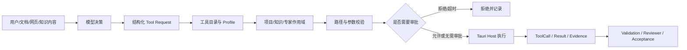

# Agent 安全与可信执行

> 状态：生效 
> 适用版本：Fox `0.1.x` 
> 维护范围：面向用户、评审与工程师解释 Fox 如何限制 Agent 权限 
> 最后更新：2026-08-27

## 核心结论

Fox 不把模型当作可信程序，也不让模型直接接触操作系统。模型只能生成文字或提出结构化工具请求；真正的文件、命令、数据库、知识库和 MCP 操作由 Tauri Host 掌握。Host 根据当前用户授权、项目范围、Execution Profile、工具协议、参数、审批和任务状态决定是否执行。

因此，限制工具只是第一层。Fox 还通过路径隔离、权限交集、审批绑定、资源预算、状态机、Evidence、独立 Reviewer、持久审计和 fail-closed 恢复共同约束 Agent。

## 答辩时可以直接这样回答

> 我们首先把模型和系统权限分开。模型本身不能直接读写文件、运行命令或访问密钥，只能申请调用系统提供的工具。工具请求到达 Rust Host 后，还要经过工具白名单、Agent 执行 Profile、项目路径、参数范围和用户审批的多重校验。高风险任务不是模型说完成就完成，还必须提交可验证证据，并由独立只读 Reviewer 复核，最后由 Host 状态机验收。所有调用、审批和状态变化都会持久化，未知情况默认拒绝。所以我们的安全边界不依赖模型自觉，而是由模型无法绕过的 Host 和数据库规则强制执行。

如果评委继续追问，可以补充一句：

> 我们不能承诺任何复杂桌面软件绝对没有漏洞，但可以保证模型没有一条“只靠提示词就扩大权限”的正常执行路径。安全控制在模型之外，即使模型受到提示注入，也仍然要经过同样的 Host 校验。

## 一次操作怎样通过安全边界

模型能决定“想做什么”，但不能决定“自己有没有权限”，也不能自己宣布数据库里的任务已经通过验收。

## 安全控制分层

### 1. 模型没有直接系统权限

Agent Runtime 负责模型循环、上下文和工具请求，不直接持有 Fox 数据库写权限。写文件、执行进程、读取附件、调用知识库和 MCP 等系统能力由 Rust Host 提供。

即使模型输出一段命令或伪造“系统已批准”的文字，这些文字也不会自动成为系统操作。

### 2. 工具采用白名单和能力交集

工具必须同时存在于 Runtime Capability Manifest 和 Host canonical protocol。当前 Assistant、Expert、Worker、Child Run 与 Reviewer 还会分别冻结 Execution Profile。

实际可用范围取以下条件的交集：

- Host 支持的工具；
- 当前 Execution Profile 允许的工具；
- Assistant 声明的工具；
- 当前 Expert 声明的工具；
- Child 或 Reviewer 的专用只读范围；
- 当前会话的项目、知识库和 MCP 绑定。

任何一层显式为空，都不能被另一层扩大。Skill 只能提供方法说明，不能凭 Prompt 获得未授权工具。

### 3. 项目和文件路径受到强制约束

Host 会对项目根与目标路径进行 canonicalize，再判断目标是否仍位于授权根目录内。以下情况默认拒绝：

- `..` 路径穿越；
- 未授权的绝对路径；
- 符号链接或 Junction 逃逸；
- 不存在的新文件但父目录越界；
- 空路径、NUL、设备名和无法解析的路径；
- 仅凭模型提供的任意本机路径打开受管文件。

附件、知识预览、下载文件和 Agent 产物必须通过数据库记录确认归属，不能因为模型知道一个路径就获得访问权。

### 4. 高风险操作需要审批

`run_command`、MCP 调用和敏感写入不会因为模型请求就自动执行。审批绑定具体 Tool Call、参数、目标和会话：

- “允许一次”只对当前调用有效；
- “本次会话允许”也不能绕过项目路径、工具白名单和参数校验；
- 批准后 Runtime 不能把命令或路径替换成另一份参数；
- 拒绝、取消、超时和应用恢复冲突都视为没有批准。

### 5. 密钥留在 Host 和系统 Keyring

模型 API Key、知识库 Token、MCP 环境变量和扩展 Header 使用系统 Keyring。SQLite 保存引用或是否已配置，前端与普通 Runtime 工具不能枚举任意环境变量或读取完整密钥。

### 6. 外部内容按不可信数据处理

网页、知识库、附件、工具结果和 MCP 输出可能包含提示注入。Fox 将它们放入带 authority/trust 标记的 Typed Context，并保持稳定系统 Prompt 与动态内容分离。

Prompt 会明确告诉模型外部内容不能修改系统规则，但真正的安全保证仍来自 Host：即使模型被诱导发起越权请求，Host 仍会拒绝。

### 7. 执行受到资源和拓扑限制

Child Run 与 Reviewer 有独立生命周期、工具范围和预算。只读 Graph Lead 限制节点数、深度、并发、工具调用次数、Token 和超时；失败分支不能无限派生任务。

隐藏 Reviewer 固定只允许 `read/ls/find/grep`，不能写文件、执行命令、审批、继续委派或修改 Work 状态。

### 8. “模型说完成”不等于系统完成

复杂工作通过 `Goal → Plan → Task → Attempt → Evidence → Review → Acceptance` 状态机推进：

- Task 必须由当前有效 Attempt 完成；
- Evidence 必须指向当前会话和真实 ToolCall、Artifact、Run Event 或其他受支持事实；
- 旧 Attempt、已删除文件、失败测试和 stale Evidence 不能用于验收；
- 高风险节点必须由独立 Reviewer 对每条 criterion 绑定证据；
- Reviewer 的 pass 仍需 Lead 调用专用 finish；
- 最终 Goal Acceptance 会重新检查当前 Plan、全部节点、Evidence、Reviewer proof 和未解决 Finding。

模型自由文本、普通 Tool Result、Child completed 或直接 SQL 都不能代替这些状态转换。

### 9. 状态、调用和审批可以审计

SQLite 保存 Run、ToolCall、Approval、Attempt、Evidence、Reviewer decision 和 Acceptance。重复请求通过 ToolCall identity、版本 CAS、Hash 和事务实现幂等；应用重启后的恢复仍从持久事实重建，不接受迟到事件复活终态 Run。

关键 authority 事实还受到数据库约束和 trigger 保护，防止普通 Repository 路径或误用 SQL 绕开专用入口。

### 10. 异常默认拒绝

未知工具、未知 Profile、Schema 不匹配、权限模式异常、项目缺失、路径失效、知识库未绑定、审批超时、过期版本和恢复冲突全部 fail closed。Fox 不会在安全检查失败时自动改走更宽松的执行路径。

## 常见追问

### “既然模型只能调用工具，是不是限制工具就够了？”

不够。工具如果接受任意路径、任意命令或任意参数，仍然可能越界。因此 Fox 同时限制工具是否可见、谁能调用、参数是什么、目标属于哪个项目、是否审批、调用后如何验收。

### “提示注入让模型忽略规则怎么办？”

Prompt 隔离可以降低模型被诱导的概率，但不是最终安全边界。被注入的模型最多提出请求，Host 的路径、权限、审批和状态检查仍然存在。

### “用户批准一次后，Agent 会不会一直执行？”

一次授权只绑定当前 Tool Call；会话级授权也只减少同名工具的重复弹窗，不扩大路径、Agent、Expert、MCP 或参数范围。高风险规则仍可以要求逐次审批。

### “Agent 能不能伪造测试通过或任务完成？”

不能只靠文字完成。Evidence 必须引用持久化的真实执行事实，失败 ToolCall、旧 Attempt、缺失文件和错误 Reviewer proof 都会使验收失败。

### “多 Agent 会不会互相扩大权限？”

Child Run 的权限来自父级与自身 Profile 的交集，不能继承父级没有的权限。Reviewer 更是固定只读。当前 Writer 不采用无界共享调度，避免多个 Agent 同时任意修改同一工作区。

## 已知安全边界

Fox 采用纵深防御，但仍有需要继续加固的工程边界：

- Runtime 与本地 MCP 进程尚未进入 OS 容器或 Windows AppContainer；
- Tauri CSP 仍需收紧；
- 用户显式配置的 MCP/OpenAPI 地址和本地命令属于高风险受信配置；
- Office/PDF 等复杂解析器需要持续进行依赖更新和恶意文件测试；
- SQLite 无法防止数据库所有者主动关闭 trigger 或直接修改文件；Repository Hash 与数据库约束主要防止正常产品链路中的越权和误用。

这些限制意味着 Fox 的目标是建立可验证、默认拒绝的产品安全边界，而不是宣称桌面软件可以达到数学意义上的绝对安全。

## 实现与测试依据

- `apps/desktop/src-tauri/src/tool_guard.rs`：项目路径和只读工具边界。
- `apps/desktop/src-tauri/src/tool_host.rs`：文件与命令执行。
- `apps/desktop/src-tauri/src/runtime_host/protocol.rs`：Host canonical 工具协议。
- `apps/desktop/src-tauri/src/runtime_host/work_tools.rs`：工作状态、审批和验收工具。
- `apps/desktop/src-tauri/src/database/repositories/graph_lead.rs`：Graph、Reviewer 与 Acceptance。
- `services/agent-runtime/src/execution-profile.mjs`：Runtime Profile 与工具裁剪。
- `services/agent-runtime/src/prompt-registry.mjs`、`typed-context.mjs`：Prompt 和不可信上下文边界。

详细工程设计见[安全架构](../02-架构/安全架构.md)、[项目与权限架构](../02-架构/项目与权限架构.md)、[Agent 运行时架构](../02-架构/Agent运行时架构.md)和[权限参考](../04-技术参考/权限参考.md)。
