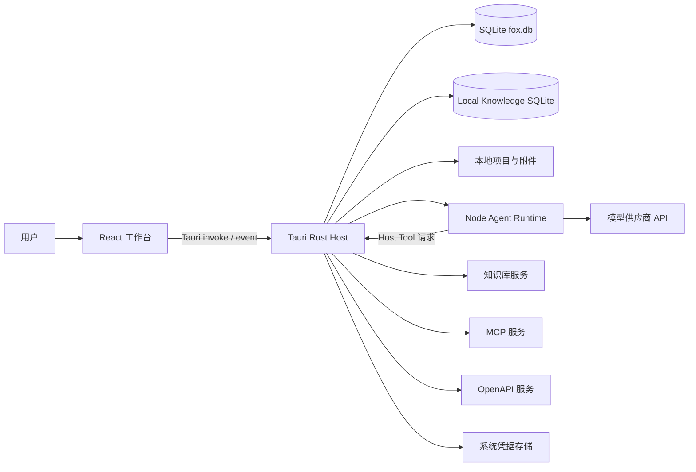
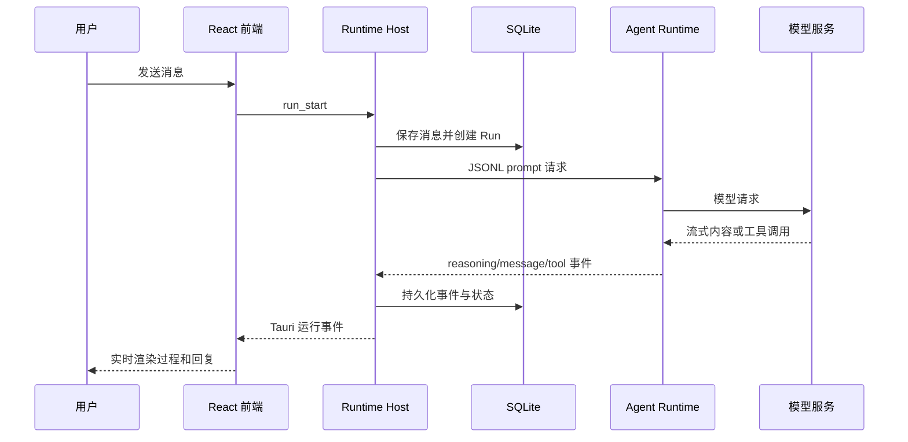

# 系统概览

> 状态：生效 
> 适用版本：Fox `0.1.x` 
> 维护范围：系统组件、主要数据流与运行边界 
> 最后更新：2026-08-27

## 一句话架构

Fox 由 React 前端、Tauri/Rust Host、SQLite、本地 Node Agent Runtime 和可选的外部知识库服务组成；Rust Host 是系统权限、持久化和运行协调的中心。

## 组件关系

## 主要组件

| 组件 | 技术 | 责任 |
| --- | --- | --- |
| 桌面前端 | React 19、TypeScript、Vite | 页面、交互、流式事件归并和用户反馈 |
| 桌面 Host | Tauri 2、Rust | Command/Event、数据库、权限、文件、Runtime 生命周期和远程适配 |
| 产品数据库 | SQLite、rusqlite | 会话、消息、运行、工作图、记忆、专家、扩展和用户资料的事实源 |
| Agent Runtime | Node.js、Pi Agent | 模型循环、Prompt Registry、Typed Context、Execution Profile、工具请求、推理与回复事件映射 |
| 知识库适配 | Rust `yuxi` 模块 | 身份、智能体、知识库、文档、图谱和远程任务接入 |
| 本地知识 | 独立 SQLite、可选 ONNX/Zvec | 文档导入、分块、检索、引用和本地资源治理 |
| 扩展系统 | Skills、MCP、OpenAPI、Hooks | 在能力清单、凭据隔离、健康检查和审批策略下扩展 Agent 能力 |
| 专家与调度 | Expert Package、Workflow、Team、Digital Colleague | 冻结能力、恢复阶段、编排 Child Run 和持久 Trigger |

## 本地对话数据流

前端实时状态不能只依赖一次监听。SQLite 快照、事件去重和运行恢复共同保证刷新或进程重启后的最终一致性。

## Agent 工作闭环

简单问答不需要进入这条状态机。复杂工作由 Host 创建并推进权威状态；模型自由文本、工具返回和 Child completed 都不能直接把 Task 或 Goal 标记为完成。高风险节点由独立只读 Reviewer 检查，整张有界 Graph 只有在当前 Plan、节点、证据和 Review proof 全部有效时才完成。

## 工具执行边界

Runtime 内部只能执行当前 Execution Profile 允许的受限只读项目工具。涉及附件、写文件、命令、知识库和 MCP 的能力通过 Host Tool 请求返回 Tauri 后端，由 Host 验证工具目录、冻结 Profile、会话身份、项目边界、参数和审批策略后执行。失败、未知或冲突状态默认拒绝。

当前能力清单的事实源为：

- `services/agent-runtime/src/runtime-contract.mjs`
- `apps/desktop/src-tauri/src/runtime_host/protocol.rs`
- `apps/desktop/src-tauri/src/tool_host.rs`
- `apps/desktop/src-tauri/src/tool_guard.rs`

## 数据所有权

| 数据 | 事实源 | 补充存储 |
| --- | --- | --- |
| 会话、消息、Run、工具调用 | SQLite | Runtime Session 用于恢复执行上下文 |
| 项目和授权 | SQLite | 本地文件系统提供实际内容 |
| 模型供应商配置 | SQLite | 密钥应进入系统 Keyring |
| 附件 | Fox 数据目录 | SQLite 保存元数据和消息关联 |
| 知识库文档 | 外部知识库服务 | Fox 缓存预览文件和阅读状态 |
| 本地知识 | 独立 Local Knowledge SQLite | 原文件与可选向量索引保存在用户数据目录 |
| Skills 与扩展源 | Fox 数据目录、SQLite、Keyring | Runtime 初始化时加载能力信息，Host 保管凭据并执行调用 |
| 诊断 | SQLite、Runtime 状态和日志 | 可导出诊断包 |

## 启动与恢复

Tauri 启动时执行以下关键步骤：

1. 解析 `FOX_DATA_DIR` 或系统应用数据目录。
2. 应用待处理的数据恢复操作。
3. 打开 `fox.db` 并执行数据库迁移。
4. 修复上次异常退出遗留的运行状态。
5. 创建 Runtime Session、附件和 Skills 目录。
6. 初始化本地知识、扩展源、Runtime 和模型服务客户端。
7. 恢复远程待处理任务、知识预览缓存和数字同事到期 Trigger。

应用退出时 Host 会请求 Runtime 关闭。异常退出后的状态修复必须由数据库和恢复流程完成，不能假设 Sidecar 总能发送终态事件。

## 部署形态

Fox 当前以桌面安装包交付。Vite 构建产物嵌入 Tauri 应用，Agent Runtime 源文件和 Sidecar 构建产物作为 Bundle Resource 分发。知识库、模型和 MCP 可以是本机或远程服务，不随 Fox 安装包默认部署。

## 关联文档

- [仓库结构](仓库结构.md)
- [能力矩阵](能力矩阵.md)
- [总体架构](../02-架构/总体架构.md)
- [Tauri 后端架构](../02-架构/Tauri后端架构.md)
- [Agent Runtime 架构](../02-架构/Agent运行时架构.md)
- [数据架构](../02-架构/数据架构.md)
- [Agent 安全与可信执行](Agent安全与可信执行.md)
