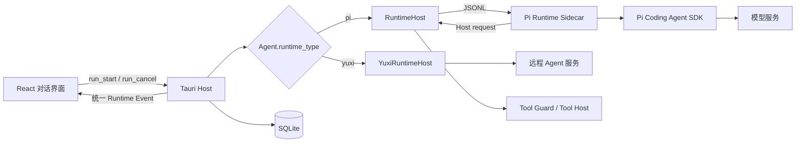
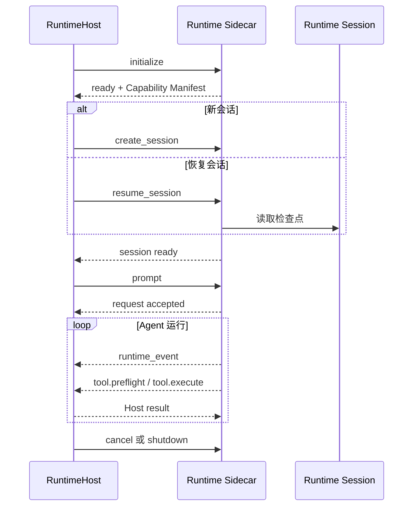

# Agent Runtime 架构

> 状态：生效<br>
> 适用版本：Fox 0.1.x<br>
> 维护范围：`services/agent-runtime`、`apps/desktop/src-tauri/src/runtime_host`、Runtime Adapter 契约<br>
> 最后更新：2026-08-27

## 目标与边界

Fox 把 Agent Runtime 定义为可替换的模型执行适配层，而不是产品状态中心。当前本地实现基于 Pi Coding Agent SDK，但对话、消息、Run、Goal、Task、Evidence、项目授权和审批都属于 Fox Host；替换 Pi 或增加其他 Agent 框架时，不应重写这些产品模型。

稳定边界如下：

- React 只依赖统一的 Conversation、Run 和 Runtime Event，不识别 Pi 内部事件。
- Tauri Host 负责选择 Runtime、持久化状态、执行权限检查和处理 Host Tool。
- Runtime 负责模型会话、提示词组合、结构化工具调用和流式事件转换。
- SQLite 是产品事实源；Runtime Session 是可丢失、可重建的执行检查点。
- Runtime 不能直接写数据库、激活 Goal、扩大项目范围或绕过审批。

相关产品级调用链见[对话系统架构](对话系统架构.md)，智能体、模型服务和能力画像见[智能体与模型架构](智能体与模型架构.md)。

## 运行时适配层



`Agent.runtime_type` 是当前路由键：

| 值 | 当前实现 | 进程位置 | 会话载体 |
| --- | --- | --- | --- |
| `pi` | `RuntimeHost` + Pi Sidecar | Rust Host 子进程 | 本地 Runtime Session JSON |
| `yuxi` | `YuxiRuntimeHost` | Tauri Host 内异步任务 + 远端服务 | 远端 Thread/Run + 本地游标 |

Pi 是首个本地 Runtime Adapter，不是 Fox 对话架构本身。未来增加 LangGraph、自研 Runtime 或其他 SDK 时，应新增适配器并复用 Host 契约，而不是在前端增加一套对话状态。

## Runtime Adapter Contract

一个 Runtime Adapter 必须实现五类行为：

1. **生命周期**：初始化、建立或恢复会话、执行 Prompt、取消和关闭。
2. **能力声明**：通过 Capability Manifest 告诉 Host 支持的流式输出、推理、图片、取消、恢复和工具能力。
3. **事件归一**：把 SDK 或远端服务事件映射为 Fox Runtime Event。
4. **工具回调**：对 Host-owned 工具发起结构化请求，等待 Host 返回结果或审批结论。
5. **可恢复性**：保留可重建会话所需的检查点或远端标识，并能在进程重启后恢复或明确失败。

适配器不得改变以下 Host 契约：

- `run_start` 先创建用户消息和 Run，再分派到 Runtime。
- Runtime Event 先写入 `run_events`，再广播 `fox://runtime-event`。
- 取消必须按 Run 生效，不能继续向已取消 Run 写增量。
- 工具的路径、执行位置和审批策略由 Host 决定。
- Goal/Task/Evidence 的持久化只能通过 Fox Work Tools 完成。
- 前端刷新后必须能只凭 SQLite 投影恢复对话。

协议字段和事件清单以[Runtime 协议](../04-技术参考/Runtime协议.md)为事实源。

## 本地进程模型

### RuntimeHost

`apps/desktop/src-tauri/src/runtime_host/mod.rs` 管理本地 Worker。内部状态包含：

- 子进程、stdin 和待响应请求表；
- 当前会话和活动 Run；
- 等待审批的 Tool Call；
- `queued_runs` 运行队列和正在分派的 Run；
- 分派前已取消的 Run 集合；
- Runtime stderr 尾部、最后错误和恢复次数；
- Runtime 名称、版本和 Capability Manifest。

Primary Run 继续使用单 Worker FIFO，保证普通会话的既有顺序语义。A5 在这一主队列之外增加 Host-owned Child Runtime 池：每个 Child Run 使用独立 RuntimeHost、Sidecar 和 Session，同一 root 最多并发 3 个、深度 1。它不是复用一个全局多 Agent 进程，也不会让普通会话绕过 FIFO。父子身份、预算、权限交集、审批、取消和结果聚合见[子 Agent 与 Child Run 架构](子Agent与ChildRun架构.md)。

### Sidecar 启动

开发环境可以直接运行 Node 入口，发布构建由 `services/agent-runtime/scripts/build-sidecar.mjs` 生成独立可执行 Sidecar。Host 为子进程配置：

- stdin/stdout：一行一个 JSON Envelope；
- stderr：诊断日志，不得混入协议 stdout；
- Session、附件和 Skills 目录；
- 当前模型服务配置和必要的 Host 上下文。

Host 对协议行大小、响应时间和 stderr 保留数量设置上限。Sidecar 输出非 JSON、未知消息或超限消息时，Host 按协议错误处理，不把原始输出直接渲染给用户。

## JSONL 生命周期



主要请求：

| 请求 | 目的 | 失败处理 |
| --- | --- | --- |
| `initialize` | 注入配置并校验协议/能力 | 初始化失败则 Runtime 不可用 |
| `create_session` | 创建新会话和初始检查点 | Run 失败，SQLite 消息仍保留 |
| `resume_session` | 从 Session 文件恢复 | 可用 Prompt 历史重建或显式失败 |
| `prompt` | 提交当前轮输入 | 立即确认接收，后台流式执行 |
| `cancel` | 取消 Agent 和 Pending Host 请求 | 生成取消终态并停止旧增量 |
| `shutdown` | 终止全部会话并退出 | Host 回收子进程 |

## Capability Manifest

Capability Manifest 是 Host 与 Runtime 的启动契约。当前本地基线声明：

- `streamingText`、`cancellation`、`reasoning`、`sessionResume`、`toolApproval`、`contextCompaction` 为支持；
- `imageInput` 由所选模型配置动态决定；
- `steering`、`dynamicModelSwitch` 当前不支持。

Manifest 版本、Runtime 版本和实际工具目录必须相容。Runtime 声明 Host 不认识的必需能力，或声明工具与注册工具不一致时，应在初始化阶段失败，不能等到用户对话中才暴露。

## Pi Runtime 实现

`services/agent-runtime/src/pi-runtime.mjs` 是当前真实本地 Runtime 入口。`pi-adapter.mjs` 是 Pi SDK 的唯一直接依赖边界，并同步锁定：

- `@earendil-works/pi-agent-core`；
- `@earendil-works/pi-ai`；
- `@earendil-works/pi-coding-agent`。

Pi 提供模型抽象、Agent Session、工具调用、重试和上下文压缩。Fox 在其外部增加以下 Harness：

| 模块 | Fox 职责 |
| --- | --- |
| `pi-adapter.mjs` | 封装 Pi 0.84.2 `ModelRuntime`、Session、ResourceLoader 与 Faux Provider，限制升级影响面 |
| `tool-adapter.mjs` | 在 Fox Tool Definition 与 Pi Custom Tool 之间转换，保持 Host 权限契约独立于 Agent 引擎 |
| `model-profile.mjs` | 按 API、供应商和模型族生成能力画像及兼容参数 |
| `runtime-instructions.mjs` | 定义 Fox 稳定运行规则、Goal 意图和安全边界 |
| `prompt-composer.mjs` | 分层组合稳定提示词、Host 上下文和单轮上下文；唯一注入并结构化裁剪 Host Work Snapshot |
| `prompt-registry.mjs` | 定义不可变的 `PromptDefinition/PromptVersion`、显式开发支持矩阵、缓存身份和无副作用实验/回滚报告 |
| `typed-context.mjs` | 校验 `TypedContextFragment v1` 的 kind、authority、trust、版本、Hash、预算、生命周期与唯一 WorkSnapshot |
| `execution-profile.mjs` | 校验受支持的执行策略组合，生成版本化 Profile 快照并收口 Shadow/Graph Preview 工具面 |
| `continuation-decision.mjs` | 定义 `ContinuationDecision v1`、规范化 Runtime 提议并提供无 Host 写入能力的提议工具 |
| `planner-runtime.mjs` | 对复杂项目任务执行只读、内部 Planner 阶段 |
| `fox-planning-extension.mjs` | 注册 Host Work Tools，并消费同一个结构化 Work Snapshot 对象；不再追加模型消息 |
| `pi-event-mapper.mjs` | 把 Pi 事件投影成 Fox Runtime Event |
| `runtime-session.mjs` | 保存和清理可恢复 Session |

## 模型能力画像

`resolveModelProfile` 不只按 API 类型判断，还结合 Base URL 和模型 ID 识别供应商族与模型族。画像包含：

- API：`openai-completions`、`anthropic-messages`、内部支持的 `openai-responses` 或测试 `faux`；
- reasoning 是否可用、传输方式和 thinking level；
- 图片、工具、并行工具、Prompt Cache 能力；
- Context Window 和最大输出 Token；
- Planner 开关、Planner Token 和思考等级；
- 重试次数、最大退避、压缩预留和最近上下文保留量；
- Provider 兼容字段，例如 `max_completion_tokens`、developer role 和 DeepSeek reasoning content。

模型设置界面当前仅正式暴露 `openai-completions` 与 `anthropic-messages`。Runtime 内部理解某种 API 不等于产品已经支持用户配置；增加 UI API 类型时必须同步验证 Rust Host、密钥、连通性测试和 Runtime。

画像快照会写入 `run.request_snapshot`，便于诊断“同一提示词在不同模型为何表现不同”。模型适配详细设计见[智能体与模型架构](智能体与模型架构.md)。

## Execution Profile

Runtime 已实现少量、可穷举的 Execution Profile，不提供任意布尔 Feature Flag 组合。`initialize.payload.executionProfile`（兼容 `execution_profile`）选择 Profile；可选 `executionStrategy`（兼容 `execution_strategy`）只能重复声明该 Profile 的固定策略，任何不匹配组合都会在 Runtime 启动阶段返回 `request_failed`。

| Profile | `completionAudit` | `validationPolicy` | `promptPolicy` | Runtime 约束 |
| --- | --- | --- | --- | --- |
| `legacy` | `legacy` | `legacy` | `stable_v1` | 保持现有 Host-guarded 工具面，不启用 Continuation 提议；不暴露 durable human escalation |
| `durable_v2_shadow` | `strict_v2` | `risk_v1` | `stable_v1` | 只读 Shadow；禁止写入、进程、远端动作、Work/Memory 变更和 Child Run；Decision 仅比较 |
| `durable_v2` | `strict_v2` | `risk_v1` | `stable_v1` | 启用 proposal-only Continuation；有副作用工具仍只能经过 Host；暴露一次性人工 Repair escalation，以及持久只读 Graph 的激活、快照、节点启动、标准风险节点验收与两阶段取消工具；Legacy Workflow mutator 在统一 Attempt/Acceptance 接入前暂不暴露 |
| `graph_readonly_preview` | `strict_v2` | `risk_v1` | `stable_v1` | `graph_readonly_run` 可启动最多 3 个内存态只读 Agent 节点，DAG 深度 1、无 Writer；不创建持久 Task/Child Run |

Profile 快照包含 `schemaVersion`、固定策略、Continuation/Graph 约束、`toolPolicy`、Shadow/副作用标记和短 Hash。它同时出现在 `ready.payload.executionProfile` 与每个 `run.request_snapshot.executionProfile`，因此一次 Run 的有效策略可复现。Runtime 在 Assistant/Expert 工具过滤后追加 proposal-only 的内部 `continuation_propose`，再执行 Profile 工具裁剪；显式 `allowedTools` 因此不会误删治理提议工具，也不会赋予 Host 写权限。`graph_readonly_run` 也走专用 Profile 判断，必须在通用 `host_guarded` 放行前判定，因此 `legacy/durable_v2_shadow/durable_v2` 均不可见，只有 `graph_readonly_preview` 可以注册到本 Run 的模型工具面。持久工具 `graph_readonly_activate` / `graph_readonly_snapshot_get` / `graph_readonly_node_start` / `graph_readonly_node_finish` / `graph_readonly_node_cancel` / `graph_readonly_node_review` / `graph_readonly_accept` 采用相反门禁：只在 `durable_v2` Lead 可见。内部 `graph_reviewer_v1` 不是用户可选执行模式，只供 Host 创建的 Reviewer Child；它固定 `strict_v2/high_risk_v1/graph_reviewer_v1` 策略、禁用 Continuation/Graph，只声明 Runtime/preflight 的 `read/ls/find/grep`，不能获得写入、审批、MCP、delegation 或 Work Tool。`task_repair_escalate_start` 同样是 `durable_v2` 独占能力；它在 Catalog 中固定为 `approval=always`，每次调用都必须由 Host 创建并绑定本次 ToolCall 的新审批，Runtime 不接受或保存 grant。`durable_v2` 同时暂时裁掉 `workflow_start/workflow_stage_start/workflow_stage_complete/workflow_stage_fail/workflow_cancel`，保留只读 `workflow_snapshot_get`。Host 逐字段校验 Profile、Graph、Continuation contract；Ready Capability Manifest 声明的每个工具都必须属于 Profile allowlist，并在 `name/category/execution/approval` 四元组上精确匹配 Host canonical catalog。任一不一致都 fail-closed 并终止异常 Worker。只有 v34 之前没有冻结快照的 Legacy Run 保留 Legacy 兼容；缺快照不能进入 Graph、Durable 或 Reviewer 权限面。

`graph_readonly_run` 是 Phase 1.5A 的内存态设计试点，不是持久化 Graph Runtime。调用输入在任何模型 Session 启动前完成节点数、字段、唯一 ID、依赖存在、自依赖、环和最大深度校验；根节点同层并行，第二层仅在全部依赖报告被机械接受后启动。每个节点使用独立 Pi Session、独立内存 SessionManager 和仅含 `read/ls/find/grep` 的工具集合；文件读取仍逐次经过 Host `tool.preflight`。节点最多 6 次工具访问、45 秒、1024 输出 Token、6000 个返回字符；整个 Graph 最多 60 秒。空报告不接受，失败后代跳过，无关分支继续，取消会 abort 已启动 Session，迟到结果不能变成 accepted。外层普通 `tool.started/completed/failed` 足够记录本次只读预览；它不生成 `graph.*` 权威事件，也不写 Goal、Task、Evidence、Acceptance 或 Child Run。

Phase 1.5B 复用现有 Goal/WorkTask/Attempt/Evidence/Finding/Acceptance，不新增 Graph 状态机。`graph_readonly_activate({planRevisionId})` 只接受一个已经由用户批准的严格 Graph PlanRevision；Host 从当前 `durable_v2` 根 Run 和真实 `tool_calls.id` 注入激活身份，在一个事务中冻结不可变 Spec、Node 与 Edge。完全相同的调用可精确重放，不同 Plan 或输入冲突会 fail-closed。`graph_readonly_snapshot_get({goalId})` 只读取 Host 派生投影；尚未激活时稳定返回 `activated=false, graph=null`，不会凭模型输入创建图。节点快照显式返回 `taskVersion`，让 Lead 使用同一份 Host 投影提交 CAS，而不猜测版本。

生产 `graph_readonly_node_start` 只接受 Graph/Task/Attempt/Worker、`expectedTaskVersion`、有界 objective/context 和四项 Child budget；模型不能传 `allowedTools`、Profile、Run/Conversation、执行 authority 或 ToolCall 身份。Host 注入当前 depth-zero primary Lead Run 与真实数据库 ToolCall ID，并复用 `Database::start_ready_read_only_graph_node` 的单个 `IMMEDIATE` 事务：重验 Goal/Graph/Task/Plan/readiness/CAS，创建父 Lead Run 持有的 Execution Attempt、隔离 Child Conversation/Run/Message/delegation，把 Child scope 固定成 `read/ls/find/grep`，预算限制为 45 秒、4096 total tokens、1024 output tokens、6 次工具调用，并冻结 Child `durable_v2`。Host 先用 common finalizer 持久化成功 ToolCall，再消费仅 fresh create 才产生的一次性 Child dispatch；Repository exact replay 与 Host terminal replay 都不会二次派发。激活 Run 只作审计；它结束后，同一 Goal Conversation 的新 depth-zero primary `durable_v2` Lead Run 仍可启动尚未执行且当前 runnable 的节点。但这项跨 Lead 恢复不能越过计划权威边界：只要出现 revision 更高且状态为 `proposed` 或 `approved` 的 PlanRevision，旧 immutable Graph 立即停止新节点派发；新计划被 rejected，或只留下 superseded 历史时，才不会错误阻断旧 approved 版本。检查和派发在同一写事务内完成，拒绝路径不改变 Task version，也不创建 Attempt 或 Child delegation。

`graph_readonly_node_finish` 与前三个持久 Graph 工具同样固定为 `work/host/none`、仅允许 `durable_v2`。模型只提交 Goal/Task/Attempt ID、两项 CAS、按冻结顺序排列的 `criterionEvidence` 和短摘要；Lead Run、真实数据库 ToolCall、Child、ValidationPolicy 与 authority 都由 Host/Repository 推导。Repository 在一个事务内先重验当前 running Attempt 的父 Lead、非空 completed Child 结果、Task/Attempt CAS 与计划权威，再要求每条冻结 criterion 恰好出现一次，并由当前 Attempt 水位之后、当前父 Lead Run 的 live Evidence 覆盖。criterion Evidence 只接受安全 allowlist 上已完成的机械 ToolCall：Runtime `read/ls/find/grep` 与 Host `git_read/structured_data/tabular_data/sqlite_read` 对应 inspection，`test_run/code_check` 可对应 test_result；位置、审批位、Run、时间和 Evidence 语义必须精确匹配。同一 Evidence 可以诚实覆盖多个 criterion，但同一 criterion 内不能重复 ID。写入顺序固定为 immutable finish header → criterion bindings → 复用通用 Attempt finish；任一步失败整事务回滚，不创建 Goal Acceptance。

Pi Runtime 的会话 checkpoint 与最终 session snapshot 共用同一条串行写入边界：`message_end` / `agent_end` 已入队的 checkpoint 必须先完成，才能替换最终 `session.json`。这不只是测试稳定性要求，也避免 Windows 上两个原子 rename 竞争产生 `EPERM` 并将已完成的模型回答误报为 Runtime 失败。

readiness 现在只把“succeeded Attempt + immutable finish header + 完整且仍 live 的 criterion bindings”投影为 `accepted`；generic `task_attempt_start/finish` 不能绕过专用入口，伪造 succeeded 或事后变 stale 的 Evidence 都不会解锁依赖。Child completed 只是必要来源事实，绝不单独等于 accepted。`standard_v1` 已开放完成；`high_risk_v1` 在当前 MVP 无论已有何种 review fact 都稳定返回 `graph.readonly_review_required` 且零写入，等待未来独立 Reviewer 切片。

生产 `graph_readonly_node_cancel` 同样是仅 `durable_v2` 可见的 `work/host/none` 工具。模型 exact input 只有 Goal/Task/Attempt ID、Task/Attempt CAS 与 1–2000 字符 reason；Child、parent、delegation、状态和 authority 全由 Host 推导。Repository 第一个 `IMMEDIATE` 事务只落 immutable pending intent，common finalizer 完成真实 ToolCall 后才允许单向激活并发送真实 Child cancel。finalizer 失败的 pending intent 永不发信号；exact replay复用同一事实，Host terminal replay不二次执行。active intent 是 durable outbox，启动恢复只向仍非终态且有 live Host 的 Child 重发；Host 缺失时 Run 保持 cancelling，绝不凭 intent 伪造 cancelled。

Child 的实际负终态由统一事务 helper 对账：failed→Attempt failed、cancelled→Attempt cancelled、interrupted→Attempt failed，Task 统一 interrupted；immutable reconciliation 绑定 Goal/Task/Attempt、parent/delegation/Child、可选 active intent、CAS、canonical terminal JSON/Hash 与错误事实，再复用内部 Attempt finish。completed 或非终态不写 reconciliation；completed 抢先时 cancel 输掉竞态，节点仍等待 criterion↔Evidence finish。通用 `child_run_cancel` 和通用 Attempt finish 都不能旁路 Graph 专用权限。启动顺序先同步 terminal delegation、再 Graph reconciliation、最后旧 owner-run audit；RuntimeHost 建立后才重发仍 active 的 outbox。

v39 增加独立高风险 Reviewer。`graph_readonly_node_review` 的模型输入与 node finish 共享同一组 Goal/Task/Attempt CAS、冻结顺序的 `criterionEvidence` 和 1–4000 字符 summary，不接受 Reviewer、Child、Plan、Profile、authority 或 ToolCall 字段。Repository 首先只写 immutable pending request；common finalizer 完成真实 Host ToolCall 后才激活并创建独立 Reviewer conversation/run/delegation。Reviewer 可复用同一 Assistant package，但 Run/Conversation/delegation 必须与 Lead、implementation Child及任何 Task Attempt Run 不同；Host 强制 `graph_reviewer_v1`、精确 `read/ls/find/grep`、45 秒/4096 total/1024 output/6 tools。没有模型 `collect`：真实 Reviewer Child terminal 由 Host 同步后交 Repository严格解析 exact JSON `{criteria:[{criterion,status,toolCallIds}],recommendation,summary,findings}`。`findings` 为 0–16 个 exact `{criterion,severity,title,detail,toolCallIds}`；severity 只能为 `critical/high/medium/low/info`，title 1–200，detail 1–2000，toolCallIds 1–16 且 item 内唯一、必须是对应失败 criterion proof IDs 的子集。pass 必须全部 passed 且 findings 为空，revise 必须至少一项 failed 且有 1–16 条 findings，inconclusive 的 findings 为空。只有冻结 criterion 同序、每项 `status=passed`、每项至少一个全局唯一且有界的本次 Reviewer Run fresh completed `read/ls/find/grep` Runtime ToolCall ID（Repository按 `runtime_tool_call_id` 解析，再冻结内部 UUID；canonical `runtime/preflight/approval=false`）且无反证时，Repository 纯决策才可得到 pass；一句推荐文字不能通过。v39 只冻结 immutable decision JSON，不投影 generic review_findings。`revise` 原子投影 Attempt/Task blocked，`failed/cancelled/interrupted` 或非法输出只形成 inconclusive，不自动 retry/repair。

高风险 review pass 仍不等于 Node accepted；Lead 调用 `graph_readonly_node_finish` 时必须逐字复用 review 冻结的完整 `goalId/taskId/attemptId/expectedTaskVersion/expectedAttemptVersion/criterionEvidence/summary`，不允许只复用 bindings 却更换 summary 或版本。Repository 重新验证 review request input/hash、contract/hash、implementation Child result、Lead Evidence和Reviewer proof后才允许既有 finish事务；已有 pass 但完整 candidate 不一致时稳定返回 `graph.readonly_review_candidate_mismatch`。`graph_readonly_accept({goalId,expectedGoalVersion,summary})` 则只提交最小意图，Plan、Node checks、Evidence、Reviewer与authority全部由 Host派生。它同样采用 pending → common finalizer completed → activate；激活事务要求当前权威 approved Plan、所有节点已 accepted、所有 Evidence/review/Child hash仍 live，并阻止任何仍 open 的 Graph-linked finding，包括 low/info，随后原子写 Graph Acceptance、通用 Acceptance投影和Goal completed。generic `acceptance_submit`、`goal_complete` 与 generic Attempt finish对Graph稳定返回 dedicated-required，不能旁路。completed、reviewed、Node accepted与Goal accepted始终是四类不同事实。

Review/Acceptance exact replay只复用同一 ToolCall和canonical input；Host terminal replay不重复激活或派发。Reviewer dispatch是数据库 exactly-once、物理 at-least-once：启动只恢复 activated request，先同步/settle真实 terminal，再重发仍 authoritative nonterminal 的 Reviewer；pending、failed ToolCall或stale Plan/Goal/Attempt永不执行。Acceptance恢复只消费已完成ToolCall对应的pending intent，Repository在最终事务再次CAS。cancel、Child terminal、review和accept竞态均以Repository首个权威事务为准；pass不直接改变Attempt，取消或计划变更先落地时后续finish/accept必须fail-closed。完整 UI、自动repair/retry、writer Graph与跨设备执行栈恢复仍未完成。

当前 Host 尚未发送 Profile 时，Runtime 明确回退到 `legacy`。回滚因此是切换到已测试的 `legacy`，不是在运行中修改一组松散开关。

## 提示词分层

Fox 不直接使用 Pi 的裸默认提示词。`composeFoxPrompt` 将输入分成稳定层和动态层：

```text
稳定层
├─ Fox Runtime instructions
└─ Model compatibility instructions

动态层
├─ assistant_persona：Host 选择的基础 Assistant 增强层
├─ runtime：项目、权限、会话、模型
├─ expert_package：可选专家 Persona Overlay 与能力包
├─ expert_binding：可选绑定 ID、版本和 Hash
├─ workspace：项目根与权限模式
├─ work_snapshot：唯一的 Host-authority WorkSnapshot 恢复视图
├─ turn_tail：当前目录、平台、日期、恢复信息
├─ planner_handoff：可选 Planner 建议
└─ approval_demo：可选审批演示约束
```

动态内容放在带 `kind` 和 `authority` 的 `<fox_context_block>` 中。项目文件、检索结果和 Work Snapshot 是数据，不得提升为 system instruction。最终模型输入只允许 `prompt-composer.mjs` 产生一个 `kind="work_snapshot" authority="host"` 片段；Planning Extension 可消费同一结构化对象注册工具，但不能通过 `before_agent_start` 再注入一次。稳定层与动态层分别计算短 SHA-256 Hash，用于回归和缓存诊断；Snapshot 还记录稳定层、动态层和最终 Prompt 的字符数及 Token 估算，不默认持久化完整 Prompt。

`TypedContextFragment v1` 是动态层进入 Composer 的唯一内部形状，字段固定为 `id/kind/authority/trust/version/hash/budget/lifecycle/content`。当前 authority 明确区分 `host/runtime/workspace/user/untrusted`；每个 kind 绑定合法 authority/trust，未知 kind、原型继承对象、future version、额外字段、预算越界或 Hash 篡改全部 fail-closed。唯一渲染边界会识别大小写、空白、opening/closing 与 JSON slash 形式的伪造 `fox_context_block` marker，只把首字符 `<` 等长改成 `[`；安全渲染后的字符才进入片段和总 Prompt 预算，因此不会靠转义膨胀突破上限，JSON/代码仍可读。Composer 强制恰好一个真实的 `work_snapshot + host + host_verified`；`durable_v2_shadow/durable_v2/graph_readonly_preview` 若连最小 WorkSnapshot 都放不下会 fail-closed，`legacy` 仍保留“预算只抬高到稳定合同、必要时不带动态块”的兼容语义。这里没有新建 World State、消息历史或 Work 数据库，Typed Fragment 只是现有输入的类型化信封。

`Prompt Registry v1` 当前登记同一个 `fox.runtime.system` 定义的两个不可变版本：`stable_v1 / 1.0.0 / stable` 与 `registry_v1 / 1.1.0 / development`。版本快照冻结 definition ID、语义版本、模板 content Hash、Runtime 协议兼容范围和 Typed Context Schema Hash；读取时重新校验 Hash，不能用任意对象替换。四个生产 Execution Profile 仍全部固定 `promptPolicy=stable_v1`，Profile 数量和 Hash 均未改变。开发矩阵唯一固定为 `fox.prompt.registry.development.v1`，只含 `prompt_registry_preview`，Hash 为 `65c3e97d4cca918161d5bc29415f19ed26c7561cbee684d98094ee5880766322`；`freeze` 与 `resolve` 两层都拒绝四个生产 Profile，即使调用方提交的是合法开发矩阵 Hash 也不能借用。未知、原型继承、future key/version 一律 fail-closed。后续若要上线，必须另行冻结新的完整 Profile/Eval 组合，不能增加散装 Flag。

缓存诊断把 `stablePrefixHash` 与 `dynamicTailHash` 分开。Cache key 只包含 Prompt definition/version/content Hash、稳定前缀、Typed Context Schema、模型与工具目录身份；WorkSnapshot、cwd、日期、恢复信息等仅改变 dynamic-tail Hash，不应冲掉稳定前缀身份。Runtime 根据 Model Profile 的 `supportsPromptCache` 决定 eligibility；Composer 只记录 read/write eligibility、`performed=false` 和原因，不伪造 provider cache hit，也不自行读写缓存；真实命中仍以 Provider usage 的 `cacheReadTokens/cacheWriteTokens` 为准。本阶段明确不做 Cache Provider，也不建立数据库 Prompt Registry。

Prompt Experiment v1 只接受 `offline_replay`、`mock`、`read_only_shadow`。实验契约必须完整声明文件写入、外部网络、MCP action、Child Run、计费调用、外部消息、生产写入和静默双跑均为 `false`，字段缺失、未知、`null` 或不是字面量 `false` 都拒绝；门槛与评分拒绝 `null` 和数字字符串，`tokens/safetyFailures` 必须是非负整数。baseline/candidate 同时记录 model、dataset、tool catalog、stablePromptHash、context schema 与 environment 身份，不可比输入不进入评分。质量、安全、成本分别过门，安全失败采用零容忍，不能被平均质量抵消。报告可确定性给出 `keep_baseline` 或“可人工晋升”，但永远 `applied=false`，不会自动改生产 Prompt 或事实。

Execution Profile 采用同一边界：短且版本化的 Profile 行为契约进入动态 Model instructions；Profile 快照和 Continuation contract 进入动态 `runtime` context block。`durable_v2` 指令明确告知 Legacy Workflow mutation 在统一 Attempt/Acceptance API 接入前暂不可用、只保留 snapshot inspection；该动态说明不修改 `stable_v1` 定义或稳定前缀 Hash。`runId`、`eventCursor`、`decisionId` 等本轮值绝不进入稳定前缀，避免动态状态破坏 Prompt 前缀复用。

Host 发送 `assistantPackage`、可选 `expertBinding` 与可选 `expertPackage`。专家包来自绑定时的冻结快照，Host 每次 Run 校验 Hash 后再叠加当前授权。助手和专家 Skills 合并去重后注入，但工具 Allowlist 与 MCP Server scope 均取交集；任一包显式空 Allowlist 都会关闭相应能力。交集诊断分别记录两侧声明、最终有效工具和排除原因；空交集仍允许纯文本回答。专家声明不能扩大 Host Capability、项目权限、知识绑定或审批范围。

Prompt 预算来自当前 Model Profile。Host/Runtime 稳定契约具有最高保留级别，Assistant 与 Expert Persona 必须作为增强层；超预算时优先收缩低权限动态块和专家附加上下文。Work Snapshot 也计入总字符/片段预算、`contextHash` 和 fragment diagnostics；超预算时按结构裁剪集合和字符串，输出仍是合法 JSON，并以 `truncation.strategy=structured_budget_v1`、遗漏计数和字符上限明确说明裁剪。Task 选择前先从原始 `taskAttempts`、Ledger `activeTasks` 和 `executionCursor` 提取关键 Task，按“全部 running → cursor → active → 原数组补位”选择；全部原始 running Attempt 与对应 Task/Policy 不依赖普通可见 Task 上限，其他可见 Task 保留最新 terminal Attempt。fallback 至少保存当前/全部 running Attempt 与对应 Policy identity，若 durable/graph 预算连这些恢复事实都放不下则 fail-closed；旧 Attempt/Policy 的省略数写入 `truncation.omitted`。裁剪结果只是单一事实源的有界 Prompt 视图。模型兼容测试覆盖 Assistant/Expert 冲突、伪 marker、40/1000 条历史末尾 running、总预算与重启恢复。

关键规则包括：

- 只有用户最新消息明确要求创建或跟踪目标时，模型才可调用 Goal 工具；
- 引用、Markdown、粘贴内容中的“建立目标”不能触发 Goal；
- Runtime 只能 propose Goal，激活由 Host 和用户确认完成；
- 不得把思考、工具 JSON 或未执行的动作写成正式回复；
- 不得把 Planner 建议当成权限或已落库事实。

## ContinuationDecision 提议契约

Runtime 已实现 `ContinuationDecision v1` 的 Schema、规范化和提议载体，字段为：

```text
schemaVersion / decisionId / runId / eventCursor
decision: continue | repair | wait_approval | complete | blocked
reasonCode / activeTaskIds[] / evidenceIds[] / missingAcceptance[]
nextAction / retryClass / blockedDependencyRefs[]
```

`reasonCode v1` 的 Runtime/Host 共同超集为 `work_remaining`、`validation_failed`、`approval_pending`、`external_dependency_unavailable`、`budget_exhausted`、`user_input_required`、`retry_available`、`retry_exhausted`、`acceptance_missing`、`acceptance_candidate`、`acceptance_passed`、`host_audit_required`、`tool_failed`、`task_interrupted`。`retryClass v1` 固定为 `none`、`recoverable`、`retry_limited`、`non_retryable`、`host_decides`。Decision 与 reason 的语义组合仍由 Host 校验，Runtime v1 只做结构和枚举规范化。

在非 Legacy Profile 中，模型可以调用 Runtime 本地的 `continuation_propose`。Runtime 用当前活动 Run 覆盖/校验 `runId`，从 Runtime 事件序列取得 `eventCursor`，对枚举、数组、长度和重复 ID 做规范化，然后发出：

```json
{
  "type": "run.continuation_proposed",
  "proposal": {
    "schemaVersion": 1,
    "decisionId": "decision-run-1-42-1",
    "runId": "run-1",
    "eventCursor": 42,
    "decision": "repair",
    "reasonCode": "validation_failed",
    "activeTaskIds": ["task-1"],
    "evidenceIds": [],
    "missingAcceptance": ["tests_pass"],
    "nextAction": "run targeted tests",
    "retryClass": "recoverable",
    "blockedDependencyRefs": [],
    "proposalOnly": true,
    "hostValidationRequired": true,
    "sideEffectsApplied": false,
    "shadow": false,
    "executionProfileId": "durable_v2"
  }
}
```

该工具的成功返回只表示“Runtime 已记录提议”，不表示完成、阻塞、审批或状态转换已被接受。Runtime 不写 SQLite、不调用 Goal/Task/Acceptance 持久化，也不会根据模型停轮自行推断 `complete`。

### Host 集成状态

Rust Host 已完成 proposal 到 Host-owned 审计事实的硬化接线：

- 从内部设置 `agent.execution_profile_v1` 读取一个受支持 Profile，默认 `legacy`；`initialize` 同时发送固定 Strategy。`ready` 必须逐字段回报完全相同的 Profile、Strategy、Graph、Continuation mode、`toolName/eventType`、枚举集合与 `shadowSideEffectsAllowed`；Capability Manifest 中每个工具还必须属于 Profile allowlist，并在 `name/category/execution/approval` 上精确匹配 Host canonical tuple，否则 Host 停止 Worker；
- 每个 `runtime_event`、`tool.preflight` 和 `tool.execute` 在处理前都把 Envelope 的 `conversationId/runId/runtimeSessionId` 绑定到当前 Worker scope，并通过 Repository 核对 Run 的权威会话归属。Proposal 持久化不接受 Runtime 自报的 conversation，而是从 DB 反查；
- 工具入口按 canonical tuple 分流：`tool.preflight` 只接 `runtime/preflight`，`tool.execute` 只接 `host`。二者除原有权限/审批外，还必须同时通过当前 Worker Profile、Run 的 Host 冻结 Profile 和 Runtime `ready` Manifest 三重校验；`tool.started/updated/completed` 在保留原始 `run_events` 前使用同一门禁并再次检查 delegated、Assistant 与 Expert scope。Profile 身份不一致、冻结快照 Hash 篡改、工具未声明或 tuple 不匹配都会使 Run/Worker fail-closed；Shadow/Graph Preview 即使被异常 Runtime 主动请求或回传伪事件，也不能执行副作用工具或污染工具审计；
- Approval 只能在关联 Tool Call 仍为 `pending` 且 Run 仍为 `running` 时完成 CAS；`AllowConversation` 仅在该 CAS 成功后写会话权限。真正执行工具前，Host 还原子 claim 已批准的 Tool Call，失去执行上下文的迟到批准不能产生副作用。显式 Run 取消将未决审批标为 `cancelled`，Run 完成、失败、中断、崩溃恢复、应用启动修复或新 Run 边界将旧审批标为 `expired`；记录保留供审计，并同步唤醒/清除内存等待者；
- `run.continuation_proposed` 先保留为原始 Run Event，再由 Host 校验 schema、活动 Run、`eventCursor = proposal event seq - 1`、Profile 元数据及当前 `TaskLedgerProjection` 的 Task、Valid Evidence、Acceptance、当前 Run Pending Approval、Finding 和阻塞事实。ID 最大 200 字符、数组最多 100 项、`nextAction` 最大 2000 字符；`wait_approval` 的依赖引用必须非空且全部对应当前 Run 待审批 Tool Call；
- 校验结果追加到 v33 `run_continuation_decisions`。Host 使用投影 Hash CAS，稳定 stale 错误最多重建投影重试两次；同一 `decisionId` 和相同 proposal core 重放时直接复用首次 Host 结果，不用变化后的事实重算，不同 core 则冲突；
- 启动时 Host 分页扫描未投影的 proposal 原始事件，并使用该事件之前同 Run 事件链派生的权威 `executionProfileId` 对账；缺失或与 proposal 自报值不一致时 fail-closed。单批最多 256 条，单次前台 pass 最多 1024 条或 2 秒；达到预算后在同一进程可靠调度后续 pass，直到队列为空，不依赖再次重启。每条成功投影或 ingest diagnostic 都会离开队首；重复 Runtime Event 也会触发幂等补投影；
- Shadow 的逻辑有效/无效提议均只记录为 `shadow_valid` / `shadow_invalid` observation，不会成为 accepted Decision。Shadow 下 malformed、游标、重复、原始事件落库或 Decision append 错误只形成持久诊断和 UI 诊断，不会 `mark_run_failed`、Crash Worker 或改变 Legacy 可见状态；非 Shadow 对相同错误保持 fail-closed；
- `WorkSnapshotV2` 已携带只读、可重建的 `taskLedger`，Runtime 不获得任何投影写接口。

以下仍未完成，因此默认继续是 `legacy`，`durable_v2` 与 `graph_readonly_preview` 仍不能作为生产默认完成门：

- accepted Decision 与底层 Goal/Task/Acceptance 状态变更的跨 Repository 原子编排；当前 accepted 只确认“模型描述与已经提交的事实一致”，不会代替正式 Work Tool 状态转换；
- 自动 Continuation/Repair 续跑调度，以及 accepted Decision 与调度 Attempt/预算之间的原子消费；proposal 启动补偿已实现分页、有界 pass 和同进程续扫，但尚不自动发起新的模型 Run；
- 持久化 Graph Lead 已能从批准 PlanRevision 原子冻结只读 Spec/Node/Edge，并经七个 `durable_v2` Host Tool 激活、读取 readiness、以 CAS 启动节点和隔离 Child Run/Attempt、以 immutable criterion↔Evidence 完成标准风险节点、以独立 Reviewer 闭合高风险节点、以 Host-derived Graph Acceptance 完成 Goal，并通过两阶段 cancel/review/accept intent、Child 终态 reconciliation 与启动 outbox恢复收口；自动 repair/retry、完整 UI、writer Graph与跨设备执行栈恢复仍未完成；
- Profile 的用户级灰度入口、UI、真实 Provider Shadow 对比和完整 Host 故障注入。

## Planner 与 Executor

复杂项目任务可以先进入内部 Planner，再交给主 Agent Executor。二者使用同一个模型服务，但权限不同：

| 阶段 | 允许 | 禁止 |
| --- | --- | --- |
| Planner | `read`、`ls`、`find`、`grep`，输出紧凑 JSON 计划 | 写文件、命令、MCP、审批、Goal/Task、子智能体 |
| Executor | 按 Runtime Tool Catalog 调用工具并生成正式回复 | 绕过 Host 权限、伪造工具结果 |

Planner 只有在存在授权项目、用户请求具有行动意图且任务较复杂时启用；审批演示和 `faux` 测试默认跳过。Planner 输出只是 `planner_handoff` 建议，`needsGoal` 也不能直接创建 Goal。

这种分离解决的是“不同模型规划质量差异”，不是新增第二套任务数据库。

## 工具体系

### Runtime 内执行

`read`、`ls`、`find`、`grep` 由 Sidecar 执行，但每个路径先经过 Host `tool.preflight`。Runtime 只能看到规范化后的授权项目根目录，符号链接、`..`、绝对路径和根目录外目标由 Host 拒绝。

### Host 执行

以下类别通过 `tool.execute` 返回 Host：

- 文件写入和编辑；
- 本地命令；
- 附件读取；
- 知识库列表、搜索、文档读取和图谱查询；
- MCP 调用；
- Goal、Task、Evidence、Host-owned Attempt/Repair 验证闭环，以及持久只读 Graph 激活/快照 Work Tools。

执行位置和审批要求由 `runtime-contract.mjs` 与 Rust Host 共同校验。Runtime 注册了工具并不代表获得权限；项目权限、智能体知识范围和用户审批仍在 Host 侧生效。

验证闭环复用同一 Runtime Catalog 和 `tool.execute`：`task_attempt_start`、`task_repair_start`、`task_repair_escalate_start`、`task_attempt_finish` 只提交 Task/Attempt 乐观版本与模型声明的修复事实，`conversationId/runId/ValidationPolicy/approval/grant/count` 只能由 Host Envelope、冻结 Snapshot 和审批记录派生。人工升级输入额外包含 `escalationReason`，但不能选择批准方式或复用授权；Catalog 的 `approval=always` 与 Host 二次门禁共同保证本次 ToolCall 等待真人决定。`task_create_many.riskLevel` 只能提示风险提升，不能降低 Host Policy；Evidence 的 `validationCheckType` 复用冻结 ValidationPolicy 枚举。人工升级仅在 `durable_v2` 暴露，其余写动作和 Shadow/Graph Readonly 继续沿既有 Profile 规则裁剪。

Host 对 `toolCallId + tool + canonical input` 的最早门禁是“已有事实只读分流”：terminal exact replay 直接返回首次持久化 result/error，failed ToolCall 使用稳定同形 `{isError:true,error}`，pending/running 则返回稳定 in-flight；它早于可变预算、override preflight、Lifecycle Hook 和 handler。对没有既有 ToolCall 的 fresh 请求，Host 可先做无副作用 eligibility/preflight；`before_tool` 评估与审计也发生在 acquire 前，但按同一 call ID insert-once，预算拒绝或并发 loser 最多留下审计事实，不会产生审批或外部副作用。只有随后在 `IMMEDIATE` 事务取得 `Created` 或 Runtime-running→Host `PromotedRuntime` 唯一执行权的赢家，才会进入审批等待和真实 handler。取得执行权后，Child、Memory、Work、MCP、Attachment、Knowledge、Project 与 Capability 八类 Host 入口都通过同一 finalizer 终结 ToolCall：普通 `Result` 失败（含参数、审批超时/拒绝、锁、服务查找和 handler 错误）必须持久化为 `failed`，成功必须先持久化为 `completed`；若 Repository 已因 managed budget/override 原子门终结该调用，finalizer 只返回既有权威结果，不能覆盖。`after_tool` 只由赢家在终结时 best-effort 执行，属于注解/审计，失败不能改变已经提交的 handler 结果。managed Child/Digital 的 fresh 获取同时要求 Run running、duration/total/output/daily 未耗尽和 `tool count < maxToolCalls`；promotion、Approval claim 与 Repair override 在真实执行前按 reserved `count <= max` 重验预算，超限将 ToolCall failed、消费当前 Approval 且 handler 零执行。`run.started` 只接受 `queued → running`；四种 Run 终态只能从非终态进入，终态之间不可互换，同终态重放还必须与首次完整 canonical payload 完全相等，并在任何 observability/projector 前短路，因此不会改写 root span 的结束时间或 UI 最后终态。managed Child/Digital 的首次 `run.completed` 在这个冻结终态分支之前，以同一事务重验 frozen duration/total/output/daily 与 `tool count <= maxToolCalls`；超限拒绝成功并由 Host 写稳定 budget failed。下一 ToolCall/monitor 只提前止损，不能替代 acquisition/claim/completion 原子门。Run 终态后除该精确重放外不接受任何 Runtime Event（包括 usage）；用户问题回复由 Host resume/new Run 路径承载。这个边界避免 Fox 内部重复写文件、创建 Child/Memory/Capability/MCP 请求；外部系统在“副作用已发生、Fox 结果尚未落库”的崩溃窗口仍需自己的幂等键。

Host-owned ToolCall 执行期间，Runtime 仍可能回传同一调用的 `tool.started/updated/completed` lifecycle echo。权限门会保留这些原始 RunEvent 供审计，但 projector 对匹配的 Host-owned ToolCall 明确 no-op：Runtime echo 不能改写 Host 已持久化的 status、result 或 error，也不能让迟到 `completed` 覆盖 Host 失败结果。

所有 Host-owned 工具在执行前后经过同一声明式 Lifecycle Hook 边界。`before_tool` 可以阻断、强制本次审批或附加注解；`after_tool` 只能注解。Run 分派和终态分别记录 `before_run/after_run`。Hook 不能执行脚本、降低目录中的审批要求或扩大 Assistant/Expert/Child Agent scope，Runtime 只接收最终工具结果和可选 `hookAnnotations`。

`list_mcp_tools/call_mcp_tool` 统一投影持久 stdio、Streamable HTTP 和 OpenAPI 源；连接方式、凭据、Session ID 和健康状态都留在 Host，不进入 Sidecar。完整边界见[扩展源与策略生命周期架构](扩展源与策略生命周期架构.md)。

## Goal 和 Planning Extension

`fox-planning-extension.mjs` 使用 Pi Extension API 注册 Work Tools，并可消费 Host 已传入的结构化 Work Snapshot 做本地规划判断。模型可见注入只由 Prompt Composer 完成；扩展不注册 `before_agent_start` 注入处理器。它不承担以下职责：

- 不保存第二份 Goal/Task；
- 不根据自然语言自行激活目标；
- 不猜测 Conversation ID；
- 不把未返回持久化记录的工具调用描述为成功。

Work Tool 的声明、Rust Handler 和 `runtime capability` 必须成套存在。缺少 Host Handler 时应在能力校验或测试阶段失败，避免出现“工具声明 host execution 但 Fox 没有 handler”的运行时错误。

`work_snapshot_get` 与每轮 Host 注入现在返回 `schemaVersion: 2`，并在原 Goal/Task/Evidence/Plan/Review/Acceptance 事实之外增加 `taskLedger`。Ledger 只压缩当前阶段、活动任务、待处理动作、完成摘要、Run/Event 水位和最新 Host accepted Decision；它每次从 SQLite 事实重建，不能被 Runtime 或 UI 更新。

## 事件与推理隔离

`pi-event-mapper.mjs` 输出统一事件：

- Run：`run.started`、`run.completed`、`run.failed`、`run.cancelled`；
- Message：`message.started`、`message.delta`、`message.completed`；
- Reasoning：`reasoning.delta`；
- Tool：`tool.started`、`tool.updated`、`tool.completed`；
- Source 和 Usage：`source.added`、`usage.updated`；
- 诊断：`run.request_snapshot`、运行阶段等事件。
- Continuation：`run.continuation_proposed` 仅是 Runtime proposal carrier，不能作为 Run 终态或 Host 事实。

Provider 原生 reasoning 优先映射到 `reasoning.delta`。对把 `<think>` 或计划文字混入普通文本的兼容模型，映射器只按明确边界分离，不能依靠宽泛关键词把正常答案误判成思考。前端只把 `message.*` 作为正式回复，把推理收进工作过程。

## Session、压缩和重试

- SQLite 消息和 Run Event 是完整产品历史。
- `runtime-sessions/*.json` 保存 Pi 可恢复消息和检查点，不是事实源。
- Prompt 携带必要历史作为 Session 丢失后的恢复兜底。
- 保存前清理 Runtime 私有字段、不兼容 reasoning 字段和不应恢复的临时规划内容。
- 工具结束、消息结束和 Agent 结束会触发串行检查点，避免并发覆盖。
- 重试与 Context Compaction 参数来自 Model Profile；不同模型可以设置不同退避和 Token 预留。
- `usage.updated` 记录当前 Run 累计的 input、output、cache read、cache write 和 total tokens，而不是覆盖为最后一次 provider call。Pi mapper 实例与 `executePrompt`/Run 同生命周期，新 Run 严格清零，工具回合和重试累加；只接受有限非负安全整数，并以“单步 total 不低于四个互斥 component 之和、累计 total 不低于累计 component 之和”保持可审计。Pi 0.84.2 中 `input` 已排除 cache read/write，不会与缓存分项重复计数；非法值或溢出 fail-closed。Fake Runtime 使用相同的五字段 Run 累计 Host 合同。

模型配置重新加载时，Host 会停止旧 Worker；活动 Run 存在时拒绝热切换，避免一次运行中途改变模型契约。

## 取消、异常与恢复

### 用户取消

1. Host 标记活动或排队 Run 的取消意图。
2. 已提交 Sidecar 的 Run 收到 `cancel`；尚未提交的 Run 从队列中移除。
3. Runtime 中止 Agent 和 Pending Host Tool Promise。
4. Host 写入取消终态，前端丢弃此后属于旧 Run 的增量。

### Sidecar 异常

- stdout 协议错误：记录 `protocol.invalid_message` 并隔离原始内容。
- 未知请求：返回 `protocol.unknown_request`。
- Provider/Pi 异常：生成 `run.failed`，保留可展示错误码。
- Agent 无终态退出：Host/Runtime 主动补失败终态。
- Worker 崩溃：保留 SQLite 事件，按受限次数恢复 Worker；诊断记录恢复次数和时间。

### 应用重启

Host 首先修复数据库中断状态，再按 Runtime 类型恢复。Pi 使用 Session 文件或历史重建；Yuxi 使用远端 Thread/Run。恢复失败必须落为明确状态，不能让界面永久“处理中”。

## 增加新的 Runtime

新增适配器时按以下顺序实施：

1. 定义 `runtime_type` 和配置来源，保持 Agent ID 与 Conversation 绑定不变。
2. 实现初始化、Session、Prompt、Cancel、Shutdown 和恢复。
3. 将原生事件映射到 Fox Runtime Event，不向前端泄漏 SDK 私有结构。
4. 实现 Capability Manifest，并与真实能力和工具 Handler 对齐。
5. 所有受保护工具走 Host Preflight/Execute，不直接访问 SQLite、Keyring 或未授权路径。
6. 支持 `run.request_snapshot`、usage 和诊断字段。
7. 加入适配器契约测试、取消/恢复测试和前端 Reducer 回放测试。
8. 更新[智能体与模型架构](智能体与模型架构.md)、[Runtime 协议](../04-技术参考/Runtime协议.md)和设置界面说明。

最低兼容验收：文本流式、工具成功/失败、审批同意/拒绝、取消、重启恢复、错误终态、引用、Usage、Goal Tool 能力校验。

## 测试与评测

| 层级 | 位置 | 关注点 |
| --- | --- | --- |
| Runtime 单元测试 | `services/agent-runtime/test` | 协议、事件映射、Session、Prompt、Profile、Planner、工具 |
| Adapter Contract | `runtime-adapter-contract.test.mjs` | Fake/Pi 遵循同一能力与事件契约 |
| Host 测试 | `apps/desktop/src-tauri/src/runtime_host` | 队列、取消、协议限制、审批、恢复、脱敏 |
| 前端测试 | `apps/desktop/tests/runtime-event-reducer.test.ts` | 事件乱序、重复、刷新恢复和终态 |
| 离线评测 | `services/agent-runtime/evals` | 模型画像、BFCL 风格工具契约、AgentDojo 风格注入、Fox 意图回归 |
| Sidecar Smoke | `scripts/smoke-sidecar.mjs` | 独立可执行文件握手、会话、流式和退出 |

常用命令：

```powershell
pnpm.cmd runtime:test
pnpm.cmd runtime:eval
pnpm.cmd runtime:build
pnpm.cmd runtime:smoke
cargo test --manifest-path apps/desktop/src-tauri/Cargo.toml runtime_host
```

离线 `35/35` 是 Harness 契约基线，不是 BFCL、AgentDojo、SWE-bench 等官方模型质量分数。真实模型评测必须记录模型版本、凭据环境、数据集版本、重复次数和成本。

## 已知限制

- 普通 Primary Run 仍按单 Worker FIFO 调度；只有显式 Child Run 使用最多 3 个隔离进程的有限并发。
- 混合文本 reasoning 的拆分存在模型特异性，需要持续回归。
- `openai-responses` 尚未作为完整 UI/Host 配置能力发布。
- Planner 仍是单轮建议器；持久化 PlanRevision、独立 Reviewer 与 Acceptance 由 Host-owned A1 工作闭环承接。
- `ContinuationDecision` 的 Runtime Schema/提议载体、Host 确定性校验、幂等追加和启动补偿已实现；自动状态转换、续跑调度和完整故障注入尚未实现。
- `durable_v2` 在 Expert Workflow 统一接入 Task Attempt/Repair/Acceptance 前不暴露 Legacy Workflow mutator；`workflow_snapshot_get` 仍可读取，Legacy Profile 保持兼容。
- `graph_readonly_preview` 已实现 Phase 1.5A 内存态只读 DAG。`durable_v2` 另已接入 Phase 1.5B 的批准 PlanRevision 原子激活、有界持久快照、节点 start、fresh-only Child dispatch、criterion↔Evidence finish、两阶段 node cancel、三类 Child 负终态对账、独立高风险 Reviewer、Host-derived Graph Acceptance 与启动 outbox恢复；自动repair/retry、writer Graph、完整UI和跨设备执行栈恢复仍未完成。
- `registry_v1` 只有开发/离线基础契约，没有生产 Execution Profile、在线候选流量、Provider 级缓存读写器或自动晋升；默认仍是 `stable_v1`。
- Runtime Session 仍是本地 JSON 文件，跨设备迁移只保证产品数据，不保证执行栈原样恢复。

## 本批实现的外部参考

以下本地路径均相对于 Fox 仓库根目录，而不是相对于本文档目录。

- Codex 本地参考 `../codex-latest/codex-rs/prompts/templates/goals/continuation.md`：保留完整目标、从当前证据继续工作，以及 complete/blocked 的严格审计；Fox 将其收敛为短 Profile 契约和 Host 必须校验的 proposal，而不是复制整份 Prompt。
- Kun 本地参考 `../Kun/kun/src/tasks/task-graph.ts`、`../Kun/kun/src/graph/graph-validator.ts`、`../Kun/kun/src/graph/graph-readiness-reconciler.ts` 与 `../Kun/kun/src/graph/graph-scheduler-policy.ts`：吸收启动前 DAG 校验、accepted 才解锁依赖、稳定 ready 批次和失败后代跳过；不复制 LoopGate、mailbox、lease、Graph journal 或第二套状态机。
- Reasonix 本地参考 `../DeepSeek-Reasonix/internal/agent/parallel_tasks.go` 与 `../DeepSeek-Reasonix/internal/agent/parallel_tasks_test.go`：吸收只读子 Agent、启动前完整校验、取消收口和有界聚合；Fox 把批次收紧为 3 节点、深度 1，并继续使用现有 Pi Adapter 与 Host preflight。
- Graph finish 进一步参考 `../DeepSeek-Reasonix/internal/recovery/reviewer.go` 的有界结构化 Evidence、`../DeepSeek-Reasonix/internal/recovery/gate.go` 与 `decision.go` 的 Host-observed facts / pure decision 分层、`../DeepSeek-Reasonix/internal/recovery/persist.go` 的恢复快照边界。Fox 没有照搬 recovery LLM reviewer、low-risk fail-open 或文件快照，而是把 criterion 关系、Child result hash、CAS 和恢复事实落入 SQLite，并对任何来源不明或失效证明 fail-closed。
- Graph cancel 参考 Maka `../maka-agent-main/packages/runtime/src/stream-graph-schedule-reconcile.ts::applyScheduleStops`、`stream-graph-readiness.ts`、`stream-graph-dispatch.ts` 与 `stream-graph-projection.ts::terminalStatusFromFacets`：吸收 committed readiness、停止意图与真实派发分离、按权威终态投影；不复制第二套 Graph 状态库。
- Graph cancel 参考 Kun `../Kun/kun/src/graph/graph-attempt-scheduler.ts::{cancelRun,failAttempt}`、`graph-control-service.ts::cancel`、`graph-recovery-service.ts::reconcile`：吸收 cancel intent、Attempt disposition 与恢复对账的分层，继续使用 Fox 既有 Task/Attempt/Child 状态机。
- Graph cancel 参考 Codex `../codex-latest/codex-rs/core/src/agent/control.rs::interrupt_agent`、`agent/control/legacy.rs::{shutdown_live_agent,shutdown_agent_tree,close_agent}`、`session/mod.rs::forward_child_completion_to_parent` 与 `spawn.rs::spawn_child_async`：吸收真实 Child lifecycle、取消树和终态向父级转发；不把发送 cancel 当成 Child 已取消。
- Graph cancel 参考 Reasonix `../DeepSeek-Reasonix/internal/recovery/decision.go::Decide`、`gate.go`、`persist.go::{SaveSnapshot,LoadSnapshot}` 与 `../DeepSeek-Reasonix/internal/control/recovery.go::loadRecoveryState`：吸收 Host-observed facts、纯决策和恢复边界；不照搬 recovery LLM reviewer、low-risk fail-open 或文件快照。
- Graph Reviewer/Acceptance 参考 Maka `../maka-agent-main/packages/runtime/src/stream-graph-readiness.ts::buildAgentGraphReadinessSnapshot`、`stream-graph-dispatch.ts::dispatchIntent` 与 `stream-graph-projection.ts::terminalStatusFromFacets`：吸收 committed facts、claim-before-dispatch 和终态投影，不复制第二套 Graph 状态库。
- Graph Reviewer/Acceptance 参考 Kun `../Kun/kun/src/graph/graph-scheduler-policy.ts::{deterministicReview,reviewDisposition}`、`graph-control-service.ts::GraphControlService.recordReview`、`graph-run-completion.ts::tryCompleteGraphRun` 与 `graph-recovery-service.ts::reconcile`：吸收机械验证先于语义结论、Reviewer 身份隔离、immutable review event 和恢复重验；不复制自动 retry/repair、LoopGate 或 GraphRun 事件状态机。
- Graph Reviewer/Acceptance 参考 Codex `../codex-latest/codex-rs/protocol/src/plan_tool.rs`、`../codex-latest/codex-rs/core/src/spawn.rs::spawn_child_async` 与 `session/mod.rs::Session.forward_child_completion_to_parent`：吸收 strict input、真实 Child lifecycle 和“Child 完成只是父级通知”；不把 Child 文本或内存 checklist 当 Acceptance。
- Graph Reviewer/Acceptance 参考 Reasonix `../DeepSeek-Reasonix/internal/recovery/reviewer.go::{PolicyPrompt,Session,Review}`、`gate.go`、`decision.go::Decide` 与 `persist.go::{SaveSnapshot,LoadSnapshot}`：吸收 bounded strict JSON、不可信 Evidence、Host facts/pure decision 和恢复边界；不照搬 verdict-alone Reviewer、low-risk fail-open 或文件快照。
- Codex 本地参考 `../codex-latest/codex-rs/core/tests/suite/rmcp_client.rs` 的 read-only tool 并发契约：只读工作可并行，写入和外部副作用仍不因“Graph”名义获得权限。
- Codex 本地参考 `../codex-latest/codex-rs/ext/goal/src/steering.rs`：Continuation 是有明确来源和类型边界的上下文片段；Fox 对应为稳定 Profile 指令、动态 Runtime context 和版本化事件载体。Host 恢复只消费 DB 中已提交事件和投影，缺身份、Profile 或游标即 fail-closed，不把 Runtime 自报状态提升为事实。
- Codex 本地参考 `../codex-latest/codex-rs/core/src/context/multi_agent_mode_instructions.rs`：模式切换使用枚举和明确覆盖语义；Fox 对应为可穷举 Profile 矩阵，而不是自由布尔组合。工具权限边界同时参考 `../codex-latest/codex-rs/core/src/tools/spec_plan.rs` 与 `../codex-latest/codex-rs/core/src/tools/sandboxing.rs` 的“模型可见工具计划不等于执行授权、执行时再次应用权限/审批”的 Host 权限模式。Fox 进一步把 Approval 绑定到仍可执行的 Run/ToolCall，并在真正副作用前二次 claim；没有照搬 Codex 的 sandbox runtime 或权限存储。
- Codex 本地参考 `../codex-latest/codex-rs/core/src/mcp_tool_exposure_test.rs` 的 model-visible capability filtering：不可用能力不进入模型工具面，但执行端仍独立授权。Kun 本地参考 `../Kun/kun/src/runtime/agent-sdk/sdk-tool-bridge.ts` 的单一 bridge selection：在同一工具桥接点做排除和去重。Fox 将两者吸收到既有 Execution Profile 过滤与 Host 二次门禁，没有另建 Workflow 协议、工具注册表或执行器。
- Human escalation 参考 Codex `../codex-latest/codex-rs/protocol/src/approvals.rs` 的有限 `available_decisions` 和 `../codex-latest/codex-rs/tui/src/chatwidget/tests/exec_flow.rs` 的 approval/call-id 绑定，以及 Kun `../Kun/kun/src/graph/graph-scheduler-policy.ts` 的 `needs_human → awaiting_human` repair gate。Fox 只吸收“每次危险动作绑定当前调用、真人决定不可由模型伪造”的边界；未复制 Codex 决策 UI，也未实现 Kun Graph gate 或可复用 two-step grant。
- Maka 本地参考 `../maka-agent-main/packages/runtime/src/graph-mode.ts`：Graph 只消费已提交记录、拓扑受限、终结前读取 durable result；Fox 吸收的是“闭环决策读取 committed durable state、状态决定与执行副作用分离、有限拓扑”的边界，并把恢复实现为 SQLite 事件队列的分页、有界消费和同进程续扫；当前只提供只读预览约束，未复制第二 Runtime/Graph 状态库。
- Maka 本地参考 `../maka-agent-main/apps/desktop/src/main/system-prompt-main.ts` 与 `../maka-agent-main/packages/cli/src/cli-system-prompt.ts`：稳定主体与环境、Goal、Ledger 等 turn tail 分离；Fox 保持稳定 Profile 行为契约和动态 Profile/Decision context 的边界。
- Maka 本地参考 `../maka-agent-main/packages/headless/src/task-ledger-experiment.ts`：当前任务优先、最新 Evidence 和有界 ledger tail；Fox 吸收其“动态恢复事实与稳定指令分离”和确定性上限，未复制第二套 Ledger 存储或 Prompt 尾部注入器。
- Maka 本地参考 `../maka-agent-main/packages/headless/src/prompt-candidate-loop.ts` 与 `../maka-agent-main/packages/headless/src/task-ledger-experiment.ts`：候选/baseline、Prompt 与源码 commit 身份、held-out 控制产物隔离、只允许目标变量变化以及失败回滚。Fox 吸收为只读 Prompt Experiment 身份/门禁/回滚建议，并在发布比较中要求双方为同一非空 commit 且明确 clean；没有照搬其 Git 写入、commit/reset、第二套 Ledger 或 Meta Agent 自动改 Prompt 流程。
- DeepSeek-Reasonix 本地参考 `../DeepSeek-Reasonix/internal/instruction/render.go` 与 `../DeepSeek-Reasonix/internal/instruction/resolver.go`：短、确定顺序的指令组装与受边界约束的来源解析；Fox 对 Profile 使用固定顺序和短契约，并把动态标识留在 Snapshot。
- DeepSeek-Reasonix 本地参考 `../DeepSeek-Reasonix/internal/control/input.go`、`../DeepSeek-Reasonix/internal/instruction/resolver.go` 与 `../DeepSeek-Reasonix/docs/SPEC.md`：一次解析形成一致输入快照、缓存稳定的指令主体、按需动态输入和分层确定性裁剪；Fox 吸收其原子快照与稳定前缀/动态尾部边界，未照搬完整 archive/retrieval/summary 或 instruction cache。
- Codex 本地参考 `../codex-latest/codex-rs/core/src/context/world_state/mod.rs`、`../codex-latest/codex-rs/core/src/context/world_state/world_state_tests.rs`、`../codex-latest/codex-rs/core/src/context/contextual_user_message.rs` 与 `../codex-latest/codex-rs/core/src/compact.rs`：稳定 section ID、类型化 snapshot/fragment、重复 ID 拒绝、compaction 后恢复与缓存作用域之外的动态状态边界；Fox 吸收为 Typed Context Fragment/Schema Hash、唯一 WorkSnapshot 和 stable/dynamic cache identity，不复制 Codex rollout、history diff、compaction 实现、Provider cache 或 World State 存储。

## 相关代码与文档

- `services/agent-runtime/src/pi-runtime.mjs`
- `services/agent-runtime/src/runtime-contract.mjs`
- `services/agent-runtime/src/model-profile.mjs`
- `services/agent-runtime/src/execution-profile.mjs`
- `services/agent-runtime/src/continuation-decision.mjs`
- `services/agent-runtime/src/prompt-composer.mjs`
- `services/agent-runtime/src/prompt-registry.mjs`
- `services/agent-runtime/src/typed-context.mjs`
- `services/agent-runtime/src/planner-runtime.mjs`
- `services/agent-runtime/src/fox-planning-extension.mjs`
- `apps/desktop/src-tauri/src/runtime_host/`
- [总体架构](总体架构.md)
- [对话系统架构](对话系统架构.md)
- [项目与权限架构](项目与权限架构.md)
- [可观测性与测试架构](可观测性与测试架构.md)
