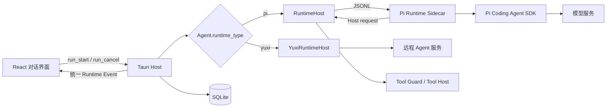
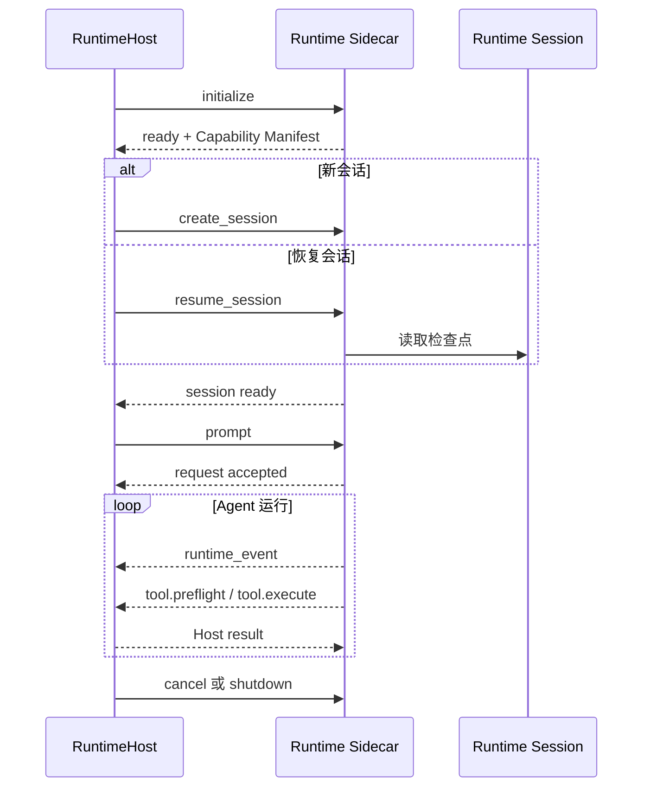

# Agent Runtime 架构

> 状态：生效<br>
> 适用版本：Fox 0.1.x<br>
> 维护范围：`services/agent-runtime`、`apps/desktop/src-tauri/src/runtime_host`、Runtime Adapter 契约<br>
> 最后更新：2026-08-21

## 目标与边界

Fox 把 Agent Runtime 定义为可替换的模型执行适配层，而不是产品状态中心。当前本地实现基于 Pi Coding Agent SDK，但对话、消息、Run、Goal、Task、Evidence、项目授权和审批都属于 Fox Host；替换 Pi 或增加其他 Agent 框架时，不应重写这些产品模型。

稳定边界如下：

- React 只依赖统一的 Conversation、Run 和 Runtime Event，不识别 Pi 内部事件。
- Tauri Host 负责选择 Runtime、持久化状态、执行权限检查和处理 Host Tool。
- Runtime 负责模型会话、提示词组合、结构化工具调用和流式事件转换。
- SQLite 是产品事实源；Runtime Session 是可丢失、可重建的执行检查点。
- Runtime 不能直接写数据库、激活 Goal、扩大项目范围或绕过审批。

相关产品级调用链见[对话系统架构](对话系统架构.md)，智能体、模型服务和能力画像见[智能体与模型架构](智能体与模型架构.md)。

## 运行时适配层



`Agent.runtime_type` 是当前路由键：

| 值 | 当前实现 | 进程位置 | 会话载体 |
| --- | --- | --- | --- |
| `pi` | `RuntimeHost` + Pi Sidecar | Rust Host 子进程 | 本地 Runtime Session JSON |
| `yuxi` | `YuxiRuntimeHost` | Tauri Host 内异步任务 + 远端服务 | 远端 Thread/Run + 本地游标 |

Pi 是首个本地 Runtime Adapter，不是 Fox 对话架构本身。未来增加 LangGraph、自研 Runtime 或其他 SDK 时，应新增适配器并复用 Host 契约，而不是在前端增加一套对话状态。

## Runtime Adapter Contract

一个 Runtime Adapter 必须实现五类行为：

1. **生命周期**：初始化、建立或恢复会话、执行 Prompt、取消和关闭。
2. **能力声明**：通过 Capability Manifest 告诉 Host 支持的流式输出、推理、图片、取消、恢复和工具能力。
3. **事件归一**：把 SDK 或远端服务事件映射为 Fox Runtime Event。
4. **工具回调**：对 Host-owned 工具发起结构化请求，等待 Host 返回结果或审批结论。
5. **可恢复性**：保留可重建会话所需的检查点或远端标识，并能在进程重启后恢复或明确失败。

适配器不得改变以下 Host 契约：

- `run_start` 先创建用户消息和 Run，再分派到 Runtime。
- Runtime Event 先写入 `run_events`，再广播 `fox://runtime-event`。
- 取消必须按 Run 生效，不能继续向已取消 Run 写增量。
- 工具的路径、执行位置和审批策略由 Host 决定。
- Goal/Task/Evidence 的持久化只能通过 Fox Work Tools 完成。
- 前端刷新后必须能只凭 SQLite 投影恢复对话。

协议字段和事件清单以[Runtime 协议](../04-技术参考/Runtime协议.md)为事实源。

## 本地进程模型

### RuntimeHost

`apps/desktop/src-tauri/src/runtime_host/mod.rs` 管理本地 Worker。内部状态包含：

- 子进程、stdin 和待响应请求表；
- 当前会话和活动 Run；
- 等待审批的 Tool Call；
- `queued_runs` 运行队列和正在分派的 Run；
- 分派前已取消的 Run 集合；
- Runtime stderr 尾部、最后错误和恢复次数；
- Runtime 名称、版本和 Capability Manifest。

当前实现是单 Worker 队列，不是多 Agent Worker Pool。同一时刻由一个本地 Worker 处理活动 Run，其他 Run 排队；A5 的 Child Agent 和真正并行 Worker 属于后续能力。

### Sidecar 启动

开发环境可以直接运行 Node 入口，发布构建由 `services/agent-runtime/scripts/build-sidecar.mjs` 生成独立可执行 Sidecar。Host 为子进程配置：

- stdin/stdout：一行一个 JSON Envelope；
- stderr：诊断日志，不得混入协议 stdout；
- Session、附件和 Skills 目录；
- 当前模型服务配置和必要的 Host 上下文。

Host 对协议行大小、响应时间和 stderr 保留数量设置上限。Sidecar 输出非 JSON、未知消息或超限消息时，Host 按协议错误处理，不把原始输出直接渲染给用户。

## JSONL 生命周期



主要请求：

| 请求 | 目的 | 失败处理 |
| --- | --- | --- |
| `initialize` | 注入配置并校验协议/能力 | 初始化失败则 Runtime 不可用 |
| `create_session` | 创建新会话和初始检查点 | Run 失败，SQLite 消息仍保留 |
| `resume_session` | 从 Session 文件恢复 | 可用 Prompt 历史重建或显式失败 |
| `prompt` | 提交当前轮输入 | 立即确认接收，后台流式执行 |
| `cancel` | 取消 Agent 和 Pending Host 请求 | 生成取消终态并停止旧增量 |
| `shutdown` | 终止全部会话并退出 | Host 回收子进程 |

## Capability Manifest

Capability Manifest 是 Host 与 Runtime 的启动契约。当前本地基线声明：

- `streamingText`、`cancellation`、`reasoning`、`sessionResume`、`toolApproval`、`contextCompaction` 为支持；
- `imageInput` 由所选模型配置动态决定；
- `steering`、`dynamicModelSwitch` 当前不支持。

Manifest 版本、Runtime 版本和实际工具目录必须相容。Runtime 声明 Host 不认识的必需能力，或声明工具与注册工具不一致时，应在初始化阶段失败，不能等到用户对话中才暴露。

## Pi Runtime 实现

`services/agent-runtime/src/pi-runtime.mjs` 是当前真实本地适配器，使用：

- `@earendil-works/pi-agent-core`；
- `@earendil-works/pi-ai`；
- `@earendil-works/pi-coding-agent`。

Pi 提供模型抽象、Agent Session、工具调用、重试和上下文压缩。Fox 在其外部增加以下 Harness：

| 模块 | Fox 职责 |
| --- | --- |
| `model-profile.mjs` | 按 API、供应商和模型族生成能力画像及兼容参数 |
| `runtime-instructions.mjs` | 定义 Fox 稳定运行规则、Goal 意图和安全边界 |
| `prompt-composer.mjs` | 分层组合稳定提示词、Host 上下文和单轮上下文 |
| `planner-runtime.mjs` | 对复杂项目任务执行只读、内部 Planner 阶段 |
| `fox-planning-extension.mjs` | 注册 Host Work Tools 并注入权威 Work Snapshot |
| `pi-event-mapper.mjs` | 把 Pi 事件投影成 Fox Runtime Event |
| `runtime-session.mjs` | 保存和清理可恢复 Session |

## 模型能力画像

`resolveModelProfile` 不只按 API 类型判断，还结合 Base URL 和模型 ID 识别供应商族与模型族。画像包含：

- API：`openai-completions`、`anthropic-messages`、内部支持的 `openai-responses` 或测试 `faux`；
- reasoning 是否可用、传输方式和 thinking level；
- 图片、工具、并行工具、Prompt Cache 能力；
- Context Window 和最大输出 Token；
- Planner 开关、Planner Token 和思考等级；
- 重试次数、最大退避、压缩预留和最近上下文保留量；
- Provider 兼容字段，例如 `max_completion_tokens`、developer role 和 DeepSeek reasoning content。

模型设置界面当前仅正式暴露 `openai-completions` 与 `anthropic-messages`。Runtime 内部理解某种 API 不等于产品已经支持用户配置；增加 UI API 类型时必须同步验证 Rust Host、密钥、连通性测试和 Runtime。

画像快照会写入 `run.request_snapshot`，便于诊断“同一提示词在不同模型为何表现不同”。模型适配详细设计见[智能体与模型架构](智能体与模型架构.md)。

## 提示词分层

Fox 不直接使用 Pi 的裸默认提示词。`composeFoxPrompt` 将输入分成稳定层和动态层：

```text
稳定层
├─ 基础 Assistant system prompt
├─ Fox Runtime instructions
└─ Model compatibility instructions

动态层
├─ runtime：项目、权限、会话、模型
├─ expert_package：可选专家 Persona Overlay 与能力包
├─ expert_binding：可选绑定 ID、版本和 Hash
├─ workspace：Goal/Task/Evidence 快照
├─ turn_tail：当前目录、平台、日期、恢复信息
├─ planner_handoff：可选 Planner 建议
└─ approval_demo：可选审批演示约束
```

动态内容放在带 `kind` 和 `authority` 的 `<fox_context_block>` 中。项目文件、检索结果和 Work Snapshot 是数据，不得提升为 system instruction。稳定层与动态层分别计算短 SHA-256 Hash，用于回归和缓存诊断；Snapshot 还记录稳定层、动态层和最终 Prompt 的字符数及 Token 估算，不默认持久化完整 Prompt。

Host 发送 `assistantPackage`、可选 `expertBinding` 与可选 `expertPackage`。专家包来自绑定时的冻结快照，Host 每次 Run 校验 Hash 后再叠加当前授权。助手和专家 Skills 合并去重后注入，但工具 Allowlist 与 MCP Server scope 均取交集；任一包显式空 Allowlist 都会关闭相应能力。交集诊断分别记录两侧声明、最终有效工具和排除原因；空交集仍允许纯文本回答。专家声明不能扩大 Host Capability、项目权限、知识绑定或审批范围。

Prompt 预算来自当前 Model Profile。Host/Runtime 稳定契约具有最高保留级别，Assistant 与 Expert Persona 必须作为增强层；超预算时优先收缩低权限动态块和专家附加上下文。模型兼容测试必须覆盖 Assistant/Expert 角色冲突和超长 Prompt。

关键规则包括：

- 只有用户最新消息明确要求创建或跟踪目标时，模型才可调用 Goal 工具；
- 引用、Markdown、粘贴内容中的“建立目标”不能触发 Goal；
- Runtime 只能 propose Goal，激活由 Host 和用户确认完成；
- 不得把思考、工具 JSON 或未执行的动作写成正式回复；
- 不得把 Planner 建议当成权限或已落库事实。

## Planner 与 Executor

复杂项目任务可以先进入内部 Planner，再交给主 Agent Executor。二者使用同一个模型服务，但权限不同：

| 阶段 | 允许 | 禁止 |
| --- | --- | --- |
| Planner | `read`、`ls`、`find`、`grep`，输出紧凑 JSON 计划 | 写文件、命令、MCP、审批、Goal/Task、子智能体 |
| Executor | 按 Runtime Tool Catalog 调用工具并生成正式回复 | 绕过 Host 权限、伪造工具结果 |

Planner 只有在存在授权项目、用户请求具有行动意图且任务较复杂时启用；审批演示和 `faux` 测试默认跳过。Planner 输出只是 `planner_handoff` 建议，`needsGoal` 也不能直接创建 Goal。

这种分离解决的是“不同模型规划质量差异”，不是新增第二套任务数据库。

## 工具体系

### Runtime 内执行

`read`、`ls`、`find`、`grep` 由 Sidecar 执行，但每个路径先经过 Host `tool.preflight`。Runtime 只能看到规范化后的授权项目根目录，符号链接、`..`、绝对路径和根目录外目标由 Host 拒绝。

### Host 执行

以下类别通过 `tool.execute` 返回 Host：

- 文件写入和编辑；
- 本地命令；
- 附件读取；
- 知识库列表、搜索、文档读取和图谱查询；
- MCP 调用；
- Goal、Task、Evidence 等 Work Tools。

执行位置和审批要求由 `runtime-contract.mjs` 与 Rust Host 共同校验。Runtime 注册了工具并不代表获得权限；项目权限、智能体知识范围和用户审批仍在 Host 侧生效。

## Goal 和 Planning Extension

`fox-planning-extension.mjs` 使用 Pi Extension API 注册 Work Tools，并在 Agent 启动前注入 Host 权威上下文。它不承担以下职责：

- 不保存第二份 Goal/Task；
- 不根据自然语言自行激活目标；
- 不猜测 Conversation ID；
- 不把未返回持久化记录的工具调用描述为成功。

Work Tool 的声明、Rust Handler 和 `runtime capability` 必须成套存在。缺少 Host Handler 时应在能力校验或测试阶段失败，避免出现“工具声明 host execution 但 Fox 没有 handler”的运行时错误。

## 事件与推理隔离

`pi-event-mapper.mjs` 输出统一事件：

- Run：`run.started`、`run.completed`、`run.failed`、`run.cancelled`；
- Message：`message.started`、`message.delta`、`message.completed`；
- Reasoning：`reasoning.delta`；
- Tool：`tool.started`、`tool.updated`、`tool.completed`；
- Source 和 Usage：`source.added`、`usage.updated`；
- 诊断：`run.request_snapshot`、运行阶段等事件。

Provider 原生 reasoning 优先映射到 `reasoning.delta`。对把 `<think>` 或计划文字混入普通文本的兼容模型，映射器只按明确边界分离，不能依靠宽泛关键词把正常答案误判成思考。前端只把 `message.*` 作为正式回复，把推理收进工作过程。

## Session、压缩和重试

- SQLite 消息和 Run Event 是完整产品历史。
- `runtime-sessions/*.json` 保存 Pi 可恢复消息和检查点，不是事实源。
- Prompt 携带必要历史作为 Session 丢失后的恢复兜底。
- 保存前清理 Runtime 私有字段、不兼容 reasoning 字段和不应恢复的临时规划内容。
- 工具结束、消息结束和 Agent 结束会触发串行检查点，避免并发覆盖。
- 重试与 Context Compaction 参数来自 Model Profile；不同模型可以设置不同退避和 Token 预留。
- `usage.updated` 记录 input、output、cache read、cache write 和 total tokens。

模型配置重新加载时，Host 会停止旧 Worker；活动 Run 存在时拒绝热切换，避免一次运行中途改变模型契约。

## 取消、异常与恢复

### 用户取消

1. Host 标记活动或排队 Run 的取消意图。
2. 已提交 Sidecar 的 Run 收到 `cancel`；尚未提交的 Run 从队列中移除。
3. Runtime 中止 Agent 和 Pending Host Tool Promise。
4. Host 写入取消终态，前端丢弃此后属于旧 Run 的增量。

### Sidecar 异常

- stdout 协议错误：记录 `protocol.invalid_message` 并隔离原始内容。
- 未知请求：返回 `protocol.unknown_request`。
- Provider/Pi 异常：生成 `run.failed`，保留可展示错误码。
- Agent 无终态退出：Host/Runtime 主动补失败终态。
- Worker 崩溃：保留 SQLite 事件，按受限次数恢复 Worker；诊断记录恢复次数和时间。

### 应用重启

Host 首先修复数据库中断状态，再按 Runtime 类型恢复。Pi 使用 Session 文件或历史重建；Yuxi 使用远端 Thread/Run。恢复失败必须落为明确状态，不能让界面永久“处理中”。

## 增加新的 Runtime

新增适配器时按以下顺序实施：

1. 定义 `runtime_type` 和配置来源，保持 Agent ID 与 Conversation 绑定不变。
2. 实现初始化、Session、Prompt、Cancel、Shutdown 和恢复。
3. 将原生事件映射到 Fox Runtime Event，不向前端泄漏 SDK 私有结构。
4. 实现 Capability Manifest，并与真实能力和工具 Handler 对齐。
5. 所有受保护工具走 Host Preflight/Execute，不直接访问 SQLite、Keyring 或未授权路径。
6. 支持 `run.request_snapshot`、usage 和诊断字段。
7. 加入适配器契约测试、取消/恢复测试和前端 Reducer 回放测试。
8. 更新[智能体与模型架构](智能体与模型架构.md)、[Runtime 协议](../04-技术参考/Runtime协议.md)和设置界面说明。

最低兼容验收：文本流式、工具成功/失败、审批同意/拒绝、取消、重启恢复、错误终态、引用、Usage、Goal Tool 能力校验。

## 测试与评测

| 层级 | 位置 | 关注点 |
| --- | --- | --- |
| Runtime 单元测试 | `services/agent-runtime/test` | 协议、事件映射、Session、Prompt、Profile、Planner、工具 |
| Adapter Contract | `runtime-adapter-contract.test.mjs` | Fake/Pi 遵循同一能力与事件契约 |
| Host 测试 | `apps/desktop/src-tauri/src/runtime_host` | 队列、取消、协议限制、审批、恢复、脱敏 |
| 前端测试 | `apps/desktop/tests/runtime-event-reducer.test.ts` | 事件乱序、重复、刷新恢复和终态 |
| 离线评测 | `services/agent-runtime/evals` | 模型画像、BFCL 风格工具契约、AgentDojo 风格注入、Fox 意图回归 |
| Sidecar Smoke | `scripts/smoke-sidecar.mjs` | 独立可执行文件握手、会话、流式和退出 |

常用命令：

```powershell
pnpm.cmd runtime:test
pnpm.cmd runtime:eval
pnpm.cmd runtime:build
pnpm.cmd runtime:smoke
cargo test --manifest-path apps/desktop/src-tauri/Cargo.toml runtime_host
```

离线 `30/30` 是 Harness 契约基线，不是 BFCL、AgentDojo、SWE-bench 等官方模型质量分数。真实模型评测必须记录模型版本、凭据环境、数据集版本、重复次数和成本。

## 已知限制

- 本地 Host 仍是单 Worker 队列，未实现 Child Agent 与并行调度。
- 混合文本 reasoning 的拆分存在模型特异性，需要持续回归。
- `openai-responses` 尚未作为完整 UI/Host 配置能力发布。
- Planner 是单轮只读建议器，尚无持久化 PlanRevision 或独立 Reviewer。
- Runtime Session 仍是本地 JSON 文件，跨设备迁移只保证产品数据，不保证执行栈原样恢复。

## 相关代码与文档

- `services/agent-runtime/src/pi-runtime.mjs`
- `services/agent-runtime/src/runtime-contract.mjs`
- `services/agent-runtime/src/model-profile.mjs`
- `services/agent-runtime/src/prompt-composer.mjs`
- `services/agent-runtime/src/planner-runtime.mjs`
- `services/agent-runtime/src/fox-planning-extension.mjs`
- `apps/desktop/src-tauri/src/runtime_host/`
- [总体架构](总体架构.md)
- [对话系统架构](对话系统架构.md)
- [项目与权限架构](项目与权限架构.md)
- [可观测性与测试架构](可观测性与测试架构.md)
