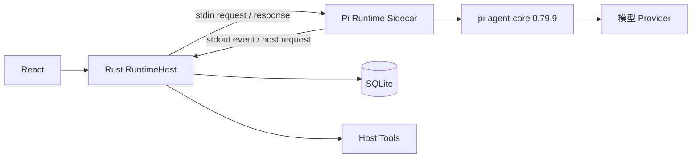

# Agent 运行时架构

> 状态：当前实现基线，含明确规划标记 
> 适用版本：Fox 0.1.x 
> 维护者：Fox Runtime 团队 
> 最后更新：2026-07-29

## 目标

Fox 通过稳定的 JSONL 协议隔离产品层与 Pi Agent 实现。Runtime 可以升级或替换，但不能拥有 Fox 的产品状态和本地权限。

## 进程模型

Sidecar 的 stdout 只允许协议 JSONL，诊断写 stderr。Host 启动时发送 `initialize` 并校验能力清单；会话通过 `create_session` 或 `resume_session` 建立。

## Runtime 请求

- `initialize`：注入模型服务配置，返回 `ready` 和能力清单。
- `create_session`：创建内存会话并保存初始检查点。
- `resume_session`：从 `runtime-sessions` 恢复。
- `prompt`：立即确认请求，后台执行 Agent。
- `cancel`：中止对应 Agent 和待处理 Host 请求。
- `shutdown`：中止全部运行并退出进程。

## 事件映射

`pi-event-mapper.mjs` 把 Pi 事件归一为：

- `run.started/completed/failed/cancelled`
- `message.started/delta/completed`
- `reasoning.delta`
- `tool.started/updated/completed`
- `source.added`
- `usage.updated`

Host 持久化事件，再发送 `fox://runtime-event`。这一顺序确保前端漏事件时仍可由数据库恢复。

## 工具执行边界

只读 `read/ls/find/grep` 在 Runtime 内执行，但路径先向 Host 做 `tool.preflight`。附件、写入、命令、知识库和 MCP 使用 `tool.execute` 交由 Host。能力清单与实际注册工具必须完全一致，否则 Runtime 初始化失败。

## Session 与历史

- SQLite 消息是完整对话历史。
- Runtime Session JSON 保存 Pi 可恢复消息，不是事实源。
- Prompt 同时携带必要历史作为恢复兜底；Runtime 会清理不兼容字段和私有规划输出。
- 工具结束、消息结束和 Agent 结束时触发串行检查点写入。

## 推理与输出

优先使用 Provider 的 thinking channel。对把规划混入文本的兼容接口，事件映射器仅按强信号拆分；无法可靠分类时避免把私有规划当最终答案。该兼容逻辑具有启发式风险，应通过 Provider 专项测试维护。

## 调度与恢复

当前 Host 管理运行队列和 Worker 生命周期。异常退出后数据库修复中断状态；远程 Yuxi Run 由另一适配器轮询恢复。多 Child Agent、真正并行 Worker Pool 是 A5 规划，不属于当前能力。

## 能力清单现状

`streamingText/cancellation/reasoning/sessionResume/toolApproval/contextCompaction` 为真；`steering/dynamicModelSwitch` 为假；图片输入由模型配置动态声明。

## 失败策略

- 协议不合法：`fatal_error(protocol.invalid_message)`。
- 未知请求：`request_failed(protocol.unknown_request)`。
- Provider 或 Pi 异常：`run.failed`，保留错误码和消息。
- Agent 无终态退出：主动生成失败事件。
- Host 工具取消：拒绝 Pending Promise，防止悬挂。

## 测试依据

`services/agent-runtime/test/` 覆盖协议、Fake Runtime、Pi 事件映射、Session、只读工具、适配器契约和能力清单；Rust Runtime Host 另有单元测试。执行 `pnpm runtime:test` 与 `pnpm runtime:smoke`。

## 关键代码

`services/agent-runtime/src/pi-runtime.mjs`、`pi-event-mapper.mjs`、`runtime-contract.mjs`、`runtime-session.mjs`、`apps/desktop/src-tauri/src/runtime_host/`。
