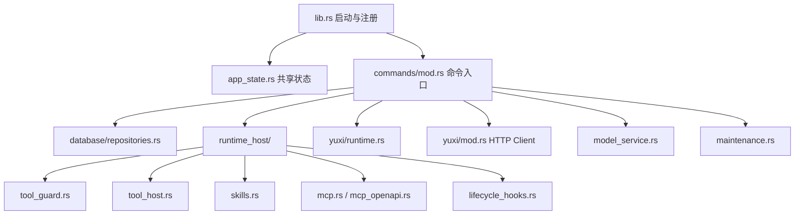

# Tauri 后端架构

> 状态：生效 
> 适用版本：Fox 0.1.x 
> 维护范围：Tauri Command、AppState、Repository、Host Service 和系统资源 
> 最后更新：2026-08-24

## 定位

Tauri 后端是 Fox 的可信 Host：它连接 WebView、SQLite、文件系统、系统凭据库、Pi Sidecar、知识库服务和 MCP。所有具有本地副作用的能力必须经过此层。

## 模块结构

## 启动生命周期

`lib.rs::run` 依次完成应用数据目录、待恢复数据、数据库、运行目录、客户端与 Runtime Host 初始化。应用退出时调用 `runtime_host.shutdown()` 和扩展连接池 shutdown，避免遗留 Sidecar 或 stdio MCP 子进程。

`AppState` 持有可共享的数据库句柄、Runtime Host、知识库客户端、远程 Runtime、模型客户端、数据路径，以及下载/预览任务的取消注册表和锁。AppState 管理基础设施引用，不应成为新的业务数据事实源。

## 命令层规则

- Tauri Command 只做参数校验、编排和 `ApiResponse<T>` 转换。
- 业务持久化放入 Repository；外部 HTTP 放入专用 Client。
- 长任务通过异步命令或脱离请求的 Runtime 任务执行。
- 前端不能传入任意存储路径绕过受管目录。
- 错误必须保留稳定错误码或可识别上下文，避免只返回“失败”。

命令分组详见 `04-技术参考/Tauri命令与事件.md`。

## 并发与锁

- SQLite 使用 WAL、5 秒 busy timeout，并通过 `Database` 封装访问。
- Runtime Host 管理 Worker 与待运行队列，单 Run 的事件按 `seq` 去重。
- 扩展连接池按 source 串行请求，复用 stdio 进程或 HTTP MCP Session；配置变化使旧连接失效。
- 知识预览以 `cache_key` 获取异步互斥锁，避免同一原件重复下载。
- 下载与预览使用取消注册表；完成路径必须注销操作。

## 文件与路径边界

- 项目文件访问先 canonicalize，并验证目标位于授权根目录内。
- 附件只能从 Fox 管理的 `attachments` 根读取。
- 预览缓存路径由 Host 根据哈希生成，前端只传缓存键。
- 备份恢复校验相对路径、大小和清单，使用待恢复目录在重启时应用。

## 失败恢复

| 故障 | 当前处理 |
|---|---|
| 上次运行中断 | 启动时修复 Run，远端 Runtime 恢复轮询 |
| Sidecar 不可用 | Runtime diagnostics 给出脚本/依赖/进程状态 |
| 下载中断 | `.part` 文件与操作注册表清理，支持取消 |
| 缓存残留 | 启动重置租约，按 LRU 和容量清理 |
| 数据恢复失败 | 保留回滚副本，阻止部分覆盖 |

## 安全注意

Host 是安全边界而不是简单代理。写文件、编辑、命令和 MCP 调用在执行前均需策略判断或用户审批；远程内容视为不可信。`tauri.conf.json` 的 `app.security` 已同时配置 `csp` 与 `devCsp`（完整策略字符串，含 `default-src 'self'`、`object-src 'none'`、显式 `connect-src`/`worker-src`），不再是「无 CSP」状态；仍需补充浏览器端策略回归。详见[安全架构](安全架构.md)。

## 测试依据

- `database/migrations.rs` 与 `repositories.rs` 内建数据库测试。
- `maintenance.rs` 覆盖缓存、备份、恢复和回滚。
- `runtime_host/mod.rs` 覆盖协议、依赖检测、附件与事件处理。
- `mcp.rs` 与 `mcp_openapi.rs` 使用假 stdio Server 和本地 HTTP Server 验证持久连接、Session/SSE、OpenAPI list/call/schema/timeout；`lifecycle_hooks.rs` 验证声明式动作与审计。

## 关键代码

`apps/desktop/src-tauri/src/lib.rs`、`app_state.rs`、`commands/mod.rs`、`runtime_host/mod.rs`、`maintenance.rs`。

领域边界分别见[对话系统架构](对话系统架构.md)、[Agent Runtime 架构](Agent运行时架构.md)、[项目与权限架构](项目与权限架构.md)、[知识库集成架构](知识库集成架构.md)和[数据架构](数据架构.md)。
