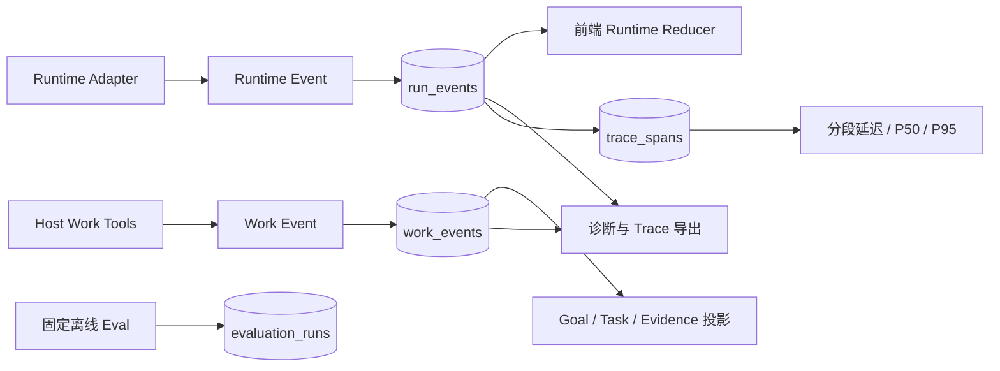
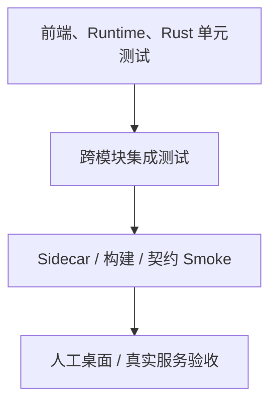

# 可观测性与测试架构

> 状态：生效<br>
> 适用版本：Fox 0.1.x<br>
> 维护范围：Runtime/Work 事件、诊断、Usage、自动化测试与 Agent Eval<br>
> 最后更新：2026-08-24

## 目标与原则

Fox 的可观测性服务于三类问题：

1. 用户为什么看到“处理中”、失败、审批或恢复状态；
2. 一次 Agent Run 实际使用了什么模型、提示词版本、工具和证据；
3. 升级 Runtime、模型适配、数据库或前端 Reducer 后是否仍满足契约。

基本原则：

- 以结构化事件和 SQLite 为事实源，不依赖控制台日志还原产品状态。
- Runtime Event 和 Work Event 分流，避免模型流式序列污染 Goal/Task 序列。
- 诊断数据默认脱敏、限长、可导出，但不保存 API Key、Token 或大段用户内容。
- 测试同时覆盖实时事件路径和刷新后数据库恢复路径。
- 离线 Harness Eval 与真实模型质量评测分开报告。

## 两条事件流



### Runtime Event

Runtime Event 描述一次模型运行中的流式事实：

- Run 生命周期；
- Assistant Message 和 Reasoning 增量；
- Tool Call 生命周期与审批；
- Source、Usage、Request Snapshot；
- 远程 Runtime 的问题、恢复和错误投影。

每条事件至少关联 Conversation ID、Run ID、`seq` 和时间戳。`seq` 在单个 Run 内单调递增，用于排序、去重和恢复缺口识别。

### Work Event

Work Event 描述 Host-owned 工作状态变化：

- Goal propose、activate、pause、resume、complete、delete；
- Task create、start、complete、block；
- Evidence 添加、校验或失效；
- 与 Run、Trace、Span 的关联。

Work Event 使用独立 `sequence`。一个 Goal 可以跨多个 Run，不能复用某个 Run 的 `seq` 作为工作图全局顺序。

### 为什么必须分开

如果把两类事件混成一个序列，会出现：

- 新 Run 从 0 开始导致 Work UI 误判旧事件；
- 流式 Token 量挤占工作状态序号；
- Goal 跨 Run 恢复时无法确定最后工作版本；
- 删除或完成 Goal 后，旧 Runtime Event 使胶囊重新出现。

前端应分别订阅 `fox://runtime-event` 和 Work Event 通知，再按 Conversation ID 汇合展示。

## 持久化顺序

Runtime 和 Work 事件都遵循“先持久化、后通知”：

1. Host 校验事件所属 Conversation/Run/Goal；
2. 在 SQLite 事务中追加事件并更新必要投影；
3. 事务提交；
4. 通过 Tauri Event 通知 React；
5. React Reducer 幂等合并。

窗口关闭、WebView 刷新或事件监听暂时丢失时，重新加载 Conversation Detail 和事件历史即可恢复。前端本地状态不是最终事实源。

## 标识和关联

| 标识 | 范围 | 用途 |
| --- | --- | --- |
| `conversation_id` | 产品会话 | 聚合消息、Run、Goal 和绑定 |
| `run_id` | 单轮执行 | Runtime Event、Tool Call、Usage |
| `runtime_session_id` | Runtime 会话 | 本地 Session 或适配器恢复 |
| `goal_id` / `task_id` | 工作图 | Goal、Task、Evidence 关系 |
| `trace_id` | 单次 Run Trace | 32 位十六进制标识；诊断、指标和证据关联 |
| `span_id` / `root_span_id` | 局部步骤 | 16 位十六进制标识；Run、阶段、工具和 UI 的父子关系 |
| `remote_thread_id` / `remote_run_id` | 远程 Runtime | Yuxi 恢复和去重 |

schema v26 起，每个新 Run 在写入时即由 Host 创建 `invoke_agent` 根 Span；旧 Run 在迁移时补齐根 Span。`run.phase` 投影为 plan/inference/host_prepare/finalize 阶段 Span，工具调用投影为 `execute_tool` Span，前端记录首次事件与终态渲染延迟。Runtime 不能自行指定或伪造 Trace 身份。

当前实现是本地、版本化的 Fox Trace schema v1，复用 OpenTelemetry 的 Trace/Span 树、状态和 GenAI operation 命名语义，但没有声明完整 OTLP/GenAI semantic conventions 兼容。A5 Child Run 与父 Run 共用 Trace ID，Child root span 连接 delegation tool span；Runtime 工具事件继续在 Child root 下形成独立子树。

## Request Snapshot

Runtime 在执行初期发出 `run.request_snapshot`，用于回答“这一轮到底以什么配置运行”。当前快照包括或可关联：

- Model ID、Provider/API 类型和 Model Capability Profile；
- reasoning、thinking level、工具和图片能力；
- Context Window、最大输出和 Planner 设置；
- 稳定提示词 Hash `stablePromptHash`；
- 动态上下文 Hash `contextHash`；
- Planner 是否启用、耗时和 Plan Hash；
- Runtime/协议版本和会话标识。

Snapshot 保存 Hash 和能力摘要，而不是完整 system prompt、API Key 或原始知识正文。需要比较输出回归时，以 Hash 判断提示词是否变化，再在受控开发环境核对源文件。

## Usage 与缓存指标

`usage.updated` 统一记录：

- `inputTokens`；
- `outputTokens`；
- `cacheReadTokens`；
- `cacheWriteTokens`；
- `totalTokens`。

同一 Run 可以多次更新 Usage。统计查询只取每个 Run 的最新事件，避免流式累计值被重复相加。设置页可按总量、日期和 Agent 聚合。

Usage 的限制：

- Provider 不返回某字段时只能记 0 或未知，不能推测精确值；
- Token 口径可能因 Provider 不同而不同；
- Cache Token 表示模型 Prompt Cache，不等同于知识预览磁盘缓存；
- 成本估算需要独立、版本化价格表，当前 Usage 本身不代表货币成本。

## 分段延迟指标

设置页从 `trace_spans` 聚合最近样本，显示 plan、inference、execute_tool、host_prepare、finalize 和 ui_render 的 P50/P95/最大耗时，并列出最近 Run 的总耗时和分段耗时。计算只使用已闭合 Span；进行中的 Span 不参与分位数。

- Host 收到 `run.phase` 时闭合上一阶段并开启下一阶段；
- `tool.started/tool.completed` 以 `toolCallId` 关联同一个工具 Span；
- Run 终态会闭合遗留的阶段和工具 Span，并设置 `ok/error`；
- UI 只允许上报 `ui.first_event` 和 `ui.terminal_render` 两种有界指标；
- Trace attributes 只保存低基数字段与 Hash，不保存 Prompt、工具输入输出或项目正文。

## Runtime 诊断

`runtime_diagnostics` 返回：

- 协议名、协议版本、Capability Manifest 版本；
- Runtime 名称、版本、状态和是否可用；
- 当前 Conversation、活动 Run；
- 最近错误；
- 最近 20 行受限 stderr；
- Session 文件数量；
- Worker 恢复次数和最后恢复时间。

Host 内部最多保留有限数量 stderr 行，并对错误和 stderr 尾部执行脱敏。Runtime stdout 是协议通道，不属于普通日志；任何非协议输出都按错误处理。

诊断页应优先展示稳定错误码、运行阶段和建议动作。原始 Provider 错误只作为次级细节，避免把内部请求或凭据直接显示给用户。

## Work State 诊断

`work_diagnostics.rs` 对指定 Conversation 执行一致性检查，报告：

- Goal、Task、Evidence、Work Event 数量；
- Run、Runtime Event、Tool Call 数量；
- 各状态分布；
- 多活动 Goal、无 Task Goal、无原因 Blocked 等异常；
- Task 与 Goal、Evidence 与 Task 的悬空关系；
- 终态、版本和事件序列不一致；
- Trace/Span 关联缺失等发现。

结果包含 `healthy`、严重度、稳定 finding code 和关联实体 ID。诊断本身只读，不自动修改数据。

### Work Trace 导出

导出文件包含诊断摘要以及脱敏后的 Goal、Task、Evidence、Work Event、Run、Runtime Event 和 Tool Call 元数据。默认只导出：

- ID、状态、版本、时间和序列；
- 错误或阻塞原因是否存在，而非完整敏感文本；
- 工具名、执行位置和是否需要审批；
- Trace/Span 关联。

导出版本和事件 Schema 版本独立记录，便于未来工具读取旧报告。导出不得包含 API Key、Token、Cookie、完整 Prompt、项目文件内容或知识正文。

## 前端事件归并

### Runtime Event Queue

`runtime-event-queue.ts` 在事件监听和 Conversation 初始化之间建立缓冲。会话切换或首屏加载时，先完成历史装载，再按 Run/Seq 消费排队事件，防止：

- 监听器先收到增量但 Message 尚未创建；
- 旧 Conversation 的延迟事件写入当前页面；
- 快速切换会话造成事件丢失。

### Reducer

`runtime-event-reducer.ts` 必须满足：

- 同一 `(run_id, seq)` 幂等；
- 只接受属于当前 Conversation 的通知；
- Message Delta 追加到正确消息；
- Reasoning、Tool、Source 与正式文本分开；
- Run 进入终态后忽略非法后续增量；
- `run.request_snapshot` 和 Usage 更新摘要面板；
- 刷新加载的历史与实时事件得到同一投影。

新增 Runtime Event 时，必须同步修改 TypeScript 类型、Reducer、历史解析和测试，不能只让实时路径“看起来可用”。

## 错误分层

| 层级 | 示例 | 责任组件 |
| --- | --- | --- |
| 输入/配置 | 未选择项目、模型服务不可用 | Tauri Command / UI |
| 权限 | 路径越界、审批拒绝 | Tool Guard / Tool Host |
| Runtime 协议 | 非法 JSONL、能力不匹配 | RuntimeHost |
| Provider/模型 | 超时、限流、响应结构错误 | Runtime Adapter |
| 远程服务 | Thread 不存在、SSE 中断 | YuxiRuntimeHost |
| 持久化 | 迁移失败、事件冲突 | Database/Repository |
| 前端投影 | 未知事件、Reducer 不一致 | Conversation Model |

错误应保留稳定 code、用户可读 message、retryable 和必要关联 ID。UI 不应把所有层级压成同一句“连接错误”，也不应把内部堆栈当正式模型回复。

## 测试金字塔



### 前端

位置：`apps/desktop/tests`。

重点覆盖 Reducer、事件 Queue、附件、知识预览、文档活动、Agent 初始化、项目授权弹窗和纯状态逻辑。组件视觉与 Tauri 真实交互仍需开发环境人工验收。

### Runtime

位置：`services/agent-runtime/test`。

覆盖 JSONL 协议、Fake/Pi Adapter Contract、Capability Manifest、事件映射、Session、只读路径、Host Tools、Planning Extension、Model Profile、Prompt Composer、Planner 和离线 Eval Runner。

### Rust Host

位置：`apps/desktop/src-tauri/src` 与 `apps/desktop/src-tauri/tests`。

覆盖迁移、Repository、Run/Work 状态机、RuntimeHost 队列和恢复、权限、持久 stdio/HTTP MCP、OpenAPI、Lifecycle Hook/审计、知识库、预览缓存、备份恢复、诊断和命令参数校验。

### 契约和 Smoke

- 知识原文件：HEAD/Range 离线契约和可选真实服务验证；
- Sidecar：独立可执行文件初始化、Session、Faux Prompt、流式、关闭；
- 前端 Build：TypeScript 与 Vite 打包；
- Rust Build/Test：编译真实 Tauri Command 和平台集成。

## Runtime Adapter Contract 测试

每个 Runtime Adapter 至少验证：

1. 初始化返回兼容 Manifest；
2. 新建和恢复 Session；
3. 文本 Delta 与 Message 终态；
4. Reasoning 不进入正式回复；
5. Tool started/updated/completed 顺序；
6. Host Tool 成功、失败、审批拒绝和超时；
7. 用户取消与分派前取消；
8. Provider 异常和无终态退出；
9. Usage 和 Request Snapshot；
10. 重复/乱序事件不会破坏前端投影。

Fake Runtime 用于确定性测试 Host 契约，不能替代真实 Pi 或远程服务测试。

## Agent 离线评测

`services/agent-runtime/evals` 当前包含五组 Fixture：

| 套件 | 来源参考 | Fox 测量内容 |
| --- | --- | --- |
| Model Adapter Matrix | 多供应商兼容需求 | 模型族、API、reasoning、cache 和 transport 画像 |
| BFCL-style Tool Contract | Berkeley Function Calling Leaderboard | 工具名、类别、执行位置和审批契约 |
| SWE-bench-style Agent Contract | SWE-bench | inspect/edit/test/evidence/acceptance 能力链与写操作审批边界 |
| AgentDojo-style Injection | AgentDojo | 不可信内容隔离、稳定 Prompt Hash、安全规则 |
| Fox Intent Regressions | Fox 历史缺陷 | Planner 触发、粘贴文本不误建 Goal、Host-owned Goal |

运行：

```powershell
pnpm.cmd runtime:eval
node services/agent-runtime/evals/run-offline-evals.mjs --output services/agent-runtime/evals/results/current.json
node services/agent-runtime/evals/report-trends.mjs services/agent-runtime/evals/results
```

2026-08-23 的离线基线为 5 个套件、35/35。桌面设置页可以启动同一个 Sidecar 内置评测器，结果和各套件明细写入 SQLite，并保留最近历史用于趋势对比。CLI 支持 `--baseline` 检测通过数回退以及 `--output` 生成版本化 JSON 报告。

该数字只证明固定 Fixture 下的 Harness 契约，不证明模型具备官方 BFCL、AgentDojo、SWE-bench、Terminal-Bench、tau-bench、Aider 或 RAGAS 成绩。SWE-bench 官方 Harness 的容器、数据集和资源开销不进入默认桌面流程；真实榜单评测必须走下述独立边界。

## 真实模型评测边界

真实模型评测必须单独记录：

- 数据集名称、版本、许可和抽样范围；
- 模型精确 ID、Provider、API 类型和日期；
- Model Profile、Prompt Hash 和 Runtime 版本；
- 温度、thinking level、最大 Token、工具集合；
- 每题重复次数、随机种子或不可控随机性；
- 成功率、工具准确率、任务完成率、延迟、Token 和成本；
- 沙箱、网络、项目 Fixture 和人工评分规则。

官方数据集不能只复制题目名称后声称兼容。需要按其许可和评分器运行，结果与 Fox 离线契约报告分开展示。

## 变更与最低验证

| 变更 | 最低验证 |
| --- | --- |
| Runtime Event 类型 | Runtime test + Reducer test + Rust event persistence |
| Work Tool/状态 | Rust Repository/Command + Runtime tool contract + Work UI |
| Model Profile/Prompt | Runtime unit + 30 条离线 Eval + 指定模型 Smoke |
| Planner | Planner unit + 意图回归 + 普通问答不触发验收 |
| 权限/审批 | Rust Guard + Runtime Contract + 同意/拒绝/超时人工验收 |
| MCP/OpenAPI/Hook | Rust 持久 Session + 本地 HTTP/SSE 集成 + Schema/审计 + 设置页构建 |
| 知识工具/引用 | Rust/Yuxi + Event Mapper + 来源跳转 |
| Session/恢复 | Runtime test + Sidecar Smoke + App 重启 |
| Migration | Rust test + 历史数据库升级 + 备份恢复 |

完整命令见[测试指南](../05-开发指南/测试指南.md)。

## 当前基线与记录方式

测试数量会随代码变化，不应在架构图中作为永久常量。最近一次完整改造基线记录为：

- Runtime：124/124；
- 前端：121/121；
- Rust：285/285，1 ignored；
- 离线 Agent Eval：35/35。

每次发布候选应把实际命令、通过数量、日期、Commit 和未执行项写入验收报告。架构文档只保留最近参考基线；出现差异时，以当前测试输出和版本化验收记录为准。

## 已知缺口

- 尚无统一 CI 工作流和根级完整 `test` 命令。
- 前端以纯逻辑测试为主，组件和端到端覆盖不足。
- 缺少正式的跨模型在线 Eval Runner、成本预算和官方数据集执行适配器。
- 尚未提供 OTLP 导出；Child Agent 父子 Run/Span 已关联，但跨进程导出和远端 collector 仍属后续能力。
- Provider Usage 口径不完全一致，成本统计仍需版本化价格与校准。

## 相关代码与文档

- `apps/desktop/src-tauri/src/runtime_host/mod.rs`
- `apps/desktop/src-tauri/src/database/repositories/observability.rs`
- `apps/desktop/src-tauri/src/work_diagnostics.rs`
- `apps/desktop/src/features/conversations/model/runtime-event-reducer.ts`
- `apps/desktop/src/features/conversations/model/runtime-event-queue.ts`
- `services/agent-runtime/evals/`
- [Agent Runtime 架构](Agent运行时架构.md)
- [对话系统架构](对话系统架构.md)
- [数据架构](数据架构.md)
- [Runtime 协议](../04-技术参考/Runtime协议.md)
- [测试指南](../05-开发指南/测试指南.md)
