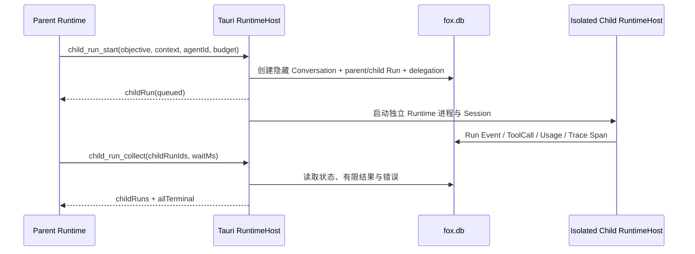

# 子 Agent 与 Child Run 架构

> 状态：生效
> 适用版本：Fox `0.1.x`；当前数据库 schema 79（本主题相关表由更早迁移引入）
> 最后更新：2026-09-22
> 基线与成熟度口径见[当前状态与核验基线](../01-项目概览/当前状态与核验基线.md)

## 目标与边界

A5 为本地 Pi Runtime 提供 Host-owned Child Run。父 Agent 可以把相互独立的调查、审查或实现子问题交给不同本地 Agent，并在父 Run 继续工作时并行执行。Child Run 不是 Prompt 中的角色扮演，也不是第二套任务事实源：身份、运行时长、状态、结果、审批和取消都由 Tauri Host 与 SQLite 管理。

本轮复用开源项目已经验证的协议语义，而不引入其 Python 运行时：LangGraph Supervisor 的 tool-based handoff、Pydantic AI 的 usage limit 与树级 cancellation、AutoGen 的 cancellation token 与终态 TaskResult。Fox 的进程、数据库和 Runtime 协议均为 Rust/Node，直接引入这些框架会产生第二事实源，因此没有复制第三方代码或新增框架依赖。

## 默认助手、专家与子 Agent

- 默认助手是面向用户的 Lead，持有主对话、目标和最终答复责任。
- 专家是可复用能力包。用户把专家挂载到对话时，它以 `expert_package` 叠加在默认助手上，不产生独立运行。
- 子 Agent 是按当前任务创建的隔离运行实例，不是预先常驻的“固定同事”。普通 Child Run 从 Assistant/Worker 模板创建；一次性专业判断通过专家咨询创建，完成后只把结果交回 Lead，不改变对话当前挂载的专家。

`child_agent_list` 一次返回相互分离的 `agents` 与 `experts` 两个目录。普通子任务使用 `child_run_start(mode=worker, agentId=...)`；一次性专业咨询使用 `child_run_start(mode=expert_consultation, expertId=...)`。两种方式都返回同一种 Host-owned `ChildRunRecord`，并统一通过 `child_run_collect` 收口。

## 执行链路

每个 Child Run 拥有独立隐藏 Conversation、独立 Runtime Session、独立 RuntimeHost 状态和独立 Sidecar 进程。它只接收 `objective`、显式 `context`、选定 Agent 的静态包、Host 允许的项目上下文和受治理 Memory；父会话 transcript 不会复制过去。项目内已存在的源码默认只传相对路径、相关符号和行号范围，由 Child 使用读取工具自行加载；只有未保存文本或无法读取的小段数据才内联。隐藏 Conversation 不进入当前、归档或回收站列表。

## Host 工具

| 工具 | 作用 | 关键边界 |
| --- | --- | --- |
| `child_agent_list` | 分别列出 Assistant/Worker 模板与可咨询 Expert | 返回 `agents` 和 `experts`，模板不是运行实例 |
| `child_run_start` | 按 `worker` 或 `expert_consultation` 模式异步启动 Child Run | 两种身份字段互斥；咨询不改变主对话专家；同一 tool call 幂等 |
| `child_run_collect` | 获取 1–8 个直属 Child Run 的状态和有限结果 | 只允许当前父 Run；最多等待 60 秒 |
| `child_run_cancel` | 取消一个直属 Child Run | 只允许当前父 Run；进程取消与终态持久化同步 |

Runtime 指令要求先批量 `start` 独立工作，再 `collect`，以获得真实并行；共享项目中的写任务不得重叠。模型不能自行提高并发、深度、运行时长或权限。Host 还会为 `child_worker` 与 `expert_consultation` 注入固定的 Runtime-authority `delegation_contract` 片段：隔离实例不是面向用户的 Lead，只处理委派目标，并以包含证据、假设、风险和下一步的自包含报告返回。该片段复用既有 `runtime` Typed Context 类型，不改变稳定 Prompt 版本或上下文 Schema 身份。

## 数据与状态

schema v27 增加：

- `conversations.conversation_kind`：`primary | child`。
- `runs.parent_run_id/root_run_id/run_kind/depth/budget_json`：保存父子身份、运行时长和旧记录兼容快照。
- `child_run_delegations`：保存目标、显式上下文、Agent、状态、Token/工具用量遥测、有限结果、错误和时间。Token 与工具调用字段用于观察，不再作为普通 Child Run 的强制终止阈值。

Child Run 与父 Run 共用 Trace ID。Child root span 的 parent 优先指向创建它的委派工具 span；Runtime 尚未投影工具 span时回退到父 root span。详细 transcript 留在隐藏 Conversation；回传父 Agent 的 `resultText` 截断到 32,000 字符，并同时返回状态、usage、工具数和错误。

## 运行边界

| 限制 | 当前值 |
| --- | --- |
| 最大深度 | 1 |
| 每个父 Run 的 Child Run 总数 | 不单独设数量上限 |
| 每个 root Run 的同时活动 Child Run | 不单独设数量上限 |
| 单 Child Run 时长 | 1 秒–15 分钟，默认 5 分钟 |
模型服务自身仍决定单次响应的上下文窗口和最大输出，这是 Provider 能力边界，不是 Child Run 的累计预算。Host 不再按累计 Token 或工具调用次数终止普通 Child Run；监控线程只检查 wall-clock deadline。深度仍限制为 1，Runtime 仍会阻止相同工具和相同参数的连续重复调用，避免无意义死循环。资源不足或供应商限流按原有错误及有界重试处理，不新增数量队列。

## 权限、审批与取消

- Child Agent 的有效工具和 MCP Server 是“父 Assistant、父 Expert、Child Agent”三者声明范围的交集；Runtime 包过滤与 Host 请求入口同时执行，权限只能收窄。
- 项目根与 permission mode 通过同一 `project_id` 继承；Child Conversation 不复制父知识绑定、工作图或 transcript。
- Child Runtime 与父 Runtime 共享 Host 的 pending approval channel。高风险调用仍显示在父会话，由用户决定；批准只写入真实 Child ToolCall/Conversation。
- 取消父 Run 时，Host 递归查询真实 descendants 并逐个取消。取消一个 Child Run 不会误伤 sibling。
- 应用退出会停止全部 Child Runtime 进程，并把未终结 Child Run 标记为 `runtime.application_exit` interrupted。

## 前端投影

`fox://child-run-updated` 携带父 Conversation、父 Run 和完整 ChildRunRecord。对话 Hook 按 `childRunId` 幂等合并 queued/running/terminal 更新；对话摘要显示子专家数量与最近状态。点击任务记录后，侧栏每 1.5 秒刷新隐藏 Conversation，按时间合并用户消息、Assistant 消息和工具调用，形成简约运行对话。Child 产生的审批也会投影到父会话，避免隐藏 Conversation 造成无法批准。

## 验证

仓储测试覆盖普通模板与专家目录隔离、隐藏会话、幂等启动、Trace 父子关系、终态结果/usage 聚合、超过旧数量阈值的子运行、运行时长、取消只作用于 descendants，以及 Child 审批回投父会话。Runtime 测试覆盖四个委派工具的目录顺序、两种启动模式的 TypeBox 边界、固定隔离角色契约、路径优先上下文和重复同参工具防循环；Host 单元测试覆盖时长规范化和父子工具/MCP 范围交集。
