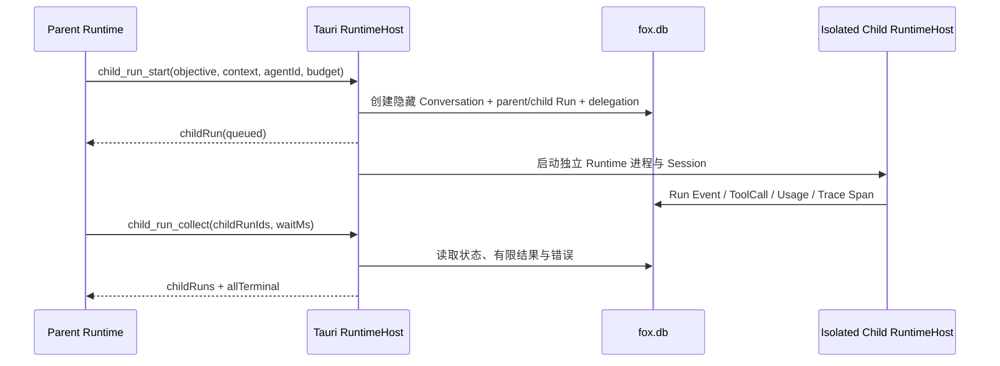

# 子 Agent 与 Child Run 架构

> 状态：生效
> 适用版本：Fox `0.1.x`，数据库 schema v27
> 最后更新：2026-08-24

## 目标与边界

A5 为本地 Pi Runtime 提供 Host-owned Child Run。父 Agent 可以把相互独立的调查、审查或实现子问题交给不同本地 Agent，并在父 Run 继续工作时并行执行。Child Run 不是 Prompt 中的角色扮演，也不是第二套任务事实源：身份、预算、状态、结果、审批和取消都由 Tauri Host 与 SQLite 管理。

本轮复用开源项目已经验证的协议语义，而不引入其 Python 运行时：LangGraph Supervisor 的 tool-based handoff、Pydantic AI 的 usage limit 与树级 cancellation、AutoGen 的 cancellation token 与终态 TaskResult。Fox 的进程、数据库和 Runtime 协议均为 Rust/Node，直接引入这些框架会产生第二事实源，因此没有复制第三方代码或新增框架依赖。

## 执行链路

每个 Child Run 拥有独立隐藏 Conversation、独立 Runtime Session、独立 RuntimeHost 状态和独立 Sidecar 进程。它只接收 `objective`、显式 `context`、选定 Agent 的静态包、Host 允许的项目上下文和受治理 Memory；父会话 transcript 不会复制过去。隐藏 Conversation 不进入当前、归档或回收站列表。

## Host 工具

| 工具 | 作用 | 关键边界 |
| --- | --- | --- |
| `child_agent_list` | 列出可作为本地 Child Agent 的 Assistant/Expert/Worker | 只返回 `runtime_type=pi` 的 Host 注册 Agent |
| `child_run_start` | 异步创建并启动一个 Child Run | objective/context 有字符上限；同一 tool call 幂等 |
| `child_run_collect` | 获取 1–8 个直属 Child Run 的状态和有限结果 | 只允许当前父 Run；最多等待 60 秒 |
| `child_run_cancel` | 取消一个直属 Child Run | 只允许当前父 Run；进程取消与终态持久化同步 |

Runtime 指令要求先批量 `start` 独立工作，再 `collect`，以获得真实并行；共享项目中的写任务不得重叠。模型不能自行提高预算、并发、深度或权限。

## 数据与状态

schema v27 增加：

- `conversations.conversation_kind`：`primary | child`。
- `runs.parent_run_id/root_run_id/run_kind/depth/budget_json`：保存父子身份和创建时预算。
- `child_run_delegations`：保存目标、显式上下文、Agent、状态、Token/工具用量、有限结果、错误和时间。

Child Run 与父 Run 共用 Trace ID。Child root span 的 parent 优先指向 `child_run_start` 工具 span；Runtime 尚未投影工具 span时回退到父 root span。详细 transcript 留在隐藏 Conversation；回传父 Agent 的 `resultText` 截断到 32,000 字符，并同时返回状态、usage、工具数和错误。

## 硬限制

| 限制 | 当前值 |
| --- | --- |
| 最大深度 | 1 |
| 每个父 Run 的 Child Run 总数 | 8 |
| 每个 root Run 的同时活动 Child Run | 3 |
| 单 Child Run 时长 | 1 秒–15 分钟，默认 5 分钟 |
| 单 Child Run 总 Token | 256–200,000，默认 32,000 |
| 单 Child Run输出 Token | 64–模型上限，默认不超过 4,096 |
| 单 Child Run 工具调用 | 0–100，默认 16 |

Host 在启动前规范化预算，在每次工具调用前检查工具/Token 预算，并由监控线程检查总 Token 与 wall-clock deadline。超限使用稳定的 `child_run.*_budget_exceeded` 错误结束 Run。

## 权限、审批与取消

- Child Agent 的有效工具和 MCP Server 是“父 Assistant、父 Expert、Child Agent”三者声明范围的交集；Runtime 包过滤与 Host 请求入口同时执行，权限只能收窄。
- 项目根与 permission mode 通过同一 `project_id` 继承；Child Conversation 不复制父知识绑定、工作图或 transcript。
- Child Runtime 与父 Runtime 共享 Host 的 pending approval channel。高风险调用仍显示在父会话，由用户决定；批准只写入真实 Child ToolCall/Conversation。
- 取消父 Run 时，Host 递归查询真实 descendants 并逐个取消。取消一个 Child Run 不会误伤 sibling。
- 应用退出会停止全部 Child Runtime 进程，并把未终结 Child Run 标记为 `runtime.application_exit` interrupted。

## 前端投影

`fox://child-run-updated` 携带父 Conversation、父 Run 和完整 ChildRunRecord。对话 Hook 按 `childRunId` 幂等合并 queued/running/terminal 更新；对话摘要显示子专家数量与最近状态。Child 产生的审批也会投影到父会话，避免隐藏 Conversation 造成无法批准。

## 验证

仓储测试覆盖隐藏会话、幂等启动、Trace 父子关系、终态结果/usage 聚合、并发上限、工具预算、取消只作用于 descendants，以及 Child 审批回投父会话。Runtime 测试覆盖四个工具的目录顺序、TypeBox 边界和输入不改写；Host 单元测试覆盖预算规范化和父子工具/MCP 范围交集。
