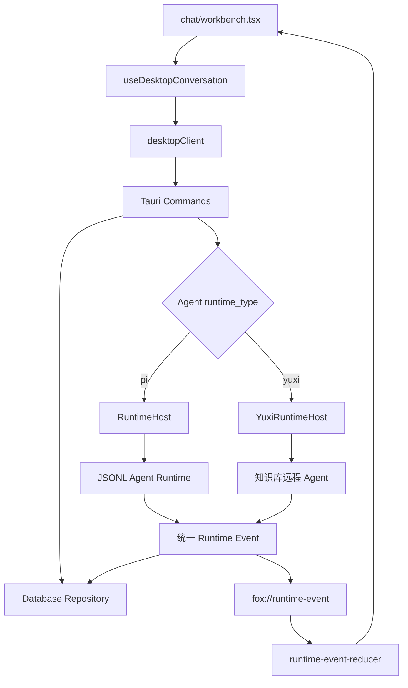
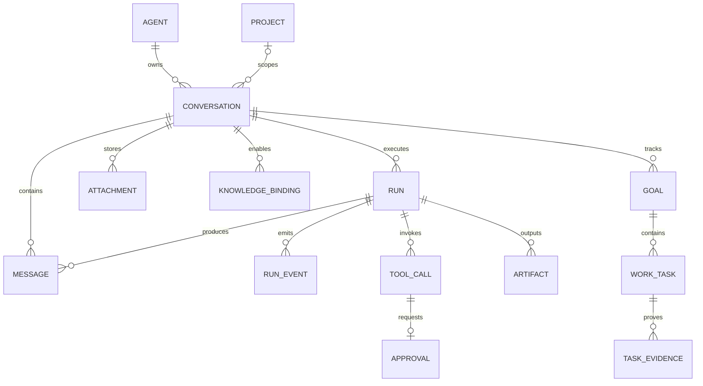
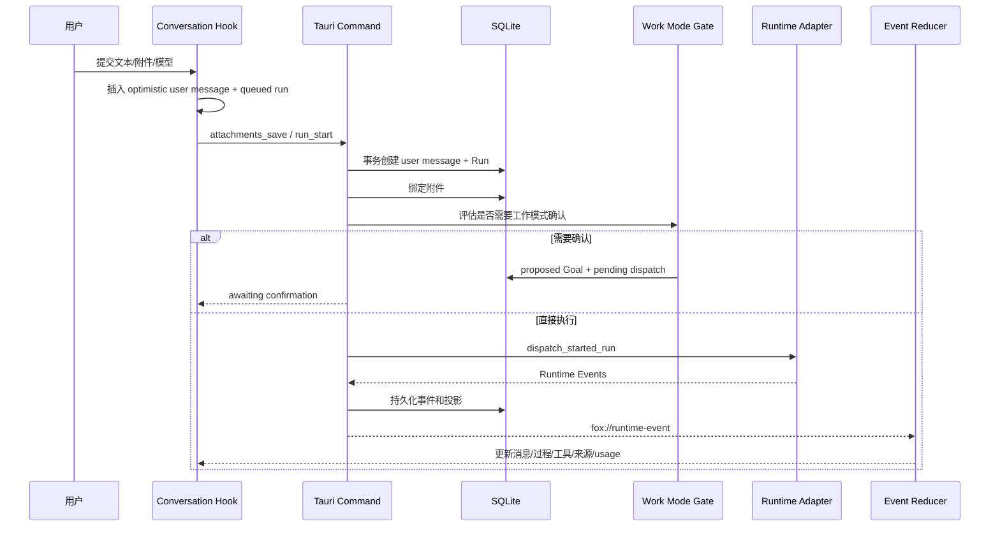

# 对话系统架构

> 状态：生效  
> 适用版本：Fox `0.1.x`  
> 维护范围：对话前端、Tauri Command、会话持久化与多 Runtime 路由  
> 最后更新：2026-08-21

## 目标与范围

本文说明 Fox 对话功能从草稿、新建会话、发送消息到流式展示、工具审批、重新编辑、取消和恢复的完整架构。重点是统一产品模型：对话层不绑定 Pi，当前既可路由到 Pi Runtime，也可路由到知识库远程智能体；未来新增 Runtime 时应继续复用同一套 Host、SQLite 和前端事件模型。

本文不重复列出所有 Command 字段或 Runtime 事件字段，字段级契约见 [Tauri 命令与事件](../04-技术参考/Tauri命令与事件.md) 和 [Runtime 协议](../04-技术参考/Runtime协议.md)。

## 核心原则

1. `Conversation` 是产品容器，固定关联一个 `agent_id`，不直接关联某个 SDK。
2. `Agent.runtime_type` 决定 Host 将 Run 路由到哪个 Runtime Adapter。
3. 用户消息与 queued Run 先在一个数据库事务中落库，再启动 Runtime。
4. Runtime Event 先持久化，再广播给前端；漏掉窗口事件时可从 SQLite 恢复。
5. 前端的乐观状态只改善响应速度，不是事实源。
6. Pi Session、远程 Thread 和模型上下文都是执行状态，不替代 Fox 消息历史。
7. 普通问答不应因文本中出现“目标”“计划”或 Markdown 标题而自动创建 Goal。

## 分层与组件

| 层 | 主要职责 | 不应承担 |
| --- | --- | --- |
| Workbench | 页面装配、消息/过程/审批展示、输入组件 | Runtime 路由、持久化规则 |
| Conversation Hook | 草稿和会话状态、乐观更新、事件队列、命令编排 | 直接访问数据库、解释 Provider 协议 |
| desktopClient | Tauri Command 与 Event 的类型化封装 | 业务状态机 |
| Tauri Commands | 输入校验、事务入口、Runtime 路由、错误转换 | 保存 React 临时状态 |
| Repository | 会话、消息、Run、事件、工具、审批和附件一致性 | 调用模型或渲染 UI |
| Runtime Adapter | 执行模型/远程 Run，并映射统一事件 | 成为产品事实源 |
| Reducer | 按 Run/seq 幂等投影实时状态 | 覆盖较新的持久化事实 |

## 核心数据模型

`ConversationDetail` 是前端加载单个对话的聚合 DTO，包含消息、Runtime Events、Tool Calls、Approvals、Attachments、Artifacts、Knowledge Bindings、最新 Run 以及 A0 Goal/Task/Evidence。大历史通过 `conversation_history` 按消息 ordinal 分页，并按实体 ID 或 `(runId, seq)` 合并。

## 草稿与会话创建

新对话页面先维护草稿状态：

- `draftAgentId`
- `draftExpertId`
- `draftProjectRoot`
- `draftPermissionMode`
- `draftKnowledgeBases`

选择助手、项目和知识库不会立即创建空会话。首次发送时，Hook 调用 `conversation_create`：

1. Host 校验 `agentId` 为 `assistant/primary/chat_selector`；可选 `expertId` 必须为 `expert/inline/expert_center`。
2. 规范化项目根目录，并校验 `read_only | ask | allow`。
3. SQLite 创建 Conversation、可选 Project 关联及可选专家绑定；任一步失败都会回滚空会话。
4. 若为远程 Agent，Host 同步创建远端 Thread，并写入 `runtime_sessions`。
5. 创建失败时回滚本地 Conversation；远端映射不完整或未登录时返回明确错误。
6. 草稿知识绑定在本地会话创建后写入 `knowledge_bindings`。

默认助手由 `runtime_initialize.defaultAgentId` 返回。前端不能假设 React 中的 Agent 列表已先加载完成，`agent-initialization.ts` 会在必要时从 Host 初始化结果获取默认 ID。

专家绑定是 Host-owned 会话事实，不作为用户消息发送。`conversation_load` 返回 active 与历史绑定；前端据此恢复输入框底部胶囊，并按 `activatedAt` 把启用卡片合并进时间线。Repository 只把 `role=user/assistant` 的消息视为已开始对话；专家卡片和输入框预填草稿不计入消息数。出现此类消息、活动 Run 或归档状态后禁止原位更换/移除专家。

绑定同时保存展示快照和经 SHA-256 标识的静态执行包。历史卡片使用展示快照；每次本地 Run 使用绑定时的执行包，不从专家最新定义覆盖，再叠加本轮实时 Host 授权。快照损坏时明确失败并要求重新选择，不能静默切换版本。

## 发送消息主链路

前端在调用 `run_start` 前等待 Runtime 和 Work Event 监听器注册完成，避免极快的 Runtime 事件先于监听器到达。Host 返回真实消息和 Run 后，Hook 用持久化 ID 替换 optimistic ID；若事件已先到达，则合并较新的状态、时间和 `lastSeq`，不能回退到 queued。

### 显示文本与 Runtime 文本

`StartRunRequest` 区分：

- `text`：用户真正输入并保存到消息中的内容。
- `runtimeText`：发送给 Runtime 的增强内容，可包含附件提取文本、受管附件 ID 或恢复上下文。

这避免把内部附件说明、Host 恢复提示或隐藏续跑指令渲染成用户消息。Runtime 输出同样必须区分 reasoning、assistant text、tool result 和 source，不能把控制状态拼成最终回答。

## Runtime 路由

Host 读取 `conversation_runtime()`，根据 `runtime_type` 选择执行器：

| Runtime 类型 | 当前实现 | 会话执行状态 | 接入方式 |
| --- | --- | --- | --- |
| `pi` | `RuntimeHost` + `services/agent-runtime` | 本地 Runtime Session JSON | Fox JSONL 协议 |
| `yuxi` | `YuxiRuntimeHost` | 远端 Thread/Run/Cursor | HTTP/SSE 适配后映射 Fox Event |
| 未来本地 Runtime | 尚未实现 | 自有可恢复 Session | 实现同一 JSONL Adapter Contract |
| 未来远程 Runtime | 尚未实现 | 远端 ID/Cursor | Host Adapter 映射统一事件 |

新增 Runtime 不应让 Workbench 出现 `if provider === ...`。差异必须收敛在 Agent 注册、Command 路由和 Runtime Adapter，最终提供同一 `StartRunResult`、Runtime Event 和取消语义。

## 流式事件与前端归并

前端监听：

- `fox://runtime-event`：模型、推理、工具、来源、usage 和 Run 终态。
- `fox://work-event`：Goal、Task 和 Evidence 独立事件序列。
- `fox://approval-requested`、`fox://approval-resolved`：审批生命周期。
- `fox://knowledge-download-progress`：知识文件下载进度。

Runtime Event 以 `(runId, seq)` 去重。`runtime-event-queue.ts` 对文本增量进行帧级排队和相邻 delta 合并，避免大量 token 触发同步重渲染；终态事件必须排在未消费文本后。Reducer 的关键约束：

1. 不接受小于等于当前 `lastSeq` 的同 Run 事件。
2. 后台 Conversation 的终态不能覆盖当前会话。
3. `message.completed` 没有 delta 时仍创建稳定 Assistant Message。
4. 持久化最终回答优先于只携带状态的迟到终态。
5. reasoning 和工具过程进入工作过程，不创建普通助手文本。
6. Work Event 使用独立 sequence，不能推进 Runtime `lastSeq`。

## 工作模式、Goal 与审批

工作模式有两层确认，语义不同：

- Work Mode Gate：在 Runtime 启动前判断是否需要创建/激活 Goal。若需确认，Host 保存 pending dispatch，不启动模型；用户确认后恢复同一 Run。
- Tool Approval：Runtime 已执行到受保护工具时，由 Host 创建 Approval；用户决定后 Runtime 的 Pending Host Request 才继续。

Goal、Task 和 Evidence 只能由 Host Tool 写入 SQLite。模型可以提出目标和任务，但不能自行激活 proposed Goal，也不能在 proposed Goal 下提前创建 Task。普通解释、引用内容或 Markdown 中出现相关词语时不应生成 Goal。

## 附件、项目与知识绑定

### 附件

1. 前端将 Data URL 交给 `attachments_save`。
2. Host 写入受管附件目录，SQLite 保存元数据。
3. 本地 Runtime 获得附件 ID；文本附件可在前端提取有限上下文，受管附件由 `read_attachment` 读取。
4. 图片在 Run 创建前按模型能力和附件归属校验。
5. 远程 Agent 的附件由 `YuxiRuntimeHost` 上传到对应 Thread。

### 项目

Conversation 绑定规范化后的项目根和权限模式。Runtime 只收到授权根；项目工具使用相对路径并经 Host preflight/execute。详细边界见 [项目与权限架构](项目与权限架构.md)。

### 知识库

Conversation 只访问显式启用的 `knowledge_bindings`。本地 Runtime 的知识工具由 Host 限制范围；远程 Agent 将绑定写入 Run metadata。详细链路见 [知识库集成架构](知识库集成架构.md)。

## 重新编辑与重新运行

`run_rewind` 的产品语义不是追加一条新消息，而是从目标用户消息重新分叉当前线性历史：

1. 只有非活动 Run 状态可以 rewind。
2. Repository 删除或截断目标 ordinal 之后的消息、Run 投影、工具、审批和产物关联。
3. 新文本占用原消息位置并创建新 Run。
4. 本地 Runtime 删除该 Conversation 的旧 Session，让 SQLite 截断历史重新建立上下文。
5. 远程 Runtime 创建替换 Thread，并把保留的历史作为上下文发送；新 Thread 绑定成功后清理旧 Thread。
6. 前端先乐观移除受影响内容，失败时重新加载持久化 Conversation 回滚。

因此 UI 不应同时保留旧回答和新回答，也不应将编辑后的文本追加到末尾。

## 用户补充与恢复

远程 Runtime 可以发出 `user.question.requested` 并进入 interrupted。`pending-interactions.ts` 从持久化事件中找出最新未回答问题；`run_resume` 创建 Child Run，写入 `user.question.responded`，并携带结构化 answers 恢复远端执行。

本地 Goal 的“继续”使用隐藏的 Goal continuation Run，不向消息历史插入伪用户消息。暂停会取消当前 Run；继续时 Host 根据 Goal 状态创建新的执行 Run并唤醒模型。

## 取消与终态

取消先把数据库 Run 置为 `cancelling`，再按 Runtime 类型调用：

- 本地：发送 JSONL `cancel`，中止 Agent 和 Pending Host Request。
- 远程：调用远端取消接口并更新活动 Run 映射。

若 Runtime 已找不到活动任务，Host 将 Run 标为 interrupted，并返回可诊断错误，而不是永久停在 cancelling。Run 终态为 `completed | failed | cancelled | interrupted`；前端不得只凭“收到最后一段文本”判断完成。

## 启动、重启与一致性

- 应用启动时，本地 queued/running/cancelling Run 修复为 interrupted；远程可恢复 Run 保留并由 `YuxiRuntimeHost` 尝试续接。
- Runtime Event 持久化先于广播，刷新通过 `conversation_load` 恢复。
- Runtime Session 文件损坏时可回退 SQLite 历史；SQLite 消息优先于陈旧 Session transcript。
- Approval、Tool Call 和 streaming Message 在非可恢复异常退出后被修正为中断/取消状态。
- 大历史只加载最近窗口，向上滚动再按 ordinal 获取更早数据。

## 错误边界

| 失败位置 | 行为 | 恢复方式 |
| --- | --- | --- |
| Agent 不可用 | 会话创建或发送返回 `agent.*` | 刷新 Agent/服务配置 |
| Runtime 未准备 | Run 创建失败或标记 failed | Runtime 诊断、重启 Worker |
| Provider 请求失败 | `run.failed`，保留已持久化过程 | 重试或换模型配置 |
| 前端事件遗漏 | UI 暂时不更新 | 重新加载 Conversation |
| 附件绑定失败 | Run 标记失败 | 重新选择附件发送 |
| Work Gate 待确认 | Run 不派发 | 用户确认或取消 |
| 审批未处理 | 工具暂停 | 用户批准/拒绝，取消 Run 时清理 |
| 远端连接中断 | Run interrupted，可恢复时保留 cursor | `run_resume` 或恢复任务 |

## 性能与容量

- 文本 delta 使用帧队列合并，避免每 token 渲染。
- Conversation 列表使用 Summary，不加载完整消息。
- 历史分页默认窗口由 Host 控制，Runtime 上下文另有消息数和字符预算。
- 大工具结果在持久化前摘要，完整文件输出应转为 Artifact。
- 500 Task Goal 的前端 P95 基线由 `a0-performance.test.tsx` 约束。

## 测试与验收

自动化重点：

- `apps/desktop/tests/runtime-event-reducer.test.ts`
- `apps/desktop/tests/agent-initialization.test.ts`
- `apps/desktop/src-tauri/src/database/repositories.rs` 中会话、Run、rewind、history、恢复测试
- `apps/desktop/src-tauri/src/commands/mod.rs` 中 Runtime 路由相关测试
- `services/agent-runtime/test/runtime-adapter-contract.test.mjs`

人工验收至少覆盖：本地/远程 Agent 新会话、首条消息、流式、取消、附件、审批、重新编辑、重启恢复、历史分页、服务离线和对话删除。

## 关键代码

- `apps/desktop/src/features/chat/workbench.tsx`
- `apps/desktop/src/features/conversations/api/desktop-client.ts`
- `apps/desktop/src/features/conversations/hooks/use-desktop-conversation.ts`
- `apps/desktop/src/features/conversations/model/runtime-event-queue.ts`
- `apps/desktop/src/features/conversations/model/runtime-event-reducer.ts`
- `apps/desktop/src-tauri/src/commands/mod.rs`
- `apps/desktop/src-tauri/src/database/repositories.rs`
- `apps/desktop/src-tauri/src/runtime_host/mod.rs`
- `apps/desktop/src-tauri/src/yuxi/runtime.rs`

## 关联文档

- [智能体与模型架构](智能体与模型架构.md)
- [Agent 运行时架构](Agent运行时架构.md)
- [数据架构](数据架构.md)
- [对话体验](../03-产品与前端/对话体验.md)
- [错误与状态](../04-技术参考/错误与状态.md)
