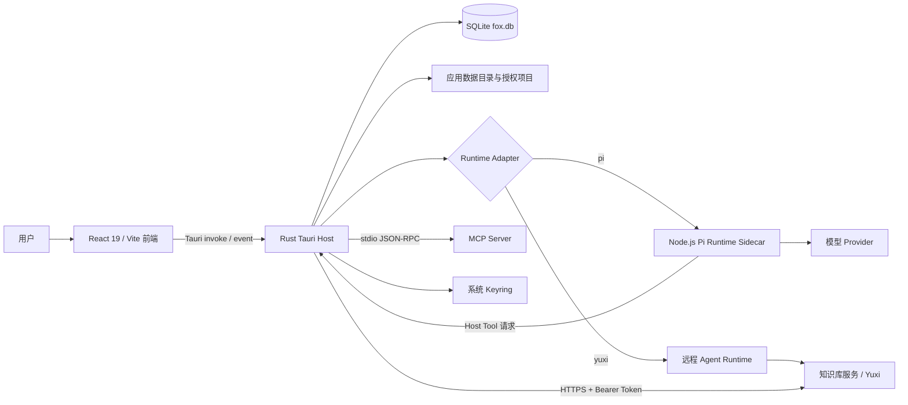
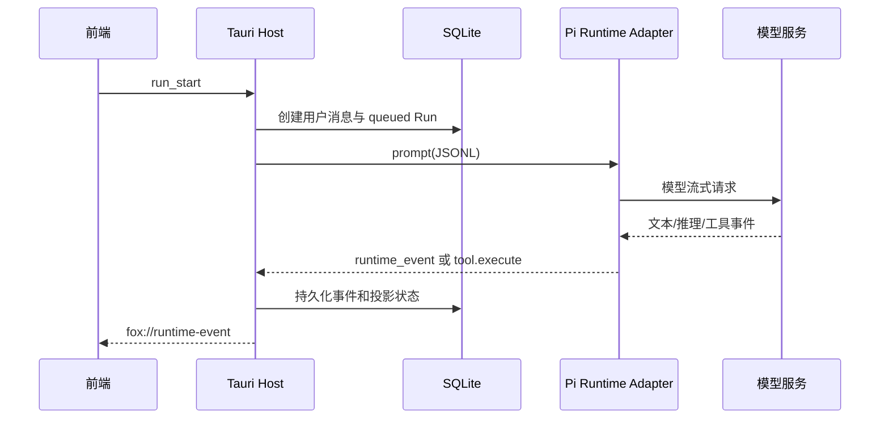

# Fox 总体架构

> 状态：生效<br>
> 适用版本：Fox 0.1.x<br>
> 维护范围：Fox 进程、领域边界、依赖方向和系统级数据流<br>
> 最后更新：2026-08-06

## 目标与范围

本文面向参与 Fox 开发的产品、前端、Rust、Runtime、知识库和测试工程师，说明桌面应用的系统边界、进程关系、领域拆分和故障隔离方式。字段级协议不在本文重复维护，详细入口见[架构文档导航](架构文档导航.md)。

A0 Goal -> Task -> Evidence 已落地；A1-A6 中的 PlanRevision、Review、Acceptance、Memory 与多 Agent 仍属于规划。

## 系统全景



## 当前组件职责

| 组件 | 负责 | 不负责 |
| --- | --- | --- |
| React 前端 | 页面、交互、事件归并、预览器、恢复展示 | 直接访问 SQLite、保存密钥、执行本地命令 |
| Tauri Host | 业务命令、持久化、权限检查、进程管理、远程服务适配 | 模型推理、把前端状态作为事实源 |
| Runtime Adapter | 模型/远端会话、流式事件映射、工具声明、恢复检查点 | 产品数据所有权、绕过 Host 权限 |
| Pi Runtime | 当前本地 Runtime 的 Pi SDK、Prompt/Profile/Planner Harness | 定义 Fox 对话产品架构 |
| SQLite | 会话、消息、Run、事件、权限、配置与缓存索引的事实源 | 保存 API Key、存放大文件正文 |
| 知识库服务 | 远程 Agent、知识检索、原文件、图谱 | Fox 本地项目权限和本地会话事实 |

## 领域架构地图

| 领域 | 稳定产品抽象 | 当前实现 | 详细文档 |
| --- | --- | --- | --- |
| 对话 | Conversation、Message、Run、Event | React + Tauri Commands + SQLite | [对话系统架构](对话系统架构.md) |
| 智能体与模型 | Agent、Runtime Type、Model Service、Model Profile | 本地默认助手、远程 Agent 同步、多模型兼容 | [智能体与模型架构](智能体与模型架构.md) |
| Runtime | Adapter、Capability Manifest、Runtime Event、Host Tool | Pi JSONL Sidecar、Yuxi Runtime Host | [Agent Runtime 架构](Agent运行时架构.md) |
| 项目与权限 | Project、Permission Mode、Preflight、Approval | Canonical Path、Tool Guard、Tool Host | [项目与权限架构](项目与权限架构.md) |
| 知识库 | Connection、Binding、Source、Document、Graph | Yuxi Client、预览缓存、远程 Run | [知识库集成架构](知识库集成架构.md) |
| 工作闭环 | Goal、Task、Evidence、Work Event | Host-owned Work Graph | [对话系统架构](对话系统架构.md)、[数据架构](数据架构.md) |
| 扩展 | Skill、MCP Server、Runtime Tool | Skills Loader、stdio MCP、工具目录 | [扩展系统架构](扩展系统架构.md) |
| 诊断与质量 | Snapshot、Usage、Diagnostic、Eval | Runtime/Work 诊断、分层测试 | [可观测性与测试架构](可观测性与测试架构.md) |

最重要的兼容边界是 Conversation，而不是 Pi Session。Conversation 绑定 `agent_id`；Host 根据 Agent 的 `runtime_type` 选择适配器。所有适配器最终写入同一 SQLite 模型并输出同一前端事件，因此接入新 Runtime 不应增加第二套聊天界面或消息表。

## 两条当前运行路径

### Fox 本地助手



### 知识库远程助手

Tauri Host 通过 `YuxiRuntimeHost` 创建远程 Thread/Run、消费 SSE 或轮询状态，并映射为同一 `fox://runtime-event`。前端不理解远端协议差异；SQLite 仍保存 Fox 会话、消息和恢复所需游标。

未来新增本地或远程 Runtime 时，也必须收敛到相同的 `StartRunResult`、Runtime Event、取消、恢复和 Host 权限契约。

## 依赖方向

```text
React Feature
  -> desktopClient / Tauri Command
    -> Host Service / Repository
      -> SQLite、受管文件、Keyring、Runtime Adapter、外部服务
```

- React 不直接访问数据库、Keyring、文件系统或模型 Provider。
- Command 处理输入校验和路由；可复用持久化规则进入 Repository。
- Runtime 不直接修改 SQLite，也不能依据 Prompt 扩大项目或知识范围。
- Provider 差异收敛在 Model Profile 和 Runtime Adapter，不扩散到消息 UI。
- 外部文本始终是不可信数据；Prompt 是纵深防御，Host 才是权限边界。

## 数据所有权

- `fox.db` 是产品事实源；前端状态可重建。
- `runtime-sessions/*.json` 是本地 Runtime 会话恢复检查点，不替代消息表。
- 远端 Thread/Run 是远程执行投影，Fox 仍保存本地 Run、事件和关联 ID。
- `attachments/`、知识预览缓存和下载文件保存二进制；SQLite 只存路径、摘要和状态。
- API Key、知识库 Token、MCP 环境变量使用系统 Keyring。

## 启动与恢复

1. `lib.rs` 解析 `FOX_DATA_DIR` 或系统应用数据目录。
2. 应用待执行备份恢复，打开数据库并运行迁移。
3. `repair_interrupted_runs` 修复异常退出留下的运行状态。
4. 创建 Runtime、附件、知识缓存和 Skills 目录。
5. 初始化本地 Runtime Host 与知识库 Runtime，并恢复远程未完成 Run。
6. 重置知识预览租约并执行缓存清理。
7. React 从数据库快照重建导航、对话和工作状态，再合并实时事件。

## 故障边界

- Sidecar 崩溃：Host 标记运行失败或受限重启 Worker；历史事件仍在 SQLite。
- 前端刷新：通过 Conversation Detail、消息和事件重建，不依赖遗漏的窗口事件。
- 知识库离线：本地助手继续可用；远程 Agent 与知识能力返回服务错误。
- MCP 超时：按 Host 超时策略回收子进程，调用结果记录为工具失败。
- 数据损坏或升级：通过备份/恢复与迁移测试处理，不允许 Runtime 直接改库。
- 运行完成但 Conversation 已删除：停止投影和远程恢复，不向不存在的对话追加错误卡片。

## 安全边界

- 项目路径和写入/命令由 Tool Guard/Tool Host 强制检查。
- 知识访问范围由 Conversation Binding 与 Agent Scope 的交集决定。
- Runtime 声明工具不等于获得执行权限；Host Handler 和审批必须同时存在。
- Keyring 是密钥事实源，诊断、事件和 Prompt 只使用脱敏配置。
- 用户内容、项目文件、知识文档、MCP 输出和远端响应都按不可信数据处理。

详细设计见[项目与权限架构](项目与权限架构.md)和[安全架构](安全架构.md)。

## 当前限制与规划

- 当前本地 Runtime Host 采用单 Worker 队列调度，并非完整多 Agent Worker Pool。
- Pi 是当前本地 Adapter；产品设置尚未暴露所有 Runtime 内部理解的 API 类型。
- A0 工作图已落地；完整 Span Tree、PlanRevision、Reviewer、Acceptance、Memory 与 Child Run 尚未实现。
- Tauri CSP 当前为 `null`，是需要收紧的安全债务。
- 知识库服务仍保留代码名 `yuxi`，产品文案统一称“知识库服务”。

## 关键代码与验证

- `apps/desktop/src/app/App.tsx`
- `apps/desktop/src/features/conversations/api/desktop-client.ts`
- `apps/desktop/src-tauri/src/lib.rs`
- `apps/desktop/src-tauri/src/runtime_host/mod.rs`
- `apps/desktop/src-tauri/src/yuxi/runtime.rs`
- `services/agent-runtime/src/pi-runtime.mjs`

验证命令：`pnpm.cmd build`、`pnpm.cmd runtime:test`、`pnpm.cmd runtime:eval`、`cargo test --manifest-path apps/desktop/src-tauri/Cargo.toml`。

进一步阅读：

- [架构文档导航](架构文档导航.md)
- [对话系统架构](对话系统架构.md)
- [智能体与模型架构](智能体与模型架构.md)
- [Agent Runtime 架构](Agent运行时架构.md)
- [项目与权限架构](项目与权限架构.md)
- [知识库集成架构](知识库集成架构.md)
- [可观测性与测试架构](可观测性与测试架构.md)
