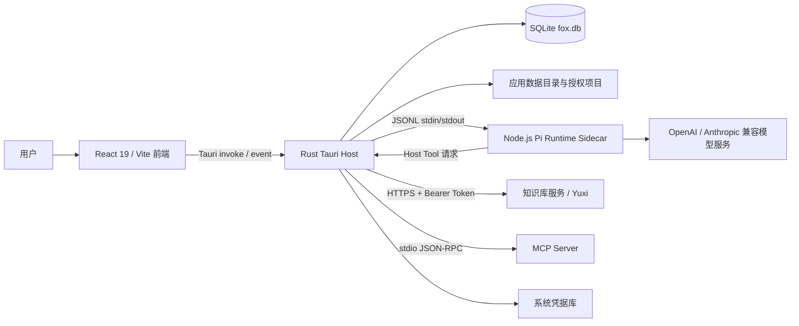
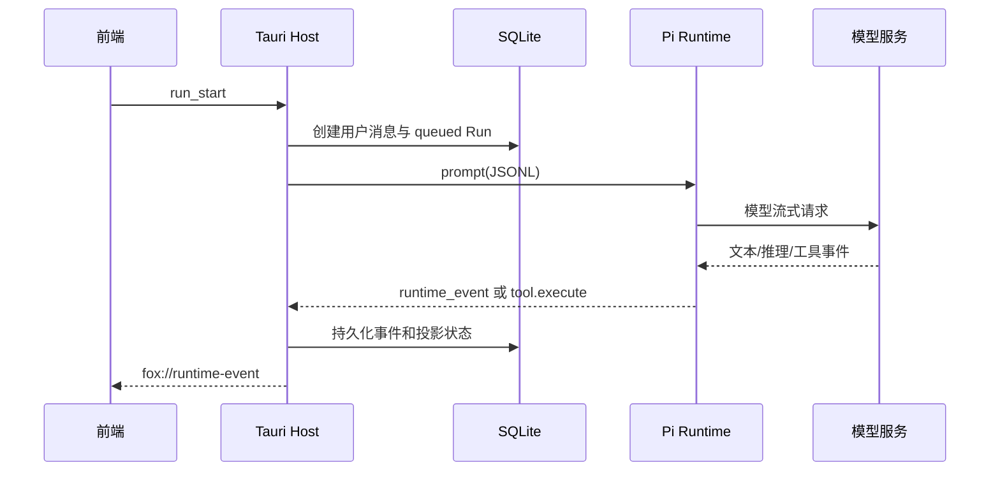

# Fox 总体架构

> 状态：当前实现基线 
> 适用版本：Fox 0.1.x 
> 维护者：Fox 工程团队 
> 最后更新：2026-07-29

## 目标与范围

本文面向参与 Fox 开发的产品、前端、Rust 与 Runtime 工程师，说明桌面应用的系统边界、进程关系、数据流和故障隔离方式。A0-A6 工作闭环属于规划，除非代码和迁移已落地，否则不作为当前契约。

## 系统全景

## 当前组件职责

| 组件 | 负责 | 不负责 |
|---|---|---|
| React 前端 | 页面、交互、事件归并、预览器、恢复展示 | 直接访问 SQLite、保存密钥、执行本地命令 |
| Tauri Host | 业务命令、持久化、权限检查、进程管理、远程服务适配 | 模型推理、把前端状态作为事实源 |
| Pi Runtime | 模型会话、流式事件映射、工具声明、Session 检查点 | 产品数据所有权、绕过 Host 权限 |
| SQLite | 会话、消息、Run、事件、权限、配置与缓存索引的事实源 | 保存 API Key、存放大文件正文 |
| 知识库服务 | 远程 Agent、知识检索、原文件、图谱 | Fox 本地项目权限和本地会话事实 |

## 两条运行路径

### Fox 本地助手

### 知识库远程助手

Tauri Host 通过 `YuxiRuntimeHost` 创建远程 Thread/Run、轮询事件并映射为同一 `fox://runtime-event`。前端不需要理解远端协议差异；SQLite 仍保存 Fox 会话和恢复所需游标。

## 数据所有权

- `fox.db` 是产品事实源；前端状态可重建。
- `runtime-sessions/*.json` 是 Pi 会话恢复检查点，不替代消息表。
- `attachments/`、知识预览缓存和下载文件保存二进制；SQLite 只存路径、摘要和状态。
- API Key、知识库 Token、MCP 环境变量使用系统 Keyring。

## 启动与恢复

1. `lib.rs` 解析 `FOX_DATA_DIR` 或系统应用数据目录。
2. 应用待执行备份恢复，打开数据库并运行迁移。
3. `repair_interrupted_runs` 修复异常退出留下的运行状态。
4. 创建 Runtime、附件和 Skills 目录。
5. 初始化 Pi Host、知识库 Runtime，并恢复远程未完成 Run。
6. 重置知识预览租约并执行缓存清理。

## 故障边界

- Sidecar 崩溃：Host 标记运行失败或重启 Worker；历史事件仍在 SQLite。
- 前端刷新：通过 `conversation_load/history` 和 Run 事件重建，不依赖遗漏的窗口事件。
- 知识库离线：本地助手继续可用；远程 Agent 与知识能力返回服务错误。
- MCP 超时：15 秒超时并回收子进程；调用结果记录为工具失败。
- 数据损坏或升级：通过备份/恢复与迁移测试处理，不允许 Runtime 直接改库。

## 当前限制与规划

- 当前本地 Runtime Host 采用队列调度，并非完整多 Agent Worker Pool。
- A0 的 Goal、Task、Evidence 表尚未出现在迁移 1-13 中，属于待实施计划。
- Tauri CSP 当前为 `null`，是需要收紧的安全债务。
- 知识库服务仍保留代码名 `yuxi`，产品文案统一称“知识库服务”。

## 关键代码与验证

- `apps/desktop/src/app/App.tsx`
- `apps/desktop/src/features/conversations/api/desktop-client.ts`
- `apps/desktop/src-tauri/src/lib.rs`
- `apps/desktop/src-tauri/src/runtime_host/mod.rs`
- `apps/desktop/src-tauri/src/yuxi/runtime.rs`
- `services/agent-runtime/src/pi-runtime.mjs`

验证命令：`pnpm build`、`pnpm runtime:test`、`cargo test --manifest-path apps/desktop/src-tauri/Cargo.toml`。
