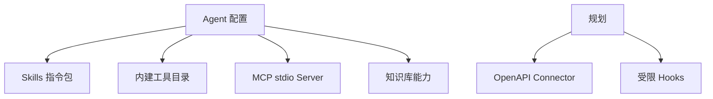

# 扩展系统架构

> 状态：Skills 与 MCP 已实现基础版，OpenAPI/Hooks 为规划 
> 适用版本：Fox 0.1.x 
> 维护者：Fox Runtime 团队 
> 最后更新：2026-07-29

## 扩展层次

## Skills

Skills 位于应用数据目录 `skills/<id>/SKILL.md`。文件可包含 YAML frontmatter：`id/name/description/version/required_tools`，正文作为 Runtime System Prompt 的附加指令。

当前约束：

- 单文件最大 128 KB。
- ID 只允许 ASCII 字母、数字、`-`、`_`。
- 重复 ID、空正文、未知 required tool 会使 Skill 无效。
- 启用状态保存在 `agent_runtime_config`。
- Skills 只提供指令，不获得独立代码执行权。

## MCP

MCP Server 配置保存命令、参数、启用状态；环境变量单独保存在 Keyring。Fox 每次操作启动 stdio 子进程，执行 `initialize`、`tools/list` 或 `tools/call`，15 秒超时后回收。

安全限制：最多 200 个工具；校验 inputSchema 为 object；调用前再次确认工具确实由 Server 声明；`call_mcp_tool` 总是需要审批。当前不支持 HTTP/SSE MCP、持久连接和资源/Prompt 协议。

## 内建工具与能力清单

`runtime-contract.mjs` 是工具目录的单一声明点。工具含分类、执行位置和审批策略，Rust Host 会校验能力清单。新增工具必须同时提供：目录声明、Runtime schema、Host 或 Runtime executor、权限策略、事件映射和契约测试。

## 模型供应商

`model_providers/provider_models` 支持多个供应商和模型；API 协议为 OpenAI Completions、OpenAI Responses、Anthropic Messages 或测试用 faux。API Key 以 Base URL 为 Key 存系统凭据库。模型能力包含上下文、最大输出和图片输入。

## 知识库扩展

知识库是受控 Provider，不是通用 HTTP 插件。Agent 只能访问会话绑定的知识库，结果转换为统一来源事件。未来若引入更多知识 Provider，应实现同一领域接口而非在 UI 中散布供应商判断。

## 规划：OpenAPI 与 Hooks

A6 计划支持 OpenAPI Connector 和生命周期 Hooks，但当前没有实现。首版必须包含域名 allowlist、操作级限流、响应大小限制、全量审计、凭据隔离；Hooks 不允许直接执行任意脚本。

## 版本与兼容

- Runtime Protocol、Capability Manifest、MCP Protocol 均显式带版本。
- 扩展无效时应隔离该扩展，不阻止 Fox 启动。
- 未识别字段应保守忽略，安全相关未知值必须拒绝。

## 测试与关键代码

`skills.rs`、`mcp.rs`、`runtime-contract.mjs`、`host-tools.mjs`、`model_service.rs`。测试覆盖 Skill 校验、MCP schema/超时/未知工具、能力清单一致性和模型 URL 规范化。
