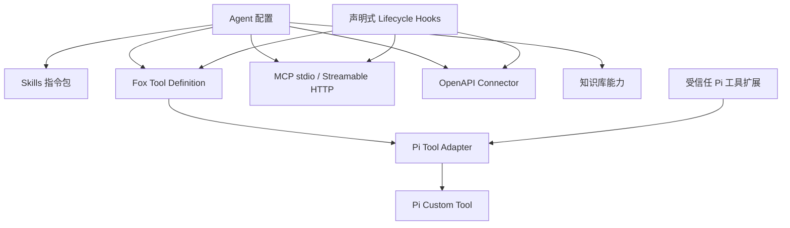

# 扩展系统架构

> 状态：生效 
> 适用版本：Fox 0.1.x 
> 维护范围：插件中心、Skills、MCP/OpenAPI 扩展源、声明式 Hooks 与 Runtime Tool Catalog 
> 最后更新：2026-08-24

## 扩展层次

## 插件中心聚合层

插件中心是统一目录与管理入口，不是新的执行引擎。`plugin_center.rs` 通过 Adapter 聚合 Skill、MCP 和 Tool Catalog；卡片状态来自各自事实源，`plugin_catalog_cache`、`plugin_installations` 和 `plugin_operations` 只保存目录、安装与操作事实，不能复制并覆盖 MCP/Skill 的真实启用状态。

激活模型分为：

- `global`：可从卡片直接切换，例如现有 MCP Server。
- `per_agent`：显示启用 Agent 数量，通过范围配置修改。
- `not_applicable`：内建工具等只读能力。

市场服务未接入前，真实闭环只覆盖现有资源的展示与启用；安装、更新和卸载必须明确返回不可用，不能伪造 Operation 成功。

## Skills

Skills 位于应用数据目录 `skills/<id>/SKILL.md`。文件可包含 YAML frontmatter：`id/name/description/version/required_tools`，正文作为 Runtime 指令层的附加内容。Skill 通过 Agent Runtime Config 启用，不能覆盖 Fox 稳定安全规则和 Host 权限。

当前约束：

- 单文件最大 128 KB。
- ID 只允许 ASCII 字母、数字、`-`、`_`。
- 重复 ID、空正文、未知 required tool 会使 Skill 无效。
- 启用状态保存在 `agent_runtime_config`。
- Skills 只提供指令，不获得独立代码执行权。

## MCP 与 OpenAPI 扩展源

`mcp_servers` 兼任统一扩展源注册表，支持 `stdio`、`streamable_http` 和 `openapi`。命令、端点、规范、启用与健康状态保存在 SQLite；环境变量或 HTTP Header 单独保存在 Keyring。stdio MCP 复用持久子进程，HTTP MCP 复用协商后的 Session ID；保存、启停、删除或凭据变化会使连接池中的旧连接失效。

Streamable HTTP MCP 支持 JSON 或 SSE 响应、协议版本协商和 `Mcp-Session-Id`。OpenAPI Connector 支持 OpenAPI 3.x JSON/YAML、内部 `$ref`、path/query/header 参数和 JSON request body，并动态生成工具 Schema。

统一安全限制：最多 200 个工具；顶层 input schema 必须是 object；调用前再次确认工具确实由源声明；`call_mcp_tool` 继续由 Host 审批；禁止 HTTP 重定向与 TRACE；规范、响应、超时和引用深度均有硬上限。当前不支持旧版 GET+SSE MCP、MCP OAuth/Resource/Prompt、OpenAPI 外部 `$ref`、multipart 或任意认证脚本。

## 内建工具与能力清单

`runtime-contract.mjs` 是 Runtime 工具目录的单一声明点。工具含分类、执行位置和审批策略，Rust Host 会校验能力清单。新增工具必须同时提供：目录声明、Runtime schema、Host 或 Runtime executor、权限策略、事件映射和契约测试。凡标记 `execution: host` 的工具都必须存在 Rust Handler；能力声明与 Handler 不一致时初始化或契约测试应失败。

`tool-adapter.mjs` 定义框架无关的 Fox Tool Definition v1，并在创建 Agent Session 前转换为 Pi Custom Tool。内建文件、Host、知识库和 MCP 工具先进入统一定义层，助手与专家的 `allowedTools` 完成交集过滤后，再由 Pi Adapter 注入当前 Agent。更换 Agent 引擎时，Host Tool 协议、权限目录和 Fox Tool Definition 可以保留，只需实现新的 Agent Adapter。

Pi 兼容扩展分为两类：

- 单个 Pi Custom Tool 可以通过 `adaptPiToolToFox` 转换；默认必须提供 Host executor，原始 `execute` 不会直接运行。
- 只调用 `registerTool` 的同步 Pi Extension 可以通过 `collectTrustedPiExtensionTools` 收集工具；扩展包必须先被标记为受信任，第三方生命周期 Hook 不会透传。

Fox 不自动扫描用户目录或项目目录中的 Pi 扩展。扩展模块本身是可执行代码，工具适配器不是 JavaScript 沙箱；未受信任包不得在 Runtime 进程中加载。需要文件写入、命令、网络或凭据的扩展仍必须注册对应 Host Handler、权限和审批策略。

首批通用能力统一由 `runtime_host/capability_tools.rs` 执行，未直接加载第三方 Pi 扩展代码：

| 工具 | 执行边界 | 审批与限制 |
|---|---|---|
| `web_search` | Host 默认使用无 Key 的 DuckDuckGo HTML 搜索，也可调用 Brave、Tavily、Exa 或 SearXNG，并归一化结果 | 每次审批；可选凭据只从 Host 环境读取 |
| `web_read` | Host 读取公开 HTTP/HTTPS 页面并提取正文 | 每次审批；逐跳校验 DNS/重定向并阻止私网、回环、链路本地和保留地址；响应上限 2 MiB |
| `http_request` | Host 对精确白名单公网 Host 发起 GET/HEAD/POST/PUT/PATCH/DELETE | 每次审批；禁止认证 Header、私网与跨 Host 重定向；请求/响应 1/10 MiB，15 秒上限 |
| `system_info` | 通过开源 `sysinfo` 采集 CPU、内存、磁盘与有限进程摘要 | 每次审批；不读取进程命令行或任意环境变量，环境只允许固定安全键 |
| `sqlite_read` | 使用 `rusqlite` 只读连接与只读 Statement 查询项目内 SQLite | 每次审批；单语句、1000 行、100 列、2 MiB、5 秒进度中断 |
| `structured_data` | Host 解析 JSON、YAML、TOML、XML、CSV、TSV | 纯内联计算无需审批；文件必须位于授权项目且不超过 4 MiB |
| `git_read` | Host 使用直接进程参数读取 status/diff/log/blame | 只读、无 Shell、路径限制在授权项目 |
| `test_run` / `code_check` / `format_code` | Host 识别 Rust、Node、Python 已有命令 | 每次审批、无 Shell、最长 600 秒、不会隐式下载工具；只读模式禁用 |
| `tabular_data` | Host 预览、筛选、聚合 CSV、TSV、JSON | 输入上限 4 MiB；XLSX 延后到下一阶段 |

搜索 Provider 自动选择顺序为 Brave、Tavily、Exa、SearXNG、DuckDuckGo：已配置的服务优先，均未配置时自动使用无需额外 Key 的 DuckDuckGo HTML 搜索。可选 Host 环境变量为 `BRAVE_API_KEY`、`TAVILY_API_KEY`、`EXA_API_KEY`、`FOX_SEARXNG_URL`；这些值不进入工具参数、对话事件或审批详情。DuckDuckGo 是桌面端默认兜底，可能受公共站点限流；正式运营可由 Fox 托管搜索网关替换，而不改变 Runtime 工具协议。

## 模型供应商

`model_providers/provider_models` 支持多个供应商和模型。当前设置界面与 Rust Host 正式暴露 OpenAI Completions 兼容和 Anthropic Messages；Runtime 内部还识别 OpenAI Responses 及测试用 `faux`，但前者尚未作为完整产品配置发布。API Key 存系统凭据库，Model Profile 负责上下文、输出、图片、工具、Reasoning、Prompt Cache 和 Provider 兼容参数。

## 知识库扩展

知识库是受控 Provider，不是通用 HTTP 插件。Agent 只能访问会话绑定的 `KnowledgeReference`，Host 根据 `source=local/remote` 路由并转换为统一来源事件。未来若引入更多知识 Provider，应实现同一领域接口而非在 UI 中散布供应商判断。

## 声明式 Lifecycle Hooks

Host 支持 `before_run`、`before_tool`、`after_tool` 和 `after_run`。动作限定为 `block`、`require_approval` 和 `annotate`；只有 `before_tool` 可以阻断或强制审批，其他事件只做注解。Matcher 只支持确定性的名称与 `*` 通配，不执行 Shell、JavaScript 或第三方回调。

Hook 命中写入独立审计表，只保存输入键名而非完整参数。策略可以收紧既有工具权限，不能把需审批工具降为免审批，也不能扩大 Assistant、Expert、Child Agent 或项目权限。

连接池、协议、OpenAPI 子集、健康字段和 Hook 审计的完整边界见[扩展源与策略生命周期架构](扩展源与策略生命周期架构.md)。

## 版本与兼容

- Runtime Protocol、Capability Manifest、MCP Protocol 均显式带版本。
- 扩展无效时应隔离该扩展，不阻止 Fox 启动。
- 未识别字段应保守忽略，安全相关未知值必须拒绝。

## 测试与关键代码

`commands/plugin_center.rs`、`skills.rs`、`mcp.rs`、`mcp_openapi.rs`、`lifecycle_hooks.rs`、`runtime_host/capability_tools.rs`、`runtime-contract.mjs`、`tool-adapter.mjs`、`host-tools.mjs`、`model_service.rs`。测试覆盖目录聚合、激活作用域、Skill 校验、Pi Tool 转换与信任边界、持久 stdio、HTTP Session 与 SSE、OpenAPI 动态工具和真实本地调用、Hook 动作与审计、网页 SSRF 边界、结构化数据与表格解析、能力清单一致性和模型 URL 规范化。

关联文档：[Agent Runtime 架构](Agent运行时架构.md)、[智能体与模型架构](智能体与模型架构.md)、[项目与权限架构](项目与权限架构.md)、[知识库集成架构](知识库集成架构.md)。
