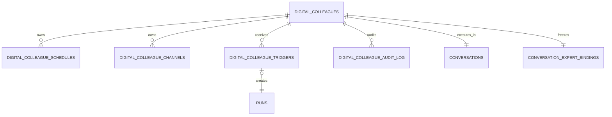
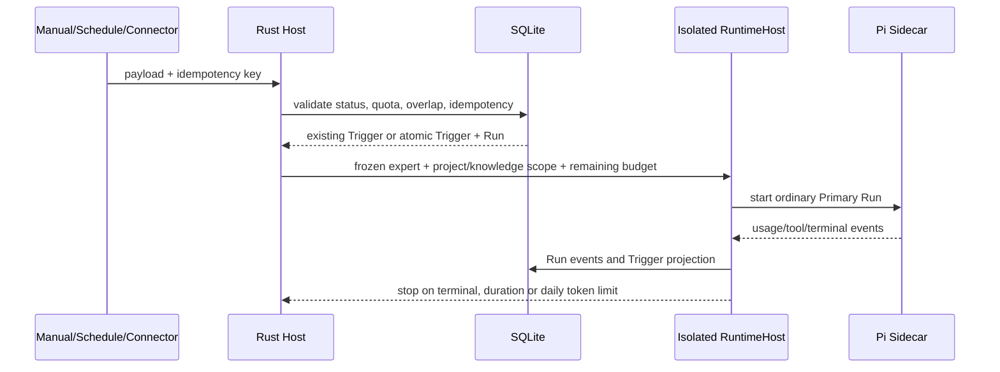

# 数字同事架构

> 状态：生效
> 适用版本：Fox `0.1.x`
> 维护范围：数字同事实例、Schedule、Channel、配额与触发执行
> 最后更新：2026-08-24

## 定位

数字同事是可治理的长期 Expert Instance，不是普通会话专家的别名。创建时，Fox 新建专用 Conversation，冻结当前 `.foxexpert` 绑定与 Package Hash，并持久化长期目标、项目、知识引用和运行配额。后续专家升级不会悄悄改变既有数字同事；需要升级时应显式重新部署。

E4 继续以 SQLite 为唯一事实源。Schedule、Channel、Trigger 和 Audit 不交给模型或 Sidecar 保管，模型只执行 Host 已接收并创建的普通 Primary Run。

## 开源复用边界

本轮优先采用成熟项目已验证的语义，没有引入第二套调度框架：

- [APScheduler user guide](https://github.com/agronholm/apscheduler/blob/master/docs/userguide.rst)：采用 misfire、coalescing 和持久 `next_due_at` 的离线补偿语义。
- [Temporal Scheduler](https://github.com/temporalio/temporal/blob/main/service/worker/scheduler/workflow.go)：采用跳过重叠运行、显式 catch-up window 和幂等调度键的语义。
- [Slack Bolt ExpressReceiver](https://github.com/slackapi/bolt-js/blob/main/src/receivers/ExpressReceiver.ts)：采用时间戳回放窗口、HMAC-SHA256 和固定形状比较。
- [Trigger.dev task rules](https://github.com/triggerdotdev/trigger.dev/blob/main/.cursor/rules/writing-tasks.mdc)：采用调用方提供幂等键，重复投递返回原 Trigger，不创建第二个 Run。
- [n8n Webhook](https://github.com/n8n-io/n8n-docs/blob/main/docs/integrations/builtin/core-nodes/n8n-nodes-base.webhook/README.md)：采用外部入口认证、速率限制和立即确认/后台执行分离。

APScheduler、Temporal、Slack Bolt、Trigger.dev 和 n8n 都绑定自己的服务进程、数据库或工作流 Runtime。Fox 已有 Rust Host、SQLite、Keyring 和 RuntimeHost，因此只复用协议语义，在现有边界内实现持久适配层，没有复制第三方源代码或新增 Agent 框架依赖。

## 数据模型



Schema v32 新增：

- `digital_colleagues`：冻结专家绑定、Package Snapshot/Hash、专用 Conversation、项目/知识作用域、状态与配额；
- `digital_colleague_schedules`：首版只允许 60 秒至 30 天的 Interval Schedule，持久化下次到期时间和 catch-up window；
- `digital_colleague_channels`：保存精确外部身份、密钥引用、速率上限与撤销状态，明文密钥不入库；
- `digital_colleague_triggers`：保存来源、幂等键、Run、用量、工具次数、错误和终态；
- `digital_colleague_audit_log`：保存创建、配置、入口接收、拒绝、misfire、触发和撤销决策。

## 状态与撤销

数字同事状态为 `active / paused / revoked`：

- `active` 接受手动、调度和 Channel 触发；
- `paused` 拒绝新触发并停用全部 Schedule，恢复后由用户显式重新启用所需调度；
- `revoked` 是不可逆终态，停用 Schedule、撤销 Channel、删除 Keyring 凭据并取消活动托管 Run。

Channel 独立支持 `active / revoked`。撤销单个 Channel 不影响同一数字同事的其他入口。

## Trigger 接收与执行



接受 Trigger 与创建 Run 在同一事务中完成。`UNIQUE(colleague_id, idempotency_key)` 保证重复投递返回原记录；同一数字同事存在 `accepted / queued / running` Trigger 时，新 Trigger 被拒绝为 `digital_colleague.overlap_skipped`。每日运行次数和累计 Token 在接受前检查，运行中继续由 Host 监控。

外部 payload 最多 64 KiB，并被包裹为 `authority="untrusted"` 的上下文数据。它不能覆盖冻结专家、系统指令、项目权限、审批策略或 Goal/Evidence 规则。

每次执行使用独立 RuntimeHost/Sidecar，并由 Host 强制：

- 剩余每日 Token 与单 Run 输出 Token；
- 单 Run 最长 15 分钟；
- 单 Run工具调用次数；
- 会话项目、专家工具和 MCP Scope 的交集；
- 原有高风险工具审批和 Lifecycle Hook。

## 调度与离线补偿

应用启动后只有一个后台 Scheduler 领取到期记录。领取使用 `id + expected next_due_at` 的 CAS 更新，多个轮询者不能领取同一时刻。幂等键固定为 `schedule:{schedule_id}:{due_at}`。

- 到期时间仍在 catch-up window 内：只补发一次，跨过的多个间隔被 coalesce；
- 超出 catch-up window：推进 `next_due_at`，不执行旧任务，并记录 `schedule.misfire`；
- 已有活动 Trigger：跳过重叠执行并写入审计；
- 应用重启：持久 `next_due_at`、Trigger 和 Audit 继续参与恢复，不依赖内存定时器。

## 签名 Channel

Channel 是 Connector/IM Bridge 调用的签名入口契约，Fox 首版不额外开放公网 HTTP Listener。创建时生成一次性 `foxdc_` 密钥，只返回一次；SQLite 只保存 Keyring 引用和短前缀。

调用必须提供：

- Channel ID；
- 与配置完全一致的 `senderId`；
- Unix 秒级 `timestamp`，与 Host 时间相差不超过 5 分钟；
- 1 至 240 字符的 `idempotencyKey`；
- JSON `payload`；
- `signature = "v1=" + hex(HMAC-SHA256(secret, signing_input))`。

签名原文为：

```text
v1:{timestamp}:{idempotencyKey}:{canonicalJson(payload)}
```

Canonical JSON 递归排序对象键，数组顺序保持不变且不加入多余空白。Host 使用固定形状比较，先执行身份、时间窗和每分钟 1 至 60 次的 Channel 频控，再接受 Trigger。成功和失败都写入审计；撤销后 Keyring 凭据删除，旧密钥不能恢复。

## 桌面入口

“专家”页的“数字同事”管理器支持：

- 选择本地可用专家并冻结当前版本；
- 绑定项目和远程知识库，设置每日 Run/Token、单次时长和工具配额；
- 暂停、恢复和不可逆撤销；
- 手动 JSON 触发；
- 创建、启停 Interval Schedule；
- 创建/撤销签名 Channel，并一次性复制密钥；
- 查看 Trigger 状态、Token/工具用量、错误和审计历史。

## 当前限制

- 调度首版只有 Interval，不支持 Cron、时区日历、DAG 或动态 Schedule；
- 同一数字同事严格禁止重叠运行，不提供并发队列；
- Channel 目前是 Tauri/Connector ingress 契约，不内置公网反向代理、Slack/钉钉/Teams 专用适配器；
- “每日”按 UTC 自然日计算；
- 已部署实例不热升级 Expert、项目或知识绑定，需要显式重新部署；
- 数字同事复用 A2 的专用 Conversation/Agent/Project Memory 可见性，但尚无独立的“同事私有 Memory Scope”。

## 验证

Rust 自动化覆盖 HMAC RFC 4231 向量、Canonical JSON、幂等、非重叠、用量投影、catch-up、coalescing、misfire、重启恢复和撤销。前端通过 TypeScript 检查，数据库迁移测试确认 Schema v32 的五张表与迁移记录。
