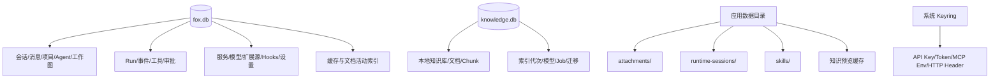
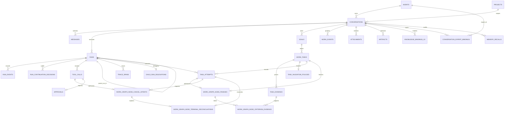

# 数据架构

> 状态：生效<br>
> 适用版本：Fox 0.1.x<br>
> 维护范围：SQLite、Keyring、受管文件、远端标识与数据一致性<br>
> 最后更新：2026-08-27

## 原则

1. SQLite 是产品事实源；核心产品与本地知识使用独立数据库。
2. 密钥与业务记录分离。
3. 大文件存文件系统，数据库保存索引和完整性信息。
4. Runtime 状态可恢复但不取代产品历史。
5. 远程服务 ID 必须通过 Fox 本地 ID 映射，不能让前端猜测。

## 数据分层



## 核心实体关系



完整表字段见 `../04-技术参考/数据库结构.md`。

## 本地文件布局

实际根目录为 Tauri `app_data_dir`，可由 `FOX_DATA_DIR` 覆盖：

```text
<data>/
├─ fox.db
├─ local-knowledge/
│  ├─ knowledge.db
│  ├─ knowledge-bases/
│  ├─ indexes/
│  ├─ models/
│  └─ staging/
├─ runtime-sessions/
├─ attachments/
├─ skills/
└─ knowledge-preview-cache/（由命令层管理）
```

本地知识根目录默认位于 `<data>/local-knowledge`，可由用户通过系统文件夹选择器迁移。迁移会锁定任务与数据库写入、执行 WAL checkpoint、复制到 staging、校验并原子切换目录；成功后写入 `fox.db` 配置并在重启后打开新路径。备份按 `fox.db` 与本地知识目录分别处理。

## 搜索与大历史

迁移 9 建立 `conversation_fts` 和 `message_fts`，用触发器保持同步。会话加载采用窗口化历史接口，前端可向前分页，避免一次装载全部消息。大 Chunk、路由和组件分包仍在性能待办中。

## 一致性机制

- 外键开启，消息、Run 事件等随会话级联删除。
- Run 事件以 `(run_id, seq)` 唯一，支持重复投递去重。
- Continuation Decision 以 `decision_id` 唯一并按 Run 追加；完全相同的重放幂等返回首次记录，同 ID 不同内容拒绝。`event_cursor` 不得超过 Run 的已持久事件水位，也不得相对该 Run 已有 Decision 后退。Decision、reason code、retry class 与 Host 校验结果使用 Schema v1 枚举；accepted 的 Task/Evidence 引用必须属于 Run 所在会话，rejected 保留模型声明用于审计。
- Host 可携 `expected_projection_hash` 追加 Decision。Repository 在同一写事务中重建正式事实投影并执行 CAS；不匹配返回稳定的 `[continuation.projection_hash_mismatch]`。该 SHA-256 排除生成时间与 Decision 审计，只覆盖 Goal/Task/Evidence validity/Acceptance/Finding/当前 Run Approval/Run Event 水位等正式事实。
- Approval 的可批准窗口由同一事务约束为“记录仍 pending、关联 Tool Call 仍 pending、所属 Run 仍 running”；只有该 CAS 成功后才能写 `conversation_tool_permissions`。工具执行前还要把已批准 Tool Call 原子 claim 为 running。显式取消把未决审批标为 `cancelled`；Run 终态、Crash/启动修复或新 Run 边界把已失去执行上下文的审批标为 `expired`，保留旧记录但禁止绑定到新 Run。
- Child Run 以 `(parent_run_id, tool_call_id)` 幂等；`root_run_id` 支持根级并发统计，取消查询只遍历真实 descendants。
- Work Event 以 `(conversation_id, sequence)` 唯一；未知类型安全忽略。
- 同一会话最多一个 `active/blocked` Goal，同一 Goal 最多一个 `in_progress` Task。
- Task/Goal 更新带 `version` 乐观锁；completed Task 必须至少有一条 Evidence。
- Runtime Session 以 `(conversation_id, runtime_type)` 唯一。
- `knowledge_bindings_v2` 以会话和 source-aware 引用为事实；旧 `knowledge_bindings` 只保留远程兼容投影。
- Agent 分类只允许 `assistant/primary/chat_selector`、`expert/inline/expert_center`、`worker/child/hidden` 三种组合。
- `conversation_expert_bindings` 通过部分唯一索引保证每个会话最多一个 active 专家，并保存历史展示快照与 Package Hash。
- Provider 模型以 `(provider_id, model_id)` 唯一。
- SQLite 使用 WAL 与 busy timeout。

## 缓存生命周期

知识预览缓存记录 `source_revision`、大小、租约数与最后访问时间。使用中条目不能被 LRU 删除；启动时重置异常退出留下的租约，并删除孤儿文件。容量由 `app_settings` 中的配置控制。

## Schema 与工作图边界

`fox.db` 当前 Schema 版本为 **79**（`DATABASE_SCHEMA_VERSION`，见 `apps/desktop/src-tauri/src/database/mod.rs`）。下表按版本区间归纳：19 增加 PlanRevision、ReviewFinding 与 Acceptance；20-23 增加 Agent/专家包、插件/source-aware 知识和会话工具授权；24-28 增加会话生命周期、Memory、Trace/Evaluation、Child Run 与扩展源/Lifecycle Hook；29-32 增加不可变专家包、Workflow、Team 与数字同事；33 增加追加式 `run_continuation_decisions`；34 增加 Task 冻结 ValidationPolicy 与追加式 Attempt 历史；35 增加一次性人类 Repair 预算升级事实和 Approval claim 元数据；36 增加最小 Readonly Graph 拓扑与 Graph Child↔父级 Attempt 映射；37 增加不可变 Graph Node finish header 与 criterion↔Evidence 绑定；38 增加两阶段 Node cancel intent 与 Child 负终态 reconciliation；60-73 增加对账证据、大结果 blob、效果 outbox 扩展、Skill/交付清单/中途指令、受管文件版本、审批过期可续跑语义、预算选择与统一后台作业、产物分类与交付位置；**74-79 增加执行准入凭据、持久单次领取、Host 文件观察、执行策略与父级代次，以及 `kernel_jobs` 幂等键放宽**。`knowledge.db` 继续独立版本化。

逐表与关键约束见[数据库结构](../04-技术参考/数据库结构.md)；该文档正文详述到 v59，60-79 的要点在同一文档的「迁移 60–79：覆盖缺口与要点」一节。

## Graph Node Finish 与证据闭环（v37）

迁移 37 补上 v36 只负责“开始节点”的另一半：Worker Child 返回 completed 只表示“它停止并交回了结果”，不表示结果已经通过验收。父 Lead 必须在 Child 结束后，重新用受控的只读/检查工具观察真实结果，并把每条 frozen acceptance criterion 明确绑定到当前 Attempt 的新鲜 Evidence；只有这一整条链同时成立，已有 Attempt/Task 状态机才允许 `running → succeeded` 和 `in_progress → completed`。迁移没有新增 Goal Acceptance，也没有让模型直接写 accepted。

持久事实分为两层：

```text
work_graph_node_finishes（一个 Attempt 最多一份不可变 finish header）
  ├─ Graph / Goal / Task / Attempt
  ├─ parent Lead Run / completed Child Run / delegation
  ├─ Host graph_readonly_node_finish ToolCall
  ├─ frozen ValidationPolicy + Task/Attempt CAS 版本
  ├─ canonical input JSON/hash + Child terminal result hash
  └─ work_graph_node_criterion_evidence（逐 criterion、逐 Evidence 明细）
       ├─ frozen criterion ordinal + exact text
       └─ current Attempt 的 fresh、live Evidence
```

模型输入固定为 `goalId/taskId/attemptId/expectedTaskVersion/expectedAttemptVersion/criterionEvidence/summary` 七项，额外字段、错误顺序的 criterion、空 Evidence、同一 criterion 内重复 Evidence 或超过边界都会拒绝。`parentRunId/childRunId/validationPolicyId/ToolCallId/childResultHash` 不由模型声明，而由 Host 从 Attempt、delegation、Run terminal 与冻结 Policy 推导。SQLite 校验 canonical JSON、事实绑定和 64 位小写十六进制 Hash 形状；真正的 SHA-256 重算与 Child terminal replay 由 Repository 完成，因为 SQLite 本身没有内置 SHA-256。

Criterion proof 不能靠 Graph 生命周期工具“自证”。允许的 Evidence 必须属于当前 Task，`source_run_id` 是当前父 Lead，创建行和引用 ToolCall 都晚于 Attempt 水位/开始时间，仍为 valid，并且 ToolCall 与 Goal 同会话、已 completed、无错误：

- inspection：Runtime `read/ls/find/grep`（无需审批），或 Host `git_read/structured_data/tabular_data`（无需审批）、`sqlite_read`（需要审批）；Evidence 类型为 `tool_call`，`validationCheckType=inspection`。
- test：Host `test_run/code_check`（需要审批）；Evidence 类型为 `test_result`，`validationCheckType=test`。
- manual/review、空 check type、旁 Run、旧 ToolCall、Child 自报、`child_run_collect` 以及 activate/start/finish 生命周期 ToolCall 都不能覆盖 criterion。一个真实 inspection 可以明确支撑多个 criterion，但在同一 criterion 内不能重复列同一 Evidence。`standard_v1` 还必须至少包含一条 inspection，只有 test 不够。

数据库把 finish 当成现有状态机的前置门，不是第二套状态机。Repository 在同一 `IMMEDIATE` 事务中按 `header → 全部 bindings → finish_task_attempt → Task completed` 写入；Attempt 的 succeeded trigger 会聚合检查 frozen criteria 是否全部覆盖、Evidence 是否仍 live、Child 是否有非空持久结果、Goal 是否仍 active、父 Lead/Child/Profile/ToolCall/Policy/CAS 是否完全匹配。缺一项，整笔事务回滚，所以通用 `finish_task_attempt` 或直接 SQL 不能绕开专用入口。v37 落地时 `graph_readonly_node_finish` 只允许 `standard_v1`，`high_risk_v1` 无论已有何种 review facts都返回 `review_required` 且零写；后续 v39 才用完整独立 Reviewer 闭环替换这道预留门禁。

Finish header、criterion binding、它们引用的 Evidence authority/ref ToolCall、冻结 Policy、Attempt 成功事实、Child terminal result 及 finish ToolCall authority 字段一经成立不得 UPDATE/直接 DELETE；Evidence 的 `validity_status/checked_at/invalid_reason` 仍可变化，读取 accepted/readiness 时必须再次确认当前 live，不能把历史上曾 valid 当作永久有效。直接掏掉一条 finish/binding 会被拒绝；Conversation/Goal 作为聚合根的正常级联删除仍能完整清理事实并通过 `foreign_key_check`。

### v37 参考来源与吸收边界

以下路径均相对于 Fox 仓库根目录：

- Fox 复用点：`apps/desktop/src-tauri/src/database/repositories/work_graph.rs` 的 `finish_task_attempt`、ValidationPolicy/Evidence/Review 水位和 CAS，`apps/desktop/src-tauri/src/database/repositories/graph_lead.rs` 的专用 finish/readiness 重验，以及 `apps/desktop/src-tauri/src/database/migrations.rs` 的 Host ToolCall authority、Run lineage、frozen profile、append-only/no-tamper trigger 模式。v37 只给既有状态机增加“必须先有可审计 finish aggregate”的门。
- Maka：`../maka-agent-main/packages/runtime/src/stream-graph-readiness.ts` 与 `../maka-agent-main/packages/runtime/src/stream-graph-dispatch.ts` 把 readiness 与 dispatch 分开；`../maka-agent-main/packages/core/src/agent-graph-topology.ts` 保持小图 exact contract。Fox 吸收“先根据权威事实判断 ready，再调度”的边界，但不复制 Maka 的 Graph/Task 状态机。
- Kun：`../Kun/kun/src/contracts/graph-core.ts` 明确区分 completed/accepted 和 `acceptedAttemptId`，`../Kun/kun/src/graph/graph-worker-context.ts` 只向下游暴露匹配 accepted Attempt 的依赖结果，`../Kun/kun/src/graph/graph-supervisor.ts` 与 `graph-supervisor-review-service.ts` 展示独立 Reviewer。Fox 吸收“执行结束不等于验收通过”和 reviewer 身份隔离；当前 high-risk 仍 fail-closed，未在 v37 偷渡半套 Reviewer。
- Reasonix：`../DeepSeek-Reasonix/internal/recovery/reviewer.go`、`gate.go`、`persist.go`、`decision.go` 展示有界结构化证据、恢复 gate、持久 decision 与 Host-observed facts 的分层。Fox 只吸收“恢复时重读持久事实、证据必须有界且可复核”，不搬它的 LLM reviewer fail-open 余地或文件快照恢复方式。
- Codex：`../codex-latest/codex-rs/core/src/tools/handlers/multi_agents_spec.rs` 与 `multi_agents.rs` 用严格工具 schema/handler 校验模型输入，`../codex-latest/codex-rs/core/src/agent/control/spawn.rs` 绑定父调用与 Child 生命周期。Fox 吸收 exact input、父级 authority 和 Child terminal replay；不复制 Codex 的线程存储或多 Agent 工具协议。

## Graph Node 取消与负终态对账（v38）

迁移 38 解决两个容易混淆的问题：用户“提出取消”不等于取消已经真正生效；Child 的失败、取消或中断也不能靠 Runtime 内存猜测后直接改 Task。Fox 把这两步分别保存为 cancel intent 和 terminal reconciliation，并继续复用原有 Attempt/Task 状态机，没有新增 retry、accepted、skipped 或另一套 Graph 状态。

取消采用两阶段事实：

```text
graph_readonly_node_cancel ToolCall = running
  → 写 work_graph_node_cancel_intents pending（activated_at = NULL，只审计、不触发取消）
  → Work Tool common finalizer 把同一 ToolCall 写成 completed
  → Host 在 live Goal/Task/Attempt/Lead/Delegation/Child + CAS 全部仍匹配时设置 activated_at
  → Host 才可以向该 Child 发取消信号
```

如果 common finalizer 失败，pending intent 永远不会激活，也不会影响 Attempt/Task；同一 Attempt 可以用新的 ToolCall 再写一个 pending 请求。`tool_call_id` 唯一，两个部分唯一索引保证同一 Attempt、同一 Child 最多只有一个已经激活的 intent。激活不是“看到 completed 就补一个时间戳”：触发器会再次要求 Goal active、Task in_progress 且 Task version/owner 匹配、Attempt running 且 Attempt version/父 Run 匹配、父 Lead 仍为同会话的 canonical durable_v2 根 Run、delegation 与 Child 仍是 queued/running/cancelling 且 Child 未结束。这样旧请求在并发完成、版本变化或重启扫描时只能成为审计记录，不能在终态之后重新发取消。

`work_graph_node_cancel_intents` 冻结 `goal/task/attempt/parent_run/delegation/child_run/tool_call`、Task/Attempt 预期版本、1–2000 字符的 reason、canonical input 和 SHA-256。模型输入恰好六项：`goalId/taskId/attemptId/expectedTaskVersion/expectedAttemptVersion/reason`；按当前 `serde_json::Value` 的 canonical 字典序持久化为 `attemptId,expectedAttemptVersion,expectedTaskVersion,goalId,reason,taskId`。Host ToolCall 必须是同一父 Lead/会话、`host + requires_approval=0 + graph_readonly_node_cancel`，pending 写入时为 running，激活时为 completed、无错误且有持久 result。

Child 真正到达负终态后，Host 写不可变 `work_graph_node_terminal_reconciliations`，它绑定 Graph/Goal/Task/Attempt、父 Lead、delegation、Child、可选 active intent、预期版本、负终态快照/hash 与 failure reason。快照只包含 `childRunId/status/finishedAt/errorCode/errorMessage`，不包含会随着事件追加变化的 `last_seq`。SQLite 校验 canonical JSON、字段与权威 Run/delegation 完全一致以及 64 位小写十六进制 Hash 形状；Repository 负责 SHA-256 重算。

| Child 权威终态 | Attempt 终态 | Task 终态 |
|---|---|---|
| `failed` | `failed` | `interrupted` |
| `cancelled` | `cancelled` | `interrupted` |
| `interrupted` | `failed` | `interrupted` |

`completed` 和非终态不能写 reconciliation；`skipped/accepted` 不参与这条链。存在 active intent 时 reconciliation 必须显式引用它；没有 active intent 的自然失败/中断仍可对账，pending/failed intent 不会冒充取消来源。推荐的单事务顺序是 `插入 reconciliation → 复用 finish_task_attempt 写 failed/cancelled → 复用 Task helper 写 interrupted`。v38 trigger 要求 Attempt、Task 的 exact version increment、failure reason、finished time 和 owner 清理都与同一 reconciliation 匹配；通用 Repository 或直接 SQL 缺少该事实时不能把 Graph Attempt/Task 改成负终态。唯一保留的旧路径是父 Lead 本身已有真实终态：它仍可按既有 startup audit 规则收口其持有的 Attempt/Task。

防删除从 v36 Graph 绑定成立时就开始，而不是等第一条 v38 intent/reconciliation 才生效。任何 `graph_task_attempt_id` 非空的 Attempt、delegation、父 Lead/Child Run 和 node-start ToolCall 都拒绝直接 DELETE，避免攻击者先删 Attempt 触发 `ON DELETE SET NULL`、或借 Run/delegation cascade 抹掉映射，再让 generic finish 把它当普通 Attempt。激活 Run 与 activation ToolCall 已由 `work_graph_specs` 的 `ON DELETE RESTRICT` 外键保护。Intent、reconciliation 和它们引用的 terminal authority 建立后还会进一步冻结终态字段。Goal/Conversation 作为聚合根的合法 cascade 通过既有 `work_graph_cascade_delete_scopes` 仍可一次清理并通过 foreign-key check；单独删除 Child Conversation 也会被 Child Run guard 拒绝。SQLite owner/调试者可以主动关闭 trigger 或直接改库，这超出同进程防篡改边界；生产 Host 必须保持 FK/trigger 开启，并在恢复时只扫描 `activated_at IS NOT NULL` 的 intent 和仍未投影的 reconciliation。v38 不自动跳过下游节点，也不把负终态解释成验收。

### v38 参考来源与吸收边界

以下路径均相对于 Fox 仓库根目录：

- Fox 复用点：`apps/desktop/src-tauri/src/database/repositories/graph_lead.rs` 的 cancel/reconciliation 专用事务，`apps/desktop/src-tauri/src/database/repositories/work_graph.rs` 的 `finish_task_attempt` 与 Task CAS，`apps/desktop/src-tauri/src/database/repositories/child_runs.rs` 的 `sync_child_run_terminal`、`reconcile_terminal_graph_children_in_transaction`，以及 `apps/desktop/src-tauri/src/database/migrations.rs` 已有 Host ToolCall authority、Run lineage、frozen Profile、append-only/no-direct-delete 模式。v38 只给既有负终态更新增加可重放前置事实。
- Maka：`../maka-agent-main/packages/runtime/src/stream-graph-dispatch.ts` 的 `runAgentGraphToQuiescence`、`dispatchIntent` 与 `stream-graph-readiness.ts` 的 `evaluateAllSettledReadiness` 把 dispatch、abort/failed 结果和下一轮 readiness 分开。Fox 吸收“先绑定 claim/terminal 路径，再由持久事实重新算 readiness”，不复制 Maka 状态机。
- Kun：`../Kun/kun/src/graph/graph-attempt-scheduler.ts` 的 `cancelRun`、`executeAttempt`、`finishChild`、`failAttempt` 与 `graph-recovery-service.ts` 的 `reconcile` 展示取消信号、Child 终态和重启对账分层。Fox 吸收 cancelled/failed 分离和重启从持久事实重放，不复制自动 retry/orphan 处置。
- Codex：`../codex-latest/codex-rs/core/src/agent/control/legacy.rs` 的 `close_agent`、`shutdown_live_agent`、`shutdown_agent_tree` 与 `../codex-latest/codex-rs/protocol/src/protocol.rs` 的 `AgentStatus` 展示停止前先收口生命周期、并区分 stopped/failed 状态。Fox 吸收 exact child lifecycle/status distinction，不复制 Codex thread store 或树关闭协议。
- Reasonix：`../DeepSeek-Reasonix/internal/recovery/persist.go` 的 `SaveSnapshot`/`LoadSnapshot`、`reviewer.go` 的 `parseReviewVerdict` 以及 `gate.go`、`decision.go` 展示有界结构化事实与恢复 gate。Fox 只借原子持久、Host-observed facts 和恢复时不复用瞬时状态；不把 LLM reviewer fail-open 或文件快照当作 SQLite 权威。

## 独立高风险 Graph Reviewer 与最终验收（v39）

迁移 39 没有增加新的 Task、Node 或 Goal 状态。它把 v37 预留的 `high_risk_v1` 补成一条可恢复、可机械重验的独立审查链，并把整张 Graph 的最终接受绑定回原有 `acceptances + goals.status/version`。standard 节点仍走原来的 criterion↔Evidence finish；high-risk 节点只有 matching Reviewer pass 才能调用同一个 Attempt/Task 成功状态机。通用 `task_attempt_finish`、`accept_goal_with_review` 和直接 SQL 对已激活 Graph 都 fail-closed，不能绕过专用入口。

节点审查采用 durable outbox：父 Lead 的 exact Host `graph_readonly_node_review` 先写 `work_graph_node_review_requests` pending，common finalizer 成功后才设置 `activated_at`；恢复只扫描 activated 且未 settled 的请求。Repository 随后派发独立 Child Conversation/Run，冻结 `graph_reviewer_v1`，目标固定为独立复核，scope 精确为 `read/ls/find/grep`，预算固定为 `45000ms / 4096 total / 1024 output / 6 tool calls`。Reviewer Run 必须不同于父 Lead 和实现 Child，不能拥有该 Task 的 Attempt；允许复用同一 Assistant package，身份隔离来自独立生命周期、Conversation、delegation、Profile 和 readonly contract，不靠模型选择 `agent_id`。

Reviewer 输出 exact 四键：`criteria/recommendation/summary/findings`。每条 frozen criterion 必须按原顺序出现，item 仅含 `criterion/status/toolCallIds`。模型看到的 `toolCallIds` 是 Runtime `runtime_tool_call_id`；Repository 必须以 `(reviewer_run_id, reviewer_conversation_id, runtime_tool_call_id)` 唯一解析内部 `tool_calls.id`，再验证调用是 activation 之后、Reviewer terminal 之前完成且无错误的 `runtime + requires_approval=0 + read|ls|find|grep`。`work_graph_node_review_proofs` 保存内部 FK 和 Runtime ID，decision 的 `proof_json` 同时冻结 Runtime→内部 ID 映射及 Hash，避免跨 Run 重放或 ID 混淆。pass 要求所有 criterion 为 passed 且 `findings=[]`；revise 至少一条 failed criterion 和 1–16 条 immutable finding，finding exact 为 `criterion/severity/title/detail/toolCallIds`，只可引用该 failed criterion 的 proof ToolCall 子集；inconclusive 不会放行 finish。

`work_graph_node_review_decisions` 只保存 `pass/revise/inconclusive`。Reviewer failed/cancelled/interrupted、非法 JSON、缺 proof 或越权 ToolCall 一律投影 inconclusive，绝不“猜成 pass”。revise 通过专用内部链路复用既有 Attempt/Task CAS 投影 blocked；v39 暂不把 findings 复制进通用 `review_findings`，避免新增 Writer/UI/repair 语义，但完整结构仍留在不可变 `decision_json`。high-risk 成功路径使用 Graph-authorized completion helper：仍要求父 Lead 的 fresh live inspection、criterion bindings 和中高风险 blocker 清零，只把原通用 policy 对“同会话 review Evidence”的要求替换为 matching immutable Reviewer decision，不伪造父会话 Evidence。

最终 `graph_readonly_accept` 也是两阶段 Host authority。pending `work_graph_acceptances` 冻结 current Plan/spec、Goal CAS、完整 Node projection/checks、input/hash；common finalizer completed 后，activation 在一个 `IMMEDIATE` transaction 内重新确认 approved+activated current Plan（存在 newer proposed/approved 就拒绝）、每个 Node 都有 succeeded Attempt 和 immutable live finish、全部 criterion Evidence 仍 valid、每个 high-risk finish 仍有 live pass proof、所有 severity 的 open Graph finding 数为零、没有 active review/nonterminal Graph Child，再写同 ID 的通用 Acceptance 并把 active Goal CAS 为 completed。任何 projection 漂移都会把 pending 判为 stale；completed Child 仍不等于 accepted，revise/inconclusive 也不会完成 Task 或 Goal。

两类请求、decision/proof、Graph acceptance、Reviewer/实现 authority 及其 ToolCalls 都禁止直接 UPDATE/DELETE；Goal/Conversation 聚合根仍通过 `work_graph_cascade_delete_scopes` 合法级联。SQLite 不提供 SHA-256，也无法防止数据库 owner 主动关闭 trigger；Hash 由 Repository 重算，数据库负责 exact FK/shape/lifecycle/CAS 防线。迁移支持 v38→v39、重复执行与 `foreign_key_check`，并重建 v37 finish trigger，使 standard 不回退、high-risk 只在 proof aggregate 完整时放行。

### v39 参考来源与吸收边界

- Fox：复用 `apps/desktop/src-tauri/src/database/repositories/work_graph.rs` 的 Attempt/Task CAS、Evidence watermark、ValidationPolicy 和 Acceptance；`apps/desktop/src-tauri/src/database/repositories/graph_lead.rs` 的 finish/readiness/Child hash；`apps/desktop/src-tauri/src/database/migrations.rs` 的 Host ToolCall authority、Run lineage、frozen Profile、append-only 与 cascade sentinel。v39 只加窄 provenance，不另造 Graph 状态机。
- Maka：`../maka-agent-main/packages/runtime/src/stream-graph-readiness.ts`、`stream-graph-dispatch.ts` 与 `goal-evaluator.ts` 提供 readiness/dispatch/目标复核分层；Fox 只吸收“先重验权威事实、再推进”的门，不复制 Maka ledger/scheduler。
- Kun：`../Kun/kun/src/graph/graph-supervisor-review-service.ts`、`graph-review-normalizer.ts`、`graph-review-idempotency.ts` 和 `../Kun/kun/src/contracts/graph-core.ts` 提供 completed≠accepted、独立 Reviewer、bounded verdict 与幂等；Fox 不复制 Kun Graph Supervisor 或自动 retry。
- Codex：`../codex-latest/codex-rs/core/src/tools/handlers/multi_agents_spec.rs`、`multi_agents.rs` 与 `../codex-latest/codex-rs/core/src/agent/control/spawn.rs` 提供严格工具输入、父调用和 Child lifecycle；Fox 不复制 Codex thread store/agent protocol。
- Reasonix：`../DeepSeek-Reasonix/internal/recovery/reviewer.go`、`gate.go`、`persist.go`、`decision.go` 提供 bounded structured result、Host-observed gate 和重启持久 decision；Fox 不采用 LLM fail-open 或文件快照作为数据库权威。

## Durable State 与只读投影

迁移 33 已实现一个 Run 对多条 `ContinuationDecision` 的追加记录，包含 `schemaVersion/decisionId/runId/eventCursor/decision/reasonCode`、关联 Task/Evidence、缺失验收、下一动作、重试分类、阻塞依赖、Host 校验结果/错误和创建时间。Rejected 提议可以留作审计，但 `TaskLedgerProjection.latestHostAcceptedDecision` 只暴露当前 latest Run 的 Host accepted Decision；旧 Run Decision 不进入当前投影。Runtime 的自由文本或未经 Host 校验的提议不构成状态事实。

`TaskLedgerProjection` 没有对应权威表或写接口。Repository 在原 `load_work_graph_snapshot` 的共享事实查询上重建 Goal、Task、每 Task 最近 Evidence，并补充 Acceptance、open Finding、当前 latest Run 的 pending Approval、Child Run 映射和 Run/Event 水位。Approval pending action 同时携带 DB 权威 `runId/toolCallId`；完成摘要只公开 `validity_status=valid` 的 Evidence ID。Legacy 数据没有 Decision 时仍从既有 Goal/Task/Evidence/Acceptance/Run 生成 `completionPolicy=legacy_v1` 的投影。

`load_work_snapshot_v2` 是 Host 的原子读取边界：它在一个 SQLite `DEFERRED` read transaction 内读取 A1、selected Goal 的 Work Graph、Task Ledger 和根级 Source identity。selected Goal 只计算一次，优先级固定为 active/blocked、proposed；没有当前 Goal 时顶层 `goal` 和 `taskLedger.goal` 都为 null，completed/cancelled 只进入历史 summary/phase，不会重新成为 Prompt 当前目标。因此即使更新更晚的 proposed 与 active 并存，顶层 `goal` 和 `taskLedger.goal` 也不会指向两套事实。`generatedAt` 在事务内取一次并与 `taskLedger.projectionMeta.generatedAt` 相同；根 `sourceHash` 是排除生成时间后的完整已发出 V2 结构 SHA-256；`sourceHighWatermark` 是 selected Goal、Ledger Run/Work/Acceptance 水位与 A1 追加游标的可读定位信息。游标不覆盖原地状态修改，所以相等性与陈旧判断以 Hash 为准。

Prompt 快照不是全历史导出。Host 结构化保留最多 64 个 Task、这些 Task 的 frozen ValidationPolicy、每个 Task 最近 4 个 Attempt、每个 Task 最新 Valid Evidence 加最近记录（合计最多 4 条）、8 个 PlanRevision、32 个优先 open Finding、8 个 current/recent Acceptance；嵌入 Ledger 保留 64 个 active Task、64 个 pending action、32 个完成摘要和 32 个 Run cursor。Policy/Attempt 与其他 V2 事实一并进入根 `sourceHash`，重启后 Runtime 能看到当前 repair/review 水位，但不能从 Prompt 改写策略或历史。选择不是裸数组截断：`resumableFrom`、pending action 对应 Task、in-progress/interrupted/blocked 与高序号关键 Task 优先，终态历史再按更新时间尾窗；`historySummary` 给出同一事务内的 total/returned。独立 Repository V1 查询和没有 continuation 的 Legacy 重建保持原接口与语义。

Decision 始终只是审计元数据：不生成 `pendingActions`，不覆盖 `currentPhase`，不提供 `resumableFrom`。这保证 Goal/Task/Evidence/Acceptance/Approval/Run 仍是唯一状态事实，避免旧 Repair/Blocked Decision 自我强化或污染新 Run。`projectionMeta.projectionHash` 是正式事实的可复算 CAS 水位；Hash material 额外覆盖当前 Goal 全部 Evidence 的 `id/taskId/validityStatus/checkedAt/invalidReason`，即使完成摘要不再公开失效 Evidence，也能检测 Valid→stale/missing/invalid。

为修复“原始 proposal event 已提交、Decision 尚未提交”的崩溃窗口，Repository 提供有界 `unprojected_continuation_proposals(limit)`：按 DB 中 `runs.conversation_id/run_events.run_id/seq` 返回所有尚无匹配 Decision、也尚无 ingest diagnostic 的 `run.continuation_proposed`，包括缺 proposal/decisionId 的 malformed 事件，供 Host 生成稳定诊断并 fail-closed。恢复记录的 `executionProfileId` 只从同 Run 更早的 `run.started` 或 `run.request_snapshot` 事件提取，缺失返回 `None`，不信任 proposal 自报。Host 以 256 条为一页，每个前台 pass 最多处理 1024 条或运行 2 秒；达到预算时在同一进程继续调度后续 pass，直至队列为空，因此 257+ 条 backlog 不依赖再次启动。`authoritative_run_conversation_id` 和带 `run_id` 校验的 `continuation_decision_by_id` 分别用于 Envelope 身份绑定及重放时复用首次 Host outcome。

`run_continuation_ingest_diagnostics` 以 `(run_id,event_seq)` 追加记录 proposal 投影失败，完全相同的重复记录返回首次结果，不同内容拒绝；它只抑制同一坏事件的重复恢复扫描，不改变 Goal/Task/Run 或投影阶段。诊断只允许关联 `run.continuation_proposed`，profile/error code 最多 200 字符、error message 最多 4096 字符，避免协议错误导致审计库无界膨胀。这样前部 malformed 事件被诊断一次后，后续有界扫描仍能到达有效 proposal。

数据库层不负责执行 complete/blocked/repair/wait_approval，也不把 Decision 转换成 Goal/Task 状态。Host 必须绑定 DB 权威 Run/Conversation、读取当前投影、确定性校验 proposal，并将读到的 `projectionHash` 作为 CAS 传给追加接口；CAS 失败只能重新读取和有限重算。原始 event 与 Decision 的跨事务补偿由 Host 调用 unprojected 查询完成。

### 参考来源与吸收边界

以下路径均相对于 Fox 仓库根目录。

- Maka：参考 `../maka-agent-main/packages/headless/src/task-ledger-experiment.ts` 的持久状态/epoch 思路、`../maka-agent-main/packages/core/src/agent-graph-client-projection.ts` 的投影幂等与 CAS 边界，以及 `../maka-agent-main/packages/runtime/src/graph-mode.ts` 的 committed durable state/有界状态决策边界；Fox 只吸收“权威事实带水位、派生投影可重建、陈旧写入拒绝、状态决定与副作用分离”的契约，并用现有 SQLite 事件队列分页恢复，不引入与 Goal/Task 平行的 Maka Task Ledger 或 Graph 状态机。
- Maka 原子边界：进一步参考 `../maka-agent-main/packages/storage/src/sqlite-session-metadata-store.ts` 的 projection snapshot/version/applied-record 同事务提交，以及 `../maka-agent-main/packages/core/src/task-ledger.ts` 的确定性投影顺序。Fox 吸收“一次事务对应一个可识别快照”和稳定选择顺序；没有照搬 Maka 的 projection 表、writer authority 或事件 Task Ledger，因为 Fox 继续从现有事实只读重建。
- Codex：参考 `../codex-latest/codex-rs/state/src/runtime/goals.rs` 与 `../codex-latest/codex-rs/ext/goal/src/steering.rs` 的 Goal continuation 边界，并参考 `../codex-latest/codex-rs/state/src/runtime/recovery.rs`、`recovery_tests.rs` 和 `../codex-latest/codex-rs/ext/goal/tests/goal_extension_backend.rs` 的事件恢复、重复事件和首次结果复用测试思路；权限侧参考 `../codex-latest/codex-rs/core/src/tools/spec_plan.rs` 与 `../codex-latest/codex-rs/core/src/tools/sandboxing.rs` 的模型可见工具/Host 执行授权分离。Fox 保留自己的 SQLite Goal/Task/Evidence/Acceptance/Run/Approval 事实，并额外要求 Approval 与可执行 Run/ToolCall 绑定；不复制 Codex Goal 存储、steering 状态机或 sandbox runtime。

## 失败恢复与验证

- 启动修复中断 Run，并审计由终态 Run 持有的非终态 Task；同一恢复事务把失去执行上下文的 pending Approval 标为 `expired`。Run 取消、终态和新 Run 边界同样幂等终结旧 Approval，迟到批准不会写会话权限。Run 终态本身不可逆：Runtime 的 `completed/failed/cancelled/interrupted` 只能由非终态 CAS 进入；高序号同终态重放必须与首次 `run_events.event_json` 的完整 canonical JSON（含未来扩展字段）完全一致，只推进水位且不追加第二条 UI 事实、不重写 Trace；不同终态或任何 payload 差异均回滚。终态后的 Runtime allowlist 仅剩这种精确终态重放，late `message/tool/reasoning/question/work/continuation/usage/unknown` 全部拒绝；`awaiting_user` 的回应由 Host `create_resumed_run` 原子追加 parent `user.question.responded` 并创建新 Run。`run.started` 只允许 `queued → running`，迟到 Host crash 也不能把 completed 改成 failed；首次 Host failure 同事务把 streaming assistant Message 置为 interrupted，精确 Host failure 重放不改消息。
- Repository 写入尽量在事务内完成用户消息、Run 和状态投影。
- 备份恢复验证路径、总大小、哈希与数据库可打开性。
- 迁移测试覆盖空库、A0 前旧库升级、幂等与备份恢复；Repository 测试覆盖状态机、Evidence 校验、SQLite busy 有界重试、Continuation 枚举/关联/水位、相同 ID 幂等/冲突、旧 Run Decision/Approval 隔离、终态/取消/启动修复/新 Run 的 Approval 终结与迟到授权拒绝、257+ proposal 分页 reconciliation、malformed diagnostic 去饥饿、同毫秒 Run 插入顺序、权威 Run identity、Evidence validity hash 与 CAS mismatch、Legacy 投影重建。

关键代码：`database/migrations.rs`、`database/repositories.rs`、`local_knowledge.rs`、`local_knowledge_import.rs`、`maintenance.rs`、`runtime-session.mjs`。

关联文档：[数据库结构](../04-技术参考/数据库结构.md)、[对话系统架构](对话系统架构.md)、[可观测性与测试架构](可观测性与测试架构.md)、[迁移备份与恢复](../06-运维指南/迁移备份与恢复.md)。

## ValidationPolicy、Attempt 与 Review/Repair 闭环（v34-v35）

迁移 34 没有建立第二套任务库。`work_tasks` 仍是 Task 当前状态，`task_validation_policies` 只为每个新 Task 冻结一次验证合同，`task_attempts` 只追加执行/返修历史；Evidence、ReviewFinding、Acceptance 继续复用原表。完整关系是：

```text
Task(current state)
  ├─ frozen ValidationPolicy (one row, immutable by API)
  └─ Attempt 1..N (append only)
       ├─ Valid Evidence + validationCheckType
       ├─ ReviewFinding references for repair
       └─ succeeded / failed / blocked / cancelled
             └─ Acceptance closes policies that require final acceptance
```

Host 与 Runtime 的三套合同完全一致：`legacy_v1`、`standard_v1`、`high_risk_v1`，Hash 分别固定为 `4129f5db32d88d7070c59ed2351aab9c6ad59c8cc380451901bb10962c5bee92`、`bcef9ad7087b2872a0152f493cfba131a4283a3170dc8fe5824d108d19e3d04d`、`bb1258169c5d923dfd5fd1980dd52150ab96e159bd01d07ff0d04c48998dc5ea`。读取时同时比对 schema、全部字段、数组顺序、policy id、列 Hash 与 snapshot Hash；未知 id、字段混搭或 Hash 篡改统一 fail-closed。`run_execution_profiles` 在 Run 提交前保存 Host 解析的 canonical profile snapshot/hash；Runtime 的 `run.started`、request snapshot 或 transcript 只能做一致性诊断，不能选择或降级权限。`durable_v2` 至少是 standard，Task risk hint 只能升级到 high，不能降到 legacy；Shadow/readonly profile 禁止创建可变 Task。

旧 Task 没有 `task_validation_policies` 行时只读解释为 `legacy_v1`，不会回填或改写；新建 Legacy Task 也写入显式 frozen row。v34/v35 对旧程序只有“物理上能读到旧表”的兼容性，不支持旧 binary 继续执行 `durable_v2`：安全回滚必须先停用 durable profile，并一起恢复升级前应用和数据库备份，否则冻结 Policy、Attempt/Approval 与一次性升级保证都会失效。`Task.attempt` 是最新 Attempt 编号的兼容摘要，`task_attempts` 才是完整历史；Evidence 不随重试覆盖。

Attempt start/finish 在单一 `IMMEDIATE` 写事务内同时校验 Task version、Attempt version、Run/Conversation/Task 身份、一个 Task 最多一个 running Attempt、policy hash，并更新 Task 当前态。重复 `attemptId` 且内容完全相同返回第一次结果，不同内容拒绝。每个 durable Task 全生命周期只允许一个 Execution；Execution 失败、取消、出现 blocking Finding 或已有 Repair 后只能进入带 root cause 与 1–32 个 open Finding refs 的 Repair。`maxRepairAttempts` 是 Task 全生命周期普通预算，重启或新 Run 均不重置；耗尽后普通入口不制造新 Attempt，而把 Task 持久化为 `blocked`。Run failed/cancelled/interrupted、启动修复和新 Run 边界会在同一事务终结遗留 running Attempt，释放唯一索引并同步 Task 状态。

迁移 35 只增加一个窄的人工升级口，不改变普通预算语义。`task_repair_override_events` 对 `task_id/attempt_id/approval_id/tool_call_id` 分别唯一，记录权威 Run/Conversation、冻结 Policy ID/Hash、普通预算和已用次数、规范输入 Hash、升级原因与时间；表不提供 update API，并用触发器拒绝原地修改，Task/会话删除时仍按既有生命周期级联清理。`approvals.category=task_repair_budget_override` 与 `claimed_at/claimed_by_run_id` 证明批准种类和一次性消费。模型只能提交 `taskId/attemptId/expectedVersion/rootCause/findingIds/escalationReason`；Run、Conversation、Policy、ToolCall、Approval 和预算全部由 Host 注入。

`task_repair_escalate_start` 只允许 Host 冻结且未篡改的 `durable_v2` Run。对 fresh 调用，Host 在创建 ToolCall/Approval 和弹窗前先做无副作用 preflight：重验 Task version、Goal active、latest Plan approved、普通预算耗尽、无 running Attempt、Finding 同 Task 且 open、尚未使用 override，避免用必然失败的请求骚扰真人；事务执行时仍完整重验，不能把 preflight 当授权。仅接受当前 ToolCall 的 `allow_once`；Conversation grant、历史 Approval、跨 Run/ToolCall/Task/会话引用和通用 claim 路径全部拒绝。允许后，Repository 在一个 `IMMEDIATE` 事务内重读全部身份和门禁，再同时追加 override event、创建一个 Repair Attempt、把 Task 置为 `in_progress` 并消费 Approval/ToolCall；任一 stale、并发或身份错误整体回滚。每个 Task 全生命周期最多一次额外 Repair，重启和新 Run 都不会刷新。rewind 若会删除承载 override 的 Run，会以 `rewind.repair_override_boundary` 明确拒绝，要求新会话或分叉，不能通过历史回退删除一次性授权事实。当前不额外把 override event 塞入 Prompt：running Attempt 已足够恢复，唯一约束与审计事实直接留在 SQLite，避免扩大 WorkSnapshot。

Host ToolCall 使用明确的 `Created / PromotedRuntime / ReplayTerminal / AlreadyInFlight` disposition。只有唯一 `Created` 或严格 CAS 赢得的 `PromotedRuntime` 能进入 handler；terminal exact replay 在任何预算、可变 preflight、Hook 或 prepare 前返回已持久化 result/error，in-flight 重复不启动第二执行。fresh 请求的无副作用 preflight 与 `before_tool` insert-once 审计可先于 acquire，预算 loser/并发 loser 可以保留审计行，但不能进入审批或真实 handler。fresh 创建和 Runtime→Host 接管在同一 `IMMEDIATE` 事务要求权威 Run 仍 running；Runtime `tool.updated/tool.completed` 只能 CAS 自己的 `execution_location=runtime,status=running` 行，不能借相同 call id 改 Host 或终态事实。八类 Host 入口取得执行权后统一进入单点 finalizer，所有普通错误出口都会把 ToolCall 持久化为 `failed`；已被 managed budget/override 原子门终结的事实只读复用，不能二次覆盖。成功结果先提交 `completed`，再由赢家 best-effort 执行只读注解性质的 `after_tool`，Hook 审计失败不得把已成功的外部副作用改报失败。这个边界保证 Fox 内部 handler 不重复；MCP/命令等外部系统仍应使用自身幂等键处理“请求已发出但本地结果未提交”的崩溃窗口。

`usage.updated` 的 Host 合同是 `run_cumulative_v1`：五个计数字段全部必需且只能是 `0..10^12` 的整数，`totalTokens` 不得小于 input/output/cache read/cache write 之和；同 Run 后一条必须逐分量不下降。校验早于 `run_events`、Trace 和 Child/Digital 投影，下降、缺字段、额外字段、负数、越界或组成不一致会整体回滚且不推进 `last_seq`。Child/Digital 表继续覆盖为最新累计值，全局和 Agent 总量每 Run 只取最后累计值；日曲线对单调 Run 按每条累计 Usage 与前一条的 delta 归到事件发生日，因此跨午夜的多回合 Run 不会把前一天用量搬到终态日，seq 重放也不会重复计数。升级前没有合同版本且发生下降的 Legacy Run 不做负 delta 截断，而只把最后 Usage 总量归到最后事件日、其他日计零，保证 daily 非负且 `sum(daily)=latest-per-run global`。终态 Run 不接受 late usage，避免把单次调用量或迟到旧值误当累计事实。

Child/Digital 的 fresh Runtime `tool.started` 与 Host ToolCall 创建在同一 `IMMEDIATE` 事务中获取冻结槽位：只有 Run running、duration/total/output（Digital 另含 daily）都未到 `>=` 边界且当前 `COUNT(tool_calls) < maxToolCalls` 才插入；并发 direct/Pi batch 由事务串行化，loser 不落行。exact replay 与 Runtime→Host promotion 不重复计数，但 promotion、等待 Approval 后的 claim、人工 Repair override 真正执行前都按 reserved `count <= max` 重验其他预算。若审批等待期间预算耗尽，ToolCall 以稳定 budget code failed，本次 Approval 被 claim 后不可复用，handler/Event/Attempt/Task 副作用为零。下一 ToolCall preflight 和 100ms monitor 只是提前停止，不能作为最终成功依据。`run.completed` 在同一 SQLite 事务中、写终态事件和关闭 Trace 之前，按 Host 冻结预算重新检查权威 `started_at + maxDurationMs`、本 Run cumulative total/output 与 `COUNT(tool_calls) <= maxToolCalls`；Digital 还检查冻结的每日窗口与 daily total。token/time 边界为 `used >= max` / `now >= deadline`，tool count 只有 `>` 才拒绝，因此正好用完最后槽可以完成，`maxToolCalls=0` 的纯文本 Run 也可完成。加法溢出、时钟倒退、缺失或损坏的冻结预算都 fail-closed。超限 completion 不留 Run/Event/Trace 成功事实，RuntimeHost 将其映射为稳定的 child/digital budget 或 tool-budget code 并把 Run 置为 failed；精确终态重放在更早的不可变事实门短路，不重复预算计算。

完成门禁是确定性的：Attempt start 冻结 Evidence/Finding SQLite rowid 高水位，只认高水位之后的 Valid Evidence 与独立 review Finding，避免同毫秒墙钟碰撞和旧证据复用；Attempt 的 `evidence_ids_json` 也只记录本次真正使用的 fresh Evidence。Evidence 的 `validationCheckType` 与 `EvidenceType/refKind` 有 Host 矩阵：failed/cancelled/error ToolCall 不能 Valid，`test` 必须是 `TestResult + completed ToolCall + 结构化 pass`，普通 ExternalReference URL 只能满足 `manual/other`。high 还要求 review Evidence 与 fresh Finding 来自同一独立 reviewer Run；独立性按 Task 全部 implementation/repair Attempt Run 历史判定。`review_findings.resolved_by` 不能属于任何相关实现/修复 Run。任意 open critical/high/medium Finding、缺必需 check、无 fresh Valid Evidence、policy 篡改均阻止 succeeded。`acceptance_submit` 使用单个 `IMMEDIATE` 事务重读 Goal version、Plan、Task/Policy/Attempt/Evidence/Finding/reviewer，原子插入 Acceptance 并完成 Goal；stale/冲突不留下 Acceptance，相同内容重放不重复插入。Durable Task 不能 model-skip，Continuation 也不把 skipped 当 verified completion。

参考路径均相对于 Fox 仓库根目录：Kun 的 `../Kun/kun/src/graph/graph-supervisor-review-service.ts`、`../Kun/kun/src/graph/graph-review-idempotency.ts`、`../Kun/kun/src/graph/graph-review-normalizer.ts`、`../Kun/kun/src/graph/graph-scheduler-policy.ts` 提供有界 review、语义幂等、attempt budget 与 `needs_human → awaiting_human` 边界；Codex 的 `../codex-latest/codex-rs/core/src/guardian/review.rs` 提供风险分级、独立审查、只重试可恢复错误的边界，`../codex-latest/codex-rs/protocol/src/approvals.rs` 与 `../codex-latest/codex-rs/tui/src/chatwidget/tests/exec_flow.rs` 提供有限批准选项和 call-id 绑定思路；Maka 的 `../maka-agent-main/packages/runtime/src/goal-evaluator.ts` 提供“基于资源/Evidence 判断目标是否真的完成”的验证思想。Fox 只吸收合同、一次性授权与失败边界，没有复制 Kun Graph Scheduler、Codex Guardian/审批 UI 或 Maka Goal 状态机。

## Readonly Graph 的数据与恢复边界（v36）

v36 采用“给现有 Task 加拓扑”的方式，而不是再造 GraphTask/GraphRun 状态机。关系可以用大白话理解为：`work_graph_specs` 是这张图的封面，`work_graph_nodes` 把现有 `work_tasks` 登记为节点，`work_task_edges` 只记录谁必须先完成；真正的排队、执行中、完成、失败和验收仍写原来的 Task/Attempt/Evidence/Finding/Acceptance。

```text
Goal + approved PlanRevision
  └─ immutable work_graph_specs (read_only, 3 nodes, depth 1)
       ├─ work_graph_nodes ──> existing work_tasks
       └─ work_task_edges    dependency Task -> dependent Task

parent Lead Run
  └─ parent-owned task_attempts
       └─ child_run_delegations.graph_task_attempt_id -> Worker Child Run
```

Attempt 必须挂在父 Lead Run，而不是 Worker Child Run。原因是现有 Run 终态和启动恢复会按 `task_attempts.run_id` 终结仍在 running 的 Attempt；若 Attempt 属于 Child，Child 自己完成时就可能把父图仍需汇总的执行历史提前冻结。Child delegation 只保存“谁在代父 Run 执行这个 Attempt”的一对一映射，Reviewer/普通 Child 不需要映射。数据库不仅在映射创建时检查这个 owner：映射成立后，父 Lead Run、Child Run 的 conversation/parent/root/kind/depth、父/子 canonical Profile、delegation 的 ToolCall/工具范围/Attempt 绑定都成为不可原地改写的授权事实；Run 与 ToolCall 的正常 status 终态变化仍然允许。

节点启动由窄 Repository API `start_ready_read_only_graph_node` 负责，并在一个 SQLite `IMMEDIATE` transaction 内完成：重验 active Goal、不可变 Graph/Task 归属、当前依赖是否按通用验证事实机械 accepted、Task 是否仍 queued 及版本 CAS；再创建父 Lead Run 拥有的 Execution Attempt、独立 Worker Conversation/Child Run/首条 Message/delegation，把 `graph_task_attempt_id` 精确映射到 Attempt。数据库触发器会再次要求 node-start ToolCall 是同 Run/同会话、running、无需审批的 Host `graph_readonly_node_start`，其 `input_json` 必须无额外字段并逐项精确绑定 Goal、Task、CAS 前版本、Attempt、Worker、目标、上下文和四项预算；同时要求 delegation 工具范围的持久 JSON 精确为 `["read","ls","find","grep"]`，Graph 预算不超过 45 秒、4096 total tokens、1024 output tokens、6 次工具调用。

Profile 写入顺序也有明确边界：现有 Repository 是先插入 delegation、再调用通用 freeze helper。SQLite 的 `BEFORE INSERT` 无法可靠检查“本语句之后才写”的事实，所以 v36 没有假装能预知后置 Profile，而是在 delegation 的 `AFTER INSERT`（兼容迁移测试中的 mapping UPDATE）中，于同一 SQLite 语句和事务内补齐或核验唯一 canonical `durable_v2` 快照与 hash；Repository 随后的 freeze 只做幂等复核。若已有冲突 Profile，整条 delegation 写入回滚；若 scope、lineage、ToolCall input 或预算不符，也不会残留 Child Profile。任何一步失败都会回滚 Attempt、Task CAS 和 Child lineage；两个调用争同一节点时只有一个事务能成为赢家，exact replay 只复用同一个 ToolCall、Attempt、Child、预算与工具事实。

并行边界很窄：一个 Graph 固定最多 3 个节点、深度最多 1、全部 read-only。`nodeKey` 只接受 1–100 个 ASCII 字母、数字、点、下划线或短横线；每条 acceptance criterion 必须是 trim 后非空、最多 1000 字符的字符串，1–8 条且不得重复。Graph 激活后，承载可见规格的 `work_tasks.goal_id/parent_task_id/ordinal/title/detail` 被触发器冻结，改标题或重排必须批准并激活新 PlanRevision；status、owner、version、attempt、blocked 原因和生命周期时间仍可正常变化。迁移移除原来“每 Goal 一个 in-progress Task”的部分唯一索引，但数据库触发器继续让普通 Goal 串行，并拒绝 Graph/非 Graph Task 混跑；只有 `work_graph_nodes` 中登记的节点可以并行。边必须在同一 Goal 且 depth 严格增加，所以 SQLite 自身已挡住自环、反向边、同层边和当前 profile 下的循环。Repository 仍须在一个原子事务中完成图激活、Attempt 领取、依赖 ready 判定和状态 CAS，数据库约束只是最后一道护栏。

权限和恢复分开处理：持久 Graph 只允许 Host 冻结并完整校验过的 `durable_v2`，Runtime 自报 profile 没有授权效力。`activated_by_run_id` 只是不可变激活审计，不是后续节点启动的永久 owner；原激活 Run crash/终态后，同一 Goal Conversation 的新 `running + primary + depth=0 + parent_run_id=NULL` durable Lead Run 可以继续领取 queued 节点，跨会话、终态、Child/伪根或旧 profile Run 一律拒绝，且有更新的 proposed PlanRevision 时暂停启动。数据库对激活 Run 也要求 `primary + depth=0 + parent_run_id=NULL`，并比较完整 canonical snapshot 字符串及 SHA-256，而不是只看 `profile_id`。`activation_tool_call_id` 明确外键指向同一 Run 的 `tool_calls.id`（不是 Runtime call id），该调用必须是正在执行、无需审批的 Host `graph_readonly_activate`，并且 `input_json` 必须精确等于 `{ "planRevisionId": <被激活 Plan ID> }`、不能夹带额外字段。两类 Graph ToolCall 的 authority 字段和三类 Graph Run 的 lineage/Profile 在事实成立后禁止改写，但 status/完成时间仍走正常生命周期。1.5A 的 `graph_readonly_preview/graph_readonly_run` 保持内存态、无持久 Task 的旧语义，不能写 v36 Graph facts。普通 `tool.started/completed` 足以展示持久 Graph Host Tool 的开始/结束，但不能成为恢复事实，所以 v36 不增加 `graph.*` Runtime 事件。重启时从 Graph 规格/节点/边、Task/Attempt/Evidence 和 Child delegation 重建 ready/running/terminal 视图；UI 的最小版本也只需读取这份投影，不直接写图状态。

本切片只负责“开始执行”。Child Run 进入 terminal、甚至返回 completed，都不会在这里直接把 Task 或 Graph Node 标成 completed/accepted；逐条 `acceptanceCriteria` 与 Evidence 的绑定、专用 Graph node finish 和最终 Acceptance 仍由后续 Host 完成入口负责，避免把 Worker 自报完成误当验收通过。

删除与回滚沿用现有生命周期，但不允许从中间掏空一张图：直接 DELETE `work_graph_specs/work_graph_nodes/work_task_edges` 或已登记的 Graph Task 都会被拒绝。SQLite 没有“本次 DELETE 来自 FK cascade”的内置判断，因此 v36 复用触发器/单事务思路，增加内部 `work_graph_cascade_delete_scopes` sentinel：删除 Goal 或 Conversation 的 BEFORE trigger 在同一 SQL 语句内打开 scope，外键级联位于 BEFORE/AFTER 之间并可完整清理拓扑，AFTER trigger 立即关闭；成功、失败或回滚后 sentinel 都不会作为业务事实残留。它不参与 Runtime/Repository 授权，也不是第二套权限系统。Attempt 随 Goal 删除时 delegation 映射置 NULL；Graph 所引用的父/子 Profile 不能在 Run 仍存在时单独 DELETE，`AFTER DELETE + RAISE` 会让 SQLite 回滚直接删除，而父 Run 随 Conversation 正常级联时 Profile/Graph facts 可以一起清理。迁移测试同时覆盖四类 direct delete 拒绝、Profile direct delete 拒绝、Conversation cascade、Goal cascade、sentinel 归零与 `foreign_key_check`，避免把“冻结”实现成无法清库。v36 是单向迁移，回退旧应用必须先关闭 Graph Profile，并恢复迁移前应用和数据库备份。

本切片的边界参考：Maka 的 `../maka-agent-main/packages/core/src/agent-graph-topology.ts` 与 `../maka-agent-main/packages/runtime-host/src/protocol/agent-graph.ts` 用于校准小图拓扑和 Host 权威边界；Codex 的 `../codex-latest/codex-rs/core/src/agent/control/spawn.rs` 用于校准 Child lineage/父调用绑定。Fox 只吸收有界 scope、父级 ownership 和可恢复事实，不复制另一套 Scheduler 或 Child 状态机。
