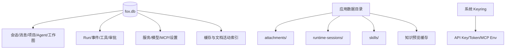
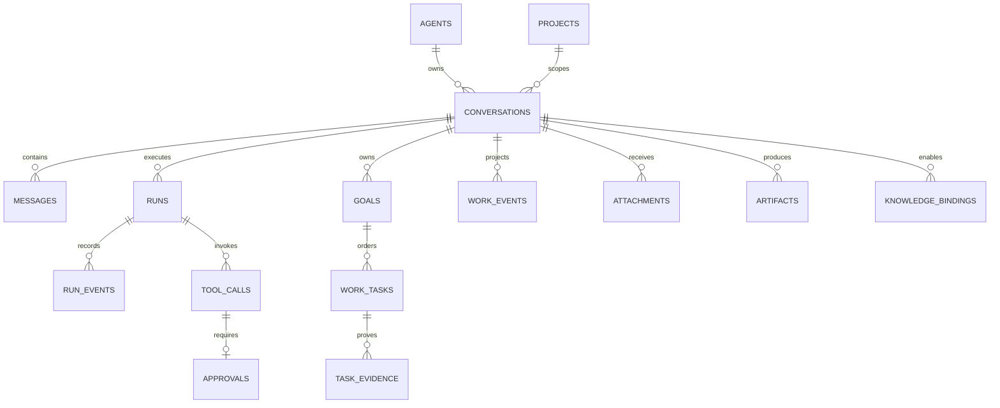

# 数据架构

> 状态：当前实现基线<br>
> 适用版本：Fox 0.1.x<br>
> 维护者：Fox 数据与后端工程师<br>
> 最后更新：2026-07-30

## 原则

1. SQLite 是产品事实源。
2. 密钥与业务记录分离。
3. 大文件存文件系统，数据库保存索引和完整性信息。
4. Runtime 状态可恢复但不取代产品历史。
5. 远程服务 ID 必须通过 Fox 本地 ID 映射，不能让前端猜测。

## 数据分层



## 核心实体关系



完整表字段见 `../04-技术参考/数据库结构.md`。

## 本地文件布局

实际根目录为 Tauri `app_data_dir`，可由 `FOX_DATA_DIR` 覆盖：

```text
<data>/
├─ fox.db
├─ runtime-sessions/
├─ attachments/
├─ skills/
└─ knowledge-preview-cache/（由命令层管理）
```

备份会收集数据库及受管目录；恢复通过待应用目录和回滚副本完成。

## 搜索与大历史

迁移 9 建立 `conversation_fts` 和 `message_fts`，用触发器保持同步。会话加载采用窗口化历史接口，前端可向前分页，避免一次装载全部消息。大 Chunk、路由和组件分包仍在性能待办中。

## 一致性机制

- 外键开启，消息、Run 事件等随会话级联删除。
- Run 事件以 `(run_id, seq)` 唯一，支持重复投递去重。
- Work Event 以 `(conversation_id, sequence)` 唯一；未知类型安全忽略。
- 同一会话最多一个 `active/blocked` Goal，同一 Goal 最多一个 `in_progress` Task。
- Task/Goal 更新带 `version` 乐观锁；completed Task 必须至少有一条 Evidence。
- Runtime Session 以 `(conversation_id, runtime_type)` 唯一。
- 知识绑定以会话、服务连接和知识库组合为主键。
- Provider 模型以 `(provider_id, model_id)` 唯一。
- SQLite 使用 WAL 与 busy timeout。

## 缓存生命周期

知识预览缓存记录 `source_revision`、大小、租约数与最后访问时间。使用中条目不能被 LRU 删除；启动时重置异常退出留下的租约，并删除孤儿文件。容量由 `app_settings` 中的配置控制。

## A0 工作图边界

当前迁移最高为 15。A0 的 `goals/work_tasks/task_evidence` 已落地，`runs/run_events/tool_calls/task_evidence` 已预埋可空 Trace 字段。完整 `run_spans`、PlanRevision、ReviewFinding、Acceptance、Memory 与 Child Run 仍属于后续里程碑；不得将这些延期能力伪装成 A0 数据。

## 失败恢复与验证

- 启动修复中断 Run，并审计由终态 Run 持有的非终态 Task。
- Repository 写入尽量在事务内完成用户消息、Run 和状态投影。
- 备份恢复验证路径、总大小、哈希与数据库可打开性。
- 迁移测试覆盖空库、A0 前旧库升级、幂等与备份恢复；Repository 测试覆盖状态机、Evidence 校验、SQLite busy 有界重试及工作事件归并。

关键代码：`database/migrations.rs`、`database/repositories.rs`、`maintenance.rs`、`runtime-session.mjs`。
