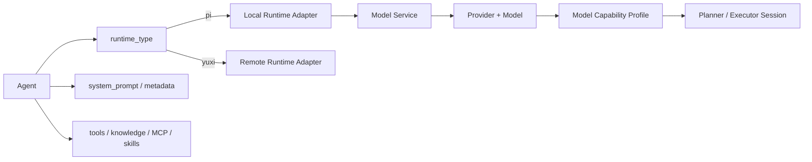

# 专家与模型架构

> 状态：生效  
> 适用版本：Fox `0.1.x`  
> 维护范围：Agent 注册、Runtime 类型、模型供应商、模型能力与初始化  
> 最后更新：2026-08-24

## 目标与范围

本文说明 Fox 如何把产品层“专家”、内部 `Agent`、`Runtime` 和“模型”拆成可组合层次：

- 专家是面向用户的能力包，决定身份、系统提示、资源和执行类型。
- `AgentRecord`、`agent_id` 和 Agent Runtime 是内部兼容名称，不随产品改名迁移。
- Runtime Adapter 决定怎样运行一次对话。
- 模型配置决定本地 Runtime 调用哪个 Provider 和模型能力。

这种拆分使 Fox 通用助手可以使用 Pi Coding Agent，也允许知识库远程助手或未来其他 Runtime 接入，而不复制对话页面和产品数据模型。

## 概念关系



Agent 与 Model 不是一对一：当前默认本地 Agent 使用全局选定模型服务；同一 Provider 可以配置多个模型。远程 Agent 的模型由知识库服务提供，Fox 只允许显式模型 override，不把本地模型服务强加给远端。

## Agent 记录与来源

`agents` 表保存：

- `id`
- `name`、`description`
- `runtime_type`
- `agent_kind`：`assistant | expert | worker`
- `invocation_mode`：`primary | inline | child`
- `visibility`：`chat_selector | expert_center | hidden`
- `system_prompt`
- `default_model`
- 创建与更新时间

返回给前端的 `AgentRecord` 还包含 `icon`、`capabilities`、`resources`、`configurableItems`、`isDefault` 和 `available`。当前部分扩展元数据从 `system_prompt` 的兼容 JSON 结构投影；这属于现有兼容实现，不代表长期推荐把结构化 Agent 配置继续塞入提示词字段。后续演进应迁移到独立字段或版本化配置表。

### 默认本地 Agent

数据库启动时 `seed_default_agent()` 幂等创建：

- ID：`fox-general`
- 名称：`Fox 通用助手`
- Runtime：`pi`
- 默认模型：`configured-model`
- System Prompt：通用桌面助手基础提示

`runtime_initialize` 返回 `defaultAgentId`。前端通过 `resolveConversationAgentId()` 获取 Host 默认值，因此新对话不依赖用户先打开智能体列表，也不会因初始化竞态要求用户手选 Agent。

### 远程 Agent

`yuxi_agents_sync` 从知识库服务同步远程 Agent，并以 `yuxi:<slug>` 作为本地 ID。同步信息包括远端 ID、名称、描述、图标、能力、资源、配置项和远端可用状态。数据库中保留本地 Agent 记录，使会话、搜索、使用统计和详情页面不直接依赖远端列表实时可用。

远程 Agent 的 `available` 同时受以下因素影响：

1. 知识库服务连接状态为 connected。
2. 远端同步结果未标记 unavailable。
3. 本地记录具有有效远端 Agent 映射。

## 专家资源模型

`AgentResourcesRecord` 将资源分为：

| 资源 | 当前来源 | 执行位置 | 权限边界 |
| --- | --- | --- | --- |
| Tools | Runtime Tool Catalog 或远端 Agent 描述 | Runtime/Host/远端 | Host Capability + Approval |
| Knowledges | 远端 Agent scope、Conversation bindings | 知识库服务 | 显式绑定与 Agent scope 交集 |
| MCPs | Fox MCP 配置 | Tauri Host | 启用、发现、审批、超时 |
| Skills | 应用数据目录 Skill 包 | Runtime Prompt | required tools 校验，不授予执行权 |

资源列表用于展示和配置，不是授权本身。即使 Agent 卡片显示某项能力，实际调用仍必须经过 Conversation 项目范围、知识绑定、Runtime Capability Manifest 和 Host Tool Handler。

## 运行时专家能力包

Fox 会在每次本地 Pi Run 启动前分别组装基础 `assistantPackage` 与可选 `expertPackage`。`conversations.agent_id` 只解析基础助手；专家来自当前 active 的 `conversation_expert_bindings`：

| 字段 | 内容 | 作用 |
| --- | --- | --- |
| `id/name` | 专家身份 | 诊断与运行上下文 |
| `runtimeType/defaultModel` | Runtime 和默认模型声明 | 记录专家预期执行环境 |
| `capabilities` | 专家能力描述 | 提示模型可用能力边界 |
| `resources.tools` | 工具清单 | 描述专家所需工具 |
| `resources.knowledges` | 知识资源清单 | 描述专家领域知识来源 |
| `resources.mcps` | MCP 清单 | 描述专家外部连接需求 |
| `resources.skills` | Skill 清单 | 描述专家工作方法 |
| `enabledSkills` | 本次已启用 Skill | 与稳定 System Prompt 中的 Skill 正文对应 |

基础助手 System Prompt 保持稳定前缀；专家 `systemPrompt` 作为受稳定 Fox/Runtime/助手规则约束的 Persona Overlay，随能力包进入低权限的 `<fox_context_block kind="expert_package" authority="runtime">`。`expertBinding` 单独记录绑定 ID、专家 ID、版本与 Package Hash；三者同时进入 Run Request Snapshot。工具和 MCP 范围取 Host、助手与专家声明的交集。

这属于“运行时能力包注入”。E1 已补齐版本化 `.foxexpert` 包；E2 允许 Schema v2 携带持久 Workflow；E3 允许 Schema v3 声明 Supervisor Team，并将 Member 映射为真实 Child Run；E4 允许把冻结专家部署为带项目/知识、配额、调度和签名 Channel 的持久数字同事。详见[专家能力包架构](专家能力包架构.md)、[专家工作流架构](专家工作流架构.md)、[专家团队架构](专家团队架构.md)和[数字同事架构](数字同事架构.md)。

## 专家能力的当前边界

Fox 当前的专家不是纯 Persona：每次 Pi Run 已注入由 System Prompt、Runtime、模型和 Tools/Knowledge/MCP/Skills 组成的运行时能力包，实际权限由 Host 收口。E1-E4 已交付版本包、Workflow、真实 Child Run 专家团队与持久数字同事首版。

- E3 v1 已提供独立上下文的 Lead/Member 串行团队；mailbox 和共享任务领取仍属后续增强；
- E4 v1 已提供冻结版本、项目/知识、Interval Schedule、配额和签名 Channel；Cron、专用 IM Adapter、同事私有 Memory Scope 和热升级仍属增强项。

因此不能把“配置了多个角色提示词”描述成多智能体团队。当前专家分层和 E1-E4 边界以本节及专家能力包、工作流、团队和数字同事架构为准。

## Conversation 与 Agent 绑定

Conversation 创建时固定基础助手 `agent_id`，专家历史写入 `conversation_expert_bindings`。这样能保证：

- 历史消息始终可以解释当时使用的 Agent。
- Host 可根据 Agent Runtime 类型恢复正确执行器。
- 删除或刷新专家列表不会改变基础助手归属；历史卡片优先读取绑定快照。
- 会话搜索、统计和工作记录能按 Agent 聚合。

助手切换始终创建新 Conversation 草稿。专家可在空草稿或无消息、无活动 Run 的持久会话中绑定/移除；已有消息时从专家中心选择会创建新的助手会话草稿，不静默改写旧上下文。

## Runtime 类型与适配边界

| runtime_type | 执行器 | 模型来源 | Session | 事件出口 |
| --- | --- | --- | --- | --- |
| `pi` | Rust `RuntimeHost` + JSONL sidecar | Fox Model Service | 本地 Session JSON | Fox Runtime Event |
| `yuxi` | Rust `YuxiRuntimeHost` | 远端服务模型 | 远端 Thread/Run | 映射为 Fox Runtime Event |

新增类型必须实现：

1. Conversation 创建和删除时的外部资源生命周期。
2. Start、cancel、必要的 resume/rewind 语义。
3. 统一 Runtime Event 映射和单调 `seq`。
4. SQLite Run、Message、Tool、Source、Usage 的持久化投影。
5. 启动恢复和不可恢复失败处理。
6. 能力声明和版本兼容。

不允许新 Runtime 直接向 Workbench 暴露供应商私有事件。

## 模型供应商数据模型

Fox 使用：

- `model_providers`：供应商名称、图标、Base URL、API 类型、默认标记、连接状态和凭据配置状态。
- `provider_models`：模型 ID、显示名、上下文窗口、最大输出、图片能力和默认标记。
- `model_service`：Runtime 当前生效的供应商/模型快照。

API Key 以 Base URL 关联存入系统 Keyring，数据库只记录是否已配置。删除供应商、切换默认模型或清空凭据必须通过 Tauri Command，前端不能读取明文 Key。

### 当前可配置 API

设置 UI 和 Rust Model Service 当前接受：

- `openai-completions`：OpenAI-compatible Chat Completions。
- `anthropic-messages`：Anthropic Messages 兼容接口。

Runtime Profile 内部保留 `openai-responses` 和 `faux` 传输适配能力：`faux` 用于测试；`openai-responses` 尚未由当前设置 UI 和 Host 保存接口开放，不能当作已交付的用户能力。

## Model Capability Profile

本地 Runtime 每次初始化和 Run 开始时解析 Model Profile。结构为：

```text
统一 Harness
  -> API Transport
  -> Provider Family
  -> Model Family
  -> Capability Profile
  -> 少量兼容 Prompt / Pi compat
```

### 自动识别维度

Provider 通过 Base URL 和模型签名识别 MiniMax 国内/国际、OpenAI、Anthropic、DeepSeek、OpenRouter、xAI、阿里云、智谱、Moonshot、Google、本地或通用兼容端点。Model Family 只从 `modelId` 推断 MiniMax、DeepSeek、Claude、OpenAI、Qwen、GLM、Kimi、Gemini、Grok 或 generic，避免把 URL 中的 `/v4` 等版本路径误识别成模型家族。

### Profile 字段

| 分组 | 字段 | 用途 |
| --- | --- | --- |
| 身份 | `id/family/provider/api` | 诊断、传输和兼容选择 |
| 推理 | `reasoning/reasoningTransport/thinkingLevel` | Pi thinking level 和输出隔离 |
| 能力 | image/tools/parallel tools/prompt cache | 输入校验、Prompt 与执行策略 |
| 限额 | contextWindow/maxOutputTokens | 模型请求和上下文管理 |
| Planner | enabled/thinkingLevel/maxOutputTokens | 独立 Planner Session |
| Runtime | retries/delay/reserve/keepRecent | 重试和上下文压缩 |
| compat | developer role、reasoning effort、token field 等 | Provider API 差异 |

显式 `modelProfile` 覆盖优先于自动默认值，用于私有模型或兼容端点的已知差异；覆盖不写入新的数据库事实源。Profile Snapshot 会进入 Runtime `ready` 和 `run.request_snapshot`，便于诊断同一模型实际启用了哪些能力。

## Prompt 分层

Fox 不为每个模型复制完整系统提示词。Prompt Composer 组合：

1. Agent System Prompt。
2. 稳定 Runtime Contract。
3. 少量 Model Compatibility Rules。
4. 低权限动态上下文：项目、权限、Work Snapshot、当前 turn。
5. 可选 Planner Handoff 与 Approval Demo 约束。

稳定前缀单独计算 hash，有利于 Provider Prompt Cache；动态上下文使用 authority 标记，避免项目文件、知识文本或工具输出冒充系统指令。

## Planner 与 Executor

复杂项目执行请求可先进入独立 Planner Session：

- 仅可使用只读项目工具。
- 不能创建 Goal/Task、写文件、运行命令、调用 MCP 或请求审批。
- 输出紧凑 JSON Plan，作为 advisory context 交给 Executor。
- Planner 是否启用、thinking level 和输出上限由 Model Profile 控制。

Executor Session 注册完整 Fox 工具目录，但 Work Tools 通过 Fox Planning Extension 投影到 Host。Planner 输出不能授予权限，也不能成为第二套持久化 Plan。

## 模型切换与配置重载

保存默认模型时，Host 调用 `RuntimeHost.reload_configuration()`：

1. 若有 active Run，拒绝修改并返回 `model.runtime_busy`。
2. 停止当前 Worker。
3. 清空已握手的 Runtime 能力和版本。
4. 下一次 Run 使用新模型配置重新初始化 sidecar。

Conversation 可在 `run_start` 中传入模型 override；最终模型 ID记录在 Run 中。当前 Capability Manifest 的 `dynamicModelSwitch` 为 false，表示正在运行的 Session 不能无重启热切换模型。

## Provider 推理与输出兼容

Provider 可能通过原生 thinking block、`reasoning_content`、混合文本标签或普通文本返回推理。Fox 的处理顺序：

1. 优先原生 reasoning channel。
2. Event Mapper 将 Provider 事件统一映射为 `reasoning.delta`。
3. 对 MiniMax/GLM/Kimi 等 mixed-text 模型添加“不把私有推理放入最终回答”的兼容规则。
4. 对历史中泄漏的强特征规划文本进行保守净化。
5. 普通解释文字不得仅因出现“让我解释”之类词语被错误隐藏。

启发式拆分只是兼容措施，必须由 Provider 专项测试保护，不能声称可以可靠重建隐藏思维。

## 缓存、Usage 与诊断

Provider usage 映射为 input/output/cacheRead/cacheWrite/total tokens。缓存命中率使用：

```text
cacheRead / (input + cacheRead)
```

Profile 只声明 Provider 是否预期支持 Prompt Cache，实际统计以 Provider 返回 usage 为准。Fox 不虚构工具目录独立缓存命中率。对话摘要和设置使用统计读取 SQLite 中最新 Run usage。

## 失败与降级

| 场景 | 行为 |
| --- | --- |
| 默认 Agent 未加载 | Host 初始化返回默认 ID，前端重试初始化 |
| 远程 Agent 未同步/不可用 | 卡片显示不可用，创建会话失败并保留本地数据一致性 |
| 模型配置缺失 | Runtime 不可用，Run 返回配置错误 |
| API 类型未知 | Host 保存时拒绝；Runtime 未知类型保守回落但不应由 UI产生 |
| 模型家族未知 | 使用 generic Profile，默认关闭推理特性 |
| 图片能力关闭 | Run 创建前拒绝图片输入 |
| Provider 不支持并行工具 | Profile Prompt 要求串行调用 |
| Planner 失败 | 发出 `planner.failed`，Executor-only 降级 |
| Runtime 崩溃 | SQLite 保留 Run/Event，Host 执行有限恢复 |

## 测试与验收

- `services/agent-runtime/test/model-profile.test.mjs`：模型/Provider 矩阵与覆盖。
- `services/agent-runtime/test/pi-runtime.test.mjs`：真实 Pi 循环、Planner、reasoning transport。
- `services/agent-runtime/test/offline-evals.test.mjs`：跨模型、工具、注入与意图评测。
- `apps/desktop/tests/agent-initialization.test.ts`：默认 Agent 初始化竞态。
- Rust Repository 测试：默认 Agent、远程同步、可用状态、模型配置与 override。

新增 Provider 至少要验证连接、普通回答、reasoning、工具调用、图片能力、重试、压缩、取消、usage 和 sidecar 打包。

## 关键代码

- `apps/desktop/src/features/agents/`
- `apps/desktop/src/features/settings/use-model-providers.ts`
- `apps/desktop/src-tauri/src/database/repositories.rs`
- `apps/desktop/src-tauri/src/model_service.rs`
- `apps/desktop/src-tauri/src/commands/mod.rs`
- `services/agent-runtime/src/model-profile.mjs`
- `services/agent-runtime/src/prompt-composer.mjs`
- `services/agent-runtime/src/planner-runtime.mjs`
- `services/agent-runtime/src/pi-runtime.mjs`

## 关联文档

- [对话系统架构](对话系统架构.md)
- [Agent 运行时架构](Agent运行时架构.md)
- [扩展系统架构](扩展系统架构.md)
- [智能体体验](../03-产品与前端/智能体体验.md)
- [配置参考](../04-技术参考/配置参考.md)
- [Fox 能力矩阵](../01-项目概览/能力矩阵.md)
- [Agent 能力测试基准](../05-开发指南/Agent能力测试基准.md)
