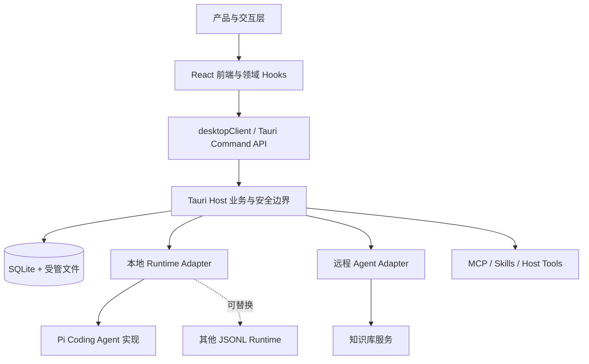

# 架构文档导航

> 状态：生效  
> 适用版本：Fox `0.1.x`  
> 维护范围：`docs/02-架构` 与跨域技术文档  
> 最后更新：2026-08-06

## 目标与读者

本文是 Fox 技术架构的入口，帮助产品、前端、Tauri、Runtime、知识库和测试工程师快速找到某项能力的职责边界、数据流、接口事实源和验证方法。这里不重复维护字段级协议，而是说明每篇文档回答什么问题，以及改代码时需要同步哪些文档。

## 架构分层

稳定边界是 `前端 -> Tauri Command -> Host/Repository -> Runtime Adapter`。Pi 是当前本地 Runtime 的实现，不是对话产品层的唯一实现；知识库远程智能体使用另一适配器，但复用相同的会话、消息、Run、事件和前端展示模型。

## 文档分组

### 系统与进程

| 文档 | 回答的问题 | 主要事实源 |
| --- | --- | --- |
| [总体架构](总体架构.md) | Fox 有哪些进程、服务和存储，它们如何协作 | `lib.rs`、`App.tsx`、各 Host |
| [Tauri 后端架构](Tauri后端架构.md) | Command、Repository、共享状态和系统能力如何组织 | `src-tauri/src` |
| [数据架构](数据架构.md) | 哪些数据由 SQLite、Keyring、受管文件或远端持有 | migrations、repositories |
| [安全架构](安全架构.md) | 不可信内容、权限、凭据和文件的信任边界 | tool guard/host、maintenance |

### 对话、智能体与 Runtime

| 文档 | 回答的问题 | 主要事实源 |
| --- | --- | --- |
| [对话系统架构](对话系统架构.md) | 从输入到消息落库、Runtime 路由、流式展示和恢复的完整链路 | conversations、commands、repositories |
| [智能体与模型架构](智能体与模型架构.md) | Agent 注册、默认助手、远程助手、模型供应商与 Profile 如何组合 | agents、model service、model profile |
| [Agent 运行时架构](Agent运行时架构.md) | JSONL Adapter、Pi Session、Planner、Prompt、工具和事件如何工作 | runtime_host、agent-runtime |
| [扩展系统架构](扩展系统架构.md) | Skills、MCP、内建工具及未来扩展如何接入 | skills、mcp、runtime contract |

### 项目、知识与执行边界

| 文档 | 回答的问题 | 主要事实源 |
| --- | --- | --- |
| [项目与权限架构](项目与权限架构.md) | 项目授权、路径校验、权限模式和审批怎样限制 Agent | projects、tool guard、approvals |
| [知识库集成架构](知识库集成架构.md) | 服务连接、知识绑定、检索、预览、图谱和远程 Run 如何集成 | yuxi、knowledge feature |
| [可观测性与测试架构](可观测性与测试架构.md) | Run Event、Work Event、诊断、评测和测试分层如何关联 | reducers、diagnostics、tests/evals |

## 架构文档与技术参考的边界

架构文档描述职责、依赖方向、数据流和约束。字段、枚举、命令清单和错误码由 `04-技术参考` 维护：

| 需要查找 | 权威文档 |
| --- | --- |
| JSONL Envelope、Runtime 请求、事件和工具 | [Runtime 协议](../04-技术参考/Runtime协议.md) |
| Tauri Command 与窗口事件 | [Tauri 命令与事件](../04-技术参考/Tauri命令与事件.md) |
| SQLite 表、索引、状态字段 | [数据库结构](../04-技术参考/数据库结构.md) |
| 权限模式、工具审批、默认拒绝 | [权限参考](../04-技术参考/权限参考.md) |
| 模型、知识库、MCP 与环境变量 | [配置参考](../04-技术参考/配置参考.md) |
| 错误族和 Run 状态 | [错误与状态](../04-技术参考/错误与状态.md) |
| 知识库 API 与原文件 Range | [知识库服务接口](../04-技术参考/知识库服务接口.md)、[原文件网关契约](../04-技术参考/知识库原文件网关契约.md) |

路线图只描述尚未完成的能力，不能作为当前实现依据。A1-A6 状态统一见 [Agent 能力实施方案](../07-路线图/Agent能力实施方案.md) 与 [已知限制](../07-路线图/已知限制.md)。

## 按变更类型查阅

| 变更类型 | 必读架构 | 同步参考 | 重点测试 |
| --- | --- | --- | --- |
| 消息发送、编辑、取消、恢复 | 对话系统 | Tauri 命令、错误与状态 | reducer、repository、run command |
| 新增 Runtime 或 Provider | 智能体与模型、Agent Runtime | Runtime 协议、配置 | adapter contract、model matrix、sidecar smoke |
| 新增 Agent 类型 | 智能体与模型、对话系统 | 数据库、Tauri 命令 | agent routing、create conversation、recovery |
| 新增 Runtime 工具 | Agent Runtime、项目与权限、安全 | Runtime 协议、权限 | catalog parity、preflight/approval、Host handler |
| 新增知识能力或预览格式 | 知识库集成 | 服务接口、原文件网关 | preview contract、range/cache、source mapping |
| 新增项目文件操作 | 项目与权限、安全 | 权限参考 | traversal、canonical path、approval |
| 数据库迁移 | 数据架构、Tauri 后端 | 数据库结构 | fresh install、upgrade、rollback、restore |
| 流式 UI 或工作过程 | 对话系统、可观测性 | Runtime 协议、错误状态 | queue/reducer、late/duplicate event |
| Skills/MCP | 扩展系统、安全 | 配置、权限 | schema、timeout、unknown tool、credential |

## 依赖方向规则

1. React 组件通过领域 Hook 和 `desktopClient` 调用能力，不直接拼装 SQL、访问 Keyring 或启动进程。
2. Tauri Command 负责输入校验、路由和错误转换；持久化规则进入 Repository，长生命周期进程进入 Host 服务。
3. Runtime 通过版本化协议提交事件与工具请求，不能直接访问 SQLite 或自行扩大项目/知识权限。
4. SQLite 是 Fox 产品状态唯一事实源；Runtime Session、远端 Thread 和前端 React State 都是可恢复投影。
5. Provider 差异收敛到 Runtime Adapter 和 Model Capability Profile，不扩散到消息 UI。
6. 外部内容默认不可信；Prompt 规则用于纵深防御，真正的权限必须由 Host 强制执行。

## 当前实现与规划的标记

- “生效”“当前实现基线”表示已经和源码、测试核对。
- “规划”“候选”“A1-A6”表示尚未完成，不得在产品或接口中假设存在。
- 同一事实只设一个权威文档；其他文档使用链接和摘要，不复制字段全集。
- 代码与文档冲突时，先用测试和事实源确认预期，再同时修复实现与文档。

## 文档维护检查表

1. 新能力是否明确归属于前端、Host、Repository、Runtime 或外部服务。
2. 是否说明本地 Pi、其他本地 Runtime 和远程 Agent 的兼容边界。
3. 是否标出事实源文件、协议、状态和恢复方式。
4. 是否覆盖正常流、取消、失败、重启、重复事件和版本兼容。
5. 是否同步更新本导航、根索引和对应技术参考。
6. 是否有自动化测试或明确的人工验收步骤。

