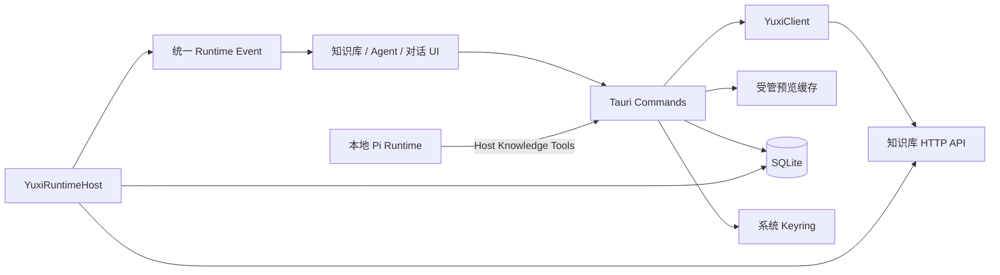
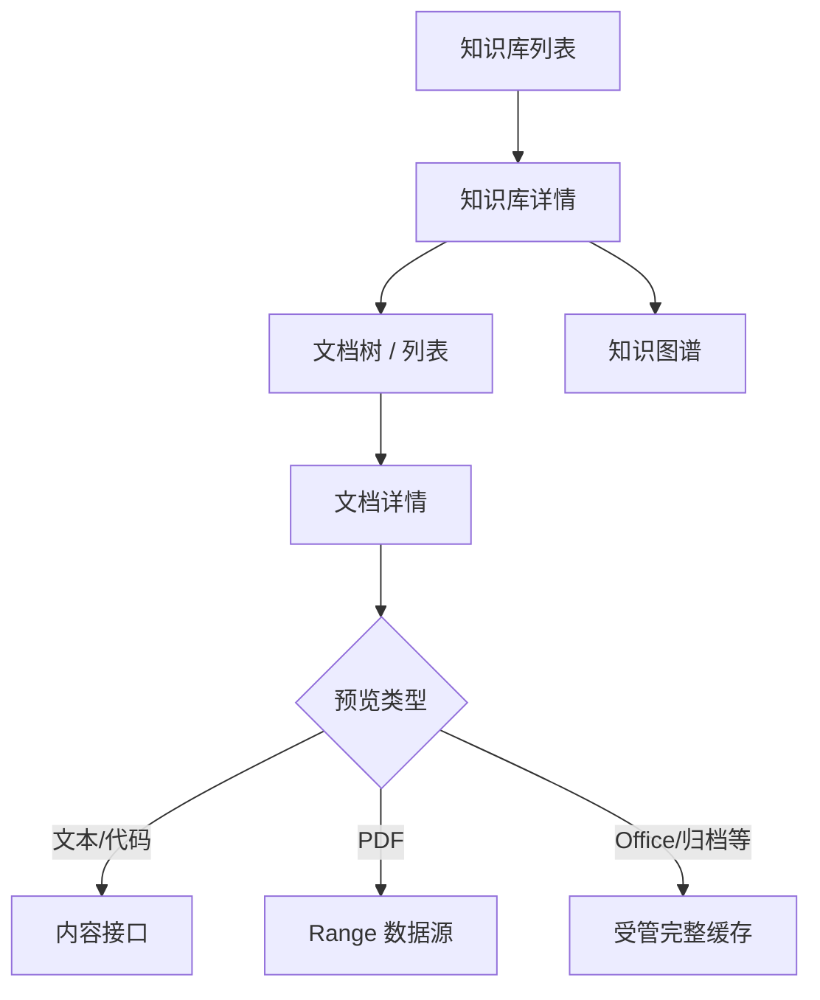
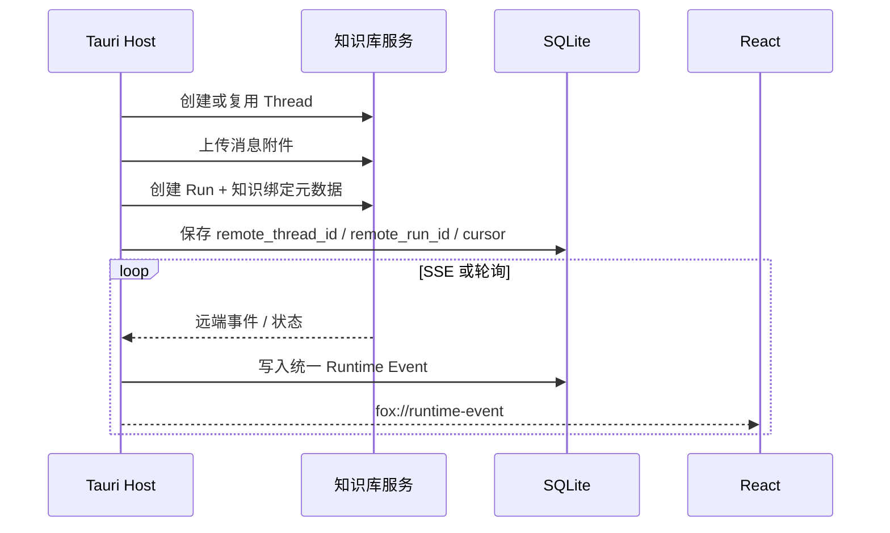

# 知识库集成架构

> 状态：生效<br>
> 适用版本：Fox 0.1.x<br>
> 维护范围：`apps/desktop/src-tauri/src/yuxi`、`features/knowledge`、知识工具与远程 Agent<br>
> 最后更新：2026-08-06

## 目标与边界

Fox 将知识库服务作为外部内容、检索、图谱和远程 Agent 能力源。产品界面统一称“知识库服务”，代码为兼容现有接口保留 `yuxi` 模块名。

核心边界：

- Fox SQLite 保存连接元数据、会话绑定、阅读状态和本地缓存索引，不复制远端知识库全部数据。
- Access Token 保存于系统 Keyring，不进入 SQLite、日志、Prompt 或诊断导出。
- 知识库必须显式绑定到会话，并受所选 Agent 的知识范围约束。
- 本地 Pi Runtime 和远程 Yuxi Runtime 最终都产生统一的 `source.added` 和对话事件。
- 原文件预览通过 Host 代理和受管缓存完成，前端不能直接携带 Token 请求远端服务。
- Fox 不读取远端 MinIO 凭据，也不依赖远端数据库结构。

## 组件全景



模块职责：

| 模块 | 负责 | 不负责 |
| --- | --- | --- |
| `YuxiClient` | HTTP、认证 Header、URL 规范化、接口响应映射 | 产品状态、页面渲染 |
| `YuxiRuntimeHost` | 远端 Thread/Run、SSE/轮询、恢复、事件映射 | 本地 Pi Session |
| Tauri Commands | 参数校验、Token 获取、下载/缓存/阅读活动编排 | 直接展示 UI |
| `features/knowledge` | 列表、详情、预览器、图谱、下载交互 | 保存凭据、绕过 Host 请求原文件 |
| SQLite | 绑定、阅读活动、缓存索引、远端游标 | 远端文档正文事实源 |

## 服务连接与身份

### 配置

知识库服务连接由 `yuxi_service` 和通用 `service_connections` 表达。连接配置包含服务标识、规范化 Base URL、显示信息和同步状态；密钥材料单独进入 Keyring。

Base URL 在 Host 中完成校验和规范化：

- 只接受有效 HTTP/HTTPS URL；
- 路径拼接由 Client 完成，前端不构造私有端点；
- 错误响应转换为稳定的 Fox 错误码和可重试性；
- 诊断不得回显 Authorization、Cookie 或原始 Token。

### 登录和连接测试

连接流程包括：

1. 用户填写服务地址和登录信息。
2. Host 调用服务登录接口或验证已有 Token。
3. Token 写入系统 Keyring，SQLite 仅记录连接存在和账户摘要。
4. Host 获取当前用户、健康状态和版本，返回设置界面。
5. 后续请求临时从 Keyring 取 Token，构造 Bearer Header。

Token 失效时，知识库和远程 Agent 显示重新登录状态；本地项目对话和不依赖知识库的功能仍应可用。

## 远程 Agent 与模型同步

Fox 从知识库服务同步可用 Agent，并投影为本地 `Agent`：

- 本地 ID 使用稳定命名空间，例如 `yuxi:<remote-slug>`；
- `runtime_type` 为 `yuxi`；
- 记录远端 Agent 标识、显示名称、说明、模型和知识范围；
- 同步更新不应删除历史对话引用的 Agent 身份；
- 远端暂时不可达时保留本地快照，并明确显示离线或过期状态。

模型列表用于远程 Agent 展示和选择，不与本地 `model_service` 混为一张配置。远端模型凭据由知识库服务管理，Fox 不接触其 Provider Key。

## 会话知识绑定

### 显式绑定

`knowledge_bindings` 是会话级能力授权。用户在对话框添加知识库后，Host 持久化：

- Conversation ID；
- Service Connection ID；
- Knowledge Base ID 和名称；
- 是否启用。

模型不能仅根据知识库名称自行扩大范围。删除绑定后，后续 Run 不得继续检索该知识库；历史引用仍保留用于审计和跳转。

### Agent 范围交集

有效知识范围是两者交集：

```text
有效范围 = 会话中已启用的知识库 ∩ 当前 Agent 允许的知识库
```

若远程 Agent 声明了知识范围，而会话绑定包含范围外知识库，Host 在创建 Run 前拒绝并提示用户修正。未声明 Agent 范围时仍以会话显式绑定为上限。

### 两条执行路径

| Runtime | 绑定如何生效 |
| --- | --- |
| 本地 Pi | Host Knowledge Tool 每次查询前读取 Conversation 绑定并校验范围 |
| 远程 Yuxi | 创建 Run 时写入 `meta.knowledge_base_ids`、`meta.knowledge_bases` 和查询提及信息 |

绑定数据属于 Host 上下文，不是用户 Prompt 授权。Prompt Injection 不能修改该交集。

## 本地 Runtime 知识工具

当前 Host 工具：

| 工具 | 用途 | 约束 |
| --- | --- | --- |
| `list_knowledge_bases` | 列出当前会话可用知识库 | 只返回绑定交集 |
| `search_knowledge` | 检索相关文档或 Chunk | 限制查询、数量和返回文本 |
| `read_knowledge_document` | 读取指定文档内容 | 文档必须属于允许知识库 |
| `query_knowledge_graph` | 查询有限子图 | 限制深度、节点和文本大小 |

Runtime 通过 `tool.execute` 请求 Host；Runtime Tool Catalog 中的 `approval: none` 只表示不弹本地危险操作审批，不表示可越过知识绑定。

Host 对返回 Runtime 的知识文本设总大小和预览大小上限，避免超大文档耗尽 Context。模型要进一步读取时应使用文档标识进行受控分页或精确读取。

## 引用与来源

本地知识工具结果和远程 Agent 输出都映射为 `source.added`。一个知识来源应尽量包含：

- Knowledge Base ID/名称；
- Document ID/标题；
- Chunk ID；
- 页码、Anchor 或内容定位；
- 服务来源和可导航元数据。

前端把来源显示为对话引用，并可跳转知识库详情或指定文档。来源记录用于证明回答依据，不替代原文；不应把大段 Chunk 正文永久复制进消息元数据。

远端输出结构不稳定时，映射器允许兼容多个来源字段，但生成的 Fox Event 必须保持统一形状。缺少可导航字段时仍可显示来源标题，同时标记无法精确定位。

## 知识库浏览

页面数据流：



`YuxiClient` 提供知识库列表、详情、文档树、文档详情和内容映射。前端不依赖服务原始树结构，而使用 Fox 的 `KnowledgeDocumentRecord` 等稳定类型。

## 原文件网关

Fox 预览二进制原文件依赖知识库服务提供稳定网关：

1. `HEAD` 返回文件大小、媒体类型、文件名、Range 能力和 `X-Source-Revision`。
2. `GET` 配合 `Range: bytes=start-end` 返回严格 `206` 和正确 `Content-Range`。
3. Fox 使用 `If-Range: <source revision>` 防止文件更新后拼接新旧字节。
4. 下载完整文件时仍通过 Host 流式写入，不把 Token 暴露给 WebView。

Revision 优先使用服务端不可变版本标识；若由 ETag 或 Last-Modified 派生，服务必须保证同一 revision 对应同一字节序列。缺少 revision、长度或错误 Range 响应时，Host 应拒绝按需预览。

正式契约见[知识库原文件网关契约](../04-技术参考/知识库原文件网关契约.md)。旧的服务端 Office `/preview/jobs` 转换方案已退役，不应重新引入。

## 预览数据源选择

`knowledge-preview-model.ts` 根据扩展名选择 Preview Kind 和 Source Strategy：

| 类型 | 当前查看器 | 数据策略 |
| --- | --- | --- |
| PDF | PDF.js | Range 优先，按页和搜索读取 |
| DOCX | `docx-preview` | 获取受管缓存后本地渲染 |
| XLS/XLSX | `@js-preview/excel` | 获取受管缓存后本地渲染 |
| PPT/PPTX | 本地 PPTX Viewer | 获取受管缓存后本地渲染 |
| 文本/代码 | 文本内容或二进制解码 | 限长展示、可搜索 |
| 图片/音视频 | WebView 原生能力或受控 Blob | 按媒体类型展示 |
| 压缩包 | 只读目录/元数据能力 | 不自动执行包内文件 |
| 未知类型 | 下载原文件 | 不尝试不安全解析 |

前端 Viewer 必须支持 AbortSignal 或卸载清理。切换文档、关闭页面或取消下载后，不得继续更新已销毁组件。

## 预览缓存

### Cache Key 与原子写入

缓存键至少包含 Knowledge Base ID、Document ID、Source Revision 和 Variant。Revision 变化会生成新键，避免旧内容覆盖新版本。

下载使用临时 `.part` 文件，完成并校验后原子移动为正式缓存文件。受管路径只允许位于预览缓存目录，并清理不安全扩展名；数据库路径不能让删除操作逃逸到缓存目录外。

### Lease

Viewer 获取完整缓存时创建 Lease：

1. `cache_acquire` 查找或下载缓存并增加 `lease_count`；
2. 使用期间更新 `last_accessed_at`；
3. Viewer 卸载调用 `cache_release`；
4. LRU 只淘汰 `lease_count = 0` 的条目；
5. App 异常退出后，启动阶段把遗留 Lease 重置为 0。

Lease 防止正在渲染的 Office 文件被缓存清理删除。释放次数不能让计数小于 0。

### 容量和清理

设置页可以读取缓存统计、设置容量上限和清理未使用缓存。SQLite 保存大小、活跃 Lease、创建和最后访问时间；真实字节保存在文件系统。

LRU 清理必须同时满足：超出配置上限、条目无 Lease、路径属于受管目录。数据库孤儿和文件系统孤儿由维护任务分别处理。

## 阅读状态、书签和批注

Fox 在本地保存用户阅读活动，不要求远端服务支持：

- Reading State：页码、缩放、滚动或 Viewer 位置；
- Bookmark：页码和用户标签；
- Annotation：当前支持 `note` 和 `highlight` 类型的数据模型；
- Source Revision：创建活动时对应的原文件版本。

阅读活动按 Knowledge Base ID + Document ID 隔离。若当前文档 Revision 与记录不同，前端将书签/批注标记为过期并禁止直接跳转，避免用户落到错误位置。删除文档活动只影响本地记录，不修改远端文档。

## 下载与外部打开

- 下载目录由 Fox 管理并通过 Host 写入。
- 下载支持进度、取消、临时文件清理和安全文件名。
- “打开文件”只允许已完整下载、存在且位于受管目录的文件。
- 缓存文件与用户下载文件语义不同；缓存可被 LRU 删除，下载文件按用户操作管理。
- WebView 不直接调用 `file://` 或拼接系统命令打开任意路径。

## 知识图谱

Host 代理 Subgraph、Labels 和 Stats 端点，前端使用 AntV G6 展示。图查询必须设置：

- Knowledge Base 范围；
- 查询关键词或中心节点；
- 最大深度；
- 最大节点/边数量；
- 返回属性白名单或大小限制。

前端把服务返回的不同字段归一为 Node、Edge、Label 和 Stats。节点可从属性或关系中解析 Document ID，并跳转来源文档。图谱为空、服务不支持、认证失败和网络失败是不同状态，不应统一显示成“没有数据”。

图谱不可用时，知识列表、文档预览和普通检索仍应工作。

## 远程 Agent Runtime

### Thread 和 Run



`YuxiRuntimeHost` 负责：

- 在会话创建或首轮运行时建立远端 Thread；
- 上传 Fox 附件并取得远端引用；
- 校验知识范围并创建 Run；
- 优先消费 SSE，限制单帧大小；
- 将消息、步骤、来源、用量和错误转换为 Fox 事件；
- 保存远端 Run 标识和恢复游标；
- 在远端要求用户回答时创建本地 Question 状态，并通过 Resume Run 继续。

### SSE、轮询与恢复

SSE 是实时路径，轮询是状态确认和降级路径。Host 不应仅凭 SSE 断开就判定 Run 失败：

1. 查询远端 Run 当前状态；
2. 拉取遗漏事件或输出；
3. 按已保存游标去重；
4. 若已终态则补齐本地终态；
5. 若仍运行则恢复监听；
6. 无法确认时写入可重试错误，不能永久停留在“处理中”。

应用启动时会扫描可恢复的远程 Run。Conversation 不存在或已删除时，应取消恢复并清理关联状态，避免完成回复后追加“对话线程不存在”。

### 用户补充

远端 Agent 需要澄清时，Fox 把问题持久化并显示统一决策卡片。用户回答后，Host 创建 Resume Run，并关联父 Remote Run ID。普通聊天文字不能被误当作问题回答；只有对应卡片提交进入 Resume 路径。

## 故障与降级矩阵

| 故障 | 用户表现 | 系统行为 |
| --- | --- | --- |
| 未登录/Token 过期 | 提示重新连接 | 不影响纯本地助手 |
| Agent 同步失败 | 显示上次快照和过期状态 | 不删除历史 Agent/Conversation |
| Range 不支持 | 提示下载或完整缓存 | 大文件不静默全量读取 |
| Revision 改变 | 重新建立数据源 | 旧缓存进入 LRU，阅读位置标过期 |
| 缓存下载取消 | 预览停止 | 删除 `.part`，释放 Pending 状态 |
| 图谱端点不可用 | 显示能力不可用 | 文档与检索继续工作 |
| SSE 中断 | 短暂重连状态 | 查询远端状态并恢复游标 |
| 远端 Run 丢失 | 明确失败/可重试 | 本地 Run 收敛到终态 |
| 本地对话已删除 | 不再写 UI | 停止恢复并清理映射 |

## 安全要求

- Token 只存在于 Keyring 和短生命周期请求 Header。
- 知识内容、文件名、图节点和远端 Agent 输出均视为不可信数据。
- 原文件路径、下载路径和缓存路径必须规范化并限制在受管目录。
- 预览器不得执行 Office 宏、压缩包脚本或文档内命令。
- 远端返回的 HTML/Markdown 必须经过现有渲染安全策略。
- 知识工具必须再次校验会话绑定，不能信任 Runtime 传入的知识库 ID。
- 诊断导出仅保留标识摘要和状态，不包含 Token 或大段知识正文。

## 性能策略

- PDF 使用 Range，避免首屏下载整文件。
- Office 文件使用一次缓存和本地渲染，复用 Lease。
- 文档列表和图谱限制请求规模，取消过期请求。
- Runtime 知识结果限制字节数和返回条数。
- 缓存按 Revision 复用，使用 LRU 控制磁盘占用。
- SSE 单帧设大小上限，事件按游标去重。

性能优化不得破坏 Revision 一致性或知识范围检查。

## 测试与验收

| 范围 | 自动化/手工验证 |
| --- | --- |
| URL、认证和响应映射 | `apps/desktop/src-tauri/src/yuxi/mod.rs` 单元测试 |
| HEAD/Range 网关 | `pnpm.cmd knowledge:verify-preview:test`，可选真实服务契约 |
| 缓存键、路径、Lease、LRU | Rust Repository/Command 测试 |
| 预览策略、Range 和活动模型 | `apps/desktop/tests/knowledge-*`、`document-activity.test.ts` |
| 远程 Run/SSE/恢复 | `yuxi/runtime.rs` 测试 + 开发环境断网/重启验收 |
| 本地知识工具 | Runtime Contract + Rust Host 工具测试 |
| 来源跳转 | 对话引用到知识文档的人工回归 |

真实服务验收至少覆盖：登录、Agent 同步、绑定一个/多个知识库、本地检索、远程回答、引用跳转、PDF Range、DOCX/XLSX/PPTX、下载取消、缓存清理、SSE 断开恢复和 Token 过期。

## 已知限制

- 产品当前只实现一个知识库服务适配器；通用 Provider SPI 尚未抽取。
- Office 预览以客户端渲染为主，复杂版式可能与原应用不同。
- 批注数据模型支持 highlight，但 Viewer 的完整跨格式选区能力仍需逐格式完善。
- 知识图谱字段兼容依赖服务响应映射，服务升级需要契约回归。
- 远程 Thread 与 Fox Conversation 不是同一事实源，异常恢复依赖稳定的远端 ID 和状态接口。

## 相关代码与文档

- `apps/desktop/src-tauri/src/yuxi/mod.rs`
- `apps/desktop/src-tauri/src/yuxi/runtime.rs`
- `apps/desktop/src/features/knowledge/`
- `services/agent-runtime/src/host-tools.mjs`
- `scripts/verify-knowledge-preview-contract.mjs`
- [对话系统架构](对话系统架构.md)
- [智能体与模型架构](智能体与模型架构.md)
- [项目与权限架构](项目与权限架构.md)
- [知识库服务接口](../04-技术参考/知识库服务接口.md)
- [知识库原文件网关契约](../04-技术参考/知识库原文件网关契约.md)
