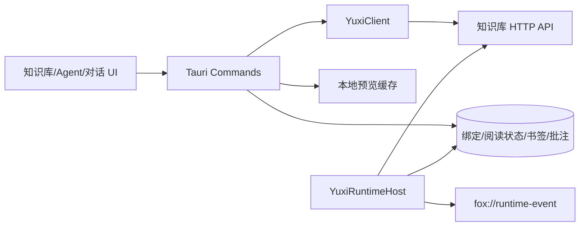
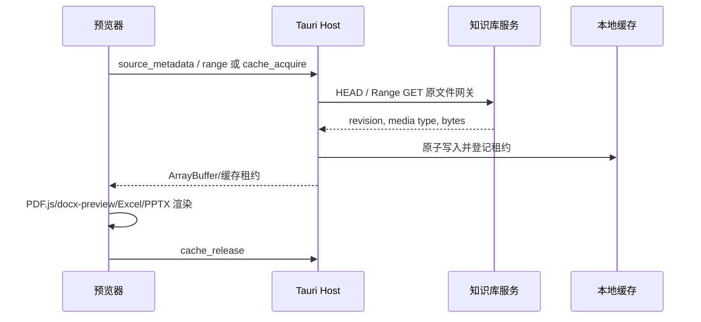

# 知识库集成架构

> 状态：当前实现基线 
> 适用版本：Fox 0.1.x 
> 维护者：Fox 知识库集成团队 
> 最后更新：2026-07-29

## 边界

Fox 将 Yuxi 作为外部“知识库服务”。产品文案不强调供应商名称，但代码保留 `yuxi` 模块以维持兼容。Fox 不直接读取 MinIO 凭据，也不把远端数据库当作本地事实源。

## 集成面

## 身份与连接

服务配置保存在 `yuxi_service` 和 `service_connections`，Token 保存于系统 Keyring。Base URL 会规范化并拒绝无效地址；测试连接读取健康信息和版本。登录、当前用户、Agent 同步与模型列表均经 Host 代理。

## 知识绑定

知识库必须显式绑定到会话。`knowledge_bindings` 决定本地知识工具可查询的范围，也会写入远程 Run 的 `meta.knowledge_base_ids` 和 `meta.knowledge_bases`。这可防止模型随意访问未启用知识库。

## 文件预览链路

PDF 支持 Range 数据源；Office 预览使用成熟前端库。原“服务端版式转换”已退役，不应重新依赖 `/preview/jobs`。

## 知识工具

本地 Pi Agent 通过 Host 调用：`list_knowledge_bases`、`search_knowledge`、`read_knowledge_document`、`query_knowledge_graph`。检索结果映射为 `source.added`，引用包含知识库、文档、chunk、页码和 anchor；Fox 可跳转到文档页，当前不要求显示 chunk 正文。

## 远程 Agent

远程路径创建/复用 Thread，上传附件，创建 Run，轮询 Run 和事件，并转换为 Fox 的统一 Runtime 事件。异常退出后会尝试恢复 pending Run。用户补充交互通过 resume Run 继续。

## 知识图谱

Host 代理 `subgraph/labels/stats`；前端使用 AntV G6。查询必须限制深度和节点数，避免大图拖垮 WebView。空图与服务不支持需显示可区分状态。

## 失败与降级

- 未登录/Token 失效：提示知识库登录，不影响本地助手。
- 原文件网关不支持 Range：可回退完整缓存，但大文件需提示成本。
- 远端 Run 事件暂缺：轮询状态和数据库快照恢复。
- revision 改变：生成新缓存键，旧缓存进入 LRU。
- 图谱端点不可用：知识列表和文档预览仍可工作。

## 后端契约要求

原文件接口需要 HEAD、Range、`Accept-Ranges`、稳定 revision（优先 versionId，其次 ETag/lastModified 的明确规则）、正确文件名和媒体类型。Fox 端不需要远端 Office 转换服务。

## 测试与代码

`yuxi/mod.rs` 含 URL、Header、Range、绑定元数据和可选 Live Test；`scripts/verify-knowledge-preview-contract.mjs` 验证预览契约。前端实现位于 `features/knowledge/`。
