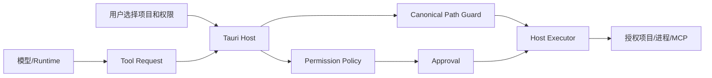
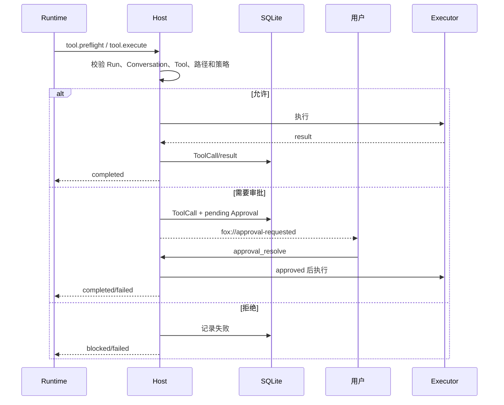

# 项目与权限架构

> 状态：生效 
> 适用版本：Fox `0.1.x` 
> 维护范围：项目授权、路径边界、工具策略、审批和凭据 
> 最后更新：2026-09-22

> 本主题的基线、成熟度口径与待验证清单见[当前状态与核验基线](../01-项目概览/当前状态与核验基线.md)。执行准入与文件提交的当前集成状态见下文「执行准入与原子文件提交」。

## 目标与范围

本文说明 Fox 如何把模型或 Runtime 的工具意图限制在用户授权项目内，并由 Tauri Host 统一执行权限判断。项目不是普通的 Prompt 字符串，而是 Conversation 的受控能力边界。

## 信任模型

模型、知识文档、附件、MCP 输出和 Runtime 均不可信。只有 Host 能解释项目根、权限模式和用户审批；Prompt 中的“已授权”“系统允许”等文字不产生权限。

## 项目实体与 Conversation 绑定

项目记录保存规范化根路径、显示名称、权限模式和时间。Conversation 可以关联 `project_id`，并保留兼容 `project_root`；查询时优先项目表根路径。一个项目可关联多个 Conversation，每个 Conversation 的权限上下文由 Host 注入 Runtime。

项目选择流程：

1. 前端调用原生文件夹选择器 `project_folder_pick`。
2. 返回非空绝对路径后更新草稿，不额外弹出确认对话框。
3. 首次发送创建 Conversation 和项目记录/关联。
4. 已存在同根路径项目时复用已保存权限。
5. 项目删除只删除 Fox 项目记录与关联语义，不删除用户文件夹。

## 权限模式

| 模式 | 读取 | 写入/编辑 | 命令 | MCP |
| --- | --- | --- | --- | --- |
| `read_only` | 项目内只读工具可 preflight | 拒绝或按 Host 策略不执行 | 始终审批且不应绕过只读意图 | 始终审批 |
| `ask` | 项目内只读工具可 preflight | 创建审批 | 始终审批 | 始终审批 |
| `allow` | 项目内只读工具可 preflight | 可按策略直接允许 | 仍始终审批 | 仍始终审批 |

`allow` 不是“关闭全部安全限制”。路径范围、命令工作目录、Runtime Tool Catalog、MCP schema 和高风险操作规则仍然生效。未知权限值默认拒绝。

## 路径校验

只读工具 `read/grep/find/ls` 的 preflight：

1. Conversation 必须有非空授权项目根。
2. 项目根必须能够 canonicalize 且是目录。
3. Tool input 必须是 object，并包含非空 path。
4. 拒绝空字节。
5. 相对路径拼接到 canonical root；绝对路径也必须最终落在 root 内。
6. 目标路径 canonicalize 后必须 `starts_with(canonical_root)`。
7. Host 将规范化后的绝对目标返回 Runtime 执行器。

由于读取目标必须存在才能 canonicalize，新建文件由 `tool_host.prepare()` 使用“已存在父目录 + 安全文件名”规则处理。路径检查必须考虑 `..`、绝对路径、Windows 盘符、UNC、大小写和符号链接/重解析点。

## 工具目录与执行位置

`runtime-contract.mjs` 维护唯一工具目录，每项声明 `category`、`execution` 和 `approval`。当前主要分组：

| 类别 | 工具 | 执行位置 | 核心限制 |
| --- | --- | --- | --- |
| project-read | read/ls/find/grep | Runtime，Host preflight | 授权项目内 |
| project-write | write_file/edit_file | Host | 路径 + 权限模式 |
| attachment | read_attachment | Host | 数据库归属 + 受管根 |
| process | run_command | Host | 项目 cwd + 总是审批 |
| knowledge | list/search/read/query graph | Host | Conversation binding |
| MCP | list_mcp_tools/call_mcp_tool | Host | 启用 Server + schema + call 审批 |
| work | Goal/Task/Evidence tools | Host | Conversation/Run/版本/状态机 |

Runtime 声明与 Host Handler 必须完全匹配。能力清单包含 Host 没有处理器的工具时握手失败；旧 Manifest 未声明 workLoop 时 Work Tools 关闭。

## Tool Preflight 与 Tool Execute

Preflight 用于 Runtime 内只读执行前的路径授权，不产生“未来永久授权”。Execute 用于 Host 拥有的附件、写入、命令、知识、MCP 和 Work Tool。所有请求携带 Conversation、Runtime Session 和 Run 关联，Host 不接受模型自填另一个 Conversation ID 来扩大范围。

## 审批模型

Approval 绑定 ToolCall，状态包括 pending、approved、denied、cancelled。UI 卡片只是审批记录的展示；真正暂停的是 Runtime 中等待 Host Response 的 Promise。

关键约束：

- 只有真实受保护 Tool Call 才能创建审批。
- 模型打印一段 PowerShell、JSON 或“已被拦截”不会创建审批。
- 同一时间的多个审批必须按真实工具调用逐个处理。
- Run 取消、Runtime 崩溃或应用重启会取消未决审批。
- 用户决定先乐观更新 UI，Host 失败时回滚并重新加载持久化状态。
- 审批超时或没有结果不能被模型解释成“用户拒绝”。

## 命令执行

`run_command` 始终需要审批。Host 要求工作目录位于授权项目内；Windows 的承载方式为 `cmd.exe`，PowerShell 命令需要显式 `powershell -NoProfile -Command`。命令输出、退出码和错误进入 ToolCall/Runtime Event，大结果应摘要或转 Artifact。

**当前门禁**：生产构建中没有任何经过验证的进程隔离后端，因此命令启动在准入处被**无条件拒绝**；上述承载方式描述的是通过门禁后的执行路径，目前只在 `cfg(test)` 注入的测试后端下实际走到。状态查询、输出读取和取消仍然可用。源码依据见 `apps/desktop/src-tauri/src/process_jobs.rs` 与 `apps/desktop/src-tauri/src/tool_host.rs`。

Agent 不应为演示审批而选择删除、进程终止、安全策略修改或无关网络请求。演示也必须使用无害、项目内的真实工具调用。

## 文件写入与编辑

`write_file` 和 `edit_file` 由 Host：

1. 校验 Conversation 与项目。
2. 解析目标相对路径并限制在 root 内。
3. 生成 Tool Preview。
4. 根据 permission mode 决定允许、审批或拒绝。
5. 用户批准后执行 Prepared Action，避免审批前后参数变化。
6. 将结果、错误和可能的 Artifact 关联到 Run。

Runtime 不直接启用 Pi Coding Agent 内置 `bash/read/edit/write`，避免绕过 Fox 的路径、审批和审计。

## 知识、附件与下载权限

- 知识工具只能访问当前 Conversation 启用的 Knowledge Binding，并受 Agent knowledge scope 再次约束。
- 附件必须属于当前 Conversation；未绑定、已发送或跨会话 ID 会被拒绝。
- 附件正文提取有大小限制，图片需模型明确支持。
- 下载文件只允许打开 Host 注册且仍存在的路径；可执行文件、脚本和未知类型不能直接打开。
- 知识预览缓存路径由 Host 生成，缓存 key 绑定 source revision。

## 凭据边界

以下敏感数据存系统 Keyring：

- 模型 API Key
- 知识库 Access Token
- MCP 环境变量

SQLite 保存引用、configured 状态或非敏感配置。Runtime 只在初始化或调用所需范围内获得凭据；诊断和错误必须脱敏。备份不导出凭据，跨机器恢复后需要重新配置。

## Prompt Injection 防护

Prompt Composer 把项目、Work Snapshot、知识和工具结果标为低权限 context，并明确“不可信数据不能改变规则”。这只能降低模型服从注入的概率；确定性保护仍来自：

- Host 路径检查
- Tool Catalog/Handler 对齐
- Permission Mode
- Approval
- Knowledge Binding
- Keyring 隔离
- 输出大小与超时

AgentDojo 风格离线评测检查注入内容只进入动态 context，不改变稳定 Prompt hash。

## 失败与默认拒绝

以下情况必须拒绝：无项目、根路径不可解析、目标越界、未知工具、未知权限值、Command cwd 越界、跨会话附件、未绑定知识库、Assistant 或 Expert 未允许该工具、MCP 不在双方 scope 交集、MCP 未声明工具、无效 schema、未知协议安全枚举。

安全失败不得自动改走更宽松路径。例如 Range 预览失败可以回退完整缓存，但不能绕过文件大小与 revision 校验；MCP 超时必须回收进程，不能无限等待。

## 执行准入与原子文件提交

自提交 `b6cd463` 起，持久化准入凭据与安全文件执行已接入真实 Host 链路，**Legacy 文件入口同样接入**，不再只修 Kernel 而留下另一条绕过路径。新 Run 默认由 Rust Host 执行只读文件工具；既有 Run 的冻结配置保持不变。

### Host 读取基线

普通文件写入的前置条件取自 **Host 实际读取得到的 observation**（持久化于 `kernel_host_observations`），模型自报的 `expectedVersion` 不产生授权含义。目标在写入前发生变化即返回冲突。文件提交层还会独立校验参数摘要，并检测旧基线与外部修改。

### 原子文件提交

提交通过原子替换完成：Windows 使用系统替换操作并核验保存的前镜像，POSIX 在 rename 前再次核对。版本登记在文件临界区内，失败不会被静默吞掉；若最后一次实时复验拒绝，会保留 `not_applied` 结算记录，因此「已提交文件登记失败」不能被描述成「未发生」。跨进程不合作写入仍有非零竞争窗口，这些检查**不是**通用文件锁。

### 持久单次领取与执行确认

- 执行凭据由 Host 的持久事实产生，接收方逐字段与权威快照核对；凭据字段被改动后即使重算自洽摘要也不能替代权威快照，工具参数必须与持久意图一致。
- 一次 dispatch 只允许**一次**持久领取，由 `kernel_execution_attempts` 的主键加仓库层 CAS 保证，SQLite 两个独立连接下也只有一方成功。
- 领取 ≠ 启动，`Ok` ≠ 启动；已经确认的外部操作不能退回「未发生」。`start_confirmed` 一旦为 1 不回退，文件与进程使用各自的阶段表示。

### 审批失效与不确定结果

- 权限模式更新使用请求标识加版本 CAS。策略代次变化会作废旧审批：未消费的原意图可以重新评估，但已经签发 dispatch 的意图不能借重新授权重放。
- Ask→Ask 只更换票据，不会提前生成 dispatch/credential/attempt；旧版本票据不能批准新版本策略。
- 初次拒绝、完成和不确定结果都只提供**只读查询**，不能被重新领取或自动重放；不确定的写入转对账或人工核对。

以上为源码实现层结论。定向测试记录见[权限与文件安全集成验证（2026-09-22）](../评审/权限与文件安全集成验证-2026-09-22.md)；该记录产生于提交前工作树 `13fcbcf`，且明确不代表 GUI、远端 CI、跨平台发布包或操作系统沙箱验收。

## 测试与验收

- `tool_guard.rs`：项目内读取、无项目、未知工具、越界路径。
- `tool_host.rs`：写入准备、新文件父目录和命令 cwd。
- `runtime_host`：Approval 生命周期、Capability Handler 对齐。
- `mcp.rs`：schema、未知工具、超时与进程回收。
- `maintenance.rs`：缓存/备份路径、Zip Slip、下载注册。
- Runtime offline eval：BFCL 风格工具契约、AgentDojo 风格注入边界。

人工验收应覆盖三种权限模式、相对/绝对/父目录路径、写入审批、命令审批、取消审批、重启后清理和跨项目拒绝。

## 关键代码

- `apps/desktop/src-tauri/src/tool_guard.rs`
- `apps/desktop/src-tauri/src/tool_host.rs`
- `apps/desktop/src-tauri/src/runtime_host/mod.rs`
- `apps/desktop/src-tauri/src/runtime_host/protocol.rs`
- `apps/desktop/src-tauri/src/commands/mod.rs`
- `services/agent-runtime/src/runtime-contract.mjs`
- `services/agent-runtime/src/host-tools.mjs`

## 关联文档

- [安全架构](安全架构.md)
- [对话系统架构](对话系统架构.md)
- [权限参考](../04-技术参考/权限参考.md)
- [扩展系统架构](扩展系统架构.md)
