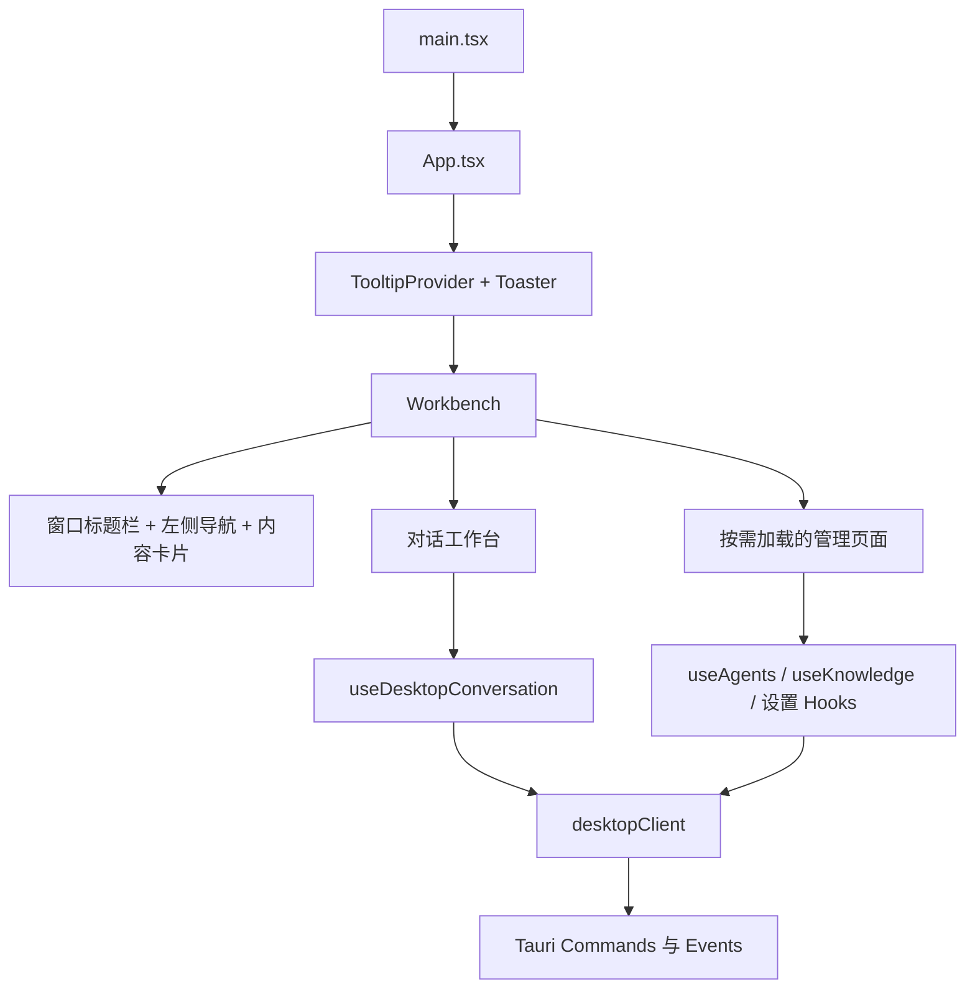
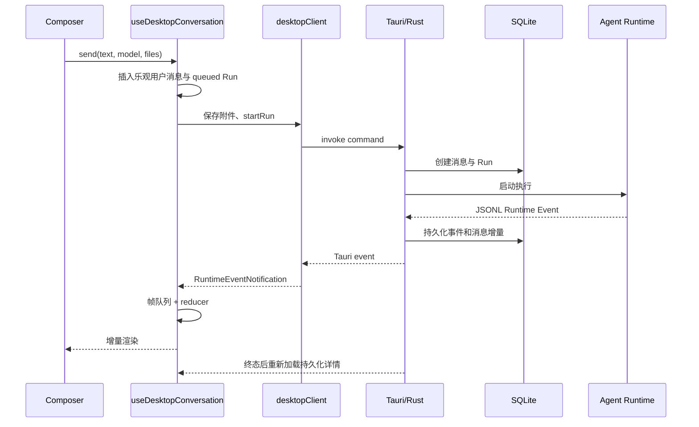

# 前端架构

> 状态：生效<br>
> 适用版本：Fox 0.1.x<br>
> 维护范围：`apps/desktop/src`<br>
> 最后更新：2026-07-31

## 目标与范围

本文面向参与 Fox 桌面端开发的前端、全栈和测试工程师，说明 React 前端的模块边界、页面装配方式、状态来源和与 Tauri 的通信方式。

本文只描述当前代码。A0 最小工作闭环已经实现；A1-A6 的完整工作图、长期记忆、多智能体协作等路线图能力不作为既有实现写入本文。

## 技术栈

| 类别 | 当前实现 | 主要用途 |
| --- | --- | --- |
| UI 框架 | React 19、TypeScript | 页面、交互和本地状态 |
| 构建 | Vite 6 | 开发服务器、代码分包和生产构建 |
| 桌面桥接 | Tauri 2 API | Command 调用、事件监听、窗口控制 |
| 基础组件 | shadcn/ui、Radix UI | Button、Dialog、Select、DropdownMenu 等 |
| Agent UI | 项目内 `ai-elements` | 消息、推理过程、工具、引用、附件、产物 |
| 样式 | Tailwind CSS 4 + 全局 CSS | Design Token、工作台和业务页面样式 |
| 动画 | Motion、OGL、自定义效果组件 | 引导页和少量状态反馈 |
| 文档预览 | PDF.js、docx-preview、@js-preview/excel、@aiden0z/pptx-renderer | 受控缓存中的只读原件预览 |
| 图谱 | AntV G6 | 知识图谱布局与交互 |

## 当前实现

应用入口非常薄：`main.tsx` 注册全局样式、禁用 WebView 全局右键菜单并挂载 `App`；`App` 只提供 Tooltip 和 Toast 上下文，实际产品外壳由 `Workbench` 负责。



### 目录职责

| 路径 | 职责 |
| --- | --- |
| `src/app` | 应用根组件 |
| `src/features/chat` | 主工作台、对话布局、输入框、侧栏与消息时间线 |
| `src/features/conversations` | 对话类型、Tauri Client、事件归并、会话 Hook |
| `src/features/agents` | 智能体列表、详情、工作记录和能力管理 |
| `src/features/knowledge` | 知识库、资源树、预览器、引用定位和图谱 |
| `src/features/settings` | 设置页与各类资源 Hooks |
| `src/features/workspace` | 页面外壳、路由类型和复用实体卡片 |
| `src/features/profile` | 本地用户资料与头像 |
| `src/components/ui` | shadcn/ui 基础组件 |
| `src/components/ai-elements` | Agent 场景复合组件 |
| `src/components/effects` | 品牌动效组件 |
| `src/styles` | Token、工作台样式和业务页面样式 |

## 页面装配与路由

Fox 当前没有引入 React Router。`Workbench` 以 `WorkspaceView` 联合类型维护当前页面，并通过 `navigate(view, entityId, context)` 切换视图。页面级组件使用 `React.lazy` 与 `Suspense` 加载，避免知识预览、设置和管理页面全部进入首屏执行路径。

路由上下文包含：

- `entityId`：智能体 ID 或知识库 ID。
- `documentId`：知识库文档 ID，或智能体详情的二级栏目名称。
- `sourceLocator`：引用定位所需的页码、正文摘录、锚点和内部 chunk 信息。

当前导航是内存态，不写入 URL。刷新 WebView 后不能通过 URL 恢复管理页或文档定位；需要深链接时应先设计稳定路由契约，再决定是否引入路由库。

## 状态分层

### 组件状态

页面展开、筛选词、弹窗、当前选项、布局宽度等短生命周期状态使用 React State。主题、左右侧栏宽度、折叠状态、专注模式和部分偏好保存到 `localStorage`。

### 领域资源 Hooks

`useAgents`、`useKnowledgeBases`、`useKnowledgeDetail`、`useModelProviders`、`useSkills`、`useMcpServers` 等 Hook 负责：

1. 调用 `desktopClient`；
2. 维护 loading/error/data；
3. 处理最小范围的资源刷新和乐观反馈；
4. 向页面暴露稳定的操作函数。

这些 Hook 不是服务端缓存层。跨页面的事实状态仍由 SQLite 或知识库服务决定，页面应在必要时重新读取。

### 对话聚合状态

`useDesktopConversation` 是最复杂的前端状态边界，聚合会话、消息、Run、事件、审批、附件、产物、知识库绑定和 Runtime 状态。它通过三种来源更新：

1. 用户发送时的乐观消息和临时 Run；
2. `fox://runtime-event` 与 `fox://work-event` 的实时推送；
3. 活跃 Run 的退避轮询以及终态后的 SQLite 全量归并。

Runtime 事件队列按动画帧批处理，降低高频 token 事件导致的重渲染；Work Event 使用独立 reducer 和会话级 sequence 去重，只更新 Goal、Task 与 Evidence，不得推进 Runtime `lastSeq` 或改写助手消息。持久化详情和内存详情通过专用 reducer 合并，不能使用简单对象覆盖，否则可能回退已经收到的流式文本或审批状态。

## 数据流



## 错误与边界

- 浏览器预览中没有 Tauri Runtime，窗口操作保持无害，真实数据功能不可用。
- 管理页面的错误通常就地显示；短操作结果通过 Sonner Toast 反馈。
- 知识库服务离线时，本地智能体应继续显示和运行；远程智能体会从可用列表过滤。
- 切换页面会关闭终端和右侧上下文栏，避免上下文跨页面残留。
- `Workbench` 目前承担路由、全局布局和大量对话 UI，文件体积较大，是后续路由与组件分包的主要对象。
- 多处偏好只存 `localStorage`，并不等同于可迁移、可备份的应用配置。

## 测试与验证

前端变更至少执行：

```powershell
pnpm.cmd --dir apps/desktop build
```

涉及对话事件、附件或知识预览时，还应运行对应 Bun 测试：

```powershell
bun test apps/desktop/tests
```

人工验证建议覆盖：首次进入、新建草稿、发送消息、流式回复、审批/补充问题、切换会话、服务离线、窗口窄屏、深浅主题和页面懒加载。

## 相关代码路径

- `apps/desktop/src/main.tsx`
- `apps/desktop/src/app/App.tsx`
- `apps/desktop/src/features/chat/workbench.tsx`
- `apps/desktop/src/features/workspace/types.ts`
- `apps/desktop/src/features/workspace/page-shell.tsx`
- `apps/desktop/src/features/conversations/hooks/use-desktop-conversation.ts`
- `apps/desktop/src/features/conversations/model/runtime-event-reducer.ts`
- `apps/desktop/src/features/conversations/api/desktop-client.ts`

## 已知限制

- 尚无 URL 路由、路由级错误边界和页面级数据缓存策略。
- `Workbench` 的职责仍偏多，修改时需要重点防止跨功能回归。
- 当前自动化测试偏重 reducer、附件和知识预览，缺少完整的组件交互与端到端测试。
- 页面文本、可访问性和响应式行为仍需持续通过真实 Tauri WebView 验证。
