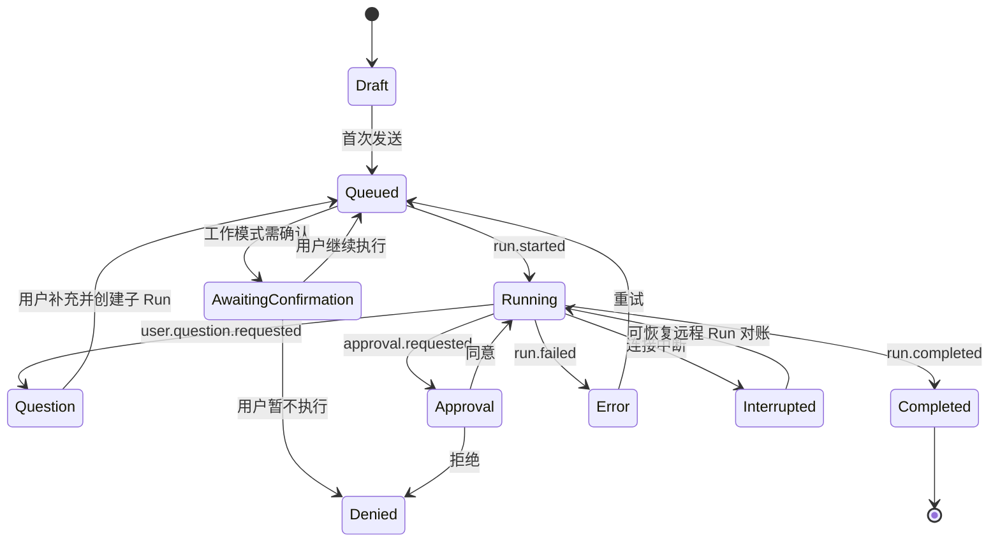

# 对话体验

> 状态：生效 
> 适用版本：Fox 0.1.x 
> 维护范围：会话创建、消息时间线、输入、流式状态与人工交互 
> 最后更新：2026-08-23

## 目标与范围

本文说明用户从新对话到 Run 完成的完整前端体验，以及消息、工作过程、审批、补充问题、附件、引用和产物如何呈现。

## 产品原则

- 新对话先作为草稿存在，首次发送后才写入历史。
- 一个会话始终绑定一个基础助手，并可独立绑定一个专家；切换助手或在已有消息后更换专家会准备新草稿。
- 用户消息应即时出现，模型输出应实时增量渲染，并以 SQLite 最终状态校正。
- 向用户展示可审计的工作过程、工具和证据，不渲染隐藏的模型内部思维。
- 需要审批或补充信息时在输入框上方提供明确、可继续的交互。

## 当前实现

对话 UI 主要由 `Workbench`、`Timeline`、`RuntimeTimeline`、`Composer` 和 `useDesktopConversation` 组成。消息主体通过 AI Elements 渲染 Markdown、工具过程、Sources、Inline Citation、Attachments 和 Artifact。

### 新对话页

空会话居中展示品牌形象、标题、四个建议提示和输入框。标题区、建议区和输入框保持左边缘对齐。用户可以预先选择：

- 基础助手；
- 可选专家；
- 已授权项目与权限模式；
- 一个或多个知识库；
- 模型覆盖（仅 Runtime 明确允许时）；
- 文档或图片附件（图片取决于模型能力）。

选择项目或附件时，输入框向上扩展并在内部展示所选上下文；发送区保持稳定边距。

### 已有会话

时间线展示：

- 用户消息及其附件；
- 模型状态行、助手名、模型名和时间；
- 工作过程与工具调用；
- Markdown 回复；
- 引用来源和生成产物；
- 固定显示的复制、赞、踩等消息操作。
- Host-owned 的专家启用历史卡片；卡片不是用户消息，也不会进入模型历史。

左侧回合导航基于当前会话的用户消息生成细条标记，悬浮展示该回合的用户问题、简要回复和产物/来源，点击滚动到对应位置。它不是会话列表。

当前专家以胶囊显示在 Composer 底部左侧工具区，固定紧跟“执行前询问”右侧。胶囊菜单支持详情、更换和移除，并显示最近一次 Run 的“有效/声明”工具数量；交集为空时提示“当前无可用工具，仍可纯文本回答”。Run 运行中、等待审批或等待用户补充时只允许查看详情。窄窗口优先截断名称，最窄宽度仅保留头像。

## Run 状态模型

前端展示状态为：`complete`、`running`、`question`、`approval`、`error`、`denied`。持久化 Run 还包括 `queued`、`awaiting_confirmation`、`running`、`cancelling`、终态和中断态；等待确认的 Run 尚未提交给 Runtime。

### 实时更新策略

发送时先写入乐观用户消息和临时 queued Run。正式 `startRun` 返回后，用真实消息与 Run 替换临时记录。

Runtime 事件先进入前端队列，再按 `requestAnimationFrame` 批量归并，避免每个 token 都立即触发完整时间线更新。活跃 Run 同时运行退避轮询：近期有事件时暂缓查询；长时间无事件时从 SQLite 重新加载。终态事件到达后再次读取持久化详情，确保漏事件、跨窗口调度和远程 Run 恢复也能收敛。

此双通道是为了可靠性，不应删掉其中任一通道后只依赖刷新页面。

## 工作过程与工具

`runtimeEvents` 会归并为推理步骤、工具步骤、搜索结果、usage 和终态。工作中使用 Shiny Text 等轻量状态提示；完成后状态图标静止，历史工作过程保留可展开。

工具调用展示名称、输入、输出摘要和完成状态。超大工具结果由宿主侧截断并保存摘要，前端不应尝试将任意大 JSON 全量展开。

## 用户补充与审批

### 补充问题

Runtime 发出结构化问题后，Composer 上方出现窄抽屉。它支持：

- 单选、多选和自由文本；
- 必答校验；
- 确认型问题的简化按钮；
- 提交后创建子 Run，并记录 `user.question.responded`。

旧 Run 的“等待用户”终态不能被误显示为普通完成。提交失败时抽屉应保留，允许用户重试。

### 审批

审批请求以 Confirmation 组件显示。多个请求按 `requestedAt + id` 排队，Composer 同一时间只展示最早的一条；当前请求解决后再展示下一条，禁止把多张审批卡同时堆叠。前端先做可回滚的乐观状态更新，再调用 Tauri 处理；失败时恢复为 pending。

真实工具审批提供“拒绝”“允许一次”“本次对话始终允许”三种决定。“本次对话始终允许”只对当前会话内的同名工具生效，不等于放开全部工具；选择后已排队的同名工具请求也自动通过，会话删除后授权随之删除。审批卡不显示左侧 Fox 图标，正文与操作区使用常规可读字号并在抽屉高度内垂直居中，右上角 Composer 状态形象可继续保留。审批是权限系统的界面，不得仅通过前端隐藏按钮绕过宿主校验。

工作模式确认与工具审批是两个边界。含糊或高风险的复杂请求先创建 proposed Goal，并把 Run 以 `awaiting_confirmation` 和待派发载荷持久化；用户选择“继续执行”后才恢复同一个 Run，选择“暂不执行”则取消尚未派发的 Run。刷新或重启不会绕过这一步。

## 附件、知识库与项目

- 附件先保存到 Fox 管理目录，再把附件 ID 交给 Runtime。
- 本地 Runtime 对可解析附件注入受控上下文，并可调用 `read_attachment`。
- 远程知识库智能体使用其服务端附件链路，前端不重复注入本地抽取文本。
- 知识库绑定属于会话上下文；草稿阶段暂存在 Hook，创建会话后立即写入绑定表。
- 专家绑定同样支持草稿物化和重启恢复；只有出现 `user/assistant` 消息后才锁定原位更换，预填草稿和专家时间线卡片不计入消息。已有消息的会话不会热切换 Persona。
- 当前启用知识库与项目都以输入框内上下文项显示，并可从加号菜单修改。

## 引用与产物

引用保留知识库 ID、文档 ID、页码、摘录和内部定位信息。点击引用跳转到知识库详情：PDF 按页码，DOCX/文本按摘录搜索并高亮。普通界面不展示内部 chunk ID。

产物显示在模型回复下方，包含名称、类型和可用动作。消息底部的助手名称应使用当次会话/Run 的真实名称；时间包含日期与时间，避免跨日歧义。

## 异常与边界

- 事件可能早于 `startRun` 命令返回，因此监听器必须在发起 Run 前 ready。
- 快速切换会话时，只接受当前会话的 UI 更新；其他会话终态仅刷新列表。
- Yuxi 中断态需要专门对账，不能直接永久显示“工作过程未完成”。
- 取消中的 Run 仍属于活动状态，直到宿主确认终态。
- 历史初次只加载最近 120 条消息，更早消息按需分页。
- 点赞/点踩目前主要是表现层，若要用于评估需补持久化与数据契约。
- 语音入口存在于 UI，但完整语音识别能力需以实际实现和权限为准。

## 测试与验证

自动测试重点：

- `runtime-event-reducer.test.ts`：事件顺序、重复事件、终态归并；
- `agent-classification.test.ts`、`conversation-expert-state.test.ts`、`expert-binding-ui.test.ts`：菜单分层、绑定恢复、时间线与锁定状态；
- `attachment-content.test.ts`：附件内容提取；
- 生产构建：类型、懒加载与样式依赖。

人工回归必须覆盖：

1. 首次消息即时出现；
2. 短回复和长回复均连续流式显示；
3. 完成后无需刷新即可看到最终内容；
4. 切换会话后不串消息；
5. 工具、审批和补充问题可继续 Run；
6. 应用重启后历史、工作过程、附件、引用和产物仍在；
7. Runtime/Yuxi 暂时断开后的错误与恢复；
8. 加载更早历史时滚动位置稳定。

## 相关代码路径

- `apps/desktop/src/features/chat/workbench.tsx`
- `apps/desktop/src/features/conversations/hooks/use-desktop-conversation.ts`
- `apps/desktop/src/features/conversations/model/runtime-event-reducer.ts`
- `apps/desktop/src/features/conversations/model/runtime-event-queue.ts`
- `apps/desktop/src/features/conversations/model/pending-interactions.ts`
- `apps/desktop/src/features/conversations/model/attachment-content.ts`
- `apps/desktop/src/components/ai-elements`

## 已知限制

- `Workbench` 中仍混合了部分演示态与真实 Runtime 分支，真实桌面环境以 `desktopRuntimeAvailable` 分支为准。
- 消息反馈、归档、分享链接和协作者等功能尚未形成完整后端闭环。
- 缺少覆盖真实 Tauri 事件时序的端到端自动化测试。
- A0 已提供 Goal/Task/Evidence 持久工作图；Plan 修订、独立 Review、Acceptance 和完整 Span 树仍属于后续阶段。
