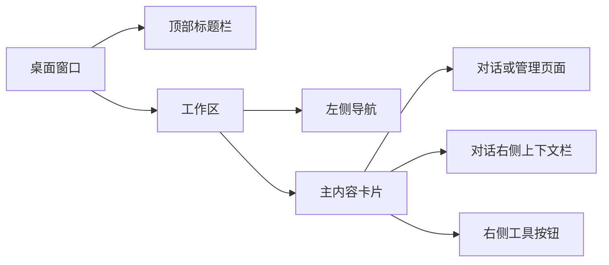
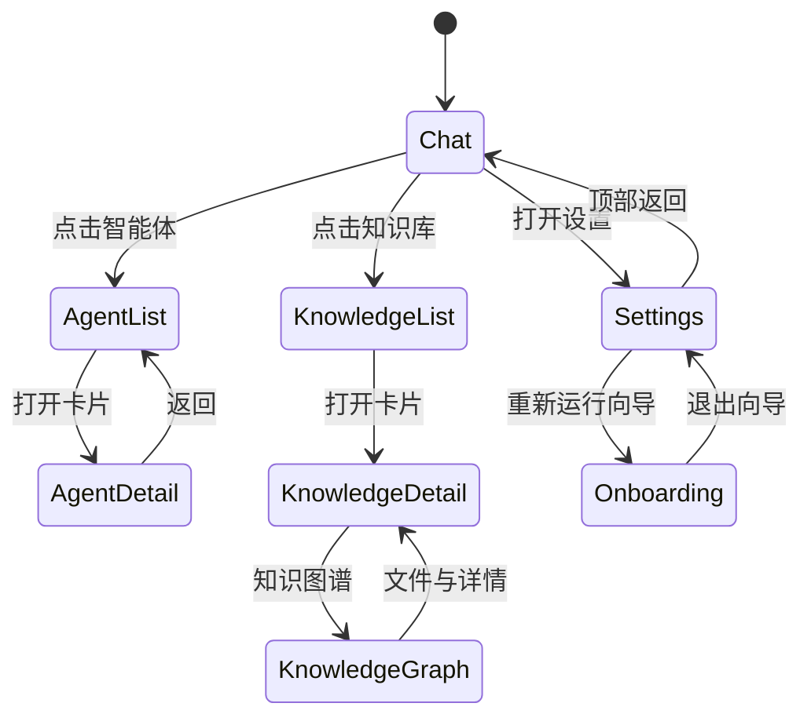

# 导航与页面布局

> 状态：生效 
> 适用版本：Fox 0.1.x 
> 维护范围：窗口框架、页面导航和响应式布局 
> 最后更新：2026-07-29

## 目标与范围

本文说明 Fox 桌面窗口如何组织标题栏、左侧导航、主内容区、对话右侧栏和管理页面，并定义新增页面应接入的导航方式。

## 当前实现

Fox 使用一个持续存在的工作台外壳。顶部标题栏和左侧导航构成半透明底层背景，主内容作为独立内容表面覆盖其上。右侧上下文栏只在对话视图展示；设置、智能体和知识库管理页面只替换主内容，并按上下文复用左侧导航。

## 顶部标题栏

`WindowTitlebar` 同时承担 Tauri 拖拽区、产品标识、应用菜单和窗口控制：

- 文件：新建对话、打开项目、设置、退出；
- 编辑：撤销、重做、复制、粘贴；
- 视图：折叠侧栏、缩放；
- 帮助：文档与版本提示；
- 窗口：最小化、最大化/还原、关闭。

最大化按钮会根据真实窗口状态切换图标。浏览器预览没有原生窗口能力时，相关操作必须静默失败而不是让整个应用报错。

## 左侧导航模式

左侧栏根据 `activeView` 进入四种模式：

| 模式 | 触发视图 | 内容 |
| --- | --- | --- |
| 对话 | `chat`、智能体列表、知识库列表 | 助手/知识用途切换、新对话、搜索、智能体、知识库、项目与会话 |
| 设置 | 所有设置和扩展页面 | 返回、设置分类导航、底部用户区 |
| 智能体详情 | `agent-detail` | 返回智能体列表、首页、对话任务、记忆、Skills、工具 |
| 知识库详情 | `knowledge-detail`、`knowledge-graph` | 返回知识库列表、文件与详情、知识图谱、资源管理器 |

底部用户资料、主题和设置入口在各模式中保持固定。管理页顶部的“返回”回到进入该管理区域之前的页面，而不是在同一区域内逐页回退。

### 对话导航

- “助手/知识”切换代表 Fox 的用途模式，不是页面 Tab。
- 切换用途会准备对应默认智能体的新会话草稿。
- 搜索同时覆盖普通会话、项目名称和项目内会话。
- 项目按规范化根路径分组；项目标题可展开/收起，旁边的加号创建绑定该项目的新会话。
- 新草稿不立即进入历史，首次发送成功后才形成持久会话。

## 主内容页

`WorkspacePage` 是管理页面的统一外壳，提供：

- 固定高度的页面标题栏；
- 左侧栏折叠按钮；
- 单行标题和可选副标题；
- 右侧页面动作；
- 独立可滚动内容区。

新增管理页应复用 `WorkspacePage`，不要自行复制标题栏。设置类页面在内部继续使用居中的 `SettingsScaffold`；列表页使用 `fox-page-content`；知识图谱和文档查看器可使用全宽工具布局。

## 页面映射

`WorkspaceView` 是当前路由契约：

- 对话：`chat`；
- 智能体：`agents`、`agent-detail`；
- 知识库：`knowledge`、`knowledge-detail`、`knowledge-graph`；
- 设置：首页、模型偏好、模型供应商、知识库服务、项目权限、输入对话、使用统计、扩展、诊断、关于；
- 扩展详情：Skills、MCP；
- 独立流程：模型服务、知识库服务、登录、首次向导。

页面通过 `navigate` 传递实体与文档上下文。返回管理区时由 `managementReturnRoute` 保存之前的视图；首次向导使用独立的 `onboardingReturnRoute`。

## 对话右侧栏

右侧工具栏当前定义六个模式：待办、变更、浏览器、文件、知识库和智能体。只有前四个具备主要内容能力；知识库和智能体入口仍保留为后续扩展占位。

桌面宽度下右侧栏可调整宽度并折叠。紧凑宽度下使用 `Sheet` 弹出，不与主内容并排。折叠后，展开按钮回到对话顶部操作区，位置应与收起按钮一致。

## 响应式规则

| 断点 | 行为 |
| --- | --- |
| `> 1180px` | 完整左侧栏，可调宽；右侧栏可并排显示 |
| `<= 1180px` | 左侧栏自动变为 64px 图标模式；右侧内容使用 Sheet |
| `<= 900px` | 对话顶部与内容间距进一步收紧 |
| `<= 820px` | 内容表面与顶部栏圆角策略调整 |
| `<= 520px` | 左侧栏隐藏，主内容占满可用宽度 |

布局尺寸会保存到 `localStorage`，包括左右侧栏宽度、折叠状态、右侧模式、终端高度、主题和专注模式。

## 关键交互与状态

- 切换管理页面会关闭终端和右侧栏。
- 右侧栏模式与宽度持久化，但管理页不会渲染它。
- 专注模式隐藏非必要界面，不能改变会话本身的权限或运行状态。
- 页面标题、折叠按钮和右侧动作需使用同一基线，避免不同页面发生水平漂移。

## 异常与边界

- 当前路由没有浏览器历史栈；“返回”是产品定义的上下文返回。
- `WorkspacePage` 接收 `onBack`，但当前实际返回按钮由左侧管理导航承担。
- 侧栏项目来源于已有会话的 `projectRoot`，没有会话的已授权项目不会自动成为侧栏分组。
- 右侧“知识库/智能体”模式仍不应被当作已完成能力宣传。
- 首次向导占满窗口，绕过普通工作台布局。

## 测试与验证

人工回归至少覆盖：

1. 从对话进入每个管理区域并返回原页面；
2. 智能体详情二级栏目切换；
3. 知识库文件与图谱切换；
4. 左右侧栏折叠、调整宽度和重启恢复；
5. 1180px、820px、520px 附近的布局；
6. 最大化/还原按钮图标；
7. 快捷键 `Ctrl+N/O/,/B/J`；
8. 生产构建。

## 相关代码路径

- `apps/desktop/src/features/chat/workbench.tsx`
- `apps/desktop/src/features/workspace/types.ts`
- `apps/desktop/src/features/workspace/page-shell.tsx`
- `apps/desktop/src/styles/workbench.css`
- `apps/desktop/src/styles/workspace-pages.css`

## 已知限制

- 无 URL 深链接和浏览器式前进/后退。
- 已授权但尚无会话的项目缺少独立侧栏数据源。
- 顶部菜单中部分帮助、协作、归档能力仍是提示或占位。
- 小屏主要用于窗口缩窄，不等同于完整移动端适配。
