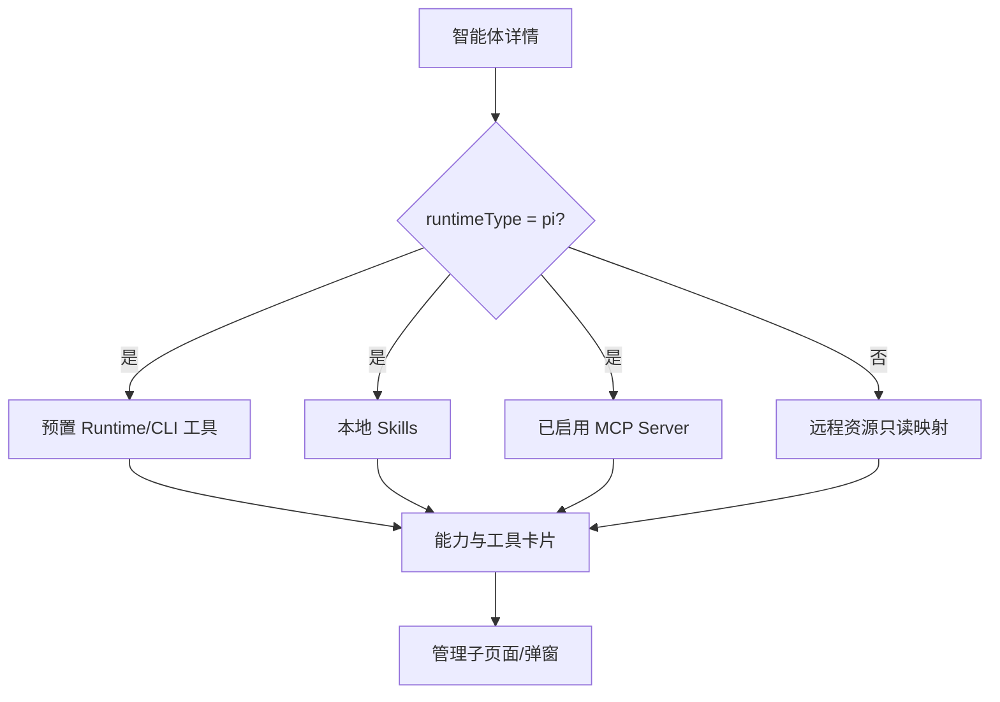
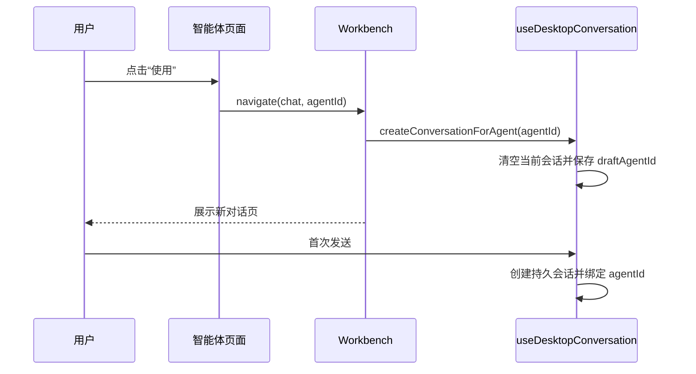

# 智能体体验

> 状态：生效 
> 适用版本：Fox 0.1.x 
> 维护范围：智能体列表、详情、选择和能力管理 
> 最后更新：2026-07-29

## 目标与范围

本文说明 Fox 如何统一呈现本地 Pi Runtime 智能体与知识库服务智能体，以及用户如何查看、筛选、使用和管理其能力。

## 当前实现

`AgentListPage` 和 `AgentDetailPage` 负责页面表现，`useAgents` 负责远程同步、离线过滤和本地记录读取，实体卡片由 `workspace/entity-card.tsx` 统一提供。Skills 与 MCP 的可管理状态分别来自设置模块的资源 Hook；使用智能体时由 `Workbench` 把页面导航转换为新会话草稿。

## 产品边界

Fox 面向用户统一展示 `AgentRecord`，但保留 Runtime 来源：

- `pi`：Fox 本地智能体，可在知识库服务离线时继续工作；
- `yuxi`：知识库服务提供的远程智能体，配置事实以远端为准。

Fox 当前不在桌面端创建、删除或完整编辑远程智能体。会话创建后绑定固定智能体；用户从卡片切换智能体时创建新会话草稿。

## 智能体列表

列表页由页面介绍、汇总指标、筛选栏和实体卡片组成。筛选支持：

- 状态：全部、可使用、不可用；
- 环境：全部、本机、知识库；
- 搜索：名称、简介和默认模型；
- 手动刷新。

远程同步失败时，`useAgents` 仍加载本地数据库记录，但会过滤知识库来源智能体，避免在服务未启动时显示看似可用的远程卡片。若列表完全为空，页面提供本地 `Fox 通用助手` 作为前端兜底展示；真实会话仍以宿主初始化返回的默认智能体为准。

### 卡片结构

智能体卡片复用知识库卡片的尺寸和布局：

1. 图标、名称和最多两行简介；
2. 默认模型；
3. Tools、知识库、MCP、Skills 数量；
4. 可用状态、来源胶囊和“使用”按钮。

本机来源使用淡蓝胶囊，知识库来源使用中性灰。卡片点击打开详情，“使用”按钮阻止冒泡并直接准备会话。

## 智能体详情

详情页复用主左侧栏作为二级导航：

| 栏目 | 当前能力 |
| --- | --- |
| 首页 | 智能体简介、工作记录、能力与工具 |
| 对话任务 | 该智能体关联的最近会话列表 |
| 记忆 | 占位页，长期记忆尚未启用 |
| Skills | 查看并管理 Skill 启用状态 |
| 工具 | 查看 Runtime、CLI 和 MCP 工具 |

标题区展示智能体名称、简介和来源说明；远程智能体明确提示其系统提示词与管理配置保留在知识库服务。

### 工作记录

工作记录从本地会话汇总生成：

- 活跃天数；
- 自动任务数（当前为 0）；
- 对话任务数；
- 参与项目数；
- 最近 52 周活动热力图；
- 最近会话列表。

这不是独立任务系统，也不等同于 A0 工作图。自动任务目前只显示空状态。

## 能力与工具

本地智能体的能力来源包含：

- 智能体记录中的预置 Skills；
- Fox 数据目录中已安装并启用的用户 Skills；
- Runtime 预置工具，如 `read`、`ls`、`find`、`grep`、`write_file`、`edit_file`、`run_command`；
- 已启用 MCP Server。

远程智能体的工具、MCP 和 Skills 来自服务端记录，在 Fox 中只读展示。

### 核心模块与数据流

在首页点击“管理”会进入对应 Skills 或工具子页面。在子页面中，本地智能体可打开管理 Dialog：预置项默认开启且不可修改，用户添加项可启停，并可继续跳到全局 Skills/MCP 设置添加资源。

## 使用智能体流程

## 异常与边界

- 知识库服务离线时不能沿用数据库中的远程智能体假装可用。
- `fallbackAgent` 只用于列表/详情的展示兜底，不应成为绕过 Runtime 初始化的执行对象。
- 资源数量依赖服务端映射和本地扫描结果，刷新期间可能暂时变化。
- 远程智能体的配置能力由 `configurableItems` 决定，Fox 不应自行开放模型覆盖。
- Skills 只注入指令，不获得额外工具权限；MCP 调用仍受 Fox 审批和审计。
- 记忆、自动任务和完整 Agent 编辑尚未实现。

## 测试与验证

人工验证：

1. 知识库服务在线/离线时列表差异正确；
2. 状态、环境和搜索组合筛选；
3. 卡片高度、标题和底部状态对齐；
4. 使用本地/远程智能体后创建正确来源的草稿；
5. 进入详情后左侧二级导航和返回行为；
6. 工作记录只统计该智能体会话；
7. Skills 与 MCP 启停保存、失败提示和刷新；
8. 深浅主题与窄窗口。

## 相关代码路径

- `apps/desktop/src/features/agents/agent-pages.tsx`
- `apps/desktop/src/features/agents/use-agents.ts`
- `apps/desktop/src/features/workspace/entity-card.tsx`
- `apps/desktop/src/features/chat/workbench.tsx`
- `apps/desktop/src/features/settings/use-skills.ts`
- `apps/desktop/src/features/settings/use-mcp-servers.ts`

## 已知限制

- 没有长期记忆管理、自动任务和 Agent 版本历史。
- 工作记录基于会话摘要，不是独立任务与证据模型。
- 列表中的“能力项”汇总口径偏展示性，未覆盖全部 Runtime 能力声明。
- 远程智能体管理仍需前往知识库服务管理端。
