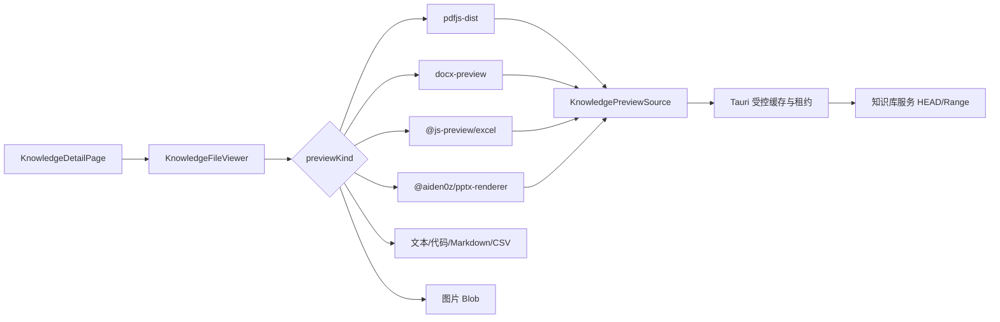

# 知识库体验

> 状态：生效 
> 适用版本：Fox 0.1.x 
> 维护范围：远程知识库列表、文件浏览、预览、引用导航、下载与知识图谱 
> 最后更新：2026-08-22

## 目标与范围

本文说明 Fox 如何以只读客户端方式接入远程知识库服务。助手侧栏中的入口显示为“远程知识库”。Fox 负责浏览、预览、下载、检索授权和引用导航；上传、解析、分块、Embedding 与知识库治理仍由知识库服务管理端负责。用户可编辑的本机资料进入顶部“知识”工作区，详见 [本地知识库体验](本地知识库体验.md)。

## 当前实现

`KnowledgeListPage`、`KnowledgeDetailPage` 和 `KnowledgeGraphPage` 负责三个主要视图；`useKnowledgeBases` 与 `useKnowledgeDetail` 读取远端资源并维护请求状态；资源管理器、文件查看器和图谱画布是独立模块。所有远端请求都通过 `desktopClient` 进入 Tauri，而不是由 WebView 直接持有知识库凭据。

## 访问前置条件

知识库列表需要：

1. 已配置知识库服务；
2. 服务连接可用；
3. 用户在 Fox 内完成知识库登录；
4. 当前账户拥有对应知识库权限。

浏览器中的登录状态不会自动共享给 Tauri 应用。未配置、未登录、无权限和空列表均有独立空状态及下一步动作。

## 知识库列表

列表展示知识库数量、文件总数、平均处理进度、搜索和刷新。卡片包含：

- 名称与简介；
- 资料类型；
- 文件数、处理比例和关联 Agent 数；
- 已就绪/处理中状态；
- 更新时间与浏览动作。

列表为只读，不提供上传、删除、解析配置或打开管理后台的快捷入口。

## 文件与详情

进入知识库后，左侧导航切换为“文件与详情”和“知识图谱”，并在下方展示资源管理器。资源管理器将远端文档路径组装为文件树，支持文件夹展开、搜索和选择文件；主内容区只显示当前选中文档。

若没有显式文档 ID，页面选择首个非文件夹文档并更新导航上下文。文档请求带代次编号，快速切换时迟到响应不会覆盖当前文件。

### 文档标题与元数据

顶部标题使用当前文档名称。正文顶部是一行元数据：类型、大小、更新时间和处理状态。右侧动作包括：

- 使用知识助手提问；
- 本机打开；
- 下载原文件与取消下载；
- 重新加载预览；
- 复制文件信息。

“使用知识助手提问”会创建新会话草稿，选择可用的默认远程知识助手并绑定当前知识库，而不是跳转到智能体列表。

## 核心模块与预览数据流

Fox 不使用 Office 服务端转换。预览器读取知识库原件，经 Tauri 鉴权网关写入 Fox 受控缓存，再按文件类型调用成熟前端库。

### 格式策略

| 格式 | 当前查看方式 | 主要约束 |
| --- | --- | --- |
| PDF | PDF.js，单页 Canvas、翻页、缩放、搜索 | 完整缓存，界面只挂载当前页 |
| DOCX | docx-preview，按可识别 section 翻页 | 连续文档可能只有一个渲染 section |
| XLS/XLSX/ODS | @js-preview/excel | 只读、禁用编辑器与右键菜单 |
| PPTX | @aiden0z/pptx-renderer | 只挂载当前页，支持前后翻页 |
| 图片 | Blob URL | 单图上限 64MB，支持缩放/适应 |
| 文本/代码/JSON/Markdown | 本地文本查看器 | 原件前 2MB，支持搜索和高亮 |
| CSV/TSV | 受限表格 | 最多 500 行、100 列 |
| DOC/PPT 等旧二进制格式 | 不支持内嵌预览 | 下载后使用本机应用 |

Office ZIP 文件进入第三方解析器前会检查加密、条目数、展开体积、压缩比、ZIP64 和分卷，降低 ZIP bomb 风险。

## 缓存、打开与下载

- 缓存默认上限 500MB，可在数据与诊断中调整并按 LRU 清理。
- 缓存键由知识库 ID、文档 ID、服务端 `source_revision` 和预览规格构成。
- 写入使用随机 `.part`、长度校验和原子替换；活动查看器通过租约保护文件。
- WebView 只持有不透明缓存键，不接收本地绝对路径。
- 本机打开只允许常见文档和图片白名单，宏文档、脚本、可执行文件等被拒绝直接启动。
- 下载使用系统另存为、分块写入、进度事件、取消和完成后的“打开/定位”。

## 引用导航

对话引用保留 `knowledgeBaseId`、`documentId` 和定位信息。点击后打开对应知识库与文件：

- PDF：优先跳到指定页；无页码时搜索摘录；
- DOCX：按页或 section 定位，再搜索并高亮摘录；
- 文本：搜索摘录并滚动到匹配；
- 内部 chunk ID：仅用于定位，不向普通用户显示。

页面切换、新会话和普通文件导航会清理旧定位，避免引用高亮错误残留。

## 知识图谱

图谱页使用 AntV G6，支持：

- 关键词查询；
- 实体类型筛选；
- 查询深度 1-3；
- 最大节点数 50/100/200；
- 缩放、适应画布、单击详情和双击展开邻居；
- 节点属性、关联关系列表和来源文档跳转。

节点与关系先经过前端规范化，以兼容服务端不同字段包装。无图谱时提示在画布中央展示；大图默认限制节点数量，避免一次性渲染全部数据。

## 异常与边界

- 服务必须提供稳定 `source_revision`、鉴权 HEAD 和严格 Range 响应；否则原件预览会失败或降级。
- 预览状态统一为 loading、ready、failed、unsupported，失败必须可重试。
- 切换文件时要取消远端分块、本地缓存读取和第三方渲染任务。
- 文档解析内容与原件预览是两条数据链，解析内容不能冒充原始版式。
- DOCX 的分页由文档结构和库输出决定，无法保证与 Word 打印页完全一致。
- 图谱内容和远端文档均视为不可信数据，不能改变系统权限或工具白名单。

## 测试与验证

自动测试覆盖：

- `knowledge-preview-model.test.ts`：格式路由、表格和页码模型；
- `knowledge-preview-source.test.ts`：缓存/Range 数据源、取消和租约；
- `document-activity.test.ts`：阅读位置与引用定位；
- Rust 侧缓存、下载、路径和网关测试。

人工回归至少覆盖：

1. 未配置、未登录、空知识库和服务离线；
2. 文件树深层目录和快速切换；
3. PDF 第二页以后、DOCX 图片、Excel 多表、PPTX 翻页；
4. 大文件取消、缓存清理和重新打开；
5. 下载完成动作与危险格式限制；
6. 从对话引用跳到正确文档与位置；
7. 图谱节点多时的清晰度、缩放和来源跳转。

## 相关代码路径

- `apps/desktop/src/features/knowledge/knowledge-pages.tsx`
- `apps/desktop/src/features/knowledge/use-knowledge.ts`
- `apps/desktop/src/features/knowledge/knowledge-resource-explorer.tsx`
- `apps/desktop/src/features/knowledge/knowledge-file-viewer.tsx`
- `apps/desktop/src/features/knowledge/knowledge-preview-source.ts`
- `apps/desktop/src/features/knowledge/knowledge-pdf-viewer.tsx`
- `apps/desktop/src/features/knowledge/knowledge-docx-viewer.tsx`
- `apps/desktop/src/features/knowledge/knowledge-spreadsheet-viewer.tsx`
- `apps/desktop/src/features/knowledge/knowledge-pptx-viewer.tsx`
- `apps/desktop/src/features/knowledge/knowledge-graph-canvas.tsx`

## 已知限制

- Fox 不提供知识库上传、解析配置和权限管理。
- 旧 Office 二进制文件缺少内嵌预览。
- DOCX 分页不是打印级版式复现。
- 引用目前支持页码和摘录定位，不展示 chunk 管理界面。
- 图谱仍受远端数据质量、节点标识和来源字段一致性影响。
