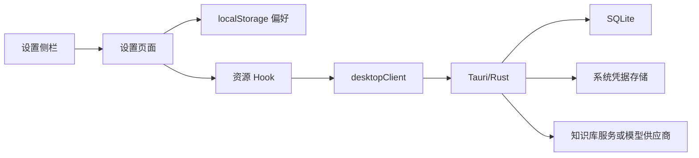
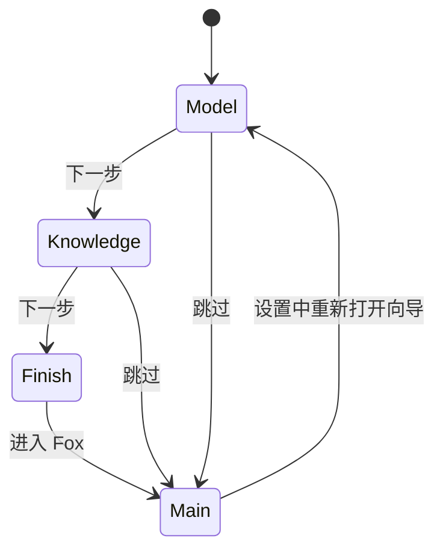

# 设置中心

> 状态：生效 
> 适用版本：Fox 0.1.x 
> 维护范围：设置中心信息架构、页面职责和配置持久化 
> 最后更新：2026-07-29

## 目标与范围

本文说明 Fox 设置中心的分类、页面结构、配置事实来源和扩展边界。目标是让工程师知道某项配置应放在哪一页、保存在哪里，以及哪些能力仍由知识库服务管理。

## 当前实现

设置页面集中在 `settings-pages.tsx`，使用多个资源 Hook 将 UI 与 Tauri Command 隔开。导航由 `Workbench` 的 `WorkspaceView` 管理；通用页面外壳使用 `WorkspacePage`，设置正文使用 `SettingsScaffold` 和 `PreferenceRow`。复杂资源配置进入独立页面或 Dialog，不在左侧导航中嵌套第三层菜单。

## 核心模块与数据流

## 信息架构

设置中心通过主左侧栏切换，底部用户区保持不变。当前分类为：

| 页面 | 主要内容 | 事实来源 |
| --- | --- | --- |
| 应用 | 个人资料、主题、首次向导、通知和关闭行为 | SQLite + localStorage |
| 模型供应商 | 供应商、API 协议、地址、凭证和多个模型 | SQLite + 系统凭据存储 |
| 模型偏好 | 默认模型、推理深度和当前模型能力 | 供应商数据 + localStorage |
| 知识库服务 | 服务地址、连接状态、知识库账户 | SQLite + 系统凭据存储 + 远端 |
| 项目与权限 | 已授权目录、默认和逐项目权限模式 | SQLite + localStorage |
| 输入与对话 | 发送键、拼写、语音、附件和启动行为 | localStorage + 能力状态 |
| 使用统计 | 对话、Run、Agent 和 Token 本地统计 | SQLite 聚合 |
| 扩展 | Skills 与 MCP 入口 | 本地文件 + SQLite + 凭据存储 |
| 数据与诊断 | Runtime、缓存、备份、恢复、清理和诊断包 | Tauri/Rust + SQLite |
| 关于与更新 | 版本、技术栈、许可证和更新状态 | 应用常量/构建信息 |

## 页面布局

所有设置页使用 `WorkspacePage` 加 `SettingsScaffold`：

- 页面标题栏与其他管理页面一致；
- 内容为居中的单列阅读区；
- 每页首先展示大标题和一句范围说明；
- 同类设置放在连续 Card 中；
- `PreferenceRow` 左侧为标题与说明，右侧为控件；
- 按钮、选择框和状态胶囊保持一致高度。

简单配置不应拆成层层嵌套卡片。需要独立凭证、危险操作、服务状态或复杂列表时才使用完整卡片。

## 应用与个人资料

应用页包含：

- 本地头像和用户名编辑；
- 知识库账户状态入口；
- 浅色、深色和跟随系统主题展示；
- 重新打开首次设置向导；
- 回复完成通知；
- 关闭窗口行为。

本地资料通过 `useUserProfile` 读写宿主数据库，知识库账户头像和用户名仅作为首次默认值。两者需要保持边界：用户更改本地资料不应覆盖远端账户。

当前“跟随系统”视觉选项尚未形成完整的系统主题监听闭环；新增逻辑时不能只增加卡片选中样式。

## 模型供应商

供应商页以卡片列表展示已有配置，并提供 OpenAI、DeepSeek、DashScope、Anthropic、SiliconFlow、Moonshot 等预置模板。模板默认填充：

- 供应商名称与图标；
- Base URL；
- API 协议；
- 推荐模型占位；
- 上下文和最大输出；
- 图片输入能力。

用户仍需配置 API Key、实际模型和默认项。卡片右侧菜单支持重命名/编辑、验证连接和删除；新增使用可关闭 Dialog，编辑配置在当前页面完成。

API Key 不写入普通前端状态持久层或 SQLite 明文字段。表单只表达“已配置、替换、清除”，凭据由 Tauri 侧安全存储。

一个供应商可配置多个模型，每个模型记录展示名称、模型 ID、上下文、最大输出、多模态和默认状态。保存后刷新当前默认模型服务。

## 模型偏好

模型偏好页选择全局默认供应商/模型，并展示当前连接协议、上下文和图片能力。选择框宽度适应供应商和模型名称，不使用容易截断的固定宽度。

推理深度当前保存为 `fox.preferences.reasoning`。它只有在 Runtime/模型适配器实际读取并映射到供应商参数时才会生效；前端选项本身不保证所有模型支持。后续应由模型能力声明决定可用档位，并在不支持时禁用或隐藏。

## 知识库服务

知识库服务页只管理 Fox 连接远端所需的客户端配置：

- 本地、局域网或远程地址；
- 连接测试与延迟；
- Fox 内独立登录；
- 当前用户、部门和角色。

Embedding、Reranker、分块、知识图谱构建、内容审查、用户和部门管理不放入 Fox 设置。页面和用户文案统一称“知识库服务”；代码中历史 `Yuxi` 名称仅作为适配器实现细节保留。

## 项目与权限

项目页展示已授权目录及每个项目的权限模式：

- 只读：读取、搜索和分析；
- 询问：写入、命令和敏感操作前审批；
- 允许：在宿主规则允许的范围内自动执行。

默认权限只影响之后加入的新项目。路径边界由 Tauri/Rust 校验，前端 Select 不是安全边界。命令、MCP 和高风险操作可以在项目为“允许”时仍要求单独审批。

## 输入与对话

当前偏好包括发送键、拼写检查、语音入口和是否恢复上次对话。产品默认不恢复上次会话，启动进入欢迎页；新草稿只有首次发送后才出现在历史。

附件和历史回合导航在页面中以状态项展示。对模型能力有条件的功能，例如图片输入，应读取 Runtime/模型 Capability，而不是只读取本地开关。

## 使用统计

使用统计从本地 SQLite 汇总，不包含费用估算。页面包含：

- 对话数、完成 Run、活跃天数、Token 总量；
- 最近一年活动热力图；
- 智能体使用排名；
- 输入/输出 Token 构成。

Token 统计使用每个 Run 最后一次 usage 上报，避免把流式增量重复累计。远程服务未返回 usage 时，统计可能低于实际使用量。

## 扩展

### Skills

扫描 Fox 数据目录 `skills/*/SKILL.md`，展示元数据、校验错误、所需工具、源路径和指令内容。Skill 只能注入指令，不自动扩权。

### MCP

当前支持 stdio Server 的新增、编辑、删除、测试、启停和工具预览。命令与非敏感配置保存在数据库，环境凭据保存到系统凭据存储。所有 MCP 调用仍经过 schema 校验、审批和审计。

## 数据与诊断

该页通过 Tauri Command 提供：

- Runtime 与服务状态；
- 知识预览缓存统计、上限调整和安全清理；
- `.foxbackup` 备份与排队恢复；
- 孤立数据与过期会话清理；
- 脱敏诊断包。

缓存清理只删除未租用的 Fox 管理缓存，不触碰用户另存的原文件。恢复操作在重启前排队并由宿主完成完整性校验和失败回滚。

## 首次设置向导

首次启动未发现 `fox.onboarding.status` 时直接进入全屏向导。步骤为：

1. 配置模型服务；
2. 配置可选知识库服务；
3. 进入 Fox。

模型服务是本地默认助手正常工作的必要条件；知识库服务可跳过。向导使用独立品牌背景、卡片分步动画和完成过渡。跳过会进入主界面，但在模型未配置时明确提示功能限制。

## 配置持久化规则

选择存储位置时遵循：

- 仅影响当前 WebView 外观的偏好可用 localStorage；
- 需要随备份、安装升级和业务查询保留的资料写 SQLite；
- API Key、Token、MCP 环境密钥进入系统凭据存储；
- 远程智能体、知识库和账户事实以知识库服务为准；
- 安全判断必须在 Tauri/Rust 再次校验。

## 异常与边界

- 服务配置保存成功不代表连接有效，应提供独立测试结果。
- 删除默认供应商前必须处理默认模型回退。
- 未支持推理深度的模型不能伪装成配置已生效。
- localStorage 偏好不在 `.foxbackup` 完整覆盖范围内，迁移设备时可能丢失。
- 关于页的自动更新仍为“尚未接入”。
- 设置中的文案不应暴露 Yuxi 品牌，但代码适配器名称可暂时保留。

## 测试与验证

每个设置页至少验证：

1. 首次空状态、加载、保存成功和失败；
2. 重启应用后的持久化；
3. 凭据不会出现在普通日志、SQLite 导出和诊断包；
4. 删除/清理等危险操作的确认与失败回滚；
5. 长供应商名、URL、模型名和路径不破坏布局；
6. 所有 Button、Select 和 Badge 高度与文本居中；
7. 深浅主题和键盘操作；
8. `pnpm.cmd --dir apps/desktop build`。

## 相关代码路径

- `apps/desktop/src/features/settings/settings-pages.tsx`
- `apps/desktop/src/features/settings/use-model-service.ts`
- `apps/desktop/src/features/settings/use-model-providers.ts`
- `apps/desktop/src/features/settings/use-yuxi-service.ts`
- `apps/desktop/src/features/settings/use-yuxi-user.ts`
- `apps/desktop/src/features/settings/use-skills.ts`
- `apps/desktop/src/features/settings/use-mcp-servers.ts`
- `apps/desktop/src/features/profile/user-profile.tsx`
- `apps/desktop/src/features/conversations/api/desktop-client.ts`

## 已知限制

- 部分偏好仍只保存于 localStorage，尚未统一进入数据库配置表。
- 推理深度的供应商能力映射需要进一步明确和验证。
- 跟随系统主题、自动更新、语音输入仍未形成完整产品闭环。
- 设置页面自动化测试不足，目前主要依靠类型构建和人工回归。
