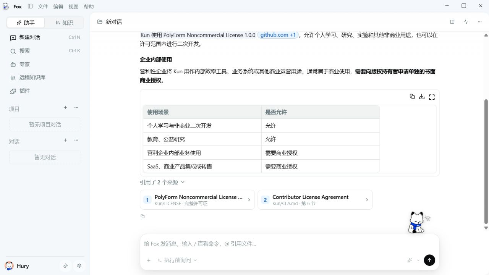
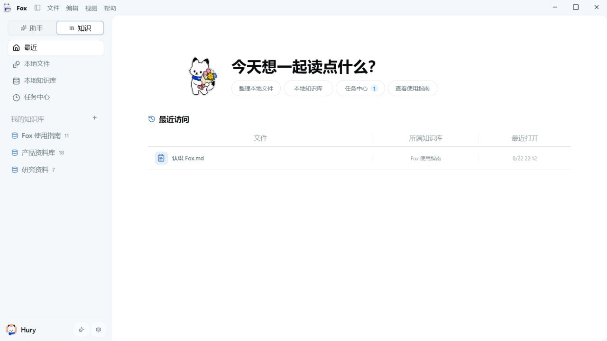
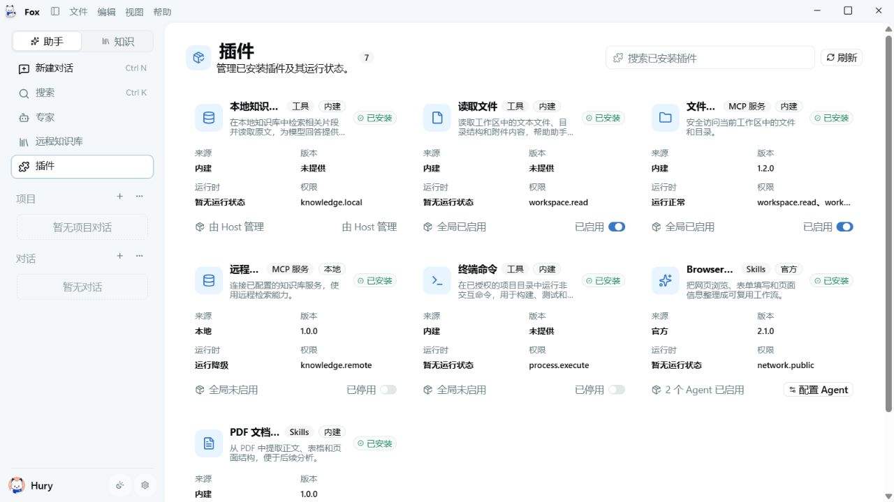
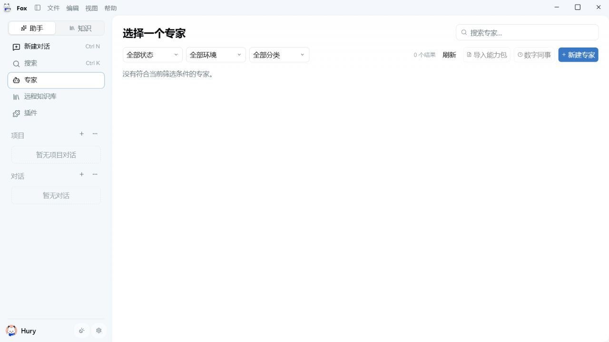
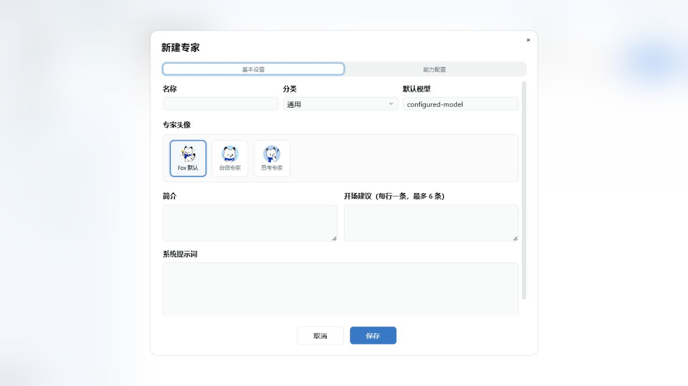

# Fox 设计系统

> 状态：生效 
> 适用版本：Fox 0.1.x 及后续桌面端版本 
> 维护范围：Fox Desktop 的视觉语言、页面模板、组件、交互状态与设计验收 
> 最后更新：2026-08-29

## 1. 设计目标

Fox 是面向知识工作与 Agent 协作的桌面应用。设计需要同时满足长时间阅读、频繁操作、复杂状态反馈和较高信息密度，不追求网页营销感。

### 1.1 产品气质

- **安静可信**：大面积使用中性画布和清晰边界，蓝色只承担强调、选中和关键操作。
- **紧凑但可读**：允许桌面工具级的信息密度，但连续文本不得依赖 8-11px 小字号堆叠。
- **任务优先**：页面先呈现当前任务、主要动作和状态，装饰不得抢占操作层级。
- **温和品牌化**：Fox 形象用于欢迎、空状态、运行反馈和关键完成反馈，不在每张业务卡片中重复出现。
- **本地优先**：文件路径、项目、知识库、插件和权限状态必须直接、可解释、可追溯。

### 1.2 基本原则

1. 一个页面只保留一个主要标题，不使用蓝色英文 Kicker，也不在标题下重复一行说明。
2. 同级操作使用同一高度、字号和圆角；差异通过主次样式表达，不靠尺寸漂移表达。
3. Hover、选中、加载、禁用和错误必须是不同状态，不能只依赖颜色深浅区分。
4. 优先复用 shadcn/ui、Radix UI、`components/ui` 和 `components/ai-elements`，禁止另建平行的 `.btn`、`.input`、`.card` 通用体系。
5. 新代码优先使用语义令牌；历史硬编码值逐步迁移，不因一次改造全量重写业务 CSS。

## 2. 当前视觉审查基线

本轮在 1280×720、浅色主题下检查了主要工作流。截图只证明可见布局，不替代深色主题、窄屏、键盘和真实数据状态测试。

### 2.1 对话工作区

- **整体健康度：良好。** 标题栏、侧边栏、对话区和输入区的层级已经稳定，内容区留白适合长时间阅读。
- 对话标题、项目入口和右侧动作形成同一水平线，标题应保持中等字重，不使用粗黑标题。
- 消息正文可读性较好，但引用卡片、元数据和输入框底部控制仍存在过小文本风险。
- 输入框是页面主操作，应保持稳定的默认高度；附件、模式、审批和模型选项必须使用紧凑但可识别的分组。

### 2.2 知识最近页

- **整体健康度：良好。** Fox 形象、问候语、快捷胶囊和最近文件构成了清晰的工作台入口。
- 快捷胶囊必须与新对话页保持同一高度和字号，图标可省略，文案承担主要识别。
- 最近访问表格应保持轻量，但表头和内容必须按列对齐；文件名左对齐，其余列按列规则对齐。
- 当前内容宽度偏集中，后续新增模块应先复用现有最大内容宽度，不应直接贴近画布两侧。

### 2.3 插件管理页

- **整体健康度：需要收敛。** 三列卡片适合桌面宽度，但卡片同时展示来源、版本、运行时、权限和启用状态，信息层级偏密。
- 工具、Skills、MCP 的分类应作为顶层切换；卡片主层只展示名称、类型、两行描述和当前状态。
- 低频详情进入展开区或详情页，避免所有字段在卡片中同权显示。
- 长名称、权限列表和说明必须省略并提供 Tooltip，不能压缩主要动作或破坏三列对齐。

### 2.4 专家中心

- **整体健康度：基本可用。** 搜索、筛选和创建入口明确，但空状态缺少视觉重心，顶部操作横向分散。
- 搜索框与页面主标题平行；筛选放在下一行，结果数靠近筛选而不是漂浮在主按钮旁。
- 专家只出现在专家中心，不进入普通助手下拉菜单；选中专家后在对话工具栏显示专家胶囊，并在时间线插入专家启用卡片。

### 2.5 新建专家弹窗

- **整体健康度：良好。** 两步标签、双列字段和右侧头像区域已经形成稳定结构。
- 弹窗需要固定可用高度、内部滚动和稳定底部操作区，不能让第二个标签页溢出屏幕。
- 关闭按钮、输入框、选择器和底部按钮必须使用统一尺寸；取消和保存按内容宽度居中排列，不铺满整行。

## 3. 样式架构

Fox 使用三层样式体系：

1. shadcn/ui 与 Radix UI 提供可访问的交互原语；
2. `globals.css` 定义主题、语义色、字体、控制高度和基础令牌；
3. `workbench.css`、`workspace-pages.css`、`local-knowledge.css`、`plugin-center.css` 等业务样式负责页面布局。

复杂 Agent 内容优先复用 `components/ai-elements`。新页面不得再创建一套通用 Button、Input、Dialog 或 Card 样式；确有新语义时，应封装到 `components/ui` 或对应业务组件中。

## 4. 视觉令牌

### 4.1 字体

- 主字体：`HarmonyOS Sans SC`。
- 回退：`Segoe UI Variable`、`Segoe UI`、系统无衬线字体。
- 字间距默认 0；不要按视口宽度连续缩放字号。
- 半像素字号不是全局禁用项。`13.5px` 是已经过产品确认的正文和控制字号；禁止继续新增无语义的 8.5、9.5、10.5 等随机值。

| 语义 | Token / 目标值 | 使用场景 | 限制 |
| --- | --- | --- | --- |
| 窗口 Chrome | `--fox-type-chrome: 13px` | 顶部标题栏、应用菜单 | 不用于正文 |
| Caption | `--fox-type-caption: 11.5px` | Tooltip、快捷键、极短辅助信息 | 不承载连续阅读内容 |
| Meta | `--fox-type-meta: 12px` | 时间、来源、状态、表格次级列 | 最低常规可读字号 |
| Control | `--fox-type-control: 13.5px` | 按钮、输入框、下拉项、侧边栏 | 页面控制统一使用 |
| Body | `--fox-type-body: 13.5px` | 对话正文、卡片简介、设置正文 | 行高至少 1.5 |
| UI Emphasis | `--fox-type-ui: 14px` | 卡片标题、列表主文本 | 不作为页面标题 |
| Small Title | `--fox-type-title: 15px` | Dialog 小标题、区块标题 | 字重 600 |
| Section | 18px | 页面区块、空状态标题 | 新增实现前补语义 Token |
| Page | 24px | 列表页、管理页主标题 | 字重 600-700 |
| Display | 32px | 新对话、知识欢迎语 | 仅首页式工作台使用 |

字重只使用 400、500、600、700 四档：

- 400：正文、说明；
- 500：顶部对话标题、按钮和列表主文本；
- 600：卡片标题、区块标题；
- 700：首页问候语和需要突出的一次性页面标题。

### 4.2 间距

采用 **4px 基准 + 2px 微调**，而不是强制所有布局只用 8 的倍数。

| 级别 | 值 | 典型用途 |
| --- | --- | --- |
| Micro | 2px | 图标光学修正、相邻状态点 |
| XS | 4px | 紧凑行内间距 |
| S | 6px | 图标与文字、紧凑控件组 |
| M | 8px | 按钮组、字段内部间距 |
| L | 12px | 卡片内部、列表行间距 |
| XL | 16px | 表单字段、卡片内容区 |
| 2XL | 20px | 页面子区块 |
| 3XL | 24px | 页面内容内边距 |
| 4XL | 32px | 大区块分隔 |
| 5XL | 40px | 首页首屏留白 |
| 6XL | 48px | 页面纵向主分区 |
| 8XL | 64px | 大型欢迎区 |

1px 只用于边框；3、5、7、9、11、13、17、23px 等值视为历史遗留或明确的光学例外，新增前必须说明原因。

### 4.3 尺寸

| 对象 | 标准尺寸 | 说明 |
| --- | --- | --- |
| 自定义窗口标题栏 | 30px 高 | Windows 桌面 Chrome，不能套用 macOS 38px 标准 |
| 页面级 Button / Input / Select | `--fox-action-height: 34px` | 页面标题区、筛选、Dialog 底部动作统一使用 |
| 紧凑行内动作 | 28px | 表格行、卡片内部、状态旁动作 |
| 图标页面动作 | 34×34px | 刷新、存储位置、更多等 |
| 侧边栏菜单行 | 34px | 图标和文字垂直居中 |
| 命令菜单行 | 28px | `/` 与 `@` 列表，紧凑单行 |
| Badge / 状态标签 | 20px | 不小于 12px 字号时可放宽到 22px |
| 普通图标 | 16px | 按钮、输入框、侧边栏 |
| 紧凑图标 | 12px | 状态、元数据、行内动作 |
| 页面功能图标 | 20-24px | 页面标题、空状态和卡片主图标 |

标题栏中的菜单项可以使用 22px 可视高度，但整行点击区域仍由 30px 标题栏承载。不要把通用页面按钮压缩到标题栏规格。

### 4.4 圆角

| 语义 | 值 | 使用场景 |
| --- | --- | --- |
| Small | 6px | Badge、紧凑标签 |
| Control | 8px | Button、Input、Select、菜单项 |
| Card | 10px | 普通业务卡片，与 `--radius` 对齐 |
| Large | 12px | 大型面板、筛选胶囊容器 |
| Overlay | 16px | Dialog、审批卡、输入框外壳 |
| Pill | 999px | 模式胶囊、分段切换 |

禁止新增 7、9、11、13、14px 等仅为局部“看起来差不多”的圆角。

### 4.5 颜色

业务代码优先使用语义变量：

| Token | 含义 |
| --- | --- |
| `--fox-canvas` | 主画布 |
| `--fox-sidebar` | 侧边栏底色 |
| `--fox-card` | 卡片与弹层表面 |
| `--fox-panel` | 次级区域与弱背景 |
| `--fox-text` | 主文字 |
| `--fox-muted` | 次要文字 |
| `--fox-faint` | 元数据与弱提示 |
| `--fox-border` | 常规边框 |
| `--fox-border-strong` | 需要强调的分隔 |
| `--fox-accent` | Fox 蓝色主强调 |
| `--fox-accent-soft` | 淡蓝选中与弱提示 |
| `--fox-hover` | 中性 Hover 背景 |

`--accent` 是 shadcn 的中性交互色，`--fox-accent` 才是 Fox 品牌蓝。不得为了“全局变蓝”直接把 `--accent`、`--sidebar-accent` 改为品牌色，否则会把中性 Hover 和选择状态全部染蓝。

#### `color-mix()` 规则

- 不全局禁用 `color-mix()`；它适合表达主题适配后的弱背景和边框。
- 优先使用已定义的语义 Token；相同配方出现三次以上，应抽成 Token。
- 白色、灰色与蓝色混合时优先使用 `in srgb`，避免无色相端点在 OKLCH 中出现偏粉插值。
- `in oklch` 只用于两个明确有色相、且希望保持感知亮度的颜色。
- 默认界面不得出现粉色或紫色 Hover；这些颜色只在明确业务语义中使用。

### 4.6 阴影

- 页面 section 不加阴影；依赖背景、边框和留白形成层级。
- 普通卡片默认无阴影，Hover 最多使用边框变化和 `translateY(-1px)`。
- Popover、Dropdown 和 Dialog 可以使用一层弱阴影。
- 输入框、命令菜单和 `/` 弹窗不得使用大面积发光或多层阴影。

## 5. 布局系统

### 5.1 应用框架

- 顶部标题栏固定 30px。
- 左侧导航默认宽度 236px，可调整范围 220-456px。
- 右侧工作区默认按内容打开，可调整范围 280-760px。
- 内容区使用 `min-width: 0`、`min-height: 0`，滚动发生在明确的页面内容容器内，禁止整页和内部列表同时滚动。
- 页面主要内容最大宽度为 1120px；首页欢迎区可更窄，详情预览可按内容扩展。

### 5.2 页面模板

#### A. 工作台页

适用于新对话和知识“最近”：

1. 品牌形象 + 32px 问候语；
2. 3-4 个等高快捷胶囊；
3. 最近访问、建议动作或状态摘要；
4. 内容整体向首屏中上部集中，不贴顶部，也不垂直绝对居中。

#### B. 列表 / 管理页

适用于专家、插件、本地知识库、任务中心：

1. 第一行：黑色页面主标题，右侧搜索与主要动作；
2. 第二行：分段切换、筛选和刷新；
3. 主内容：网格、列表或空状态；
4. 不添加英文副标题、蓝色标题或重复说明行。

#### C. 详情 / 预览页

1. 顶部返回、标题、状态和右侧动作；
2. 主内容承担文档、知识库或任务详情；
3. 次级文件列表或属性放在可折叠侧栏；
4. PDF、PPT 等第三方预览器样式必须限定在查看器容器内。

#### D. 设置页

设置是临时任务层，不改变用户原本的主页面上下文。返回应回到进入设置前的对话、知识或插件页面，而不是把用户困在设置子页面。

## 6. 组件规范

### 6.1 页面标题区

- 只显示一个黑色主标题。
- 页面主标题使用 24px；Dialog 标题使用 15-18px；对话顶部标题使用 13px、500 字重。
- 搜索框和页面动作与标题同一水平线；筛选放在下一行。
- 标题过长使用省略，并通过 Tooltip 或详情弹层显示完整内容。

### 6.2 Button

- 页面级按钮统一 34px；卡片或表格内联按钮统一 28px。
- Primary 同一页面最多一个；Secondary、Ghost 和 Destructive 按语义使用。
- 图标按钮必须提供 Tooltip 或 `aria-label`。
- Loading 保留原尺寸，禁止文字消失导致按钮跳动。
- Disabled 不响应点击，并使用 `not-allowed`；可点击项必须显示手型指针。

### 6.3 Input、Select 与搜索

- 单行输入、搜索、Select 统一 34px。
- Label 使用 12px、600 字重；说明文字使用 12px、400 字重。
- Focus 使用边框和可见 Ring，不只改变背景。
- 搜索框在同类页面中保持相同宽度；本地文件、专家、插件和知识库不得各自定义一套高度。

### 6.4 胶囊与分段切换

- 胶囊用于快捷意图、模式或互斥分类，不用于承载长说明。
- 首页快捷胶囊必须等高、等圆角、接近等宽；文案字号统一。
- 工具 / Skills / MCP 使用三段切换，顺序固定为 **工具 → Skills → MCP**。
- `/` 菜单选中“目标”或“计划”后，在输入框底部出现可关闭模式胶囊；不自动替用户生成一段提示词。

### 6.5 卡片

卡片只用于可独立点击、可管理或可追踪的对象，不把每个页面 section 都包成卡片。

- 默认 1px 边框、10px 圆角、无阴影。
- 卡片标题 14px，简介 12-13.5px、最多两行。
- 状态、来源和类型使用 Badge；Badge 不得小于 20px 高和 11.5px 字号。
- 1280px 内容区的集合卡片优先一行 3 个；产物卡片可一行 3-4 个。
- 整卡可点击时必须支持 Enter / Space，内部 Switch 或 Button 阻止冒泡。

### 6.6 列表与表格

- 列标题按列区域居中；文件名列内容左对齐，其他列按数据类型选择左对齐或居中。
- 表头和内容之间使用 1px 强边框；列间分割线使用更弱的 1px 边框。
- 文件名可用 500 字重，其余内容使用 400；整行不得全部加粗。
- 大型文件列表使用增量加载或虚拟滚动，不一次渲染全部条目。

### 6.7 Dialog

- 使用 Radix Dialog 的焦点锁定和 Escape 行为。
- 关闭图标使用 16px，点击区域至少 32×32px。
- 弹窗最大高度不超过视口减 48px；内容区独立滚动，标题和底部动作保持稳定。
- 底部按钮按内容宽度居中排列，默认不铺满整行。
- 需要多步配置时使用 2-3 个标签；不同标签页保持相同弹窗外部尺寸。

### 6.8 Popover、Dropdown 与命令菜单

- `/` 和 `@` 弹窗宽度与聊天输入框一致，无外围大阴影。
- 每行 28px，标题左对齐，简短注释右对齐；不保留额外顶部标题。
- 支持方向键上下、Enter 选择、Escape 关闭；Hover 和键盘选中状态一致。
- 知识库命令在同一弹层内进入二级选择，本地与远程知识库之间使用分割线，不再打开新的 Dialog。

### 6.9 审批卡

- 多个审批请求按队列逐个展示，禁止同时覆盖两个审批层。
- 不显示左侧 Fox 表情，内容区域充分利用卡片宽度并垂直居中。
- 标准动作：**拒绝**、**允许一次**、**本次对话始终允许**。
- 长参数默认摘要，用户可以展开检查完整命令、路径或域名。

### 6.10 对话输入框

- 输入框外壳为页面主要操作区，默认保持可输入两行的高度。
- 文本区增长到可视区域约 40% 后内部滚动，不持续挤压消息历史。
- 底部从左到右依次放置附件 / 命令、审批策略、专家胶囊、知识库、模型和发送。
- 专家胶囊位于“执行前询问”右侧；Hover 显示关闭按钮，移除后恢复基础助手。
- 发送按钮为清晰的圆形主动作，禁用状态仍保留稳定轮廓。

## 7. 业务页面规范

### 7.1 助手与对话

- 普通助手只出现在聊天模型 / 助手选择器中。
- 专家从专家中心选择，绑定后在输入区显示胶囊，并在时间线记录启用卡片。
- 对话顶部标题前显示文件夹图标；点击后展示项目名、可打开的文件目录和“编辑名称”。
- 编辑重发应替换原用户气泡并从该节点重新运行，不新增重复用户气泡。
- 目标只在用户显式选择“目标”模式、输入 `/目标` 或明确说“创建目标”时触发；普通委派文字不得自动创建目标。

### 7.2 知识

- 助手侧远程知识库只用于调用和访问；知识模式中的本地文件和本地知识库允许编辑、移动、索引和删除。
- 知识侧边栏固定为：最近、本地文件、本地知识库、任务中心、我的知识库。
- 选中某个知识库后，在同宽侧栏项下显示浅灰文件列表区域；列表高度受限并独立滚动。
- 本地文件点击后优先在 Fox 内预览；不支持的格式显示说明和“使用系统打开”。
- 文件操作固定为加入知识库、打开、打开所在文件夹。

### 7.3 插件

- 插件中心是助手工作区中的独立页面，不放在设置页。
- 顶层顺序固定为工具、Skills、MCP。
- 顶部放搜索、“我安装的”和“添加插件”；刷新与分段切换同一行。
- “精选”不受分类筛选影响；筛选栏只作用于“全部”区域，并放在“全部工具 / Skills / MCP”标题下。
- “我安装的”进入独立管理页：左上返回，标题后显示数量，卡片右侧使用 Switch 启停。

### 7.4 专家

- 专家中心使用集合页模板；搜索在标题右侧，筛选在下一行。
- 新建专家的基本设置使用两列字段 + 右侧双行高度头像区；简介与开场建议一行两列。
- 能力配置只提供可选择的知识库、Skills、MCP 和工具，不要求用户输入内部 ID。
- 专家头像从 `/expert-icons/` 读取稳定注册项，专家删除后历史对话仍使用绑定快照展示。

## 8. 状态与反馈

所有业务组件至少覆盖：Default、Hover、Focus、Active、Loading、Success、Error、Disabled、Empty。

- Hover 不能代替选中态；选中态需要背景、边框或状态标识。
- Loading 禁止重复提交，长任务必须显示阶段、进度和可恢复状态。
- Success 优先 Toast；持久状态同时在页面中更新。
- Error 提供人类可读原因、技术详情入口和可执行的下一步。
- Empty 状态说明“为什么为空”和“下一步做什么”，但不添加长篇教程。
- 网络重连、工具调用和模型流式输出必须分层显示，不能把等待中的工具状态伪装成网络错误。

## 9. 动画

- 过渡时长使用 120ms、150ms、200ms 三档。
- Hover 位移最多 1px；页面切换不使用大幅滑动。
- Loader 可以持续动画，完成后必须停止。
- PDF、PPT 预览翻页时不得因重建 Viewer 导致闪烁；页面切换只更新当前页状态。
- 支持 `prefers-reduced-motion`，功能理解不得依赖动画。

## 10. 可访问性

- 所有纯图标按钮提供可读名称。
- 键盘焦点使用可见 Ring，不能只靠背景色。
- Popover、Dropdown、Tabs、Dialog 复用 Radix 语义和焦点管理。
- 连续正文不低于 12px；关键操作文本不低于 13px。
- 长模型名、Windows 路径、专家名和文件名使用省略并提供完整内容入口。
- 正常文本、次要文本和禁用文本分别满足对应对比度要求；禁用状态不能仅降低到不可读。
- 全局右键菜单被禁用时，复制、打开、下载等操作必须提供显式入口。

## 11. 响应式与窗口适配

- **≥1180px**：完整侧边栏，集合页优先三列卡片。
- **960-1179px**：两列卡片，右侧工作区默认折叠。
- **<960px**：侧边栏可折叠，集合页单列，顶部动作允许分两行。
- **<720px**：只保证关键任务流，不同时展示左侧栏、主内容和右侧栏。
- 缩放与窄屏适配优先调整列数和区域显隐，不缩小字体。

## 12. 设计治理

### 12.1 新页面检查清单

- [ ] 使用工作台、列表、详情或设置模板之一。
- [ ] 页面只保留一个黑色主标题。
- [ ] 页面级 Button、Input、Select 使用 34px 高度。
- [ ] 字体使用现有语义 Token；没有新增 8-11px 连续文本。
- [ ] 间距来自 2/4/6/8/12/16/20/24/32/40/48/64 体系。
- [ ] 圆角来自 6/8/10/12/16/full 体系。
- [ ] 颜色使用 Fox 语义 Token；无意外粉色或紫色混合。
- [ ] 覆盖 Loading、Empty、Error、Disabled。
- [ ] 支持键盘、长文本、浅色和深色主题。

### 12.2 代码评审规则

- 不接受为单个页面复制一套 Button、Dialog、Card 或菜单实现。
- 不接受依靠尾部覆盖选择器持续修复字号；应修改组件语义或令牌引用。
- 不接受未说明的新硬编码字号、控制高度和圆角。
- `!important` 只用于第三方样式隔离或迁移期覆盖，并需要注明清理目标。
- 同一配方出现三次以上应提取为组件或语义 Token。

### 12.3 视觉验收矩阵

每次涉及布局或视觉的改动至少检查：

1. 1280×720 与 1440×900；
2. 1180px 以下紧凑布局；
3. 浅色和深色主题；
4. 键盘 Tab、方向键、Enter、Escape；
5. 最长中文标题、英文模型名和 Windows 路径；
6. Loading、Disabled、Error、Empty；
7. 对话流式输出、工具调用和审批队列；
8. `pnpm.cmd --dir apps/desktop build`。

## 13. 迁移优先级

### P0：规范与基础组件

1. 把缺失的间距、圆角和标题字号补充为语义 Token；
2. 统一 `Button`、`Input`、`Select`、Dialog Footer 和页面标题区；
3. 建立页面截图基线和视觉验收清单。

### P1：高频主流程

1. 统一侧边栏行、聊天输入框、命令菜单和审批卡；
2. 收敛对话元数据、引用卡片和产物卡片的小字号；
3. 修正插件页的信息层级与截断策略。

### P2：集合与管理页

1. 专家、插件、本地知识库统一页面模板；
2. 表格、文件列表和卡片网格统一密度；
3. 清理重复的尾部字号覆盖和随机尺寸。

### P3：自动化治理

1. 增加 Storybook 或组件演示页；
2. 增加关键页面视觉回归；
3. 增加 CSS 令牌覆盖率和异常字号扫描。

## 14. 相关代码与资源

- `apps/desktop/src/styles/globals.css`
- `apps/desktop/src/styles/workbench.css`
- `apps/desktop/src/styles/workspace-pages.css`
- `apps/desktop/src/styles/local-knowledge.css`
- `apps/desktop/src/styles/plugin-center.css`
- `apps/desktop/src/components/ui`
- `apps/desktop/src/components/ai-elements`
- `apps/desktop/src/features/workspace/entity-card.tsx`
- `apps/desktop/src/features/workspace/page-shell.tsx`
- `apps/desktop/public/mascot/`
- `apps/desktop/public/avatars/defaults/`
- `apps/desktop/public/expert-icons/`

## 15. 已知限制

- 历史 CSS 中仍存在大量低于 12px 的字号、随机间距和局部覆盖，规范已冻结但迁移尚未完成。
- 当前没有 Storybook、正式视觉回归和集中式组件文档站。
- 深色主题、窄屏和 PDF/PPT 预览的自动化覆盖不足。
- 截图基线只覆盖浅色 1280×720，不代表所有数据状态均已通过验收。
