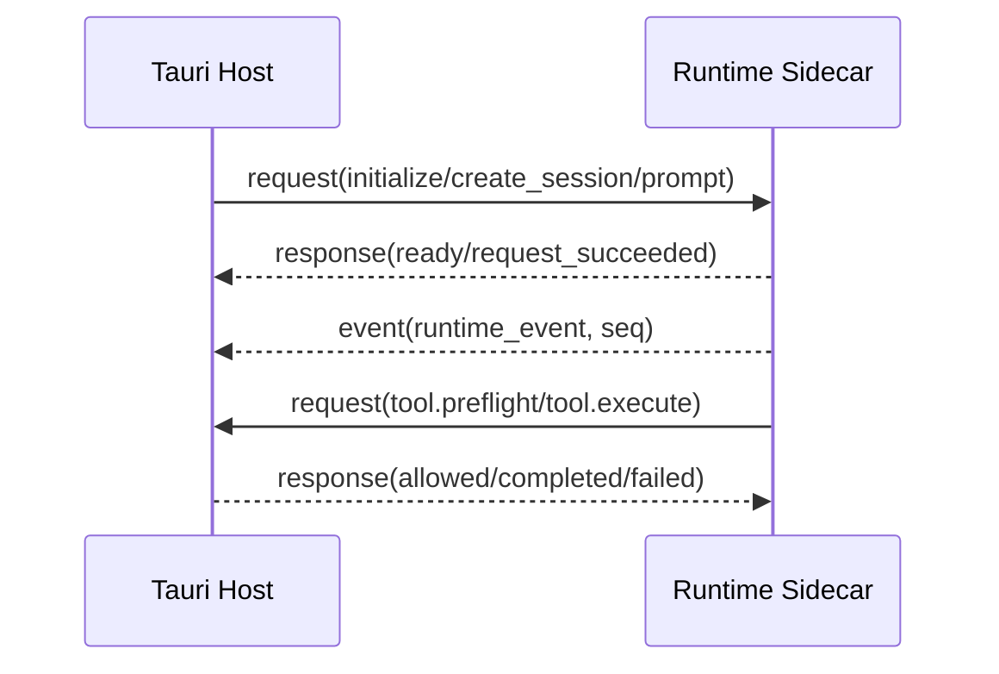

# Runtime 协议参考

> 状态：协议版本 1<br>
> 适用版本：Fox 0.1.x<br>
> 维护者：Fox Runtime 团队<br>
> 最后更新：2026-08-21

## Envelope



Runtime 与 Host 使用逐行 JSON（JSONL）。公共字段：

```json
{
  "protocol": "fox-runtime-jsonl",
  "version": 1,
  "kind": "request | response | event",
  "id": "uuid-or-runtime-id",
  "timestamp": "RFC3339",
  "type": "prompt",
  "requestId": "仅响应",
  "conversationId": "可选",
  "runtimeSessionId": "可选",
  "runId": "可选",
  "seq": 1,
  "payload": {}
}
```

stdout 只能输出 Envelope；日志必须写 stderr。Host 校验 protocol/version/kind/id/type，Runtime 只接受 request。

## Host 到 Runtime

| type | 必需上下文 | 说明 | 响应 |
|---|---|---|---|
| `initialize` | payload.modelService | 模型和能力初始化 | `ready` |
| `create_session` | conversation/session | 新建检查点 | `session_created` |
| `resume_session` | sessionPath | 恢复检查点 | `session_created` |
| `prompt` | conversation/session/run + assistantPackage + expertBinding? + expertPackage? + projectContext/workSnapshot | 开始异步推理 | `request_succeeded` |
| `cancel` | run | 中止运行 | `request_succeeded` |
| `shutdown` | 无 | 关闭进程 | `request_succeeded` |

响应仅表示请求已接收；Run 完成以事件为准。

`assistantPackage` 表示 `conversations.agent_id` 对应的基础助手；`expertBinding` 仅在当前会话有 active 专家时携带绑定 ID、专家 ID、版本与 Hash；`expertPackage` 来自绑定时冻结并经 Hash 校验的静态执行包，再叠加当前 Run 的 Skills、知识和 Host 授权。Runtime 对助手和专家 `allowedTools` 逐层过滤，MCP scope 也取交集；这些字段不能授予 Host 未注册或未批准的能力。

## Runtime 到 Host 的请求

- `tool.preflight`：校验只读工具路径与权限。
- `tool.execute`：执行附件、写入、命令、知识、MCP 或 A0 工作闭环工具。

Host 返回 `tool.preflight_allowed/blocked` 或 `tool.execute_completed/failed`，并使用原请求 `requestId` 关联。

## Runtime 事件

外层 type 为 `runtime_event`，实际事件在 `payload.type`：

| 事件 | 关键字段 |
|---|---|
| `run.started` | model |
| `run.request_snapshot` | model, provider, assistantPackage, expertBinding, expertPackage, Prompt 长度/Hash、Assistant/Expert 声明工具、有效工具、排除原因、token limits |
| `run.phase` | phase, attempt?, outcome? |
| `run.retrying` | attempt, maxAttempts, delayMs, message |
| `run.retry.completed` | success, attempt, finalError? |
| `context.compaction.started` | reason |
| `context.compaction.completed` | reason, aborted, willRetry, errorMessage? |
| `planner.started` | model |
| `planner.completed` | durationMs, planHash, stepCount, needsGoal |
| `planner.failed` | code, message, fallback |
| `message.started` | role, kind |
| `message.delta` | delta |
| `reasoning.delta` | delta, source |
| `tool.started` | toolCallId, tool, input |
| `tool.updated` | toolCallId, update |
| `tool.completed` | result, isError |
| `source.added` | document/chunk/page/anchor metadata |
| `usage.updated` | inputTokens/outputTokens/cacheReadTokens/cacheWriteTokens/totalTokens |
| `message.completed` | 无 |
| `run.completed` | 无 |
| `run.cancelled` | 无 |
| `run.failed` | code, message |

知识库远程 Runtime 还可产生 `user.question.requested/responded` 和 `run.interrupted`。所有事件必须有单 Run 单调递增 `seq`。

`cacheReadTokens` 与 `cacheWriteTokens` 由模型供应商 usage 原样映射；不支持 Prompt 缓存的供应商上报 `0`。Fox 使用 `cacheReadTokens / (inputTokens + cacheReadTokens)` 作为缓存命中率，Prompt 稳定前缀和工具目录共享这一供应商口径，不伪造无法从 provider 区分的“工具独立命中率”。

## A0/A1 工作闭环工具

Runtime 只能经 `tool.execute` 提交以下命令，Host 校验当前 `conversationId`、Run、实体归属、输入和状态转换后，调用 Repository 写入 SQLite。Runtime 不暴露 SQLite 或 Repository 直写接口。

| 工具 | 核心输入 |
|---|---|
| `work_snapshot_get` | 无；Host 从 Envelope 注入当前会话 |
| `goal_propose` | `title`, `objective`, `acceptanceSummary?` |
| `task_create_many` | `goalId`, `tasks[{title, detail?, ordinal}]` |
| `task_update` | `taskId`, `status`, `expectedVersion`, `blockedReason?` |
| `task_evidence_add` | `taskId`, `evidenceType`, `refKind`, `refId`, `summary` |
| `task_evidence_validate` | `evidenceId` |
| `goal_complete` | `goalId`, `expectedVersion` |
| `plan_revision_create` | `goalId`, `title`, `summary`, `tasks[]` |
| `review_finding_add` | `goalId`, `taskId?`, `planRevisionId?`, `severity`, `category`, `title`, `detail`, `status?`, `reviewer` |
| `review_finding_resolve` | `findingId`, `status` |
| `acceptance_submit` | `goalId`, `expectedVersion`, `summary`, `reviewer` |

十一个工具固定为 `category: work`、`execution: host`、`approval: none`。任务和 Goal 状态更新使用乐观版本；任务完成前必须已有 Evidence。`task_create_many` 只接受 `active` Goal；`proposed` Goal 必须先由用户在 Host 确认，Runtime 无权激活，也不能提前创建 queued Task。`goal_complete` 保留为兼容 A0 的完成请求；A1 使用 `acceptance_submit`，Host 还会要求已批准的 PlanRevision、至少一条独立 ReviewFinding、没有未解决的 critical/high/medium 审查问题，并继续校验任务终态与有效 Evidence。

## Pi Coding Agent 扩展边界

Fox Runtime 固定使用 `@earendil-works/pi-coding-agent@0.79.9` 的 `DefaultResourceLoader`、`createAgentSession` 和内联 Extension 生命周期。Fox 的规划扩展在每轮 `before_agent_start` 注入 Host 提供的项目授权与工作快照，并注册 A0 Work Tool。

Coding Agent 的内置 `bash/read/edit/write`、TUI plan-mode 示例和本地 todo 持久化不会启用。项目读写、命令、Goal、Task、Evidence 与审批仍全部经过 Fox Host；SQLite 仍是唯一事实源。Runtime 仅加载 Fox 内联扩展，不自动发现用户目录或项目目录中的 Pi 扩展。

## A0/A1 工作事件

工作事件 `schemaVersion` 固定为 1。事件类型冻结为：

- Goal：`goal.proposed`、`goal.activated`、`goal.blocked`、`goal.completed`、`goal.cancelled`
- Task：`task.created`、`task.started`、`task.completed`、`task.blocked`、`task.interrupted`
- Evidence：`evidence.added`、`evidence.validated`
- PlanRevision：`plan.revised`
- ReviewFinding：`review.finding_added`、`review.finding_resolved`
- Acceptance：`acceptance.completed`

所有事件对象固定包含以下公共字段；不适用的关联 ID 为 `null`，实体内容放入 `data`：

```json
{
  "type": "task.started",
  "schemaVersion": 1,
  "conversationId": "conversation-id",
  "goalId": "goal-id",
  "taskId": "task-id",
  "runId": "run-id",
  "traceId": null,
  "spanId": null,
  "sequence": 1,
  "timestamp": "2026-07-30T00:00:00.000Z",
  "data": {}
}
```

Host 在状态提交后单独记录事件，事件记录失败不回滚工作状态。`work_events` 以 `(conversation_id, sequence)` 去重；未知工作事件类型安全忽略。恢复时 `goals`、`work_tasks`、`task_evidence` 是唯一事实源，事件只服务流式展示和诊断。

`data` 载荷与事件类型一致：Goal 事件携带 `goal`，Task 事件携带 `task`，`evidence.added` 携带 `evidence`，`evidence.validated` 携带 `evidenceId` 与 `validityStatus`。前端必须按 `schemaVersion + type` 解析，不得从文本消息反推工作状态。

## Host 诊断命令

`diagnose_work_state` 与 `export_work_trace` 是 Tauri Host 管理命令，不属于十一个 Runtime Work Tool，也不会授予 Runtime 额外写权限。前者只读检查工作图不变量；后者只导出 Goal、Task、Evidence、Work Event 与 Run 的脱敏结构元数据，不导出标题、目标、任务正文、Evidence 摘要/metadata/refId/失效原因、事件 data、对话正文、项目文件或凭证。

## 能力清单

Manifest 版本为 2，字段包括流式、取消、推理、Session 恢复、审批、图片、Steering、上下文压缩、动态模型切换、`workLoop` 和工具列表。工具条目含 `name/category/execution/approval`。Rust 与 Node 两端均校验版本、枚举、重复工具及 Host Handler 存在性。

Host 继续接受 manifest v1；v1、缺少 `workLoop` 或 `workLoop: false` 时，工作工具关闭，会话无错误地按普通对话运行。即使旧 Runtime 主动伪造工作工具请求，Host 也会拒绝执行。

## 模型 Capability Profile

Runtime 在 `initialize` 和每次 `prompt` 开始时，根据 `modelId`、`baseUrl`、`apiType` 和可选的 `modelProfile` 覆盖项解析一个只读 Profile。自动识别优先，显式覆盖只用于供应商兼容端点或私有模型的已知差异；Profile 不写入 SQLite，因此不会形成第二套模型配置事实源。

Profile 至少包含：`provider`、`family`、`api`、`reasoning`、`reasoningTransport`、`thinkingLevel`、图片/工具/并行工具/Prompt Cache 能力、Planner 能力、上下文窗口、输出上限、压缩预算、重试次数和 provider 重试延迟。Planner 使用独立 Pi Session，但复用同一个模型 Profile；Executor 使用 Profile 的思考级别和图片能力。`run.request_snapshot` 与 `ready` 回执携带可序列化的 `modelProfile`，便于诊断和跨模型对比。

Fox 只在确有差异时做模型家族分支：MiniMax、DeepSeek、Claude、OpenAI、Qwen、GLM、Kimi、Gemini、Grok 以及通用/本地模型。模型家族只从 `modelId` 推断，不能从 URL 的版本路径推断；未知模型回落为安全的通用兼容 Profile。混合文本推理模型会收到“推理不得进入最终回答”的稳定 Prompt 规则，但最终仍以 provider reasoning 事件和事件映射为准。

## 离线适配评测

运行 `pnpm runtime:eval`，或在 `services/agent-runtime` 下运行 `pnpm eval:offline`。当前包含四组可重复 Fixture：

- `model-adapter-matrix.json`：12 个代表性模型/供应商组合的 Profile、传输、推理和能力矩阵。
- `bfcl-tool-contract.json`：BFCL 风格工具调用子集，检查工具目录、执行边界和审批元数据；不是官方 BFCL 准确率。
- `agentdojo-injection.json`：AgentDojo 风格提示注入子集，检查不可信上下文隔离、稳定 Prompt 不被污染和 Host 权限规则保留；不是官方 AgentDojo 安全分数。
- `fox-intent-regressions.json`：普通问答不误触发 Planner/Goal、复杂编码请求进入 Planner、审批演示不伪造工具调用。

2026-08-06 基线为 `4` 个套件、`30/30` 通过。真实 BFCL、AgentDojo、SWE-bench、Aider、Terminal-Bench、tau-bench 和 RAGAS 需要显式模型凭据、隔离工作区及相应数据集；Fox 不把离线适配结果冒充这些项目的官方排行榜分数。

## 幂等与恢复

- 数据库以 `(run_id, seq)` 去重。
- A0 工作事件另以 `(conversation_id, sequence)` 去重。
- 前端拒绝不大于当前 `lastSeq` 的同 Run 事件。
- 终态事件后不得再接受普通增量。
- Host 事件持久化应先于窗口广播。
- 需要工作模式确认的 Run 以 `awaiting_confirmation` 持久化，不调用 Runtime；批准后恢复同一 Run，拒绝后取消未派发 Run。
- 进程崩溃生成 `runtime.process_crashed` 或中断状态，刷新从数据库恢复。

## 错误

协议错误：`protocol.invalid_message`、`protocol.unknown_request`；Runtime 请求错误：`runtime.request_failed`；Pi 执行错误：`runtime.pi_failed`；Provider 错误：`provider.request_failed`。

## 契约测试

`services/agent-runtime/test/protocol.test.mjs`、`runtime-adapter-contract.test.mjs`、`pi-event-mapper.test.mjs`、Rust `runtime_host/protocol.rs` 测试。任何协议变更必须先增加兼容测试，再提升版本。
