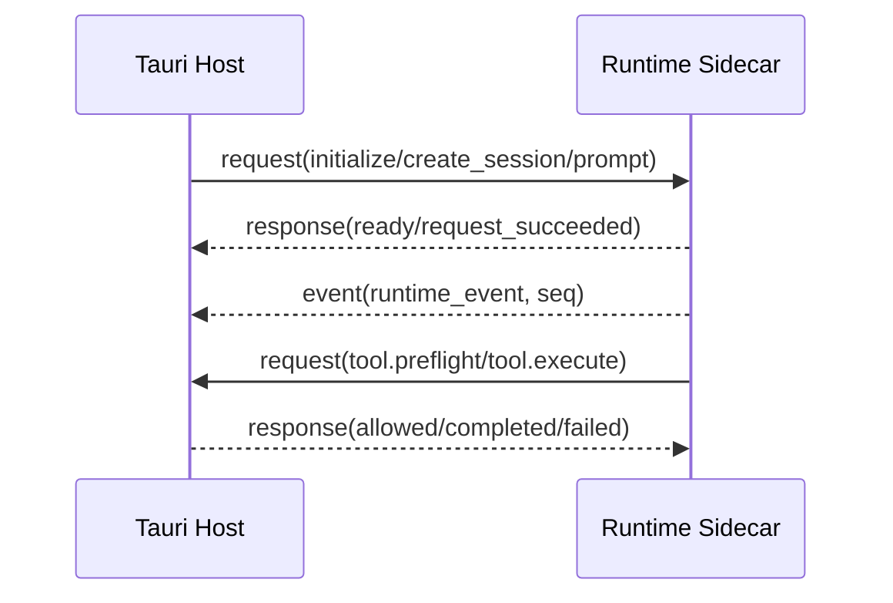

# Runtime 协议参考

> 状态：生效<br>
> 协议版本：1<br>
> 适用版本：Fox 0.1.x<br>
> 维护者：Fox Runtime 团队<br>
> 最后更新：2026-08-27

## Envelope



Runtime 与 Host 使用逐行 JSON（JSONL）。公共字段：

```json
{
  "protocol": "fox-runtime-jsonl",
  "version": 1,
  "kind": "request | response | event",
  "id": "uuid-or-runtime-id",
  "timestamp": "RFC3339",
  "type": "prompt",
  "requestId": "仅响应",
  "conversationId": "可选",
  "runtimeSessionId": "可选",
  "runId": "可选",
  "seq": 1,
  "payload": {}
}
```

stdout 只能输出 Envelope；日志必须写 stderr。Host 校验 protocol/version/kind/id/type，Runtime 只接受 request。

## Host 到 Runtime

### 冻结控制与受控 Kernel 交接

`RunControlBinding` 冻结 Run/Conversation、引擎、权威模式、执行 Profile、权限内容及哈希、只读执行位置和四类时间预算。Pi Legacy `prompt` 只接受 Legacy/Pi；显式空值、损坏绑定或不同身份拒绝。仅缺省字段保留旧 v1 兼容。

Kernel 的受控适配入口使用下列共享 DTO；它们尚不是默认 sidecar 命令，不改变上文 Envelope 版本或默认 Legacy 路径：

| DTO | 权威内容与约束 |
|---|---|
| `KernelEngineBatchCheckpoint` | 原始历史与 assistant 工具提议，同提议、审批和工具事实一次落库并校验内容哈希 |
| `KernelBatchResumeFrame` | 已落库的整批结果；绑定 Turn/Batch、事件游标和交付幂等键，结果按 source order 排列，缺失或未终结结果拒绝 |
| `KernelModelResponse` | 同一 Run/Turn/Batch 和游标对应的新 assistant 消息；只接受完整回答或合法工具提议，不允许 Node 提供替换历史或下一批身份 |

受控 Pi 会话关闭自动重试和自动压缩，只暴露提议用工具描述而无资源执行器；公开的、被等待的 `message_end` 边界在任何工具准备之前停止该回合。Host 从原始检查点和持久结果构造下一批历史，重新决定权限和审批。交付领取与模型超时起点同事务提交；模型响应、下一批或完成决定、交付完成也同事务提交。已发送但结果不确定的交付不能自动重播。

上述路径已用于真实 Pi 子进程与 SQLite/Rust 受控联测，不代表默认 `resume_session` 已恢复待审批工具，也不代表 Tauri UI 或生产切权已经验收。

### 默认命令

| type | 必需上下文 | 说明 | 响应 |
|---|---|---|---|
| `initialize` | payload.modelService + executionProfile + executionStrategy | 模型、能力与受支持执行策略初始化 | `ready` |
| `create_session` | conversation/session | 新建检查点 | `session_created` |
| `resume_session` | sessionPath | 恢复检查点 | `session_created` |
| `evaluation.run` | 无 | 运行内置确定性离线评测；不要求模型初始化 | `evaluation_report` |
| `prompt` | conversation/session/run + assistantPackage + expertBinding? + expertPackage? + projectContext/workSnapshot | 开始异步推理 | `request_succeeded` |
| `cancel` | run | 中止运行 | `request_succeeded` |
| `shutdown` | 无 | 关闭进程 | `request_succeeded` |

普通运行响应仅表示请求已接收；Run 完成以事件为准。`evaluation_report` 是例外：它同步返回 schema v4 固定清单报告，不创建 Conversation/Run、不读取项目、不调用模型或网络，由 Host 校验并持久化报告 Hash、身份 Hash、分类、重复运行聚合、硬门槛和套件摘要。

`assistantPackage` 表示 `conversations.agent_id` 对应的基础助手；`expertBinding` 仅在当前会话有 active 专家时携带绑定 ID、专家 ID、版本与 Hash；`expertPackage` 来自绑定时冻结并经 Hash 校验的静态执行包，再叠加当前 Run 的 Skills、知识和 Host 授权。Runtime 对助手和专家 `allowedTools` 逐层过滤，MCP scope 也取交集；这些字段不能授予 Host 未注册或未批准的能力。

### Execution Profile 初始化

Host 只允许五个可穷举 Profile：`legacy`、`durable_v2_shadow`、`durable_v2`、`graph_readonly_preview`、`graph_reviewer_v1`。前四个是普通执行选择；`graph_reviewer_v1` 只能由 Host 内部创建的独立 Reviewer Child使用，固定 `completionAudit=strict_v2 / validationPolicy=high_risk_v1 / promptPolicy=graph_reviewer_v1 / continuation=disabled / graph=disabled / toolPolicy=graph_reviewer_read_only`。Profile 不接受任意布尔开关或混搭 Strategy。Host 默认发送 `legacy`，并逐字段校验 `ready.payload.executionProfile`、Graph 配置与 `continuationDecisionContract`；任一字段不一致时 Worker 初始化失败。`ready.capabilities.tools` 中每个工具必须属于所选 Profile allowlist，并在 `name/category/execution/approval` 上精确匹配 Host canonical catalog。

Profile 在一个 Worker 生命周期内固定，不能逐 Run 热切换。`task_repair_escalate_start` 只出现在 `durable_v2` 的模型工具面。`graph_readonly_run` 只允许 `graph_readonly_preview`。持久 Host 工具 `graph_readonly_activate` / `graph_readonly_snapshot_get` / `graph_readonly_node_start` / `graph_readonly_node_finish` / `graph_readonly_node_cancel` / `graph_readonly_node_review` / `graph_readonly_accept` 只允许 `durable_v2` Lead；内部 Reviewer 看不到这些工具。`graph_reviewer_v1` Ready Manifest 必须精确只有 Runtime/preflight 的 `read/ls/find/grep`，`sideEffectsAllowed=false`，不允许 `continuation_propose`、Host审批工具、MCP、delegation或Work Tool。工具权限不是单门判断：当前 Worker Profile、Run 在 SQLite 的 Host 冻结 Profile和 `ready.capabilities.tools` 必须三方一致且都允许。v34 之前没有冻结快照的 Legacy Run 才可回退 Legacy，不能借此获得 Durable/Graph/Reviewer 权限。

Runtime 隐藏只减少模型暴露面，不构成权限事实。旧客户端、历史 transcript、恶意/失控模型或事件重放若直接提交上述 Workflow mutator，Host 必须再次绑定当前 Run 的权威 Profile 并拒绝，不能因请求绕过 Catalog 就执行。`durable_v2` 的动态 Execution Profile 指令会说明“接入统一 Attempt/Acceptance API 前暂不可用”；该说明属于动态尾部，不改变 `stable_v1` content/stable-prefix Hash。

## Runtime 到 Host 的请求

- `tool.preflight`：只接受 canonical `execution=runtime / approval=preflight` 的工具，校验只读工具路径与权限。
- `tool.execute`：常规接受 canonical `execution=host` 的工具，执行附件、写入、命令、通用 Host 能力、知识、MCP、A0/A1 工作闭环、持久只读 Graph 或 A5 Child Run 工具。仅当 Run 冻结 `readOnlyExecutor=rust` 时，另允许将 canonical 只读工具交 Rust Resource Gateway；Host 校验预检规范化参数与不可变原始参数一致，失败不回退 Node。

Host 返回 `tool.preflight_allowed/blocked` 或 `tool.execute_completed/failed`，并使用原请求 `requestId` 关联。两个请求以及全部 `runtime_event` 在处理前都必须携带非空 `conversationId/runId/runtimeSessionId`；Host 将三者绑定到当前 Worker 的 conversation、active run、runtime session，并从 DB 核对 `runId` 的权威会话归属。任何不匹配在非 Shadow 路径 fail-closed，Proposal 的 conversation 只能从 DB 派生，不能采用 Runtime 自报值。工具生命周期事件还必须携带非空 `tool`，先复核同一 Profile/Manifest canonical tuple，再重验 delegated、Assistant 与 Expert scope。匹配 Host-owned ToolCall 的 Runtime lifecycle echo 仍作为原始 RunEvent 保留，但 Event projector 对它 no-op，不能覆盖 Host 已持久化的 status/result/error。

### Phase 1.5A 内存态只读 Graph

`graph_readonly_run` 是 `category=project-read / execution=runtime / approval=none` 的包装工具；`approval=none` 只表示包装器本身不访问资源，每个节点内的 `read/ls/find/grep` 仍逐次调用 `tool.preflight`。输入只接受 1–3 个 `{id, task, dependsOn?}` 节点，拒绝任何模型/角色/工具/持久 ID/Writer 覆盖。Runtime 在启动前用确定性拓扑校验拒绝重复 ID、未知依赖、自依赖、环和深度大于 1；同层使用有界并行，依赖只认 `accepted` 的非空终态报告，失败后代为 `skipped`，无关分支继续。节点 Session 禁用扩展、Skills、Prompt 模板、Context Files 和图片，只注册四个只读项目工具；节点与总 Graph 都有固定工具、时间、Token、读取和返回字符预算。取消会 abort 活动 Session，并使迟到结果不能覆盖 cancelled。

这一工具的输出与外层 ToolCall 通过普通 Runtime Tool Event 持久化，足以审计一次可重跑的只读预览；它不会发出可伪造成权威状态的 `graph.*` 事件，也不写 `work_tasks`、Child Run、Evidence 或 Acceptance。应用在预览中断后可以安全重跑只读节点，但不能恢复节点级执行栈。完整 Phase 1.5 必须另由 Host Graph Tool、Task Edge、Child Run/Attempt 映射和 SQLite 事务实现，不能把本工具结果当产品任务事实。

### Phase 1.5B PlanRevision Graph 输入合同

`plan_revision_create` 保持原有串行计划兼容：`tasks` 可继续只传 1–64 个 `{title, detail?, ordinal}`，串行标题最长 500 字符。只要任一 Task 出现 `nodeKey`、`dependsOn` 或 `acceptanceCriteria`，整份修订就切换为完整的只读 Graph 合同，禁止串行/Graph 形状混用：所有节点都必须提供 `nodeKey` 与 1–8 条 `acceptanceCriteria`，`dependsOn` 可省略为空依赖；整图最多 3 个节点、`ordinal` 必须从 0 连续、Graph 节点标题最长 300 字符，`nodeKey` 只能使用最长 100 字符的 ASCII 字母/数字/`._-` 且全图唯一。依赖必须同图存在、不得重复、自依赖或成环，最长路径深度不得超过 1；每条验收标准必须是去首尾空白后仍非空且最长 1000 字符的唯一字符串，详情最长 4000 字符。

Runtime TypeBox 用互斥的串行/Graph item schema、`additionalProperties=false`、长度/数量/格式/唯一性约束挡住明显坏输入；Rust Host 不信任 Runtime Schema，会重新检测 Graph 模式、拒绝未知字段并完成连续序号、引用、环与深度校验，再按 `ordinal` 规范化后保存。`status/ownerRunId/attempt/evidence/accepted/readiness` 等运行态字段不属于计划输入，不能被模型写进 PlanRevision。修订仍先保持 `proposed`，必须由用户审批；后续激活只接收 `planRevisionId`，不接受第二份节点定义。

### Phase 1.5B 持久只读 Graph Host 工具

canonical tuple 固定为 `graph_readonly_activate / work / host / none`、`graph_readonly_snapshot_get / work / host / none`、`graph_readonly_node_start / work / host / none`、`graph_readonly_node_finish / work / host / none`、`graph_readonly_node_cancel / work / host / none`、`graph_readonly_node_review / work / host / none` 与 `graph_readonly_accept / work / host / none`。七个工具只在当前 Worker 和冻结 Lead Run 都为 `durable_v2` 时出现在 Ready Manifest、每 Run 模型工具面并允许执行；其他 Profile 均 fail-closed。`graph_readonly_activate({planRevisionId})` 要求修订已批准，Host 把真实数据库 `tool_calls.id`（不是 Runtime `toolCallId`）作为 `activation_tool_call_id` 注入 Repository，在同一事务冻结不可变 Spec、Node 与 Edge。Repository 还复核 ToolCall 名称、`execution_location=host`、`status=running`、`requires_approval=false`、精确 input JSON 和 Run/Conversation 归属。完全相同调用可精确重放；换 Plan、身份或输入则冲突，不会建立第二张图。

`graph_readonly_snapshot_get({goalId})` 只读现有投影；未激活时稳定返回 `{activated:false, graph:null}`。激活后 GraphId 等于 GoalId，Node 复用 WorkTask，Edge 复用 `work_task_edges`，每个节点返回当前 `taskVersion` 供 CAS；readiness 从 Task、依赖、当前 policy-matched succeeded Attempt、该 Attempt 仍引用的 Valid Evidence，以及未关闭的 medium/high/critical Finding 派生。

`graph_readonly_node_start` 的模型输入严格为：

```json
{
  "goalId": "...",
  "taskId": "...",
  "expectedTaskVersion": 1,
  "attemptId": "...",
  "workerAgentId": "fox-general",
  "objective": "...",
  "context": "...",
  "budget": {
    "maxDurationMs": 45000,
    "maxTotalTokens": 4096,
    "maxOutputTokens": 1024,
    "maxToolCalls": 6
  }
}
```

TypeBox 与 Rust 均关闭额外字段。模型不能传 `allowedTools`、Execution Profile、Run/Conversation、authority、执行位置、审批或 ToolCall ID；Host 注入当前 depth-zero primary Lead Run 和真实数据库 `tool_calls.id`。Repository 在一个 `IMMEDIATE` 事务内重验 active Goal、已激活 Graph、没有 revision 更高且状态为 `proposed|approved` 的权威候选、节点 `runnable + queued`、Task version CAS 和准确 Host ToolCall，再复用现有 Attempt/Child 内核原子创建父 Lead Run owned Execution Attempt、隔离 Child Conversation/Run/Message/delegation，并冻结 Child `durable_v2`。新 PlanRevision 一旦 approved，旧 activated revision 会变成 superseded，因此旧 immutable Graph 即使从新的同会话 durable Lead Run 恢复，也必须以 `graph.readonly_plan_changed` 拒绝且不改变 Task/Attempt/Child facts；rejected 或仅 superseded 的更新历史不算当前权威候选。Child allowlist 由 Repository 硬编码为 `read/ls/find/grep`；预算上限为 45 秒、4096 total tokens、1024 output tokens、6 次工具调用。

exactly-once 分两层：Repository exact replay 必须匹配同一 ToolCall/Attempt/Child/Worker/objective/context/budget/scope，但只返回 `replayed=true`，不再产生派发令牌；Host common finalizer 先把 fresh ToolCall 成功结果持久化，再消费仅 `created=true && replayed=false` 才有的一次性派发令牌。Host terminal replay 在最早事实门直接返回持久结果，也不进入 Repository 或 Child dispatch。稳定错误码包括 `graph.readonly_node_not_runnable`、`graph.readonly_node_version_conflict`、`graph.readonly_node_budget_invalid`、`graph.readonly_plan_changed`、`graph.readonly_node_start_source_invalid` 和可重试的 `graph.readonly_repository_busy`。

`graph_readonly_node_finish` 的 exact 模型输入是 `{goalId,taskId,attemptId,expectedTaskVersion,expectedAttemptVersion,criterionEvidence,summary}`；`criterionEvidence` 含 1–8 个 `{criterion,evidenceIds}`，每项 1–16 个 ID、总绑定不超过 100。criteria 必须与冻结 JSON 的顺序和文本完全一致；同一 Evidence 可覆盖不同 criterion，同一 criterion 内禁止重复。模型不得提交 Lead/Child Run、ToolCall、policy、Profile、authority 或审批字段，Host 注入当前 Lead Run 与真实数据库 `tool_calls.id`。

Repository 只允许父 Lead 完成它启动且仍 running 的 Graph Attempt，并在单个事务内重验 Task/Attempt CAS、active Goal、没有更新的 `proposed|approved` PlanRevision、权威 completed Child 及非空结果。每条 criterion 必须绑定当前 Attempt 水位之后、同 Task/Conversation、`source_run_id` 为当前父 Lead且重新验证仍 live 的 Evidence；引用 ToolCall 也必须属于该 Lead、晚于 Attempt 启动、completed 且无错误。MVP allowlist 精确为 Runtime/preflight/none 的 `read/ls/find/grep` 和 Host/none 的 `git_read/structured_data/tabular_data`、Host/always 的 `sqlite_read`（均为 inspection），以及 Host/always 的 `test_run/code_check`（`test_result + test`）；同名但 location/approval 位不同、manual/review/空 checkType、旧或旁 Run ToolCall都拒绝。standard policy 仍要求 Attempt 至少有一条 fresh inspection。

成功写入顺序固定为 immutable finish header（含 Child result hash）→ criterion bindings → 复用通用 Attempt finish/Task complete；任何失败全部回滚且不创建 Goal Acceptance。Repository exact replay只返回既有事实，Host terminal replay不再执行 handler。Graph readiness 只有在 header 和全部当前 live bindings 齐全时才投影 `accepted`，所以 generic start/finish、伪造 succeeded、stale Evidence 都不能解锁依赖。Child completed 只是必要来源事实，绝不等于 accepted。`standard_v1` 可直接走上述机械门；`high_risk_v1` 还必须具备 v39 当前 Attempt、完整candidate和live Reviewer proof均匹配的独立pass，否则返回`graph.readonly_review_required`或`graph.readonly_review_candidate_mismatch`且零写入。激活 Run 只作审计；同一 Goal Conversation 的新 depth-zero primary `durable_v2` Lead Run 可以接续仍有权威的旧 Graph。Runtime lifecycle echo 只能保留原始 RunEvent，不能覆盖 Host 结果。

`graph_readonly_node_cancel` 的 exact 模型输入只有 `{goalId,taskId,attemptId,expectedTaskVersion,expectedAttemptVersion,reason}`，两项版本至少为 1，`reason` 是无首尾空白的 1–2000 字符字符串；额外字段一律拒绝。Child/parent Run、delegation、状态、Profile、authority、审批与 ToolCall 身份都由 Host/Repository 推导，当前只允许 `standard_v1`。Repository 的 `IMMEDIATE` 事务只创建 immutable pending cancel intent，并重验 active Goal、当前权威 PlanRevision、父 Lead、running execution Attempt、Task/Attempt CAS、唯一 Graph delegation、非终态 Child 与真实 running Host ToolCall；这一步绝不发送取消。

common finalizer 成功写完 ToolCall 后，Host 才把 intent 单向激活，再向真实 Child Host 发送 cancel。finalizer 失败时 pending intent 永久惰性；同 ToolCall/同输入精确重放复用原 intent，输入变化冲突；Host terminal replay不再执行 handler或发送信号。激活后的 intent 是 durable outbox：启动顺序固定为同步 terminal delegation → Graph Child reconciliation → 原 owner-run audit → RuntimeHost 建立后扫描仍 active 且 Child 非终态的 intent 幂等重发。物理 signal 可 at-least-once，数据库 intent/终态事实 exactly-once；没有 live Child Host 只会保留 active intent、把 Run 保持在 `cancelling`，绝不伪造 `run.cancelled`。

激活不等于取消完成。Child 若先 completed，cancel 输掉竞态，Attempt 继续等待专用 finish/review；Child 若实际 failed/cancelled/interrupted，则同一事务写 immutable terminal reconciliation，再复用内部 Attempt finish，分别映射为 failed/cancelled/failed，Task 统一进入 interrupted，不创建 Acceptance、不解锁依赖，也不自动 skip。普通 `child_run_cancel` 对 Graph-bound Child 稳定返回 `graph.readonly_dedicated_cancel_required`；普通 `task_attempt_finish` 对 Graph Attempt 的 succeeded/failed/cancelled 全部 fail-closed。

`graph_readonly_node_review` 的 exact 模型输入为 `{goalId,taskId,attemptId,expectedTaskVersion,expectedAttemptVersion,criterionEvidence,summary}`，复用 node finish 的 1–8 criteria、每项 1–16 Evidence、总绑定不超过100及相同文本/ID上限。Reviewer/Child/Lead/Plan/Profile/status/authority/ToolCall一律不是模型字段。Repository只先写 immutable pending request并冻结当前 Plan/spec、high_risk policy/hash、implementation Child result hash、criterion↔Lead Evidence candidate/hash；common finalizer将真实review ToolCall写成completed后，Host才激活request并调用Repository创建Reviewer。finalizer失败的pending request永不派发；相同ToolCall/input exact replay复用，changed input冲突，Host terminal replay不二次执行directive。

Reviewer复用当前Assistant package，但使用Host派生的agent ID与新建的独立Child conversation/run/delegation；它必须不同于parent Lead、implementation Child和任何Task Attempt Run。Host强制内部 `graph_reviewer_v1` Profile、`allowedTools=[read,ls,find,grep]`、无MCP/delegation/approval/write，以及固定45秒、4096 total tokens、1024 output tokens、6 ToolCalls。没有模型可见collect；Host在真实Reviewer终态后先同步delegation，再调用Repository settle。completed结果必须是 exact JSON `{criteria:[{criterion,status,toolCallIds}],recommendation,summary,findings}`。`findings` 限 0–16 项，item 只允许 `{criterion,severity,title,detail,toolCallIds}`；criterion 必须等于对应冻结 criterion 且该 criterion status=failed，severity 只能为 `critical/high/medium/low/info`，title 1–200，detail 1–2000，toolCallIds 1–16、item 内唯一且是该 criterion proof IDs 的子集。pass 要求全部 passed 且 `findings=[]`，revise 要求至少一项 failed 且 findings 1–16，inconclusive 要求 `findings=[]`。criteria 必须与冻结项同序，每项至少绑定一个全局唯一、有界的 Runtime ToolCall ID。Repository以Reviewer Run和`runtime_tool_call_id`解析该ID，再把内部`tool_calls.id` UUID冻结到proof；只接受review启动水位之后真实completed的canonical `runtime/preflight/approval=false` `read/ls/find/grep` ToolCalls。Repository从这些事实机械计算pass/revise，不能凭模型的推荐文字pass。v39 只保存 immutable decision JSON，不投影 generic review_findings。`revise` 通过专用事务把Attempt/Task投影blocked且不开新Attempt；failed/cancelled/interrupted或非法JSON只settle为inconclusive，不自动repair/retry。

pass仍不等于Node accepted。Lead调用`graph_readonly_node_finish`时必须逐字复用review冻结的完整`goalId/taskId/attemptId/expectedTaskVersion/expectedAttemptVersion/criterionEvidence/summary`，不允许只复用bindings却更换summary或版本；Repository重新验证review request input/hash、decision/proof、Lead Evidence、implementation Child hash与Plan/policy后才复用既有finish事务。已有pass但完整candidate不一致时返回`graph.readonly_review_candidate_mismatch`；完全没有当前Attempt pass时返回`graph.readonly_review_required`。standard节点不要求Reviewer。混合DAG只有真正accepted的节点才能解锁依赖。

`graph_readonly_accept` 的 exact 模型输入只有 `{goalId,expectedGoalVersion,summary}`，summary为1–4000 canonical字符；模型不能提交Plan/checks/Evidence/reviewer/status/authority。Repository先写pending Graph Acceptance intent，common finalizer完成真实ToolCall后Host才activate。最终`IMMEDIATE`事务重新要求active Goal和Goal CAS、当前最新approved Plan且无更新proposed/approved候选、非空Graph、每个节点当前accepted、所有Child/Evidence/review/hash仍权威，并拒绝任何open Graph-linked finding，包括low/info；然后原子写immutable Graph Acceptance、通用Acceptance投影和Goal completed。generic `acceptance_submit`、`goal_complete` 与Graph Attempt的generic finish返回`graph.readonly_dedicated_accept_required`或对应dedicated错误且零副作用。Child completed、review pass、Node accepted与Goal accepted是四种不同事实。

Reviewer dispatch采用数据库exactly-once、物理at-least-once。启动恢复只扫描activated且未settled的request：先同步真实Child terminal并settle，再对仍authoritative nonterminal且未有live Host的Reviewer幂等重发；pending、failed ToolCall、stale Plan/Goal/Attempt不执行。已由completed ToolCall激活但尚未提交的Graph Acceptance也由startup重试，Repository在每次activate末端重新CAS。cancel/implementation Child terminal/review/accept竞态均以Repository首个权威事务为准；review pass不直接改变Attempt，因此先到的cancel、negative terminal或Plan变更会使后续finish/accept fail-closed。

这一合同参考 Maka `../maka-agent-main/packages/core/src/agent-graph-topology.ts`、`../maka-agent-main/packages/runtime/src/stream-graph-readiness.ts::buildAgentGraphReadinessSnapshot`、`stream-graph-dispatch.ts::dispatchIntent`、`stream-graph-schedule-reconcile.ts::applyScheduleStops` 与 `stream-graph-projection.ts::terminalStatusFromFacets` 的 committed readiness、claim-before-dispatch与终态投影；参考 Kun `../Kun/kun/src/graph/graph-scheduler-policy.ts::{deterministicReview,reviewDisposition}`、`graph-control-service.ts::GraphControlService.recordReview`、`graph-run-completion.ts::tryCompleteGraphRun` 与 `graph-recovery-service.ts::reconcile` 的机械审查前置、Reviewer身份分离、immutable review event与恢复；参考 Codex `../codex-latest/codex-rs/protocol/src/plan_tool.rs` 的 strict input，`../codex-latest/codex-rs/core/src/spawn.rs::spawn_child_async`、`agent/control.rs::interrupt_agent` 与 `session/mod.rs::Session.forward_child_completion_to_parent` 的隔离Child和“Child完成只是父级通知”；参考 DeepSeek-Reasonix `../DeepSeek-Reasonix/internal/recovery/reviewer.go::{PolicyPrompt,Session,Review}` 的bounded strict JSON和不可信Evidence、`gate.go` / `decision.go::Decide` 的Host facts / pure decision及`persist.go::{SaveSnapshot,LoadSnapshot}`的恢复边界。Fox只吸收这些边界，仍把状态、Attempt、Evidence、权限与exactly-once落回现有Host/SQLite；不复制Maka/Kun第二套Graph状态机或自动retry、Codex checklist/in-memory acceptance、Reasonix verdict-alone reviewer、low-risk fail-open或文件快照。

需要审批的 Host Tool 只有在 Approval 仍为 `pending`、关联 Tool Call 仍为 `pending` 且 Run 仍为 `running` 时才能通过同一事务的 CAS；`AllowConversation` 只有 CAS 成功后才可写入永久会话权限。批准后、执行副作用前，Host 还必须原子 claim 该 Tool Call；若 Run 已终态或取消，迟到批准返回无效，不写权限也不执行工具。显式取消把未决审批终结为 `cancelled`；完成、失败、中断、Crash、应用启动恢复或新 Run 边界把失去上下文的旧审批终结为 `expired`，同时清除内存等待者并保留数据库审计记录。

`list_mcp_tools` 与 `call_mcp_tool` 是兼容名称下的统一扩展源工具：source 可为持久 stdio MCP、Streamable HTTP MCP 或 OpenAPI Connector。Runtime 不感知连接方式、Session ID 或凭据；Host 负责工具发现、Schema 校验、审批、超时、健康更新和连接回收。工具成功结果可包含 `hookAnnotations`，表示 `before_tool/after_tool` 声明式策略注解；阻断与强制审批由 Host 在执行前完成，Runtime 不能覆盖。

Run 分派和终态还会触发 `before_run/after_run` 审计，但不会新增 Runtime 可执行回调。Fox 不把任意 Hook 脚本、HTTP Header、MCP Session ID 或 OpenAPI 定义传入模型上下文。

知识工具保持现有名称并使用 source-aware 参数。`list_knowledge_bases`、`search_knowledge` 和 `read_knowledge_document` 根据 `KnowledgeReference.source` 路由到本地或远程 Provider；历史只传 `knowledgeBaseId` 的请求按远程语义兼容。Runtime 不直接调用任何 `local_knowledge_*` Tauri 命令。本地知识图谱尚不可用时，`query_knowledge_graph` 返回 `local_knowledge.graph_unavailable`，不能用空结果冒充“没有关系”。

### 通用 Host 工具

| 工具 | 核心输入 | category / approval |
|---|---|---|
| `web_search` | `query`、`provider=auto\|brave\|tavily\|exa\|searxng\|duckduckgo`、`maxResults?`、域名包含/排除列表 | `skill / always` |
| `web_read` | `url`、`format=markdown\|text`、`maxChars?` | `skill / always` |
| `http_request` | `method?`、`url`、精确 `allowedHosts`、安全 Header、`body?`、`timeoutSeconds?` | `skill / always` |
| `system_info` | `includeProcesses?`、`maxProcesses?`、`includeEnvironment?` | `skill / always` |
| `sqlite_read` | 项目内 `path`、单条 `query`、位置参数、`rowLimit?`、`timeoutSeconds?` | `project-read / always` |
| `structured_data` | `action`、`data?` 或 `path?`、输入/输出格式、`query?`、`requiredKeys?` | `skill / none` |
| `git_read` | `operation=status\|diff\|log\|blame`、`path?`、引用与分页参数 | `project-read / none` |
| `test_run` | `runner?`、`script?`、`target?`、`cwd?`、`timeoutSeconds?` | `process / always` |
| `code_check` | `check=auto\|lint\|typecheck`、`ecosystem?`、`cwd?` | `process / always` |
| `format_code` | `mode=check\|write`、`ecosystem?`、`path?`、`cwd?` | `project-write / always` |
| `tabular_data` | `operation=preview\|filter\|aggregate`、`data?` 或 `path?`、筛选/聚合参数 | `project-read / none` |

网络、系统、数据库、进程和格式化工具由 Host 执行并进入 `tool_calls`；需要审批的调用同时进入 `approvals`。表中的 `git_read` 仅描述 Legacy/可写 Profile 的现有 Host 工具，`durable_v2_shadow` 与 `graph_readonly_preview` 不会注册或执行它。`web_search` 的 `auto` 模式优先使用已配置 Provider，没有配置时自动回退到无 Key 的 DuckDuckGo HTML 搜索，不得向普通用户要求注册额外搜索 API Key。`web_read` 只接受公开 HTTP/HTTPS 地址，逐跳重新解析并验证重定向；正文最大 2 MiB。`http_request` 只访问调用中列出的精确公网 Host，阻止私网、跨 Host 重定向和认证 Header，请求/响应分别限制为 1/10 MiB，最长 15 秒；认证 API 必须改用 Keyring-backed OpenAPI Connector。`system_info` 只输出 CPU、内存、磁盘、有限进程摘要和固定安全环境变量白名单。`sqlite_read` 只打开授权项目内文件，连接和 Statement 双重只读，最多 1000 行、100 列、2 MiB、5 秒。进程工具使用程序名与参数数组直接启动，不通过 Shell，输出最大 512 KiB，超时范围 1–600 秒；测试或静态检查返回非零码时，工具调用本身成功完成并在 `details.passed=false` 中报告检查失败。结构化和表格文件必须位于授权项目且最大 4 MiB，当前表格首版不支持 XLSX。

### A5 Child Run 工具

四个工具固定为 `category: delegation`、`execution: host`、`approval: none`。`approval: none` 只表示创建/查询/取消 delegation 本身不需审批；Child 内部调用高风险工具时仍走真实 ToolCall 与 Host 审批。

| 工具 | 核心输入 | Host 结果 |
|---|---|---|
| `child_agent_list` | 空对象 | `agents[]` |
| `child_run_start` | `objective`、`context?`、`agentId?`、`budget?`（当前仅支持 `maxDurationMs`） | `childRun`、`created` |
| `child_run_collect` | `childRunIds`（1–8）、`waitMs?`（0–60000） | `childRuns`、`allTerminal` |
| `child_run_cancel` | `childRunId` | `cancelled`、`childRun` |

Graph-bound Child 不能使用通用 `child_run_cancel`；必须走 `graph_readonly_node_cancel`，否则 Host 会在任何取消副作用前返回 `graph.readonly_dedicated_cancel_required`。

普通 `child_run_start` 只允许声明 `maxDurationMs`，Host 在固定安全范围内规范化并继续硬性执行运行时长、深度、并发、权限交集和重复同参工具循环保护。累计 Token、输出 Token 和工具调用次数保留为观测指标，不再作为普通 Child 的终止门，避免长审查或多轮检索在正常工作中被固定计数截断。Graph implementation/Reviewer 属于 Host 内部专用执行 Profile，仍可使用其固定、不可由模型改写的确定性计数预算。`objective/context` 应优先传项目相对路径、符号名和行范围；仅对未保存内容、很短的必要摘录或 Child 无法访问的数据内联全文。`child_run_start` 以 `(parent_run_id, toolCallId)` 幂等；collect/cancel 只接受当前 parent 的直属 Child。父子共用 Trace ID但使用不同 root span。Child 的工具和 MCP scope 是父 Assistant、父 Expert 与 Child Agent 声明的交集，Runtime 侧过滤后 Host 仍会再次拒绝越权请求。

## Runtime 事件

外层 type 为 `runtime_event`，实际事件在 `payload.type`：

| 事件 | 关键字段 |
|---|---|
| `run.started` | model |
| `run.request_snapshot` | model, provider, assistantPackage, expertBinding, expertPackage；`stablePromptHash/contextHash`；Prompt definition/version/content Hash、Typed Context Schema Hash、stable/dynamic cache identity 与 read/write diagnostics；Assistant/Expert 声明工具、有效工具、排除原因、token limits；`retryPolicy`（Provider HTTP 重试与 Turn 重试的独立上限/退避） |
| `run.continuation_proposed` | proposal-only `ContinuationDecision v1`；不是终态或 Host 事实 |
| `run.phase` | phase, attempt?, outcome? |
| `run.retrying` | attempt, maxAttempts, delayMs, message |
| `run.retry.completed` | success, attempt, finalError? |
| `context.compaction.started` | reason |
| `context.compaction.completed` | reason, aborted, willRetry, errorMessage? |
| `planner.started` | model |
| `planner.completed` | durationMs, planHash, stepCount, needsGoal |
| `planner.failed` | code, message, fallback |
| `message.started` | role, kind |
| `message.delta` | delta |
| `reasoning.delta` | delta, source |
| `tool.started` | toolCallId, tool, input |
| `tool.updated` | toolCallId, update |
| `tool.completed` | result, isError |
| `source.added` | document/chunk/page/anchor metadata |
| `usage.updated` | Run 累计 inputTokens/outputTokens/cacheReadTokens/cacheWriteTokens/totalTokens |
| `message.completed` | 无 |
| `run.completed` | 无 |
| `run.cancelled` | 无 |
| `run.failed` | code, message |

知识库远程 Runtime 还可产生 `user.question.requested/responded` 和 `run.interrupted`。所有事件必须有单 Run 单调递增 `seq`。

`usage.updated` 使用固定 `run_cumulative_v1`：五个 token 字段全部必需，均为 `0..10^12` 的整数，`totalTokens >= inputTokens + outputTokens + cacheReadTokens + cacheWriteTokens`，同 Run 每个分量只能不减。Host 在写 `run_events`、Trace 或 Child/Digital 投影前重验 exact shape、数值与上一条权威 Usage；失败整事务回滚且不推进 `last_seq`。它只允许在 `running/cancelling` Run 上出现；四种终态之后一律拒绝 late usage。

数字同事在 Trigger 接受事务中把本 Run 的 duration/total/output/tool-call、每日 token 上限与每日窗口写入 `runs.budget_json` 的 `digital_colleague_run_budget_v1` 冻结快照；后续配置变化不能改本次 Run。有效 `maxOutputTokens` 是“同事配置、当日剩余额度、Model Service 上限”的最小值；低于 Host 最小输出量时 Trigger 在创建 Run 前以稳定预算错误拒绝，不能为了满足 provider 最小值反向抬高。该值同时作为 provider 单次生成上限以提前约束模型，但 Host 仍按本 Run cumulative output 执行硬门；daily total 继续跨同日计划 Run 累计。fresh ToolCall 原子占槽、promotion/Approval claim 二次预算核验以及 completion 的 tool count 防御与 Child 相同；Digital 额外在 acquisition、claim 和 `run.completed` 同事务检查冻结 daily window/total。下一 ToolCall 与 monitor 只负责提前取消；`run.completed` 的 Repository 原子门会再次检查 frozen duration/total/output/daily 及 `count <= maxToolCalls`，token/time 边界为 `>=`，拒绝时映射 `digital_colleague.budget_exceeded` 或 `digital_colleague.tool_budget_exceeded` 并保证最终非 completed。

Run 终态事件采用完整 payload 冻结：相同终态的高序号重放只有在 canonical JSON（包括未知扩展字段）与首次记录完全相同时才幂等成功，只推进水位，不追加第二条终态事件，也不重写 Trace。Run 终态后的 Runtime allowlist 没有其他成员：Message、Tool、Reasoning、Question、Work/Continuation、Usage 和未知事件全部拒绝并回滚。`run.completed(completionReason=awaiting_user)` 之后的回答不由 Runtime 往旧 Run 写 `responded`，而由 Host `create_resumed_run` 绑定既有 question、追加 parent response 并创建新 Run。

### ContinuationDecision v1

非 Legacy Profile 可使用 Runtime 本地 `continuation_propose`，但该工具不会发出 `tool.execute`。Runtime Event 的 `proposal` 固定包含 `schemaVersion / decisionId / runId / eventCursor / decision / reasonCode / activeTaskIds / evidenceIds / missingAcceptance / nextAction / retryClass / blockedDependencyRefs`，以及 `proposalOnly=true`、`hostValidationRequired=true`、`sideEffectsApplied=false`、`shadow` 和 `executionProfileId`。

Host 要求 `eventCursor` 精确等于 proposal event 的 `seq - 1`，并根据 SQLite 的 Goal、Task、Valid Evidence、Acceptance、当前 Run Pending Approval、Open Finding、阻塞状态和 `TaskLedgerProjection` 校验提议。`decisionId/runId/activeTaskIds/evidenceIds/blockedDependencyRefs` 中的 ID 最长 200 字符，每个数组最多 100 项，`nextAction` 最长 2000 字符；`wait_approval` 的 `blockedDependencyRefs` 必须非空且全部对应当前 Run 的待审批 Tool Call。

Host 先按 `(runId, decisionId)` 查找既有 Decision。Proposal core 与首次记录完全相同则直接返回首次 Host outcome，不按已经变化的事实重新计算；不同则报告冲突。新提议使用 `TaskLedgerProjection.projectionHash` 做 CAS，在稳定的 projection stale 错误上最多重建投影重试两次，因此“校验后 Evidence 失效”等竞态不会以旧事实落库。结果追加到 `run_continuation_decisions`；只有 accepted 记录可以进入 Ledger 的最新决定，rejected 与 Shadow observation 只用于审计。`run.completed` 只结束本次模型 Run，不自动完成 Goal、Task 或 Acceptance。

Host 启动时分页扫描尚未投影的 `run.continuation_proposed` 原始事件，使用 proposal 之前同 Run 的 `run.started.executionProfileId`（兼容 `run.request_snapshot.executionProfile.id`）作为权威 Profile；缺失或与 proposal 自报值不一致时拒绝，绝不允许 Runtime 通过自报 Shadow 绕过 fail-closed。每批最多 256 条；一个前台 pass 最多处理 1024 条或运行 2 秒，达到预算后在同一 Host 生命周期启动后续 pass，直至查询为空，不依赖再次重启。重复 Runtime Event 也触发相同的幂等补投影。malformed 或已拒绝输入按 `(runId,eventSeq)` 写入幂等 ingest diagnostic 后离开队首，不再阻塞后续项；Host 在写入前将 code/profile 按 Unicode 字符截到 200、message 截到 4000，低于 DB 的 4096 字符上限。

`durable_v2_shadow` 是纯观测路径：malformed、游标、重复、身份、原始事件写入、Decision append 与诊断写入错误都不得 `mark_run_failed`、Crash Worker 或改变 Legacy 可见状态，只发出/保留诊断；非 Shadow 对同类协议或持久化错误保持 fail-closed。Shadow 与非 Shadow 的判定来自 Host 当前 Profile或事件链权威 Profile，不能信任 proposal 自报字段。

`usage.updated` 的五个数值都是当前 Run 自启动以来的累计值，不是本次 provider call 的单步值。Pi mapper 每个 `executePrompt` 新建实例，因此新 Run（包括 resume session 后的新 Run）从零开始；工具回合、重试与多次 assistant `message_end` 则持续累加。每次 provider usage 的 `input/output/cacheRead/cacheWrite/totalTokens` 只接受有限、非负、安全整数；四个 component 先各自累加，单步 total 取 `max(provider totalTokens, input + output + cacheRead + cacheWrite)`，Run total 累加每个单步 total 并保证不小于四个累计 component 之和。Pi 0.84.2 供应商适配层已将 `input` 定义为扣除 cache read/write 后的非缓存输入，所以这个四项和不会重复计算 cache token。NaN、负数、浮点、非安全整数或任一累加溢出都以 `runtime.usage.invalid/overflow` fail-closed，不发出部分或降账的 `usage.updated`。Pi 事件无稳定 event ID，mapper 防止同一内存事件对象重复计费，跨进程/持久化重放仍由 Host 现有 `(runId, seq)` 幂等门禁处理。日曲线对满足单调合同的 Run 按相邻累计值 delta 归到事件发生日；对升级前没有合同版本且出现下降的 Legacy Run，保守地只把该 Run 最后一条 Usage 总量归到最后事件日，其他日计零，保证 daily 非负且总和与 latest-per-run 全局统计一致。

`cacheReadTokens` 与 `cacheWriteTokens` 由模型供应商 usage 原样分项后累加；不支持 Prompt 缓存的供应商上报 `0`。Fox 使用 `cacheReadTokens / (inputTokens + cacheReadTokens)` 作为缓存命中率，Prompt 稳定前缀和工具目录共享这一供应商口径，不伪造无法从 provider 区分的“工具独立命中率”。

### Prompt Registry 与 Typed Context v1

`run.request_snapshot` 的 Prompt 身份固定记录：

- `promptDefinitionId=fox.runtime.system`、`promptVersion=1.0.0`、完整 `promptContentHash`；
- `contextSchemaHash`，对应 `TypedContextFragment v1`；
- `promptCacheIdentity.cacheKey/stablePrefixHash/dynamicTailHash/modelId/toolCatalogHash/contextSchemaHash`；
- `promptCacheDiagnostics.read/write` 的 eligible、performed 与原因；eligibility 受 Model Profile 的 `supportsPromptCache` 约束，Composer 阶段 `performed` 固定为 `false`，不得伪造 provider 命中。

四个生产 Profile 的 `promptPolicy` 均继续为 `stable_v1`。`registry_v1` 只是开发/离线可解析版本，唯一预冻结矩阵为 `fox.prompt.registry.development.v1`，只允许 `prompt_registry_preview`，固定 Hash 为 `65c3e97d4cca918161d5bc29415f19ed26c7561cbee684d98094ee5880766322`。`freezePromptSupportMatrix` 与 `resolvePromptPolicy` 都显式拒绝 `legacy/durable_v2_shadow/durable_v2/graph_readonly_preview`；生产 `initialize` 不接收散装 Prompt Flag，也不会因 Runtime 自报或合法矩阵 Hash 而启用。未知 policy、future schema/version、额外字段、原型继承键和篡改 Hash 均 fail-closed。

动态上下文必须先成为 `TypedContextFragment v1`。Fragment 固定包含 `id/kind/authority/trust/version/hash/budget/lifecycle/content`，目前 Composer kind 使用固定 allowlist；裸字符串不能直接进入 fragment set。唯一 renderer 会对 opening/closing、大小写、空白及 JSON slash 形式的伪造 marker 等长执行 `<`→`[`，再以中和后的字符做片段预算和最终总预算断言。最终集合必须恰好包含一个真实 `kind=work_snapshot, authority=host, trust=host_verified`；durable/graph Profile 放不下最小 WorkSnapshot 时拒绝，Legacy 的稳定合同保留语义不变。Fragment Hash 与最终有界渲染 Hash 分开记录：前者证明安全化后的来源信封未被篡改，后者说明本轮实际发送了哪些字符。

Prompt Experiment/Report 不是 Runtime 双跑协议。仅允许 offline replay、mock、read-only shadow，并要求 filesystem write、external network、MCP action、Child Run、billable call、external message、production write、silent dual run 全部显式为字面量 `false`；缺失、未知、`null` 或其他类型全部拒绝。门槛和 score 不接受 `null`/数字字符串，`tokens/safetyFailures` 只接受非负整数。实验报告的 safety gate 为零容忍；rollback 只生成 `keep_baseline` 建议，`applied=false`，不能写 Host、文件或生产 Registry。

## A0/A1 工作闭环工具

Runtime 只能经 `tool.execute` 提交以下命令，Host 校验当前 `conversationId`、Run、实体归属、输入和状态转换后，调用 Repository 写入 SQLite。Runtime 不暴露 SQLite 或 Repository 直写接口。

`work_snapshot_get` 与 Host 每轮注入使用 `WorkSnapshotV2`：顶层 `schemaVersion=2`，保留原 `goal/tasks/evidence/planRevisions/reviewFindings/acceptances`，新增只读 `validationPolicies/taskAttempts/taskLedger`。Ledger 由 Repository 按需重建，包含活动任务、待审批/Review/Repair/Retry、完成摘要、执行水位和最新 Host accepted Decision；任何写入仍必须调用原 Goal/Task/Evidence/Acceptance/Attempt Repository。

V2 的所有字段来自一次 SQLite read transaction，不允许先读 Ledger、再读 Work Graph/A1 后拼成数据库中从未存在过的状态。顶层与 Ledger 使用同一个 selected Goal（active/blocked 优先于 proposed）；没有当前 Goal 时两者都为 null，completed/cancelled 仅保留为历史 summary/phase，不得重新成为 Prompt 当前目标。`resumableFrom` 必须与 `currentPhase` 对齐，`wait_approval` 指向当前 Run Approval，execute/interrupted/blocked/queued 分别指向对应状态 Task。Runtime 只能消费该只读投影，不能提交或回写 Source identity、Ledger 或 `historySummary`。

根级 Source identity 固定为 `generatedAt/sourceHighWatermark/sourceHash`。`generatedAt` 是事务内生成时刻并等于 Ledger 的生成时刻；high-watermark 用于诊断来源游标，不承诺捕获无更新时间列的原地修改；`sourceHash` 对排除生成时间后的完整已发出 V2 结构计算 SHA-256，是精确内容身份。Host 输出采用结构化预算：64 Task、每 Task 最多 4 条 Evidence（优先最新 Valid）、8 PlanRevision、32 Finding、8 Acceptance，Ledger 另有 active/pending/completed/run cursor 尾窗；关键 cursor/pending/运行中与阻塞 Task 优先，`historySummary` 返回 total/returned，禁止对 JSON 字符串做字段不完整的裸切片。V1 输入与 Legacy 无 Decision 数据仍按既有 compact/重建契约读取。

实现参考路径均相对于 Fox 仓库根目录：`../maka-agent-main/packages/storage/src/sqlite-session-metadata-store.ts` 提供同事务 projection/version 边界，`../maka-agent-main/packages/core/src/task-ledger.ts` 提供确定性投影顺序；`../codex-latest/codex-rs/state/src/runtime/goals.rs`、`../codex-latest/codex-rs/state/src/runtime/recovery.rs` 与 `recovery_tests.rs` 用于校准版本陈旧、恢复和失败边界。Fox 没有照搬 Maka 的可写投影表，也没有照搬 Codex Goal/恢复存储；Host SQLite 事实仍是唯一权威源。

最终模型输入中的 Work Snapshot 只有一个规范注入点：`prompt-composer.mjs` 生成 `kind="work_snapshot" authority="host"` 动态片段，Planning Extension 不再通过 `before_agent_start` 追加副本。该片段计入 Prompt 总字符/fragment 预算、`contextHash` 与 `promptComposition.fragments`；诊断同时记录 `workSnapshotHash`、`workSnapshotChars`。Hash 针对实际注入的有界片段计算，稳定指令未改变时 `stablePromptHash` 不因 Snapshot 更新而变化。

超预算裁剪必须在 JSON 序列化前按字段和集合结构执行，禁止对 raw JSON 字符串直接 `slice`。Task 选择前从原始 `taskAttempts`、`taskLedger.activeTasks` 与 `executionCursor` 提取关键 ID，严格按 running、cursor、active、原数组补位排序；全部原始 running Attempt 与对应 Task/Policy 独立于普通 Task 上限保留，其他可见 Task保留最新 terminal Attempt。结果保持合法 JSON，并以 `truncation.schemaVersion=1`、`strategy=structured_budget_v1`、`maxChars`、遗漏/裁短计数说明边界；fallback 至少保留当前/全部 running Attempt 的 `id/taskId/version/runId/policyHash`、Task identity 与对应 Policy `id/hash/riskLevel`。被省略的旧记录计入 `truncation.omitted.validationPolicies/taskAttempts`；durable/graph 若不能承载全部 running 恢复身份则拒绝，Legacy 仍允许只保稳定合同。V1 快照继续接受。任何 compact Snapshot 都只是 SQLite/Host 单一权威事实的有界恢复视图，不是新的事实源。

| 工具 | 核心输入 |
|---|---|
| `work_snapshot_get` | 无；Host 从 Envelope 注入当前会话 |
| `goal_propose` | `title`, `objective`, `acceptanceSummary?` |
| `task_create_many` | `goalId`, `tasks[{title, detail?, ordinal, riskLevel?}]`；风险仅可向 Host 提示提升，不能降低冻结策略 |
| `task_update` | `taskId`, `status`, `expectedVersion`, `blockedReason?` |
| `task_attempt_start` | `taskId`, `attemptId`, `expectedVersion` |
| `task_repair_start` | `taskId`, `attemptId`, `expectedVersion`, `rootCause`, `findingIds[1..32]` |
| `task_repair_escalate_start` | `taskId`, `attemptId`, `expectedVersion`, `rootCause`, `findingIds[1..32]`, `escalationReason`；仅 `durable_v2`，每次强制审批 |
| `task_attempt_finish` | `taskId`, `attemptId`, `expectedVersion`, `expectedAttemptVersion`, `status`, `failureReason?` |
| `task_evidence_add` | `taskId`, `evidenceType`, `refKind`, `refId`, `summary`, `validationCheckType?` |
| `task_evidence_validate` | `evidenceId` |
| `goal_complete` | `goalId`, `expectedVersion` |
| `plan_revision_create` | `goalId`, `title`, `summary`, `tasks[]` |
| `review_finding_add` | `goalId`, `taskId?`, `planRevisionId?`, `severity`, `category`, `title`, `detail`, `status?`, `reviewer` |
| `review_finding_resolve` | `findingId`, `status` |
| `acceptance_submit` | `goalId`, `expectedVersion`, `summary`, `reviewer` |
| `workflow_snapshot_get` | 无；读取当前冻结 Workflow 的持久检查点 |
| `workflow_start` | `input` |
| `workflow_stage_start` | `workflowRunId`, `stageId` |
| `workflow_stage_complete` | `workflowRunId`, `stageId`, `output`, `evidenceIds` |
| `workflow_stage_fail` | `workflowRunId`, `stageId`, `error` |
| `workflow_cancel` | `workflowRunId`, `reason?` |

二十一个工具固定为 `category: work`、`execution: host`；除 `task_repair_escalate_start` 固定 `approval: always` 外均为 `approval: none`。任务和 Goal 状态更新使用乐观版本。Host 在 Run 提交前把 execution profile 写入 `run_execution_profiles`；Runtime ready/event/request snapshot 没有降级权限。`task_create_many.riskLevel` 只是风险提升提示，不能借 `low` 降低策略。`task_evidence_add.validationCheckType` 除 frozen allowlist 外还受 Host 语义矩阵约束：非 successful ToolCall 拒绝，`test` 需 TestResult/ToolCall/结构化 pass，External URL 仅可用于 manual/other。

三个 Attempt/Repair 工具是写/副作用工具，`durable_v2_shadow` 与 `graph_readonly_preview` 会按现有 Profile work-tool 规则自动裁掉，不能加入只读 allowlist。`task_attempt_finish.status=succeeded` 禁止 `failureReason`；`failed/blocked/cancelled` 必须提供 1–4000 字符原因。相关输入 Schema 关闭额外属性，因此模型不能提交 `conversationId/runId/policy`；Runtime 原样转发声明字段，Host 只从 Envelope 和冻结 Run Snapshot 注入身份、策略、预算及授权。

`task_repair_start` 与 `task_repair_escalate_start` 的 `taskId/attemptId/rootCause/findingIds[]`，以及升级工具的 `escalationReason`，都使用 Runtime TypeBox 的 `minLength/maxLength + ^(?![\\s\\u0085])[\\s\\S]*[^\\s\\u0085]$` 边界。Sidecar 会在发出 `tool.started` 前拒绝空串、纯空白，以及带边界 whitespace 的字符串，同时允许内部空格、换行、U+0085 和 U+FEFF 作为正文内容。Host canonical parser 使用同一边界集合：Rust `trim` 覆盖 U+0085，并显式补充首尾 U+FEFF；它拒绝而不是改写 raw 输入，再按原值去重和字符计数。这样六个字段在 Runtime schema、Runtime `tool.started` 投影、Host ToolCall/Approval 与 input hash 上保持同一字节语义，Host 仍是恶意直连时的最终门禁。`findingIds` 另要求 1–32 项且唯一。

`task_repair_escalate_start` 的其余 Schema 精确为必填 `taskId/attemptId`（1–200）、`expectedVersion>=1`、`rootCause`（1–4000）和 `escalationReason`（1–2000），并关闭额外属性；模型不能提交 `runId/conversationId/approval/policy/grant/count`。Runtime 原样转发这些声明字段，不生成审批决定。Host 必须把审批绑定到当前 ToolCall/Run，只在本次 pending approval 被允许后执行，不能把 AllowConversation 或历史 grant 当作该高风险 Repair 的授权。

Host 实现把 `approval=always` 当作自身强制规则，不依赖 Runtime Catalog 是否诚实：请求先按上面的精确 Schema 校验，再以 Host Envelope 的 Run/Conversation 创建 pending ToolCall 和 category=`task_repair_budget_override` 的 Approval；可选决定只有 `allow_once/deny`。`AllowConversation`、普通工具 claim、已 claim/历史 Approval、跨 ToolCall/Run/Task/会话和非 canonical `durable_v2` 均 fail-closed。批准后由单个 SQLite `IMMEDIATE` 事务重新核验 Task CAS、冻结 Policy、普通 Repair 预算耗尽、running Attempt、Finding/root cause、Approval claim，以及普通 Child 的 reserved-slot duration 与 Digital Colleague 的 duration/total/output/daily/tool count。成功时原子追加一次 override event、一个 Repair Attempt、Task `in_progress` 及 Approval/ToolCall claim；若等待真人期间预算耗尽，则 Event/Attempt/Task 零写，ToolCall 原子 failed 且本次 Approval 被 claim 后不可复用。每个 Task 全生命周期最多一次，重启或新 Run 不重置。

前端把 Approval `request.category`、`request.availableDecisions` 和工具专用 `request.arguments` 视为不可信协议输入。审批按钮只显示 Host 明确声明、Fox 当前支持且符合 category 上限的决定，点击发送前还会重新执行同一校验；`task_repair_budget_override` 只显示“拒绝/只允许这一次”，绝不显示会话级长期授权，并展示 `rootCause/findingIds` 供真人判断。普通工具的历史 Approval 在缺少 `availableDecisions` 时兼容原三选项；一旦字段显式存在但为空、重复、含未知值，或 category/额外返工上下文未知、畸形，UI 只保留安全的“拒绝”，也不会替 Host 补出未声明的 `allow_once`。这层裁剪用于减少误操作，Host 的 CAS、claim 和 category 校验仍是最终权限事实。

`task_create_many` 只接受 `active` Goal；`proposed` Goal 必须先由用户在 Host 确认，Runtime 无权激活，也不能提前创建 queued Task。`goal_complete` 保留为兼容 A0 的完成请求；A1 使用 `acceptance_submit`，Host 还会要求已批准的 PlanRevision、至少一条独立 ReviewFinding、没有未解决的 critical/high/medium 审查问题，并继续校验任务终态与有效 Evidence。Workflow 工具复用同一 Goal/Task/Evidence 事实源，不能建立第二套任务图。当前 Legacy Workflow mutator 只在 `legacy` 保持兼容；`durable_v2` 在它们统一改用 Attempt/Repair/Acceptance 前 fail-closed 隐藏，Host 仍对直接请求执行同样拒绝。

工具协议参考路径均相对于 Fox 仓库根目录。Fox 参考 `../Kun/kun/src/runtime/agent-sdk/sdk-tool-bridge.ts` 的 JSON Schema 到 SDK 工具桥接和单一 bridge selection，以及 `../Kun/kun/src/adapters/tool/builtin-tools.ts` 的只读工具分面；这里保留 TypeBox 的完整边界/条件 Schema，并在既有 Profile 过滤点收窄暴露，不采用会丢失约束的宽化转换或第二桥接器。Human escalation 另参考 `../Kun/kun/src/graph/graph-scheduler-policy.ts` 的 `needs_human/awaiting_human` gate，只吸收“修复不能自动越过真人边界”，不复制 Graph 状态。权限边界参考 `../codex-latest/codex-rs/core/src/tools/spec_plan.rs`、`tools/sandboxing.rs`、`protocol/src/approvals.rs` 的有限 available decisions，以及 `tui/src/chatwidget/tests/exec_flow.rs` 的 approval/call-id 绑定；Fox 继续复用单一 Catalog/Profile/Host handler 链路，不新增 two-step grant、Workflow 协议或 Runtime 内写执行器。

## E3 专家团队工具

串行 Supervisor Team 通过五个 Host 工具运行；Member 始终是真实 Child Run：

| 工具 | 核心输入 |
|---|---|
| `team_snapshot_get` | 无；读取当前团队、成员与聚合状态 |
| `team_start` | `objective`, `context?` |
| `team_member_start` | `teamRunId`, `memberId`, `objective`, `context?` |
| `team_collect` | `teamRunId`, `waitMs?` |
| `team_cancel` | `teamRunId`, `reason?` |

Host 校验冻结 Team 定义、串行成员顺序、父 Scope 与 Member Allowlist 交集、预算、取消传播和终态聚合。Runtime 不能动态添加成员或嵌套 Team/Child 委派。

## Pi Coding Agent 扩展边界

Fox Runtime 固定使用同版本的 `@earendil-works/pi-agent-core`、`@earendil-works/pi-ai` 和 `@earendil-works/pi-coding-agent@0.84.2`。`pi-adapter.mjs` 是唯一允许直接导入 Pi 包的 Runtime 模块，负责 `ModelRuntime`、`DefaultResourceLoader`、`createAgentSession` 和 Faux Provider 兼容；业务工具和执行流程不能直接依赖 Pi 包入口。Fox 的规划扩展注册 A0 Work Tool，并可消费 Host 提供的同一结构化工作快照；项目授权与工作快照的模型可见表达统一由 Prompt Composer 生成，扩展不得二次注入。

Coding Agent 的内置 `bash/read/edit/write`、TUI plan-mode 示例和本地 todo 持久化不会启用。项目读写、命令、Goal、Task、Evidence 与审批仍全部经过 Fox Host；SQLite 仍是唯一事实源。Runtime 仅加载 Fox 内联扩展，不自动发现用户目录或项目目录中的 Pi 扩展。

Runtime 工具先按 Fox Tool Definition v1 注册，再经过助手/专家 `allowedTools` 交集过滤，最后由 `adaptFoxToolsToPi` 转换为当前 Pi `customTools`。统一定义固定包含 `name`、`label`、`description`、object 类型 `parameters`、`execute` 和 `fox{schemaVersion, source, execution, trusted}`，并可保留 Pi 的 `promptSnippet`、`promptGuidelines`、`prepareArguments` 与 `executionMode`；`fox` 元数据和 TUI 专用渲染器不会传给 Pi。

兼容 Pi 工具时使用以下约束：

- `adaptPiToolToFox` 默认采用 `execution: host`，必须注入 Host executor，并替换第三方工具原始 `execute`。
- 只有应用明确标记 `trusted: true` 的工具才能使用 `execution: runtime` 直接执行。
- `collectTrustedPiExtensionTools` 只开放同步 `registerTool`，不开放 `on` 等生命周期 API。
- 适配成功不代表获得权限；工具仍需进入 Runtime Tool Catalog，并在 Host 注册 Handler、审批和审计策略。

当前适配层支持开发者显式集成受信任 Pi 工具，不提供市场包的自动 JavaScript 加载。未来若开放第三方安装，Host 必须先完成签名、来源、版本、Hash 和权限审核，再把受信任模块交给 Runtime。

Pi 三个核心包必须锁定并同步升级。升级 PR 必须通过 Runtime 全量测试、Pi Adapter 版本门禁、Windows Sidecar 构建和 Sidecar 冒烟；`build-sidecar.mjs` 只允许使用公开包入口，不得修改 Pi 的 `dist` 内部文件。

## A0/A1 工作事件

工作事件 `schemaVersion` 固定为 1。事件类型冻结为：

- Goal：`goal.proposed`、`goal.activated`、`goal.blocked`、`goal.completed`、`goal.cancelled`
- Task：`task.created`、`task.started`、`task.completed`、`task.blocked`、`task.interrupted`
- Evidence：`evidence.added`、`evidence.validated`
- PlanRevision：`plan.revised`
- ReviewFinding：`review.finding_added`、`review.finding_resolved`
- Acceptance：`acceptance.completed`

所有事件对象固定包含以下公共字段；不适用的关联 ID 为 `null`，实体内容放入 `data`：

```json
{
  "type": "task.started",
  "schemaVersion": 1,
  "conversationId": "conversation-id",
  "goalId": "goal-id",
  "taskId": "task-id",
  "runId": "run-id",
  "traceId": null,
  "spanId": null,
  "sequence": 1,
  "timestamp": "2026-07-30T00:00:00.000Z",
  "data": {}
}
```

Host 在状态提交后单独记录事件，事件记录失败不回滚工作状态。`work_events` 以 `(conversation_id, sequence)` 去重；未知工作事件类型安全忽略。恢复时 `goals`、`work_tasks`、`task_evidence` 是唯一事实源，事件只服务流式展示和诊断。

`data` 载荷与事件类型一致：Goal 事件携带 `goal`，Task 事件携带 `task`，`evidence.added` 携带 `evidence`，`evidence.validated` 携带 `evidenceId` 与 `validityStatus`。前端必须按 `schemaVersion + type` 解析，不得从文本消息反推工作状态。

## Host 诊断命令

`diagnose_work_state` 与 `export_work_trace` 是 Tauri Host 管理命令，不属于 Runtime Work Tool 清单，也不会授予 Runtime 额外写权限。前者只读检查工作图不变量；后者只导出 Goal、Task、Evidence、Work Event 与 Run 的脱敏结构元数据，不导出标题、目标、任务正文、Evidence 摘要/metadata/refId/失效原因、事件 data、对话正文、项目文件或凭证。

## 能力清单

Manifest 版本为 2，字段包括流式、取消、推理、Session 恢复、审批、图片、Steering、上下文压缩、动态模型切换、`workLoop` 和工具列表。工具条目含 `name/category/execution/approval`；category 当前包含 `project-read/project-write/attachment/process/knowledge/skill/mcp/work/memory/delegation`。Rust 与 Node 两端均校验版本、枚举、重复工具及 Host Handler 存在性；Rust 还要求每个已声明工具的四元组与 Host canonical catalog 精确一致。

Host 继续接受 manifest v1；v1、缺少 `workLoop` 或 `workLoop: false` 时，工作工具关闭，会话无错误地按普通对话运行。即使旧 Runtime 主动伪造工作工具请求，Host 也会拒绝执行。

## 模型 Capability Profile

Runtime 在 `initialize` 和每次 `prompt` 开始时，根据 `modelId`、`baseUrl`、`apiType` 和可选的 `modelProfile` 覆盖项解析一个只读 Profile。自动识别优先，显式覆盖只用于供应商兼容端点或私有模型的已知差异；Profile 不写入 SQLite，因此不会形成第二套模型配置事实源。

Profile 至少包含：`provider`、`family`、`api`、`reasoning`、`reasoningTransport`、`thinkingLevel`、图片/工具/并行工具/Prompt Cache 能力、Planner 能力、上下文窗口、输出上限、压缩预算、重试次数和 provider 重试延迟。Planner 使用独立 Pi Session，但复用同一个模型 Profile；Executor 使用 Profile 的思考级别和图片能力。`run.request_snapshot` 与 `ready` 回执携带可序列化的 `modelProfile`，便于诊断和跨模型对比。

Fox 只在确有差异时做模型家族分支：MiniMax、DeepSeek、Claude、OpenAI、Qwen、GLM、Kimi、Gemini、Grok 以及通用/本地模型。模型家族只从 `modelId` 推断，不能从 URL 的版本路径推断；未知模型回落为安全的通用兼容 Profile。混合文本推理模型会收到“推理不得进入最终回答”的稳定 Prompt 规则，但最终仍以 provider reasoning 事件和事件映射为准。

## 离线适配评测

运行 `pnpm runtime:eval`，或在 `services/agent-runtime` 下运行 `pnpm eval:offline`。阶段 0B 默认使用 121-case 固定清单；阶段 0A 的 30-case fast 清单保持独立 Hash，可通过 `--manifest fast` 单独运行。当前覆盖：

- 65/65 Runtime Tool Catalog 逐项契约及全部 10 个工具类别；
- 13 条 Capability Manifest 权限/失败边界；
- permission、injection、truthful-completion、recovery-fact-priority、tool-catalog-integrity、graph-review-acceptance 六个零容忍硬门槛；
- 模型适配、BFCL/AgentDojo/SWE-bench 风格子集、意图回归、Runtime Session 恢复边界，以及隐藏 Reviewer 与 Graph Acceptance 合同。

报告 schema v4 记录 Commit/dirty、环境、模型、Dataset、Manifest、评分器、Prompt definition/version/content Hash、stablePromptHash、Typed Context Schema Hash、缓存身份、工具目录和 Result Hash。发布比较的硬身份包括 evaluator/scorer、Dataset/Manifest、模型配置、工具目录、环境与 Context Schema；双方还必须声明相同且非空的 Fox commit，并都明确 `dirtyWorktree=false`。Prompt definition/version/content/stable Hash 可以作为受控实验变量，但仍列入差异，不能静默忽略。任一硬身份不满足均 `comparable=false`。CLI 支持重复运行并聚合 success、error-completion、P50/P95 latency 与可选 Token。2026-08-27 确定性基线为 `121/121`、硬门槛 `6/6`；它不是 121 个真实模型任务。真实 Provider held-out、Host/SQLite/审批/Child Run 故障注入、官方 BFCL/AgentDojo/SWE-bench 等仍是发布前单独门槛，Fox 不把适配结果冒充官方排行榜分数。

## 幂等与恢复

- 数据库以 `(run_id, seq)` 去重。
- `run.started` 只允许权威 `queued → running`；`run.completed/run.failed/run.cancelled/run.interrupted` 只允许非终态→目标终态。相同终态且 error code/message 完全相同的高序号重放只推进水位；冲突终态、迟到 `run.started` 或 Host crash fail-closed，不能复活或改写 Run outcome。
- `tool.started` fresh 投影要求同事务内 Run 仍 running；终态 Run 下已有完全相同的 Runtime ToolCall 只读重放，fresh 或冲突 started 拒绝。`tool.updated/tool.completed` 只 CAS `execution_location=runtime,status=running`。若 call identity 已匹配 Host-owned ToolCall，则 raw RunEvent 可审计保留，但 projector no-op，永远不能改变 Host 或 terminal ToolCall。
- Host ToolCall 按 `Created/PromotedRuntime/ReplayTerminal/AlreadyInFlight` 分流。最早的是既有 ToolCall 的 exact identity/terminal/in-flight 只读 replay gate；terminal replay返回持久结果，in-flight duplicate不进第二 handler。fresh 请求可先做无副作用 preflight；`before_tool` 评估/审计也在 acquire 前按 call ID insert-once，预算或并发 loser 可能留下审计事实但没有外部副作用。只有事务中取得 `Created` 或 `PromotedRuntime` 唯一执行权的赢家，才会进入审批等待与真实 handler；managed fresh/promotion/approval claim 都在各自原子边界重验冻结预算。执行权取得后，所有 Host 工具入口均以同一 finalizer 覆盖成功、参数/审批/锁/handler 失败等普通 `Result` 出口，确保 ToolCall 必为 `completed|failed`；Repository 已原子终结时只返回首次持久结果。`after_tool` 仅由赢家在终结时 best-effort 执行，不得覆盖已提交结果，exact replay 不重复执行 Hook。
- A0 工作事件另以 `(conversation_id, sequence)` 去重。
- 前端拒绝不大于当前 `lastSeq` 的同 Run 事件。
- 终态事件后不得再接受普通增量。
- Host 事件持久化应先于窗口广播。
- 需要工作模式确认的 Run 以 `awaiting_confirmation` 持久化，不调用 Runtime；批准后恢复同一 Run，拒绝后取消未派发 Run。
- 进程崩溃生成 `runtime.process_crashed` 或中断状态，刷新从数据库恢复。

## 隔离 Kernel 模型进程与桌面权威接线

桌面 RuntimeHost 已支持显式 `FOX_KERNEL_MODE=authoritative`。新 Run 冻结执行权、权限、模型、输入与资源范围后，由独占 Host 循环执行；默认仍为 Legacy，已有 Run 不随设置改换执行权。启动恢复读取持久事实与命令队列，不能重发结果不明的 leased 模型请求或已领取 Host 动作。隔离桌面实测使用本机合成 Provider，不代表云模型质量、线上性能或生产默认切换。

资源入口提供 64 项受支持工具，实际暴露还受冻结 Profile、助手/专家、项目、知识引用、MCP/Office 范围限制。模型只持有描述，读写、命令、通用能力、知识、记忆、附件、工作和子任务操作均由 Host 执行。生命周期 block/require_approval 规则随 Run 冻结；资源执行前复核身份、计数与剩余预算，失败不回落到旧引擎执行。取消不能撤销外部服务已经接受的副作用。

`task_repair_escalate_start` 在提议前检查业务资格，始终要求本次批准，不使用 Allow 或会话 grant 自动放行。审批仅支持 `allow_once/deny`，同事务复核当前 Kernel 工具 running、审批 AllowOnce、dispatch 租约、业务 CAS 与一次性 claim；不能先写 Legacy 工具状态再补 Kernel 事实。

子任务/Graph 后续动作经 v59 日志在工具成功事务之后领取；父任务等待子执行器退出及清理后才继续模型或终态。Legacy 的 Graph 恢复扫描排除 Kernel 父任务，避免第二条调度路径。取消命令先按冻结执行权路由，Kernel 已终态或请求失败均不尝试 Legacy 回退。

桌面审批、Run、工具、子任务、团队、消息及用量是 Kernel 提交事务的兼容投影。`fox://kernel-state-invalidated` 仅提示重新读取事实；聊天和通知中心不把通知本身视作终态。`fox://kernel-model-preview` 为临时可见正文，绑定 Run/Turn/请求游标和递增修订；不持久化、不含 thinking，正式响应提交后替换，取消或请求推进后丢弃。

正式 Runtime 的 `--kernel-worker` 启动参数选择独立的一次性进程模式；默认 Legacy 进程不接受此协议。仅支持以下请求，均使用原 JSONL envelope：

- `kernel.initialize`：绑定 envelope 的 Run/Conversation/Session，以及 payload 的 `executionProfileId`、`modelService`、`systemPrompt`、`proposalTools`。返回 `kernel.ready`；重复初始化拒绝。模型凭证仅经 stdin 提供，不作为命令行参数。
- `kernel.start_initial`：payload 为 `controlBinding` 和 `initialModel: KernelInitialModelFrame`，后者包含冻结输入、幂等键和检查点游标。返回 `kernel.model_response`，其中 `response` 使用 `KernelInitialModelResponse`，没有虚构的 Batch 身份。与批次请求共用一次性派发约束、取消和模型预算。
- `kernel.resume_batch`：payload 使用共享 `controlBinding` 与 `batchResume`，完整匹配初始化身份。返回 `kernel.model_response`，payload 为 `{idempotencyKey, checkpointSeq, response: KernelModelResponse}`。仅返回模型响应/提议，不执行资源；真正派发后进程永久 consumed，失败必须由 Host 对持久交付事实进行核对，不能重发。
- `kernel.cancel`：核对完整身份后请求取消，`kernel.cancelling` 只表示接收取消，不代表模型已退出或 Run 已提交终态。原批次请求会在模型结束后失败。关闭 stdin 同样触发取消及清理。

初始化与批次请求上限均为 1 MiB；错误不包含原始凭证、历史或 Provider 响应。模型请求受冻结预算约束，Node 取消后仍等待引擎结束。

Rust `KernelCoordinator::dispatch_stored_batch_with_worker` 是受控正式调用入口：只从 v55 `kernel_model_configs` 恢复模型/提示/工具描述/Profile 配置，核对内容哈希与持久 `prompt_config_hash` 后才进入 Outbox 领取事务；外部调用者不能传入当前配置作为替代。快照必须在 Run 启动前冻结，缺失或损坏不自动回填。凭证单独传入，不进入该配置哈希或命令行参数。`kernel.ready.adapterVersion` 必须与快照支持的 `pi-0.84.2/fox-kernel-worker-v1` 匹配。启动与管道写入、响应等待共享剩余 Run/模型预算；取消/超时清理并回收该次创建的子进程，不复用 Legacy 进程。不确定交付保持租约事实，不能因进程已退出就重播。

Host 校验响应的协议版本、类型、请求 ID、Run/Conversation/Session、批次及游标，拒绝超大帧、其他身份和非预期事件。模型响应仍经协调器同事务提交。配置内容可持久恢复，并用于桌面显式权威模式下的批次及首轮派发；不构成默认生产权威切换。

共享 DTO `KernelInitialModelInput`（schemaVersion=1）定义 Host 拥有的初始上下文：`runId`、`turnId`、`promptConfigHash`、`messages`。v56 输入表在 Run 启动前冻结，读取时与模型配置在同一数据库事务校验；完整历史须以当前用户消息结束，不接受孤立工具结果、悬空工具调用或未知内容块，上限 1 MiB。此输入 DTO 本身不授权派发：`start_prepared` 持久创建 v57 首轮 Outbox，`dispatch_initial_with_worker` 验证冻结配置并以专用事务领取后，才构造 `KernelInitialModelFrame` 发给隔离进程。首响应与 Outbox 完成、后续批次或终态一并提交，失联不得自动重发。正式桌面显式权威路径使用该入口。

## 错误

协议错误：`protocol.invalid_message`、`protocol.unknown_request`；Runtime 请求错误：`runtime.request_failed`；Pi 执行错误：`runtime.pi_failed`；Provider 错误：`provider.request_failed`。

取消分类：用户或 Host 取消（包括工具等待 Host 预检期间）终止为 `run.cancelled`。取消会 abort 在途 Provider 请求，Pi 可能据此产生 `stopReason=error/aborted`，但该 abort 诱发的 provider 错误**不得**投影为 `run.failed/provider.request_failed`；取消是权威终态，优先级高于迟到失败。取消按 `runId` 隔离，只中止该 Run 的在途 Host 请求，不做影响其它 Run 的全局清理；终态只写一次，取消后的迟到成功结果只进审计。

重试分类：Provider HTTP 重试（单次请求的传输/5xx/429 有界重试，遵循服务端 `Retry-After`）与整轮 Turn 重试是两套独立策略，分别配置、分别观测，禁止两层对同一失败重复重试。Sidecar 默认 Turn 重试关闭（由 Fox Kernel/Host 决定），Provider 重试使用模型画像的有界上限；`run.request_snapshot.retryPolicy` 回传本轮冻结的两层上限。Kernel 侧 `run.retrying`（整轮重试调度）、`run.provider_retry`（Provider 重试观测）与 `context.compaction.started/completed`（上下文压缩）是相互独立的状态/事件，重试调度进入 `retry_scheduled` 并持久化 wall-clock scheduled/due time，压缩进入 `compacting`，二者不共用状态。

时间与超时：模型、工具执行、Run 执行和审批等待分别计时。Kernel 模型请求在实际持久派发时启动，在完整响应提交时结束；临时正文预览不终止该时钟。模型请求墙钟锚点持久化，恢复不重置窗口；审批等待暂停 Run 执行计时，但使用独立持久化截止。错误分别为 `model.request_timeout`、`tool.execution_timeout`、`runtime.duration_budget_exceeded` 和 `approval.wait_timeout`。Host/Pi 已接入取消及超时清理并等待自身进程退出；进入 cancelling 后，迟到成功或超时不能覆盖取消终态。

Kernel 持久编排已接桌面显式权威路径：v49–50 Outbox 及 v57 `initial_model` 覆盖首请求、工具派发、审批、取消和整批模型续接；状态为 `pending/leased/completed/failed`，每行具有稳定幂等键。连续事件、Run/Batch/Tool、审批 CAS 与效果在同一事务提交，工具结果及租约完成亦原子提交。过期审批拒绝，重放逐字段比较且要求匹配所有者。恢复仅执行安全 pending 动作；结果不明的 leased 请求需要对账，不自动重发。rehydrate 和 Snapshot 以单事务核对身份、游标及审批/批次屏障，缺失或损坏不回退。Host 启动恢复已经接线，但默认生产权威仍未切换，受控恢复测试不等于所有线上故障场景均已验证。

Kernel Shadow（v51，生产 Legacy 仍为权威）：每次 Legacy Run 启动在 Host 用 `ShadowContext::start` 创建并运行一个真实的 shadow RunController（`kernel_shadow_runs`，`shadow-{legacyRunId}`），并写入首条 `not_comparable` 观察记录。Shadow 跑纯决策核但不派发工具、不发网络、不弹第二次审批、不取消真实 Run、不交付第二份批次、不改写 Legacy 终态；可执行 Effect 在 ShadowContext 内分类后丢弃。比较结果写入独立 `kernel_shadow_diffs`（类别 `match / state_mismatch / approval_mismatch / tool_param_or_order_mismatch / terminal_mismatch / timeout_retry_mismatch / not_comparable / shadow_error`；disposition 携带工具名/canonical input/source order/batch 顺序与 retry/timeout 事实，不按 ID 排序抹序；含 cursor、冻结身份、schemaVersion）。Shadow 副作用**三层物理隔离**：(1) `kernel_create_run` 写入边界拒绝 `kernel_mode='shadow'`（shadow 只能进 `kernel_shadow_runs`）；(2) 单 Run 与全局租约扫描 SQL 带 `kernel_mode <> 'shadow'`；(3) shadow 代码路径无执行器句柄且 `kernel_executable_outbox_count=0`。diff cursor 严格单调，身份/配置冲突 fail-closed（不用 INSERT OR IGNORE）。Shadow 引导失败只进诊断，不影响 Legacy。逐事件在线 diff（`on_tool_batch`/`on_terminal`）尚未接入 Host 事件循环，启动点之后的生产比对待后续阶段。

## 契约测试

`services/agent-runtime/test/protocol.test.mjs`、`runtime-adapter-contract.test.mjs`、`pi-event-mapper.test.mjs`、Rust `runtime_host/protocol.rs` 测试。任何协议变更必须先增加兼容测试，再提升版本。

## Validation/Attempt Host Work Tools

Durable Task 使用三个 Host 写工具；`conversationId/runId` 只取 Host envelope，不出现在模型输入 Schema。所有 ID 最多 200 字符，写入继续经过 Work Tool permission/preflight/execute 门禁：

```json
{"tool":"task_attempt_start","input":{"taskId":"...","attemptId":"...","expectedVersion":1}}
{"tool":"task_repair_start","input":{"taskId":"...","attemptId":"...","expectedVersion":3,"rootCause":"...","findingIds":["..."]}}
{"tool":"task_repair_escalate_start","input":{"taskId":"...","attemptId":"...","expectedVersion":4,"rootCause":"...","findingIds":["..."],"escalationReason":"..."}}
{"tool":"task_attempt_finish","input":{"taskId":"...","attemptId":"...","expectedVersion":2,"expectedAttemptVersion":1,"status":"succeeded"}}
```

`task_repair_start.findingIds` 为 1–32 个唯一字符串，`rootCause` 最多 4000 字符。`task_attempt_finish.status` 只允许 `succeeded|failed|blocked|cancelled`；succeeded 禁止 `failureReason`，其他状态要求 1–4000 字符。Attempt/Task 各自 CAS；相同 attemptId/内容重放返回首次记录，冲突内容拒绝。每个 durable Task 全生命周期只有一个普通 Execution；失败、取消、出现 blocking Finding 或已有 Repair 后只能走带 root cause/Finding refs 的 Repair。普通 Repair 预算同样按 Task 全生命周期计数，重启或新 Run 不重置；只有独立的、绑定当前 ToolCall/Run 的显式用户批准 escalation 才能走专用入口，不能伪装成普通重试。

`task_create_many.tasks[].riskLevel` 可选 `low|standard|high|critical`，它不是 policy 选择权：Host 先从权威 frozen Run profile 选择最小 policy，risk 只能升级 standard→high。Runtime 不得发送 policy id/hash/snapshot。Attempt start 冻结 Evidence/Finding rowid 水位，requiredChecks、Attempt `evidenceIds` 和 high-risk review 只认水位后的事实，不使用可能同毫秒碰撞的墙钟。High-risk review Evidence 与 fresh Finding 必须来自同一独立 reviewer Run；`resolvedBy` 不能属于该 Task 任意 implementation/repair Attempt Run。open critical/high/medium 均阻塞 finish 和 Acceptance。Durable Task 不能用 `task_update` 进入 execution/terminal/skipped 状态，Continuation complete 也拒绝把 skipped 当 verified；要求 Acceptance 的 Task 不能用 `goal_complete` 绕开原子 `acceptance_submit`。

`acceptance_submit` 的 Host 最终动作是单 Repository `IMMEDIATE` 事务：重读 expected Goal version、approved/latest Plan、Task/Policy/Attempt/Evidence/Finding/reviewer 绑定，插 accepted Acceptance 与 Goal complete 一次提交。stale、并发 blocker/Task 或内容冲突不留下半条 Acceptance；完全相同重放返回原记录。

稳定错误码包括：`runtime.validation_policy.invalid_snapshot`、`task.attempt_required`、`task.validation_checks_missing`、`task.valid_evidence_required`、`task.review_blocked`、`task.independent_review_required`、`task.optimistic_lock_failed`、`task.repair_budget_exhausted`、`goal.acceptance_required`。预算耗尽时 Tool 返回错误，但 Host 已把 Task 原子持久化为真实 blocked，并在 details 中给出 `humanEscalationRequired=true`；这不是可自动无限重试的错误。

人工升级的 fresh 请求在创建 Approval 前执行只读 preflight：必须是 Host-frozen `durable_v2`、Task version 当前、Goal active、latest Plan approved、普通预算已耗尽、无 running Attempt、Finding 同 Task 且 open、Task 尚未用过 override。失败不创建 Approval，避免 approval fatigue；批准后的 `IMMEDIATE` 事务仍完整重验。输入六个字段禁止首尾空白，确保 Runtime `tool.started` 原始投影、Host canonical input、Approval request 与 input hash 使用同一字节语义。成功 override 后的 exact ToolCall replay必须先返回持久结果，即使原 expectedVersion 已 stale，也不得再次 preflight/弹审批/执行 Hook。

参考边界：Kun `../Kun/kun/src/graph/graph-scheduler-policy.ts` 的 attempt budget/确定性 disposition、Codex `../codex-latest/codex-rs/core/src/guardian/review.rs` 的风险与有限 retry、Maka `../maka-agent-main/packages/runtime/src/goal-evaluator.ts` 的资源验证。Fox 没有引入第二套 Runtime Graph/Guardian/Goal evaluator，所有结果仍落回 Task/Evidence/ReviewFinding/Acceptance/Run。
