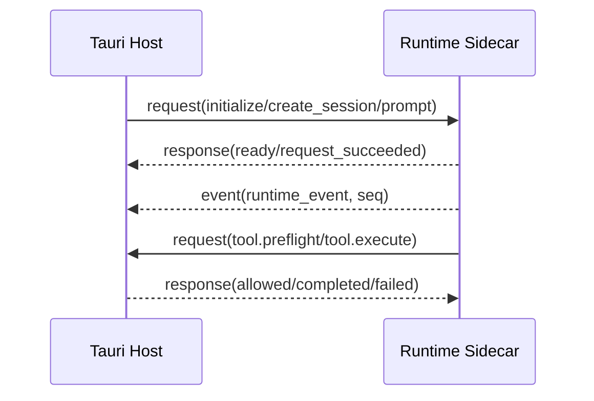

# Runtime 协议参考

> 状态：协议版本 1<br>
> 适用版本：Fox 0.1.x<br>
> 维护者：Fox Runtime 团队<br>
> 最后更新：2026-07-29

## Envelope



Runtime 与 Host 使用逐行 JSON（JSONL）。公共字段：

```json
{
  "protocol": "fox-runtime-jsonl",
  "version": 1,
  "kind": "request | response | event",
  "id": "uuid-or-runtime-id",
  "timestamp": "RFC3339",
  "type": "prompt",
  "requestId": "仅响应",
  "conversationId": "可选",
  "runtimeSessionId": "可选",
  "runId": "可选",
  "seq": 1,
  "payload": {}
}
```

stdout 只能输出 Envelope；日志必须写 stderr。Host 校验 protocol/version/kind/id/type，Runtime 只接受 request。

## Host 到 Runtime

| type | 必需上下文 | 说明 | 响应 |
|---|---|---|---|
| `initialize` | payload.modelService | 模型和能力初始化 | `ready` |
| `create_session` | conversation/session | 新建检查点 | `session_created` |
| `resume_session` | sessionPath | 恢复检查点 | `session_created` |
| `prompt` | conversation/session/run | 开始异步推理 | `request_succeeded` |
| `cancel` | run | 中止运行 | `request_succeeded` |
| `shutdown` | 无 | 关闭进程 | `request_succeeded` |

响应仅表示请求已接收；Run 完成以事件为准。

## Runtime 到 Host 的请求

- `tool.preflight`：校验只读工具路径与权限。
- `tool.execute`：执行附件、写入、命令、知识或 MCP 工具。

Host 返回 `tool.preflight_allowed/blocked` 或 `tool.execute_completed/failed`，并使用原请求 `requestId` 关联。

## Runtime 事件

外层 type 为 `runtime_event`，实际事件在 `payload.type`：

| 事件 | 关键字段 |
|---|---|
| `run.started` | model |
| `message.started` | role, kind |
| `message.delta` | delta |
| `reasoning.delta` | delta, source |
| `tool.started` | toolCallId, tool, input |
| `tool.updated` | toolCallId, update |
| `tool.completed` | result, isError |
| `source.added` | document/chunk/page/anchor metadata |
| `usage.updated` | inputTokens/outputTokens/totalTokens |
| `message.completed` | 无 |
| `run.completed` | 无 |
| `run.cancelled` | 无 |
| `run.failed` | code, message |

知识库远程 Runtime 还可产生 `user.question.requested/responded` 和 `run.interrupted`。所有事件必须有单 Run 单调递增 `seq`。

## 能力清单

Manifest 版本为 1，字段包括流式、取消、推理、Session 恢复、审批、图片、Steering、上下文压缩、动态模型切换和工具列表。工具条目含 `name/category/execution/approval`。Rust 与 Node 两端均校验版本、枚举、重复工具及 Host Handler 存在性。

## 幂等与恢复

- 数据库以 `(run_id, seq)` 去重。
- 前端拒绝不大于当前 `lastSeq` 的同 Run 事件。
- 终态事件后不得再接受普通增量。
- Host 事件持久化应先于窗口广播。
- 进程崩溃生成 `runtime.process_crashed` 或中断状态，刷新从数据库恢复。

## 错误

协议错误：`protocol.invalid_message`、`protocol.unknown_request`；Runtime 请求错误：`runtime.request_failed`；Pi 执行错误：`runtime.pi_failed`；Provider 错误：`provider.request_failed`。

## 契约测试

`services/agent-runtime/test/protocol.test.mjs`、`runtime-adapter-contract.test.mjs`、`pi-event-mapper.test.mjs`、Rust `runtime_host/protocol.rs` 测试。任何协议变更必须先增加兼容测试，再提升版本。
