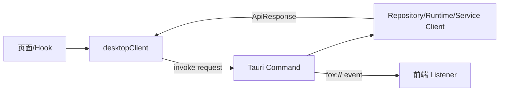

# Tauri 命令与事件参考

> 状态：生效<br>
> 适用版本：Fox 0.1.x<br>
> 维护者：Fox 前后端工程师<br>
> 最后更新：2026-08-24

## 调用约定



前端 `desktop-client.ts` 将请求包装为 `{ request }`，后端返回：

```ts
type ApiResponse<T> =
  | { ok: true; data: T }
  | { ok: false; error: { code: string; message: string; retryable: boolean } }
```

二进制 Range/缓存读取直接返回 `ArrayBuffer`，不经过通用 JSON 包装。

## 命令分组

| 分组 | 命令 |
|---|---|
| Runtime/诊断 | `runtime_initialize`, `runtime_status`, `runtime_diagnostics`, `diagnostics_export`, `diagnose_work_state`, `export_work_trace` |
| 维护 | `backup_create`, `backup_restore`, `data_cleanup` |
| Agent/扩展 | `agents_list`, `skills_list`, `skill_set_enabled`, `mcp_servers_list`, `mcp_server_save/test/set_enabled/delete`, `lifecycle_hooks_list/save/set_enabled/delete` |
| 专家 | `expert_package_inspect/install/export/versions/rollback`, `expert_workflow_get/start/gate_resolve/cancel`, `expert_team_get/cancel` |
| 数字同事 | `digital_colleagues_list`, `digital_colleague_create/update/set_paused/revoke`, `digital_colleague_schedules_list/schedule_save`, `digital_colleague_channels_list/channel_create/channel_revoke`, `digital_colleague_trigger_manual/trigger_channel`, `digital_colleague_triggers_list/audit_list` |
| 用户/统计 | `usage_statistics`, `user_profile_get`, `user_profile_save` |
| 项目 | `projects_list`, `project_folder_pick`, `project_files_list`, `project_file_read`, `project_permission_update` |
| 会话 | `conversations_list/search`, `conversation_create/load/history/rename/delete`, `conversation_expert_bind`, `conversation_expert_remove` |
| Run | `run_start`, `run_resume`, `run_cancel`, `approval_resolve`, `work_mode_confirmation_resolve` |
| 附件/绑定 | `attachments_save`, `knowledge_bindings_set`（兼容 legacy ID 与 source-aware reference） |

`mcp_server_save` 的 `transport` 为 `stdio|streamable_http|openapi`。stdio 使用 `command/args/credentials`；HTTP 使用 `endpointUrl/credentials`；OpenAPI 使用 `definition` 和可选 `endpointUrl` 覆盖。`credentials` 只写入 Keyring，不在读取结果中回传。

`lifecycle_hook_save` 接受 `event/matcher/action/reason/enabled/priority`。事件为 `before_run|before_tool|after_tool|after_run`，动作为 `block|require_approval|annotate`；非 `before_tool` 只能使用 `annotate`。命令层拒绝未知枚举、空 matcher/reason 和超长输入。
| 插件中心 | `plugin_catalog_list`, `plugin_installations_list`, `plugin_set_activation` |
| 本地知识 | `local_knowledge_bases_list`, `local_knowledge_base_get/create/update`, `local_knowledge_source_folder_pick`, `local_knowledge_file_sources_list`, `local_knowledge_file_source_add/rescan/remove`, `local_knowledge_local_files_list`, `local_knowledge_local_file_read/open`, `local_knowledge_documents_list`, `local_knowledge_document_file_read/open`, `local_knowledge_import_files_pick`, `local_knowledge_documents_import_start`, `local_knowledge_jobs_list/get/cancel/retry`, `local_knowledge_storage_status`, `local_knowledge_storage_directory_pick`, `local_knowledge_storage_migrate_start`, `local_knowledge_storage_migration_get` |
| 知识服务 | `yuxi_service_get/save/test`, `yuxi_login/current_user/agents_sync/models_list` |
| 知识内容 | `knowledge_bases_list`, `knowledge_detail`, `knowledge_document_content`, `knowledge_query` |
| 文档活动 | `knowledge_document_activity_get`, `reading_state_save`, `bookmark_save/delete`, `annotation_save/delete` |
| 原文件/缓存 | `knowledge_document_source_metadata`, `knowledge_document_range`, `knowledge_document_download`, `knowledge_document_download_cancel`, `knowledge_preview_cache_statistics`, `knowledge_preview_cache_limit_set`, `knowledge_preview_cache_clear`, `knowledge_preview_cache_operation_register`, `knowledge_preview_cache_operation_finish`, `knowledge_preview_cache_cancel`, `knowledge_preview_cache_acquire`, `knowledge_preview_cache_read`, `knowledge_preview_cache_release`, `knowledge_preview_cache_open`, `downloaded_file_open` |
| 图谱 | `knowledge_graph`, `knowledge_graph_labels`, `knowledge_graph_stats` |
| 模型 | `model_service_get/save/test`, `model_providers_list`, `model_provider_save/delete` |

真实注册清单以 `src-tauri/src/lib.rs` 为准；前端封装以 `features/conversations/api/desktop-client.ts` 为准。

`approval_resolve` 接收 `{ approvalId, decision }`，其中 `decision` 为 `deny | allow_once | allow_conversation`。`allow_conversation` 会在同一事务中解决当前审批并写入当前会话的同名工具授权；后续调用仍需通过 Expert/Assistant allowlist、只读模式、路径边界和 Host 参数校验，只跳过该工具的交互式审批。

本地文件目录命令只接受 Host 文件夹选择器返回的绝对路径。`file_source_add/rescan` 在阻塞线程中扫描普通目录，跳过符号链接、Fox 受管知识目录、不支持格式和超过 256 MB 的文件；`file_source_remove` 只删除 `knowledge.db` 中的来源及目录缓存，不删除用户文件。

`local_knowledge_local_files_list` 支持 `offset + limit` 分页，前端通过滚动哨兵逐页追加。`local_knowledge_document_file_read/open` 只接受知识库与文档稳定 ID；Host 根据 `relative_path` 在受管知识库 `documents/` 目录下重新解析、规范化并校验路径。范围读取同样限制单次最大 4 MB，不能通过前端参数读取任意绝对路径。

`conversation_create` 可接受可选 `expertId`，但 `agentId` 必须为 Assistant，`expertId` 必须为 Expert。`conversation_expert_bind` 与 `conversation_expert_remove` 接收 `{ conversationId, expertId? }`；Repository 只把 `role=user/assistant` 的消息计入锁定条件，专家卡片和输入框草稿不计，活动 Run 或归档会话也会锁定。绑定错误使用 `conversation.expert_locked`、`conversation.expert_invalid_role`、`conversation.expert_remote_unavailable`、`expert.not_found` 等稳定错误码。`conversation_load` 通过 `expertBindings` 返回 active 与历史记录，其中展示快照负责卡片，执行快照及 Hash 负责 Runtime 版本冻结。

数字同事命令统一接受 `{ request }`。创建请求包含专家、目标、可选项目/知识和配额；Channel 创建只返回一次明文 `secret`，后续列表只返回前缀。`trigger_channel` 由 Connector/IM Bridge 提供 sender、Unix 秒级 timestamp、idempotency key、payload 和 `v1=` HMAC；签名、频控、幂等、非重叠、撤销和审计契约见[数字同事架构](../02-架构/数字同事架构.md)。

`yuxi_agents_sync` 使用 3 秒总超时。成功时写入最新远程专家并恢复服务端可用状态；失败、超时或未登录时保留缓存记录但将其标记为不可用，分别返回 `yuxi.agent_sync_failed`、`yuxi.agent_sync_timeout` 或 `yuxi.not_authenticated`。前端应先调用本地 `agents_list` 完成渲染，再在后台调用该命令，不能让远程连接阻塞专家中心首屏。

### A0 工作状态诊断

两个命令都接收 `{ conversationId }`：

- `diagnose_work_state` 返回 Schema 版本、Event Schema 版本、Goal/Task/Evidence/Work Event 计数及结构化 findings。`healthy=false` 只表示存在破坏不变量的 error；未校验或失效 Evidence、旧 Runtime 缺少 Trace 等以 warning 报告。
- `export_work_trace` 在 `<app-data>/exports/` 写入 `fox-work-trace-<conversation>-<timestamp>.json`，返回通用 `MaintenanceResult`。导出包含工作图、Work Event 以及 Run/Runtime Event/Tool Call 的脱敏 Trace 元数据；不包含 Goal/Task/Evidence 正文、Evidence refId、事件 data、工具输入/结果、消息正文、项目文件或凭证。

## 窗口事件

| 事件 | Payload | 用途 |
|---|---|---|
| `fox://runtime-event` | RuntimeEventNotification | 文本、推理、工具、来源和 Run 状态 |
| `fox://work-event` | WorkEventRecord | Goal、Task 和 Evidence 的实时投影；按 conversation sequence 去重 |
| `fox://child-run-updated` | ChildRunNotification | 按 `childRunId` 更新隐藏 Child Run 的 queued/running/terminal 状态、预算使用和有限结果 |
| `fox://approval-requested` | ApprovalRecord | 展示待审批交互 |
| `fox://approval-resolved` | ApprovalRecord | 同步审批终态 |
| `fox://knowledge-download-progress` | KnowledgeDownloadProgress | 下载进度与终态 |

## 前端使用规则

- 页面组件不直接 `invoke`；统一调用 `desktopClient`。
- Listener 必须在卸载时执行 `UnlistenFn`。
- 事件用于低延迟更新，数据库 reload/poll 用于恢复和最终一致性。
- 收到非当前 conversation 的事件可以缓存或忽略，但不能错误归入当前页面。唯一例外是当前父会话已知 `childConversationId` 的审批事件，它必须显示在父会话中。
- Run 以 `runId + seq` 去重，不能只按时间戳排序。
- Work Event 与 Runtime Event 使用独立 reducer；Work Event 不得修改 Runtime `lastSeq` 或消息正文。

## 新增命令检查表

1. 定义 serde Request/Response，验证空值、范围和路径。
2. 在 `commands/mod.rs` 实现并返回稳定错误码。
3. 在 `lib.rs` 注册。
4. 在 `desktop-client.ts` 增加 typed wrapper。
5. 增加后端单测以及前端状态/错误路径测试。
6. 若有事件，规定幂等键、顺序、恢复来源和取消语义。
