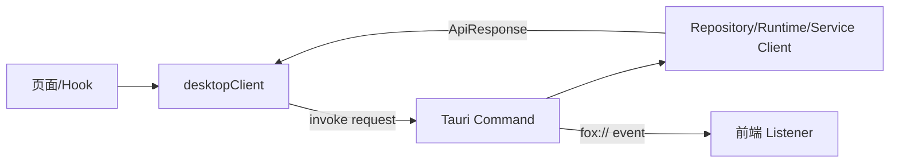

# Tauri 命令与事件参考

> 状态：当前注册表<br>
> 适用版本：Fox 0.1.x<br>
> 维护者：Fox 前后端工程师<br>
> 最后更新：2026-07-30

## 调用约定



前端 `desktop-client.ts` 将请求包装为 `{ request }`，后端返回：

```ts
type ApiResponse<T> =
  | { ok: true; data: T }
  | { ok: false; error: { code: string; message: string; retryable: boolean } }
```

二进制 Range/缓存读取直接返回 `ArrayBuffer`，不经过通用 JSON 包装。

## 命令分组

| 分组 | 命令 |
|---|---|
| Runtime/诊断 | `runtime_initialize`, `runtime_status`, `runtime_diagnostics`, `diagnostics_export`, `diagnose_work_state`, `export_work_trace` |
| 维护 | `backup_create`, `backup_restore`, `data_cleanup` |
| Agent/扩展 | `agents_list`, `skills_list`, `skill_set_enabled`, `mcp_servers_list`, `mcp_server_save`, `mcp_server_test`, `mcp_server_set_enabled`, `mcp_server_delete` |
| 用户/统计 | `usage_statistics`, `user_profile_get`, `user_profile_save` |
| 项目 | `projects_list`, `project_folder_pick`, `project_files_list`, `project_file_read`, `project_permission_update` |
| 会话 | `conversations_list/search`, `conversation_create/load/history/rename/delete` |
| Run | `run_start`, `run_resume`, `run_cancel`, `approval_resolve` |
| 附件/绑定 | `attachments_save`, `knowledge_bindings_set` |
| 知识服务 | `yuxi_service_get/save/test`, `yuxi_login/current_user/agents_sync/models_list` |
| 知识内容 | `knowledge_bases_list`, `knowledge_detail`, `knowledge_document_content`, `knowledge_query` |
| 文档活动 | `knowledge_document_activity_get`, `reading_state_save`, `bookmark_save/delete`, `annotation_save/delete` |
| 原文件/缓存 | `knowledge_document_source_metadata`, `knowledge_document_range`, `knowledge_document_download`, `knowledge_document_download_cancel`, `knowledge_preview_cache_statistics`, `knowledge_preview_cache_limit_set`, `knowledge_preview_cache_clear`, `knowledge_preview_cache_operation_register`, `knowledge_preview_cache_operation_finish`, `knowledge_preview_cache_cancel`, `knowledge_preview_cache_acquire`, `knowledge_preview_cache_read`, `knowledge_preview_cache_release`, `knowledge_preview_cache_open`, `downloaded_file_open` |
| 图谱 | `knowledge_graph`, `knowledge_graph_labels`, `knowledge_graph_stats` |
| 模型 | `model_service_get/save/test`, `model_providers_list`, `model_provider_save/delete` |

真实注册清单以 `src-tauri/src/lib.rs` 为准；前端封装以 `features/conversations/api/desktop-client.ts` 为准。

### A0 工作状态诊断

两个命令都接收 `{ conversationId }`：

- `diagnose_work_state` 返回 Schema 版本、Event Schema 版本、Goal/Task/Evidence/Work Event 计数及结构化 findings。`healthy=false` 只表示存在破坏不变量的 error；未校验或失效 Evidence、旧 Runtime 缺少 Trace 等以 warning 报告。
- `export_work_trace` 在 `<app-data>/exports/` 写入 `fox-work-trace-<conversation>-<timestamp>.json`，返回通用 `MaintenanceResult`。导出包含工作图、Work Event 以及 Run/Runtime Event/Tool Call 的脱敏 Trace 元数据；不包含事件正文、工具输入/结果、消息正文、项目文件或凭证。

## 窗口事件

| 事件 | Payload | 用途 |
|---|---|---|
| `fox://runtime-event` | RuntimeEventNotification | 文本、推理、工具、来源和 Run 状态 |
| `fox://approval-requested` | ApprovalRecord | 展示待审批交互 |
| `fox://approval-resolved` | ApprovalRecord | 同步审批终态 |
| `fox://knowledge-download-progress` | KnowledgeDownloadProgress | 下载进度与终态 |

## 前端使用规则

- 页面组件不直接 `invoke`；统一调用 `desktopClient`。
- Listener 必须在卸载时执行 `UnlistenFn`。
- 事件用于低延迟更新，数据库 reload/poll 用于恢复和最终一致性。
- 收到非当前 conversation 的事件可以缓存或忽略，但不能错误归入当前页面。
- Run 以 `runId + seq` 去重，不能只按时间戳排序。

## 新增命令检查表

1. 定义 serde Request/Response，验证空值、范围和路径。
2. 在 `commands/mod.rs` 实现并返回稳定错误码。
3. 在 `lib.rs` 注册。
4. 在 `desktop-client.ts` 增加 typed wrapper。
5. 增加后端单测以及前端状态/错误路径测试。
6. 若有事件，规定幂等键、顺序、恢复来源和取消语义。
