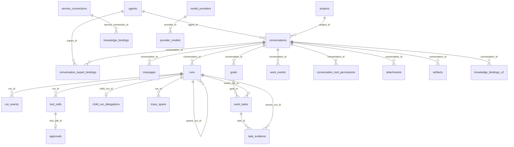

# 数据库结构参考

> 状态：生效 
> 数据库 Schema：迁移 1-32 
> 适用版本：Fox 0.1.x 
> 维护范围：`database/migrations.rs`、`models.rs`、Repository 持久化契约 
> 最后更新：2026-08-24

## 数据库设置

核心产品数据库为 `<app_data>/fox.db`，本地知识事实库为 `<app_data>/local-knowledge/knowledge.db`，均使用 rusqlite bundled SQLite 和 WAL。`fox.db` 的迁移记录在 `schema_migrations`；`knowledge.db` 使用独立 `user_version`。两个数据库不使用跨库事务或外键，边界见架构决策 0004。

## 表总览

| 领域 | 表 | 用途与关键约束 |
|---|---|---|
| 元数据 | `schema_migrations` | 已应用迁移版本 |
| Agent | `agents` | 本地及同步 Agent；`runtime_type` 区分 pi/yuxi，分类三元组约束入口与调用方式 |
| 会话 | `conversations` | 绑定基础 Assistant、项目、生命周期/lineage；`conversation_kind=primary|child` 隔离隐藏子会话 |
| 专家绑定 | `conversation_expert_bindings` | active/replaced/removed 历史、展示快照、冻结执行包、版本与 Package Hash；每会话最多一个 active |
| 消息 | `messages` | `(conversation_id, ordinal)` 排序；含 run、role、kind、metadata |
| 运行 | `runs` | 模型、终态、错误、`last_seq`、远端 run/cursor、Trace root、parent/root Run、kind/depth/budget |
| Child Run | `child_run_delegations` | 父子 Run、隐藏 Conversation、目标/上下文、Agent、预算、usage、有限结果和错误 |
| 专家能力包 | `expert_package_versions` | 不可变版本、Package Hash、激活/历史状态和显式回滚来源 |
| 专家工作流 | `expert_workflow_runs/stage_runs/gate_decisions` | Workflow、Stage、Gate、Schema 输出、有限重试与恢复检查点 |
| 专家团队 | `expert_team_runs` | 冻结 Team 定义、Supervisor parent Run、成员聚合和终态 |
| 数字同事 | `digital_colleagues` | 冻结专家实例、专用 Conversation、项目/知识、状态和 Host 配额 |
| 数字同事调度 | `digital_colleague_schedules` | Interval、catch-up window、next due 与 CAS 领取 |
| 数字同事入口 | `digital_colleague_channels` | 精确外部身份、Keyring 引用、速率与撤销状态 |
| 数字同事运行 | `digital_colleague_triggers` | 来源、幂等键、Run、usage、错误与终态 |
| 数字同事审计 | `digital_colleague_audit_log` | 配置、触发、拒绝、misfire 和撤销决策 |
| 会话恢复 | `runtime_sessions` | `(conversation_id, runtime_type)` 唯一 |
| 原始事件 | `run_events` | `(run_id, seq)` 唯一，保存 JSON 事件 |
| Trace | `trace_spans` | OTel 风格 Span Tree、操作/分类/状态/时长和低基数 attributes；不保存正文 |
| 评测 | `evaluation_runs`、`evaluation_suite_results` | 离线报告 Hash、总分、套件明细和趋势 |
| 长期记忆 | `memory_entities/revisions/conflicts/recalls` | candidate/confirmed/conflict、启停/软删、版本、冲突和每次召回审计 |
| 工作闭环 | `goals` | 会话级目标；同一会话最多一个 `active/blocked` Goal |
| 工作闭环 | `work_tasks` | Goal 下的有序 Task；同一 Goal 最多一个 `in_progress` Task |
| 工作闭环 | `task_evidence` | Task 的多态证据、有效性与 Trace 关联 |
| 工作闭环事件 | `work_events` | `(conversation_id, sequence)` 唯一；保存 Event Schema v1 JSON |
| 工作模式确认 | `pending_work_mode_dispatches` | proposed Goal 对应的未派发 Run 与 Runtime 输入；确认后删除 |
| 项目 | `projects` | `root_path` 唯一；权限 read_only/ask/allow |
| 工具 | `tool_calls` | `(run_id, runtime_tool_call_id)` 唯一 |
| 审批 | `approvals` | 每个 tool_call 最多一条；pending/approved/denied/cancelled/expired |
| 会话工具授权 | `conversation_tool_permissions` | `(conversation_id, tool_name)` 唯一；保存“本次对话始终允许”，删除会话时级联删除 |
| 文件 | `attachments` | 用户附件路径、类型、大小、SHA-256 |
| 产物 | `artifacts` | Run 生成文件及完整性信息 |
| 外部连接 | `service_connections` | 按 service_type/base_url 唯一 |
| 知识绑定 | `knowledge_bindings` | 历史远程绑定兼容投影 |
| 知识引用 | `knowledge_bindings_v2` | source-aware 本地/远程引用；本地 ID 或远程 connection/provider/ID |
| Agent 配置 | `agent_runtime_config` | agent/conversation scope 的 JSON 配置 |
| 知识服务 | `yuxi_service` | 兼容用单例服务配置，不存 Token |
| 模型服务 | `model_service` | 兼容用单例默认模型配置，不存 API Key |
| 模型供应商 | `model_providers` | 多供应商、自定义图标、默认项和连接状态 |
| 供应商模型 | `provider_models` | 上下文、输出、图片能力、默认模型 |
| 扩展源 | `mcp_servers` | stdio/Streamable HTTP/OpenAPI 配置、启用与健康状态；不存环境变量或 Header 凭据 |
| 生命周期策略 | `lifecycle_hooks` | Run/Tool 前后事件、matcher、声明式动作、优先级和启停 |
| 生命周期审计 | `lifecycle_hook_executions` | Hook 命中、Run/Tool Call、动作结果与脱敏输入键 |
| 插件目录 | `plugin_catalog_cache` | 内建、官方或缓存 Catalog 元数据 |
| 插件安装 | `plugin_installations` | 安装来源、版本、路径、Hash 与状态 |
| 插件任务 | `plugin_operations` | 安装、更新、卸载与导入 Operation 快照 |
| 全文检索 | `conversation_fts` | 会话标题、项目、Agent |
| 全文检索 | `message_fts` | 消息正文 |
| 预览缓存 | `knowledge_preview_cache` | revision、文件路径、租约和 LRU |
| 应用设置 | `app_settings` | JSON/字符串设置键值 |
| 阅读状态 | `knowledge_document_reading_state` | 页码、滚动、缩放 |
| 书签 | `knowledge_document_bookmarks` | 页码、anchor、摘录、标签 |
| 批注 | `knowledge_document_annotations` | note/highlight、颜色和定位 |

## 核心关系

## 本地知识数据库

`knowledge.db` 当前包含：

| 表 | 用途与关键约束 |
| --- | --- |
| `local_knowledge_bases` | 本地知识库与 active index generation |
| `local_file_sources` | 用户主动选择的本地文件夹、扫描时间、文件数与总大小 |
| `local_file_catalog` | 本地文件目录缓存；保存绝对/相对路径、类型、大小和修改时间，删除来源时级联清理 |
| `local_kb_documents` | 受管文档、Hash、修订、解析与索引状态 |
| `local_kb_chunks` | 文本分块、anchor、页码/幻灯片与 byte offset |
| `local_kb_index_generations` | VectorStore、模型、维度、解析器和分块配置代次；每库最多一个 active |
| `local_kb_jobs` | 导入、解析、索引、重建和删除任务；含 sequence、heartbeat、checkpoint |
| `local_kb_storage_migrations` | 存储迁移状态机与恢复信息 |
| `local_embedding_models` | 本地模型版本、维度、包 Hash 和安装状态 |

导入与索引不直接覆盖 active 代次。新代次完整写入、校验并提交后才切换；失败保留原 active。每个知识库同时最多一个 index/rebuild Job。

`local_file_sources/local_file_catalog` 只承担文件发现和筛选，不把用户目录变成事实源。用户选择“加入知识库”后仍走受管导入流程；移除来源只级联删除目录缓存，禁止删除来源文件。

本地文件预览和系统打开只接收 `local_file_catalog.id`。Host 每次操作前重新解析目录记录，校验文件仍是登记来源目录中的普通文件；范围读取单次最多 4 MB，前端不能通过这些命令读取任意绝对路径。

## 状态字段

- Run：`queued/awaiting_confirmation/running/cancelling/completed/failed/cancelled/interrupted`。
- 消息：`sending/streaming/completed/failed/interrupted`。
- 项目：`active/missing/revoked`。
- Tool Call：实现中使用 queued/running/awaiting_approval/completed/failed/cancelled 等投影值。
- Goal：`proposed/active/blocked/completed/cancelled`。
- Work Task：`queued/in_progress/completed/blocked/interrupted/skipped`。
- Evidence Type：`tool_call/trace_span/test_result/file_diff/artifact/user_confirmation/external_reference`。
- Evidence Reference：`tool_call/artifact/run_event/message/source`。
- Evidence Validity：`unverified/valid/stale/missing/invalid`。
- 附件/产物通常为 `ready`；异常清理会移除非 ready 附件。
- Agent 分类：`assistant/primary/chat_selector`、`expert/inline/expert_center`、`worker/child/hidden`。
- 专家绑定：`active/replaced/removed`。

## 索引与性能

关键索引覆盖消息顺序、Run 时间、事件序号、工具时间、审批状态、附件消息、产物 Run、Provider 模型和文档活动。FTS5 由 insert/update/delete 触发器同步。新增高频查询应先写 Repository 测试和查询计划，再增加索引。

## 删除语义

会话删除级联消息、Run、事件、工具和大多数关联记录；附件文件和 Runtime Session 文件由命令/维护层清理，不能只依赖 SQL。外部下载文件不属于受管会话数据，删除会话不会删除用户选择的下载目标。

## 工作闭环、Memory、Trace、Child Run 与扩展策略

迁移 14-18 建立 A0 工作图、工作事件、待确认派发、会话置顶归档和供应商图标；迁移 19 建立 PlanRevision、ReviewFinding 与 Acceptance；迁移 20-23 增加 Agent 分类、冻结专家包、插件/source-aware 知识和会话工具授权。迁移 24 增加归档/回收站/Fork lineage；迁移 25 增加受治理 Memory；迁移 26 增加完整 Span Tree 与离线评测历史；迁移 27 增加 Host-owned Child Run；迁移 28 增加多传输扩展源健康字段与声明式 Lifecycle Hook/审计；迁移 29 增加不可变专家包版本；迁移 30 增加 Workflow/Stage/Gate；迁移 31 增加 Supervisor Team 与 Member Scope；迁移 32 增加数字同事、Schedule、签名 Channel、Trigger 和 Audit。

历史 Run 在迁移 26 回填有效 Trace/root span。迁移 27 将历史 Run 的 `root_run_id` 回填为自身；Child Conversation 删除由 delegation 触发器清理，普通会话列表始终过滤 `conversation_kind='primary'`。

`mcp_servers.transport` 仅允许 `stdio|streamable_http|openapi`；`endpoint_url` 和 `definition` 保存非密配置，`last_latency_ms/tool_count/consecutive_failures` 保存统一健康投影。`lifecycle_hooks` 只允许四个生命周期事件和三个声明式动作；`lifecycle_hook_executions` 通过外键关联 Hook/Run/Tool Call，输入快照只保存键名，不保存参数值。

`display_snapshot_json` 只服务历史卡片；`package_snapshot_json` 冻结绑定时的 Persona、Manifest、资源声明和分类。Runtime 每次 Run 校验其 SHA-256 后使用，不从专家最新定义覆盖；当前 Host 授权、会话知识绑定和允许启用的 Skills 仍在 Run 开始时动态叠加。

Task 完成必须已有 Evidence，此约束由 Repository 事务校验；Evidence 的 `ref_kind + ref_id` 也由 Repository 验证，不能以自由文本绕过。`work_events` 只用于流式展示和诊断，恢复后的唯一事实源始终是三张工作图表。

## 验证

代码：`apps/desktop/src-tauri/src/database/migrations.rs`、`repositories.rs`、`models.rs`。运行 `cargo test --manifest-path apps/desktop/src-tauri/Cargo.toml database`；A0 前数据库升级、幂等、失败后从备份恢复由 Migration 测试覆盖，真实旧库仍须先备份再升级。
