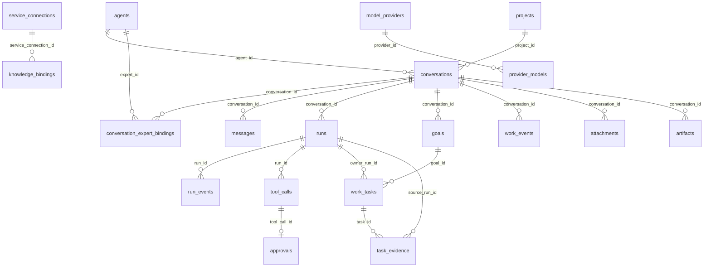

# 数据库结构参考

> 状态：迁移 1-21 当前实现 
> 适用版本：Fox 0.1.x 
> 维护范围：`database/migrations.rs`、`models.rs`、Repository 持久化契约 
> 最后更新：2026-08-21

## 数据库设置

数据库文件为 `<app_data>/fox.db`，使用 rusqlite bundled SQLite。打开时启用 `foreign_keys=ON`、`journal_mode=WAL`、`busy_timeout=5000ms`。迁移记录在 `schema_migrations`；已发布迁移不可改写，只能追加新版本。

## 表总览

| 领域 | 表 | 用途与关键约束 |
|---|---|---|
| 元数据 | `schema_migrations` | 已应用迁移版本 |
| Agent | `agents` | 本地及同步 Agent；`runtime_type` 区分 pi/yuxi，分类三元组约束入口与调用方式 |
| 会话 | `conversations` | 绑定基础 Assistant、项目、标题、状态、置顶和归档 |
| 专家绑定 | `conversation_expert_bindings` | active/replaced/removed 历史、展示快照、冻结执行包、版本与 Package Hash；每会话最多一个 active |
| 消息 | `messages` | `(conversation_id, ordinal)` 排序；含 run、role、kind、metadata |
| 运行 | `runs` | 模型、终态、错误、`last_seq`、远端 run/cursor |
| 会话恢复 | `runtime_sessions` | `(conversation_id, runtime_type)` 唯一 |
| 原始事件 | `run_events` | `(run_id, seq)` 唯一，保存 JSON 事件 |
| 工作闭环 | `goals` | 会话级目标；同一会话最多一个 `active/blocked` Goal |
| 工作闭环 | `work_tasks` | Goal 下的有序 Task；同一 Goal 最多一个 `in_progress` Task |
| 工作闭环 | `task_evidence` | Task 的多态证据、有效性与 Trace 关联 |
| 工作闭环事件 | `work_events` | `(conversation_id, sequence)` 唯一；保存 Event Schema v1 JSON |
| 工作模式确认 | `pending_work_mode_dispatches` | proposed Goal 对应的未派发 Run 与 Runtime 输入；确认后删除 |
| 项目 | `projects` | `root_path` 唯一；权限 read_only/ask/allow |
| 工具 | `tool_calls` | `(run_id, runtime_tool_call_id)` 唯一 |
| 审批 | `approvals` | 每个 tool_call 最多一条；pending/approved/denied/cancelled/expired |
| 文件 | `attachments` | 用户附件路径、类型、大小、SHA-256 |
| 产物 | `artifacts` | Run 生成文件及完整性信息 |
| 外部连接 | `service_connections` | 按 service_type/base_url 唯一 |
| 知识绑定 | `knowledge_bindings` | 会话允许访问的知识库集合 |
| Agent 配置 | `agent_runtime_config` | agent/conversation scope 的 JSON 配置 |
| 知识服务 | `yuxi_service` | 兼容用单例服务配置，不存 Token |
| 模型服务 | `model_service` | 兼容用单例默认模型配置，不存 API Key |
| 模型供应商 | `model_providers` | 多供应商、自定义图标、默认项和连接状态 |
| 供应商模型 | `provider_models` | 上下文、输出、图片能力、默认模型 |
| MCP | `mcp_servers` | stdio 命令、参数和状态，不存环境变量 |
| 全文检索 | `conversation_fts` | 会话标题、项目、Agent |
| 全文检索 | `message_fts` | 消息正文 |
| 预览缓存 | `knowledge_preview_cache` | revision、文件路径、租约和 LRU |
| 应用设置 | `app_settings` | JSON/字符串设置键值 |
| 阅读状态 | `knowledge_document_reading_state` | 页码、滚动、缩放 |
| 书签 | `knowledge_document_bookmarks` | 页码、anchor、摘录、标签 |
| 批注 | `knowledge_document_annotations` | note/highlight、颜色和定位 |

## 核心关系

## 状态字段

- Run：`queued/awaiting_confirmation/running/cancelling/completed/failed/cancelled/interrupted`。
- 消息：`sending/streaming/completed/failed/interrupted`。
- 项目：`active/missing/revoked`。
- Tool Call：实现中使用 queued/running/awaiting_approval/completed/failed/cancelled 等投影值。
- Goal：`proposed/active/blocked/completed/cancelled`。
- Work Task：`queued/in_progress/completed/blocked/interrupted/skipped`。
- Evidence Type：`tool_call/trace_span/test_result/file_diff/artifact/user_confirmation/external_reference`。
- Evidence Reference：`tool_call/artifact/run_event/message/source`。
- Evidence Validity：`unverified/valid/stale/missing/invalid`。
- 附件/产物通常为 `ready`；异常清理会移除非 ready 附件。
- Agent 分类：`assistant/primary/chat_selector`、`expert/inline/expert_center`、`worker/child/hidden`。
- 专家绑定：`active/replaced/removed`。

## 索引与性能

关键索引覆盖消息顺序、Run 时间、事件序号、工具时间、审批状态、附件消息、产物 Run、Provider 模型和文档活动。FTS5 由 insert/update/delete 触发器同步。新增高频查询应先写 Repository 测试和查询计划，再增加索引。

## 删除语义

会话删除级联消息、Run、事件、工具和大多数关联记录；附件文件和 Runtime Session 文件由命令/维护层清理，不能只依赖 SQL。外部下载文件不属于受管会话数据，删除会话不会删除用户选择的下载目标。

## A0 工作闭环与 Trace

迁移 14-18 建立 A0 工作图、工作事件、待确认派发、会话置顶归档和供应商图标；迁移 19 建立 PlanRevision、ReviewFinding 与 Acceptance。迁移 20 增加 Agent 分类与专家绑定表，并迁移五个内置专家的旧主 Agent 会话；迁移 21 增加 `package_snapshot_json`，为已有绑定回填静态专家执行包并重新计算 `package_hash`。A0 不创建完整 `run_spans` 表，旧 Runtime 产生的 Trace 字段允许为空。

`display_snapshot_json` 只服务历史卡片；`package_snapshot_json` 冻结绑定时的 Persona、Manifest、资源声明和分类。Runtime 每次 Run 校验其 SHA-256 后使用，不从专家最新定义覆盖；当前 Host 授权、会话知识绑定和允许启用的 Skills 仍在 Run 开始时动态叠加。

Task 完成必须已有 Evidence，此约束由 Repository 事务校验；Evidence 的 `ref_kind + ref_id` 也由 Repository 验证，不能以自由文本绕过。`work_events` 只用于流式展示和诊断，恢复后的唯一事实源始终是三张工作图表。

## 验证

代码：`apps/desktop/src-tauri/src/database/migrations.rs`、`repositories.rs`、`models.rs`。运行 `cargo test --manifest-path apps/desktop/src-tauri/Cargo.toml database`；A0 前数据库升级、幂等、失败后从备份恢复由 Migration 测试覆盖，真实旧库仍须先备份再升级。
