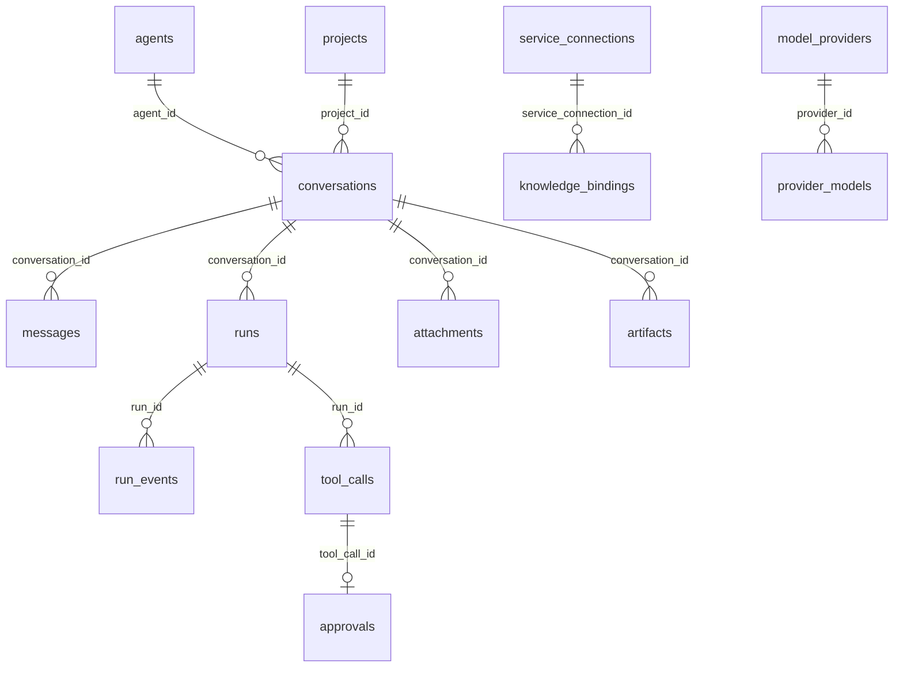

# 数据库结构参考

> 状态：迁移 1-13 当前实现 
> 适用版本：Fox 0.1.x 
> 维护者：Fox 后端工程师 
> 最后更新：2026-07-29

## 数据库设置

数据库文件为 `<app_data>/fox.db`，使用 rusqlite bundled SQLite。打开时启用 `foreign_keys=ON`、`journal_mode=WAL`、`busy_timeout=5000ms`。迁移记录在 `schema_migrations`；已发布迁移不可改写，只能追加新版本。

## 表总览

| 领域 | 表 | 用途与关键约束 |
|---|---|---|
| 元数据 | `schema_migrations` | 已应用迁移版本 |
| Agent | `agents` | 本地及同步 Agent；`runtime_type` 区分 pi/yuxi |
| 会话 | `conversations` | 绑定 Agent、项目、标题和状态 |
| 消息 | `messages` | `(conversation_id, ordinal)` 排序；含 run、role、kind、metadata |
| 运行 | `runs` | 模型、终态、错误、`last_seq`、远端 run/cursor |
| 会话恢复 | `runtime_sessions` | `(conversation_id, runtime_type)` 唯一 |
| 原始事件 | `run_events` | `(run_id, seq)` 唯一，保存 JSON 事件 |
| 项目 | `projects` | `root_path` 唯一；权限 read_only/ask/allow |
| 工具 | `tool_calls` | `(run_id, runtime_tool_call_id)` 唯一 |
| 审批 | `approvals` | 每个 tool_call 最多一条；pending/approved/denied/cancelled/expired |
| 文件 | `attachments` | 用户附件路径、类型、大小、SHA-256 |
| 产物 | `artifacts` | Run 生成文件及完整性信息 |
| 外部连接 | `service_connections` | 按 service_type/base_url 唯一 |
| 知识绑定 | `knowledge_bindings` | 会话允许访问的知识库集合 |
| Agent 配置 | `agent_runtime_config` | agent/conversation scope 的 JSON 配置 |
| 知识服务 | `yuxi_service` | 兼容用单例服务配置，不存 Token |
| 模型服务 | `model_service` | 兼容用单例默认模型配置，不存 API Key |
| 模型供应商 | `model_providers` | 多供应商、默认项和连接状态 |
| 供应商模型 | `provider_models` | 上下文、输出、图片能力、默认模型 |
| MCP | `mcp_servers` | stdio 命令、参数和状态，不存环境变量 |
| 全文检索 | `conversation_fts` | 会话标题、项目、Agent |
| 全文检索 | `message_fts` | 消息正文 |
| 预览缓存 | `knowledge_preview_cache` | revision、文件路径、租约和 LRU |
| 应用设置 | `app_settings` | JSON/字符串设置键值 |
| 阅读状态 | `knowledge_document_reading_state` | 页码、滚动、缩放 |
| 书签 | `knowledge_document_bookmarks` | 页码、anchor、摘录、标签 |
| 批注 | `knowledge_document_annotations` | note/highlight、颜色和定位 |

## 核心关系

## 状态字段

- Run：`queued/running/cancelling/completed/failed/cancelled/interrupted`。
- 消息：`sending/streaming/completed/failed/interrupted`。
- 项目：`active/missing/revoked`。
- Tool Call：实现中使用 queued/running/awaiting_approval/completed/failed/cancelled 等投影值。
- 附件/产物通常为 `ready`；异常清理会移除非 ready 附件。

## 索引与性能

关键索引覆盖消息顺序、Run 时间、事件序号、工具时间、审批状态、附件消息、产物 Run、Provider 模型和文档活动。FTS5 由 insert/update/delete 触发器同步。新增高频查询应先写 Repository 测试和查询计划，再增加索引。

## 删除语义

会话删除级联消息、Run、事件、工具和大多数关联记录；附件文件和 Runtime Session 文件由命令/维护层清理，不能只依赖 SQL。外部下载文件不属于受管会话数据，删除会话不会删除用户选择的下载目标。

## 规划表警告

`goals`、`work_tasks`、`task_evidence`、Memory、Trace、Child Run 等仅存在 A0-A6 规格中，当前库没有这些表。实现时从迁移 14 起追加，并提供旧库升级和数据完整性测试。

## 验证

代码：`apps/desktop/src-tauri/src/database/migrations.rs`、`repositories.rs`、`models.rs`。运行 `cargo test --manifest-path apps/desktop/src-tauri/Cargo.toml database`，并对真实旧库先备份后验证升级。
