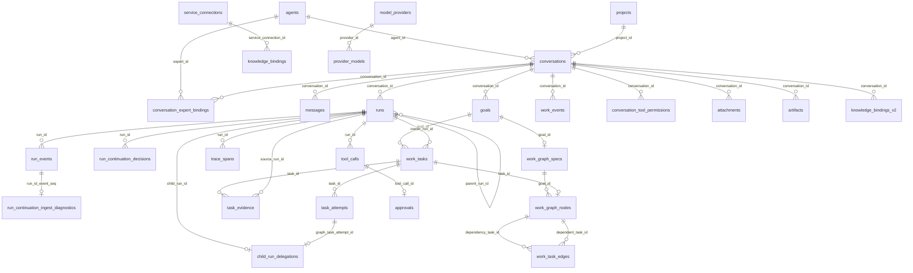

# 数据库结构参考

> 状态：生效<br>
> 数据库 Schema：迁移 1–79（`DATABASE_SCHEMA_VERSION = 79`）<br>
> 适用版本：Fox 0.1.x<br>
> 维护范围：`database/migrations.rs`、`models.rs`、Repository 持久化契约<br>
> 最后更新：2026-09-22

**正文覆盖范围说明（重要）**：下方正文按版本倒序详述到 **v59**，并保留更早的 `Schema 34–39` 历史小节。**迁移 60–79 尚未逐版本展开**，其要点集中列在下一节，避免读者以为本文的「1–59」就是当前上限。版本号以 `apps/desktop/src-tauri/src/database/mod.rs` 的 `DATABASE_SCHEMA_VERSION` 为准。

## 迁移 60–79：覆盖缺口与要点

以下为该区间的源码要点，证据层级为**源码实现**（读取 `database/migrations.rs` 的迁移常量与 `run_transaction` 顺序），未在本轮复跑迁移测试。

| 版本 | 要点 |
| --- | --- |
| 60 | `kernel_reconciliation_events`（append-only 对账证据，kind 为 query/confirmation/resume，禁止 UPDATE）与 `kernel_recovery_runs`（源 Run → 恢复 Run 映射） |
| 61 | 重写 Kernel 模型配置与初始输入的 INSERT guard，要求冻结引擎身份一致（`engine_id IN ('pi','codex','deepseek_harness')` 且与绑定匹配） |
| 62 | `tool_call_result_blobs`：大工具结果按 sha256 内容寻址存放；`tool_calls.result_blob_sha256` 列由幂等 helper 添加 |
| 63 | 重建 `kernel_effect_outbox`，放宽 `effect_type` CHECK 以容纳 `initial_model`、`continuation_model`、`publish_snapshot` |
| 64 | `skill_activations`、`delivery_checklist_items`、`delivery_repair_rounds`、`run_steering_messages`、`managed_file_versions`（全部增量表） |
| 65 | 重建 `run_steering_messages`，在 `received` 与 `applied` 之间加入 `delivered` 状态 |
| 66 | `managed_file_versions` 增加 `after_backup_path` / `source_kind` / `source_verified`；`delivery_checklist_items.requirements_json`；配套索引 |
| 67 | 重建 `managed_file_versions`，`change_kind` 增加 `replaced`（表达「本次恢复所覆盖的、未被登记的内容」） |
| 68 | 放宽 `kernel_runs.state`（`approval_expired`）与 `kernel_tool_calls.state`（`expired`）；新增 `kernel_approval_history`、`kernel_run_progress`、`kernel_authorization_grants`。表重建在事务外、关闭外键执行（`rebuild_kernel_tables_for_v68`），否则会级联删除依赖行 |
| 69 | `kernel_run_budget_choices`（冻结前记录用户选择的预算档）与统一后台作业生命周期 `kernel_jobs`（`(run_id, idempotency_key)` 唯一） |
| 70 | `kernel_jobs` 增加取消与不确定状态列；新增 `kernel_context_budget_reports` |
| 71 / 72 | v71 给 `artifacts` 增加 `artifact_class`（deliverable/preview/process）与 `artifact_origin`（project/host_private）及索引；v72 为历史行一次性回填，`attachment-compute` 路径记为 `host_private`，其余保持 `process`，不按路径猜测可交付物 |
| 73 | `deliverable_placements`：每个 Conversation × 项目根固定一个交付文件夹，避免跨午夜续跑时结果目录漂移；主键保证并发下 `INSERT OR IGNORE` 只有一行胜出 |
| 74 | `kernel_execution_credentials`（每次 dispatch 在最终准入事务中签发的权威快照，重签发必须逐字节相同）与 `kernel_execution_attempts`（持久单次领取，`start_confirmed` 不得从 1 回退） |
| 75 | `kernel_host_observations`（Host 实际读取得到的文件版本，模型自报版本不是 observation）；`kernel_execution_attempts` 增加 `action_class` / `policy_version` / `budget_ceiling_ms` / `parent_generation`；以加法方式重建 credentials CHECK 以允许 `manage` 类凭据 |
| 76 | 重建 `kernel_execution_attempts` 的 state CHECK，加入 `completed`，使「已完成读取/查询」与「拒绝」成为不同状态 |
| 77 | `kernel_execution_policies`（会话级权限模式 + 版本）、`kernel_policy_requests`（按请求 ID 幂等）、`kernel_parent_generations`；触发器在项目/会话权限变更、授权撤销、父 Run 取消时递增代次，并作废尚未派发 dispatch 的 pending 审批 |
| 78 | `kernel_approvals` 与 `kernel_host_commands` 增加 `policy_version`；触发器 `execution_approval_version` 在插入审批时按当前策略版本盖章 |
| 79 | 仅重建 `kernel_jobs` 的幂等键约束（放宽 canonical Host dispatch job 键），历史行按原样复制；重开幂等，对应测试 `migration_79_widens_only_host_job_keys_and_reopens_idempotently` |

读源码时注意两处结构差异：迁移 23 与 39 由专用函数（`apply_agent_expert_migration`、`apply_graph_review_acceptance_migration`）施加，其余由通用 `apply_migration` 施加；而 62、66、71、75、76 使用显式的 `schema_migrations` 存在性检查，因为已登记的版本不会重跑，这类迁移靠幂等 helper 补充列或重建约束。整个 `run_transaction` 在提交前执行 `pragma_foreign_key_check`，非零即整体失败。

## v58–59：资源快照、控制命令与提交后动作

v58 `kernel_host_scopes` 保存不可变资源范围及哈希，包含工具、MCP 定义、知识引用/连接、Office 操作和冻结生命周期规则；只能在模型配置已冻结、Run 尚未启动时写入，相同重放只读返回。子任务继承父执行权，权限、资源和预算只能收窄。

`kernel_host_commands` 保存审批/取消请求。审批按稳定工具身份去重并拒绝冲突结论、迟到决定和取消后的批准；工具专用返工审批拒绝会话授权。独占 Host 提交对应 Kernel 决策后确认消费，UI 不直接驱动第二个协调器。

v59 `kernel_host_actions` 保存工作/Graph/子任务提交后动作：只有当前工具的 running dispatch 租约可暂存不可变载荷；工具成功提交后才可领取。失败、不确定结果及待处理取消不能领取，已领取但执行结果不明不自动重播。Legacy Graph 恢复扫描排除 Authoritative 父 Run，避免重复派发。

Kernel 决策与兼容 `runs/messages/tool_calls/approvals`、子任务/团队、用量及生命周期审计在同一事务投影，事务提交后才发失效提示。消息只保存最终可见正文，临时预览不入库。工具与审批使用 `kernel-tool:{run}:{tool}`、`kernel-approval:{run}:{tool}` 稳定身份。修复预算 override 必须同时拥有本次 AllowOnce、running Kernel 工具和 leased dispatch，再走原有业务 CAS/claim；不通过 Legacy 工具完成入口。

## v57：Kernel 首轮模型请求 Outbox

`kernel_effect_outbox` 增加 `initial_model` 类型，保留旧效果的完整记录、状态、租约与幂等索引。`start_prepared` 在一个决策事务内写入启动事件和首轮请求意图；待派发时不启动模型请求时钟。实际派发事务验证冻结输入和配置，原子领取唯一效果并写入 `engine.initial_dispatched` 与计时起点，然后才调用隔离模型进程。通用 Outbox 领取接口不能领取首轮模型效果。

首响应的身份、游标、租约所有者和当前 Run 状态经校验后，与请求完成及下一批工具提议或 Run 终态同事务提交。领取后失联保持不确定状态，重开不能盲目重发。正式桌面显式权威模式已接入首轮调用、启动恢复与同事务聊天投影；默认模式仍为 Legacy。

## v56：Kernel 初始输入快照

`kernel_initial_inputs` 按 `run_id` 唯一关联 `kernel_model_configs`，保存初始消息完整 JSON、内容哈希、Turn 身份、模型配置哈希和版本。首次写入只允许 Authoritative/Pi Run 的 created/零事件阶段，且必须匹配已冻结模型配置；此后禁止更新，仅支持相同内容的只读重放。启动事务若使用不同 Turn，触发器会使整个事务失败。

`KernelInitialModelInput` 要求最后一条为当前用户消息，历史工具调用与结果完整配对，拒绝不支持的角色、内容块、未完成助手响应和超大输入。读取在同一事务校验输入与模型配置、Run、控制绑定；错误不回显消息内容。v55 升级不为旧 Run 猜测历史，缺失输入不从当前对话回填。

这是输入存储契约，不是派发凭证。v57 单独管理首轮请求 Outbox 与响应事务；仅输入表可读回不能称为完整恢复。桌面显式权威路径使用该输入，不改变默认模式。

## v55：Kernel 模型配置快照

`kernel_model_configs` 按 `run_id` 唯一关联 `kernel_runs`，保存 `schema_version=1`、`adapter_version`、`config_json`、`config_hash` 和创建时间。内容包含模型连接描述、系统提示、工具提议 Schema 和执行 Profile；API key 单独提供，不写入此快照。Repository 拒绝凭证字段、携带凭证/查询参数的模型 URL、未知模型配置字段及非法工具描述。

首次插入只允许已有 Authoritative/Pi 控制绑定、`kernel_runs.state=created` 且 `last_event_seq=0`，并匹配已冻结的提示配置哈希和 Profile。更新由触发器拒绝；Repository 的完全相同重放不发出 UPDATE。随所属 Run 删除级联清理。旧版本只有哈希、没有配置内容的 Run 不会从当前设置回填，读取/正式模型派发均明确失败。

读取在同一事务核对配置哈希、Run 冻结配置、控制绑定内容/哈希与适配器版本；正式派发只从本表恢复配置。该表不保存待执行的初始模型请求，不替代 Outbox 租约，也不表示默认桌面 Run 已支持完整恢复。

## 数据库设置

核心产品数据库为 `<app_data>/fox.db`，本地知识事实库为 `<app_data>/local-knowledge/knowledge.db`，均使用 rusqlite bundled SQLite 和 WAL。`fox.db` 的迁移记录在 `schema_migrations`；`knowledge.db` 使用独立 `user_version`。两个数据库不使用跨库事务或外键，边界见架构决策 0004。

## 表总览

| 领域 | 表 | 用途与关键约束 |
|---|---|---|
| 元数据 | `schema_migrations` | 已应用迁移版本 |
| Agent | `agents` | 本地及同步 Agent；`runtime_type` 区分 pi/yuxi，分类三元组约束入口与调用方式 |
| 会话 | `conversations` | 绑定基础 Assistant、项目、生命周期/lineage；`conversation_kind=primary|child` 隔离隐藏子会话 |
| 专家绑定 | `conversation_expert_bindings` | active/replaced/removed 历史、展示快照、冻结执行包、版本与 Package Hash；每会话最多一个 active |
| 消息 | `messages` | `(conversation_id, ordinal)` 排序；含 run、role、kind、metadata |
| 运行 | `runs` | 模型、终态、错误、`last_seq`、远端 run/cursor、Trace root、parent/root Run、kind/depth/budget |
| 续行审计 | `run_continuation_decisions` | Run 的追加式结构化决策；事件水位、版本化决策/原因、关联事实、Host 校验结果；一个 Run 可有多条 |
| 续行接入诊断 | `run_continuation_ingest_diagnostics` | proposal 投影失败的追加审计；按 Run/Event 幂等去重，只抑制重复恢复扫描，不改变工作状态 |
| Child Run | `child_run_delegations` | 父子 Run、隐藏 Conversation、目标/上下文、Agent、预算、usage、有限结果和错误；Graph Worker 可唯一映射父 Run 拥有的 Attempt |
| 专家能力包 | `expert_package_versions` | 不可变版本、Package Hash、激活/历史状态和显式回滚来源 |
| 专家工作流 | `expert_workflow_runs/stage_runs/gate_decisions` | Workflow、Stage、Gate、Schema 输出、有限重试与恢复检查点 |
| 专家团队 | `expert_team_runs` | 冻结 Team 定义、Supervisor parent Run、成员聚合和终态 |
| 数字同事 | `digital_colleagues` | 冻结专家实例、专用 Conversation、项目/知识、状态和 Host 配额 |
| 数字同事调度 | `digital_colleague_schedules` | Interval、catch-up window、next due 与 CAS 领取 |
| 数字同事入口 | `digital_colleague_channels` | 精确外部身份、Keyring 引用、速率与撤销状态 |
| 数字同事运行 | `digital_colleague_triggers` | 来源、幂等键、Run、usage、错误与终态 |
| 数字同事审计 | `digital_colleague_audit_log` | 配置、触发、拒绝、misfire 和撤销决策 |
| 会话恢复 | `runtime_sessions` | `(conversation_id, runtime_type)` 唯一 |
| 原始事件 | `run_events` | `(run_id, seq)` 唯一，保存 JSON 事件 |
| Trace | `trace_spans` | OTel 风格 Span Tree、操作/分类/状态/时长和低基数 attributes；不保存正文 |
| 评测 | `evaluation_runs`、`evaluation_suite_results` | 离线报告 Hash、总分、套件明细和趋势 |
| 长期记忆 | `memory_entities/revisions/conflicts/recalls` | candidate/confirmed/conflict、启停/软删、版本、冲突和每次召回审计 |
| 工作闭环 | `goals` | 会话级目标；同一会话最多一个 `active/blocked` Goal |
| 工作闭环 | `work_tasks` | Goal 下的有序 Task；普通 Goal 最多一个 `in_progress` Task，v36 Readonly Graph 节点可并行 |
| 只读工作图 | `work_graph_specs`、`work_graph_nodes` | 一个 Goal 一份不可变 Graph 规格；固定 Schema v1、read-only、最多 3 节点、深度 1，并复用 `work_tasks` 当前状态 |
| 只读工作图边 | `work_task_edges` | 依赖 Task → 被依赖 Task 的不可变边；端点同 Goal 且只允许 depth 0 → depth 1 |
| 工作闭环 | `task_evidence` | Task 的多态证据、有效性与 Trace 关联 |
| 验证合同 | `task_validation_policies`、`run_execution_profiles` | Host 冻结的 Task ValidationPolicy 与 Run Execution Profile |
| 执行准入凭据 | `kernel_execution_credentials` | 每次 dispatch 在最终准入事务中签发一次的权威快照；重签发必须逐字节相同，旧 dispatch 无凭据即不能启动（v74） |
| 执行单次领取 | `kernel_execution_attempts` | 主键 `(run_id, dispatch_id)` 保证跨连接的持久单次领取；`state` 为 claimed/refused/launched/completed/unknown，`start_confirmed` 不得 1→0（v74、v76） |
| Host 文件观察 | `kernel_host_observations` | Host 实际读取所得的目标版本，是写入前置条件的唯一来源；模型自报 `expectedVersion` 不是 observation（v75） |
| 执行策略 | `kernel_execution_policies`、`kernel_policy_requests` | 会话级权限模式与版本 CAS；按请求 ID 幂等重放；策略代次变化作废未派发的 pending 审批（v77、v78） |
| 父级代次 | `kernel_parent_generations` | 授权撤销或父 Run 取消时递增，用于判定继承授权是否已失效（v77） |
| 交付位置 | `deliverable_placements` | 每个 Conversation × 项目根固定一个交付文件夹，避免跨午夜续跑改变结果目录（v73） |
| 受管文件版本 | `managed_file_versions` | 写入/恢复的前后镜像、`replaced` 类型与 `source_verified` 来源；未验证来源的版本不可恢复（v64、v66、v67） |
| 后台作业 | `kernel_jobs` | 所有后台种类的统一生命周期；`(run_id, idempotency_key)` 唯一，取消与不确定状态持久化（v69、v70、v79） |
| 执行历史 | `task_attempts` | 每次 Execution/Repair 的追加历史、水位、结果与失败原因 |
| 人工 Repair 升级 | `task_repair_override_events` | 每 Task 最多一次、绑定 Approval/ToolCall/Run 的追加授权事实 |
| 工作闭环事件 | `work_events` | `(conversation_id, sequence)` 唯一；保存 Event Schema v1 JSON |
| 工作模式确认 | `pending_work_mode_dispatches` | proposed Goal 对应的未派发 Run 与 Runtime 输入；确认后删除 |
| 项目 | `projects` | `root_path` 唯一；权限 read_only/ask/allow |
| 工具 | `tool_calls` | `(run_id, runtime_tool_call_id)` 唯一 |
| 审批 | `approvals` | 每个 tool_call 最多一条；pending/approved/denied/cancelled/expired |
| 会话工具授权 | `conversation_tool_permissions` | `(conversation_id, tool_name)` 唯一；保存“本次对话始终允许”，删除会话时级联删除 |
| 文件 | `attachments` | 用户附件路径、类型、大小、SHA-256 |
| 产物 | `artifacts` | Run 生成文件及完整性信息 |
| 外部连接 | `service_connections` | 按 service_type/base_url 唯一 |
| 知识绑定 | `knowledge_bindings` | 历史远程绑定兼容投影 |
| 知识引用 | `knowledge_bindings_v2` | source-aware 本地/远程引用；本地 ID 或远程 connection/provider/ID |
| Agent 配置 | `agent_runtime_config` | agent/conversation scope 的 JSON 配置 |
| 知识服务 | `yuxi_service` | 兼容用单例服务配置，不存 Token |
| 模型服务 | `model_service` | 兼容用单例默认模型配置，不存 API Key |
| 模型供应商 | `model_providers` | 多供应商、自定义图标、默认项和连接状态 |
| 供应商模型 | `provider_models` | 上下文、输出、图片能力、默认模型 |
| 扩展源 | `mcp_servers` | stdio/Streamable HTTP/OpenAPI 配置、启用与健康状态；不存环境变量或 Header 凭据 |
| 生命周期策略 | `lifecycle_hooks` | Run/Tool 前后事件、matcher、声明式动作、优先级和启停 |
| 生命周期审计 | `lifecycle_hook_executions` | Hook 命中、Run/Tool Call、动作结果与脱敏输入键 |
| 插件目录 | `plugin_catalog_cache` | 内建、官方或缓存 Catalog 元数据 |
| 插件安装 | `plugin_installations` | 安装来源、版本、路径、Hash 与状态 |
| 插件任务 | `plugin_operations` | 安装、更新、卸载与导入 Operation 快照 |
| 全文检索 | `conversation_fts` | 会话标题、项目、Agent |
| 全文检索 | `message_fts` | 消息正文 |
| 预览缓存 | `knowledge_preview_cache` | revision、文件路径、租约和 LRU |
| 应用设置 | `app_settings` | JSON/字符串设置键值 |
| 阅读状态 | `knowledge_document_reading_state` | 页码、滚动、缩放 |
| 书签 | `knowledge_document_bookmarks` | 页码、anchor、摘录、标签 |
| 批注 | `knowledge_document_annotations` | note/highlight、颜色和定位 |

## 核心关系



## 本地知识数据库

`knowledge.db` 当前包含：

| 表 | 用途与关键约束 |
| --- | --- |
| `local_knowledge_bases` | 本地知识库与 active index generation |
| `local_file_sources` | 用户主动选择的本地文件夹、扫描时间、文件数与总大小 |
| `local_file_catalog` | 本地文件目录缓存；保存绝对/相对路径、类型、大小和修改时间，删除来源时级联清理 |
| `local_kb_documents` | 受管文档、Hash、修订、解析与索引状态 |
| `local_kb_chunks` | 文本分块、anchor、页码/幻灯片与 byte offset |
| `local_kb_index_generations` | VectorStore、模型、维度、解析器和分块配置代次；每库最多一个 active |
| `local_kb_jobs` | 导入、解析、索引、重建和删除任务；含 sequence、heartbeat、checkpoint |
| `local_kb_storage_migrations` | 存储迁移状态机与恢复信息 |
| `local_embedding_models` | 本地模型版本、维度、包 Hash 和安装状态 |

导入与索引不直接覆盖 active 代次。新代次完整写入、校验并提交后才切换；失败保留原 active。每个知识库同时最多一个 index/rebuild Job。

`local_file_sources/local_file_catalog` 只承担文件发现和筛选，不把用户目录变成事实源。用户选择“加入知识库”后仍走受管导入流程；移除来源只级联删除目录缓存，禁止删除来源文件。

本地文件预览和系统打开只接收 `local_file_catalog.id`。Host 每次操作前重新解析目录记录，校验文件仍是登记来源目录中的普通文件；范围读取单次最多 4 MB，前端不能通过这些命令读取任意绝对路径。

## 状态字段

- Run：`queued/awaiting_confirmation/running/cancelling/completed/failed/cancelled/interrupted`。
- 消息：`sending/streaming/completed/failed/interrupted`。
- 项目：`active/missing/revoked`。
- Tool Call：实现中使用 queued/running/awaiting_approval/completed/failed/cancelled 等投影值。
- Goal：`proposed/active/blocked/completed/cancelled`。
- Work Task：`queued/in_progress/completed/blocked/interrupted/skipped`。
- Evidence Type：`tool_call/trace_span/test_result/file_diff/artifact/user_confirmation/external_reference`。
- Evidence Reference：`tool_call/artifact/run_event/message/source`。
- Evidence Validity：`unverified/valid/stale/missing/invalid`。
- Continuation Decision：`continue/repair/wait_approval/complete/blocked`；Schema v1 reason code 为 `work_remaining/validation_failed/approval_pending/external_dependency_unavailable/budget_exhausted/user_input_required/retry_available/retry_exhausted/acceptance_missing/acceptance_candidate/acceptance_passed/host_audit_required/tool_failed/task_interrupted`，retry class 为 `none/recoverable/retry_limited/non_retryable/host_decides`，Host validation outcome 为 `accepted/rejected`。
- 附件/产物通常为 `ready`；异常清理会移除非 ready 附件。
- Agent 分类：`assistant/primary/chat_selector`、`expert/inline/expert_center`、`worker/child/hidden`。
- 专家绑定：`active/replaced/removed`。

## 索引与性能

关键索引覆盖消息顺序、Run 时间、事件序号、工具时间、审批状态、附件消息、产物 Run、Provider 模型和文档活动。FTS5 由 insert/update/delete 触发器同步。新增高频查询应先写 Repository 测试和查询计划，再增加索引。

## 删除语义

会话删除级联消息、Run、事件、工具和大多数关联记录；附件文件和 Runtime Session 文件由命令/维护层清理，不能只依赖 SQL。外部下载文件不属于受管会话数据，删除会话不会删除用户选择的下载目标。

## 工作闭环、Memory、Trace、Child Run 与扩展策略

迁移 14-18 建立 A0 工作图、工作事件、待确认派发、会话置顶归档和供应商图标；迁移 19 建立 PlanRevision、ReviewFinding 与 Acceptance；迁移 20-23 增加 Agent 分类、冻结专家包、插件/source-aware 知识和会话工具授权。迁移 24 增加归档/回收站/Fork lineage；迁移 25 增加受治理 Memory；迁移 26 增加完整 Span Tree 与离线评测历史；迁移 27 增加 Host-owned Child Run；迁移 28 增加多传输扩展源健康字段与声明式 Lifecycle Hook/审计；迁移 29 增加不可变专家包版本；迁移 30 增加 Workflow/Stage/Gate；迁移 31 增加 Supervisor Team 与 Member Scope；迁移 32 增加数字同事、Schedule、签名 Channel、Trigger 和 Audit；迁移 33 增加追加式 Run continuation decision 与 ingest diagnostic 审计；迁移 34-35 增加冻结 ValidationPolicy、Attempt 历史和一次性 Repair 升级；迁移 36 增加最小 Readonly Graph 拓扑及 Graph Child↔Attempt 映射。

历史 Run 在迁移 26 回填有效 Trace/root span。迁移 27 将历史 Run 的 `root_run_id` 回填为自身；Child Conversation 删除由 delegation 触发器清理，普通会话列表始终过滤 `conversation_kind='primary'`。

`mcp_servers.transport` 仅允许 `stdio|streamable_http|openapi`；`endpoint_url` 和 `definition` 保存非密配置，`last_latency_ms/tool_count/consecutive_failures` 保存统一健康投影。`lifecycle_hooks` 只允许四个生命周期事件和三个声明式动作；`lifecycle_hook_executions` 通过外键关联 Hook/Run/Tool Call，输入快照只保存键名，不保存参数值。

`display_snapshot_json` 只服务历史卡片；`package_snapshot_json` 冻结绑定时的 Persona、Manifest、资源声明和分类。Runtime 每次 Run 校验其 SHA-256 后使用，不从专家最新定义覆盖；当前 Host 授权、会话知识绑定和允许启用的 Skills 仍在 Run 开始时动态叠加。

Task 完成必须已有 Evidence，此约束由 Repository 事务校验；Evidence 的 `ref_kind + ref_id` 也由 Repository 验证，不能以自由文本绕过。`work_events` 只用于流式展示和诊断，恢复后的唯一事实源始终是三张工作图表。

### 迁移 33：Continuation Decision

`run_continuation_decisions` 的关键约束如下：

- `decision_id` 为主键，`run_id` 外键随 Run 级联删除；Repository 只提供 append/read，不提供 update。相同 ID 与完全相同持久字段幂等返回首次记录；同 ID 不同内容拒绝。
- `schema_version=1`；decision、reason code、retry class、Host validation outcome 均受 SQLite `CHECK` 约束。
- Task/Evidence/缺失验收/阻塞依赖使用合法 JSON array；Repository 进一步拒绝空值、重复 ID、accepted 的跨会话 Task/Evidence、未来事件水位、缺失事件水位及游标倒退。Rejected 可保留未知模型引用用于审计，但永不进入当前 accepted 投影。
- `accepted` 不得携带 validation error；`rejected` 必须携带非空 validation error。Rejected 只保留审计，不进入 `TaskLedgerProjection.latestHostAcceptedDecision`。
- `AppendContinuationDecisionInput.expected_projection_hash` 可选；存在时，append 写事务重建正式事实投影并执行 SHA-256 CAS。失配返回稳定前缀 `[continuation.projection_hash_mismatch]`，不会插入 Decision。
- `run_continuation_ingest_diagnostics` 以 `(run_id,event_seq)` 为主键并外键关联 `run_events(run_id,seq)`；SQLite trigger 与 Repository 都只接受 `run.continuation_proposed`。相同键与完全相同内容幂等返回首次记录，同键不同内容拒绝。profile/error code 上限 200 字符、error message 上限 4096 字符；它只记录投影失败，不进入 Task Ledger 正式事实。

Rust 数据层接口为：

```rust
pub fn append_continuation_decision(
    &self,
    input: AppendContinuationDecisionInput,
) -> Result<ContinuationDecisionRecord, RepositoryError>;

pub fn continuation_decisions_for_run(
    &self,
    run_id: &str,
) -> Result<Vec<ContinuationDecisionRecord>, RepositoryError>;

pub fn continuation_decision_by_id(
    &self,
    run_id: &str,
    decision_id: &str,
) -> Result<Option<ContinuationDecisionRecord>, RepositoryError>;

pub fn authoritative_run_conversation_id(
    &self,
    run_id: &str,
) -> Result<String, RepositoryError>;

pub fn unprojected_continuation_proposals(
    &self,
    limit: usize,
) -> Result<Vec<UnprojectedContinuationProposal>, RepositoryError>;

pub fn record_continuation_ingest_diagnostic(
    &self,
    input: &RecordContinuationIngestDiagnosticInput,
) -> Result<ContinuationIngestDiagnosticRecord, RepositoryError>;

pub fn task_ledger_projection(
    &self,
    conversation_id: &str,
) -> Result<TaskLedgerProjection, RepositoryError>;
```

`TaskLedgerProjection` 是按需、只读、可删除重建的 Rust 模型，不建立投影表。它复用 `load_work_graph_snapshot` 的共享 Goal/Task/最近 Evidence 查询，并读取 Acceptance、open Finding、当前 latest Run pending Approval、Child Run 映射、Run/Event 水位。Approval action 携带由 `tool_calls` 读取的 `runId/toolCallId`；完成摘要的 `evidenceIds` 只包含 Valid Evidence。旧库升级后没有 continuation 行时按 `legacy_v1` 完成策略解释，既有记录不回填、不改写。

`latestHostAcceptedDecision` 只查询 latest Run；它是审计元数据，不生成 pending action、不覆盖 phase、不提供 resumableFrom。当前 phase/resume 只从 Goal/Task/Evidence/Acceptance/Approval/Run 正式事实派生，旧 Run Decision 或 Approval 不污染新 Run。

`projectionMeta.projectionHash` 排除 `generatedAt` 与全部 Decision 审计元数据，覆盖正式 Projection 字段、水位，以及 selected Goal 全部 Evidence 的 `id/taskId/validityStatus/checkedAt/invalidReason`。因此 Decision append 不改变 Hash，Evidence Valid→stale/missing/invalid 会改变 Hash；Host 使用读到的 Hash 进行 append CAS，失败后重新读取和有限重算。

`unprojected_continuation_proposals(limit)` 使用 DB 权威 `runs.conversation_id/run_events.run_id/seq` 扫描全部尚未投影、尚未诊断的 `run.continuation_proposed`，包括缺 proposal/decisionId 的 malformed 事件。有 decisionId 时按 `(run_id, decision_id)` 排除已存在 Decision；有 ingest diagnostic 时按 `(run_id,event_seq)` 排除，避免坏事件永久占满有界批次、饿死后续有效事件。返回模型还携 `executionProfileId: Option<String>`：只从 proposal 之前同 Run 的首个 `run.started.executionProfileId`，fallback 最近的 `run.request_snapshot.executionProfile.id`；不从 proposal 自报字段取值。Host 对 `None` 必须 fail-closed，并用 `record_continuation_ingest_diagnostic` 持久化稳定失败。

重放应先调用 `continuation_decision_by_id(run_id, decision_id)`：若 proposal core 与既有记录一致，直接复用首次 Host validation outcome，不能用变化后的事实重算出另一 outcome；若 core 不同则拒绝。append 本身仍保留严格全持久字段幂等。`authoritative_run_conversation_id` 用于在处理 event 前绑定 Envelope 到 SQLite 中的 Run 所属会话。

数据库层不负责执行 complete/blocked/repair/wait_approval 或写 Goal/Task 状态。调用方必须在 Host 确定性校验后传入 `host_validation_outcome`；accepted Decision 不能代替 Goal/Task/Evidence/Acceptance/Approval/Run 的正式更新。

### 参考来源与吸收边界

以下路径均相对于 Fox 仓库根目录。

- Maka：`../maka-agent-main/packages/headless/src/task-ledger-experiment.ts` 提供持久状态/epoch 的实验参考，`../maka-agent-main/packages/core/src/agent-graph-client-projection.ts` 提供 projection CAS 与重复事务 no-op 的边界参考。Fox 只吸收水位、CAS、可重建投影契约，不增加第二套 Task/Graph 事实表。
- Codex：`../codex-latest/codex-rs/state/src/runtime/goals.rs`、`../codex-latest/codex-rs/ext/goal/src/steering.rs` 用于校准 continuation/steering 边界；`../codex-latest/codex-rs/state/src/runtime/recovery.rs`、`recovery_tests.rs` 与 `../codex-latest/codex-rs/ext/goal/tests/goal_extension_backend.rs` 用于吸收事件恢复、重复 ID 和首次结果复用的测试思路。Fox 不引入 Codex Goal/steering 状态机，SQLite 现有事实仍是唯一权威。

## 验证

代码：`apps/desktop/src-tauri/src/database/migrations.rs`、`repositories/work_graph.rs`、`models.rs`。运行 `cargo test --manifest-path apps/desktop/src-tauri/Cargo.toml database`；A0 前数据库升级、幂等、失败后从备份恢复由 Migration 测试覆盖，真实旧库仍须先备份再升级。迁移 33 另有枚举/JSON/FK/Host outcome/诊断长度约束测试，以及严格幂等/冲突、追加历史、事件水位、跨会话引用、旧 Run Decision/Approval 隔离、malformed proposal 去饥饿、同毫秒 Run 顺序、权威 execution profile、Evidence validity hash/CAS 和 Legacy 投影重建测试。

## Schema 34：Task ValidationPolicy 与 Attempt 历史

`task_validation_policies(task_id PK/FK, schema_version, policy_id, snapshot_json, policy_hash, frozen_at)` 保存 Host 冻结合同。Repository 没有 update API；读取必须把 JSON 与内置三套 canonical snapshot 做全字段相等比较，不能只相信 hash 列。旧 Task 缺行时返回 `legacy_v1 + legacyFallback=true`，新 Task 创建与 policy 写入同事务回滚。

`run_execution_profiles(run_id PK/FK, schema_version, profile_id, snapshot_json, profile_hash, frozen_at)` 保存 Host 在提交 Run 前解析的执行 Profile。选择 ValidationPolicy 只读这行 canonical 快照；Runtime event/request/transcript 中的 profile 值没有授权效力。旧 Run 缺行才按 Legacy 读取。

`task_attempts` 关键字段为 `id`、`task_id`、`attempt_number`、`kind=execution|repair`、`status=running|succeeded|failed|blocked|cancelled`、`run_id`、`policy_hash`、`root_cause`、`finding_ids_json`、`evidence_ids_json`、`failure_reason`、`version`、`evidence_rowid_watermark/finding_rowid_watermark`、`started_at/finished_at`。约束包括 `(task_id, attempt_number)` 唯一、每 Task 仅一个 running 的部分唯一索引、Repair 必须有 root cause 和非空 Finding 数组、Execution 禁止伪装 Repair 字段、running/terminal 时间一致。水位在 start 事务内冻结，finish/Acceptance 只认其后行，避免毫秒时间相同导致历史 Evidence/Review 被复用。Run 使用 `ON DELETE CASCADE`；正常 Run 终态、取消、启动修复和新 Run 边界先在同一事务把 running Attempt 确定性写成 failed/cancelled，再同步 Task。

迁移同时给 `review_findings` 增加 nullable `resolved_by -> runs.id`。新 resolved/waived Finding 记录最终确认 Run；高风险完成检查要求水位后的独立 review Evidence 与同 reviewer Run 的 fresh Finding，并拒绝 Task 任意 implementation/repair Attempt Run 自行 resolved/waived critical/high/medium Finding，而不是只看当前 owner。

Repository API：

```rust
pub fn validation_policy_id_for_run(&self, run_id: &str, risk_hint: Option<&str>)
    -> Result<&'static str, RepositoryError>;
pub fn task_validation_policy(&self, task_id: &str)
    -> Result<TaskValidationPolicyRecord, RepositoryError>;
pub fn start_task_attempt(&self, input: StartTaskAttemptInput)
    -> Result<TaskAttemptStartResult, RepositoryError>;
pub fn finish_task_attempt(&self, input: FinishTaskAttemptInput)
    -> Result<TaskAttemptFinishResult, RepositoryError>;
pub fn list_task_attempts(&self, task_id: &str, limit: usize)
    -> Result<Vec<TaskAttemptRecord>, RepositoryError>;
pub fn accept_goal_with_review(/* goal/version/plan/checks/reviewer */)
    -> Result<(AcceptanceRecord, GoalRecord), RepositoryError>;
```

`accept_goal_with_review` 是唯一最终 accepted 写路径：单个 `IMMEDIATE` 事务内重读 Goal expectedVersion、approved/latest Plan、全部 Task frozen policy、succeeded Attempt、fresh Evidence、blocking Finding 与 reviewer Attempt history，再插入 Acceptance 并 CAS 完成 Goal；stale/并发 blocker/新 Task 会整体回滚，相同 plan/summary/checks/reviewer 重放返回同一记录，内容冲突拒绝。

迁移可重复执行，v34 创建新表/索引并只给旧 Finding 增加 nullable `resolved_by`，不改写旧 Task/Evidence/Finding 状态或 Acceptance；旧 resolved Finding 的 resolver 未知时保持 NULL。旧 binary 只能物理读取它认识的旧表，不得继续执行 `durable_v2`；安全回滚必须停用 durable profile，并同时恢复升级前应用与数据库备份，否则 v34/v35 安全保证失效。测试覆盖三个 Runtime 同值 Hash、Host profile spoof、canonical 数组顺序、未知/篡改 policy、CAS/并发/重启、Run 终态清理、水位 fresh review、medium blocker、自签拒绝、Task 全生命周期 Execution/Repair 预算、atomic Acceptance、100 Task/1000 Attempt 快照过滤与迁移幂等。性能边界：Attempt 列表 API 上限 100、Prompt 仅对最终可见 Task 每 Task最近 4 个 Attempt且全局有界、running 永不裁掉、Finding refs 32、结束时 fresh Evidence ID 快照 100；完整历史仍按 task_id 索引留在 SQLite。

## Schema 35：一次性人类 Repair 预算升级

迁移 35 为 `approvals` 增加 `category`、`claimed_at`、`claimed_by_run_id`。普通工具审批的 category 为 `tool_execution`；预算升级固定为 `task_repair_budget_override`。Approval 仍然每 ToolCall 最多一条；`create_host_tool_call` 和 `create_approval` 均改为 insert-once，冲突时只接受不可变内容完全相同的重放，不能用 UPSERT 把 completed/approved/denied 事实重新打开。普通 claim 只消费 `tool_execution`，预算升级必须由专用原子事务消费，因此不会产生可复用 `conversation_tool_permissions`。

`task_repair_override_events` 字段为 `id/task_id/attempt_id/approval_id/tool_call_id/run_id/conversation_id/policy_id/policy_hash/normal_repair_budget/normal_repair_used/override_count/input_hash/escalation_reason/created_at`。`task_id`、`attempt_id`、`approval_id`、`tool_call_id` 各自唯一，`override_count` 固定为 1，`normal_repair_used >= normal_repair_budget`，Policy 只允许 standard/high。表的 no-update trigger 保持审计事实不可改；`run_id` 使用 `ON DELETE RESTRICT`。正常 Task/Conversation 删除仍遵循产品生命周期，但 `rewind_run` 在任何删除前显式检测将被回退的 override Run，并以 `rewind.repair_override_boundary` 拒绝跨越人工授权审计边界，不能靠历史回退重获一次额外预算。

核心写 API 是：

```rust
pub fn start_task_repair_override(&self, input: StartTaskRepairOverrideInput)
    -> Result<TaskRepairOverrideStartResult, RepositoryError>;
pub fn preflight_task_repair_override(&self, input: PreflightTaskRepairOverrideInput)
    -> Result<(), RepositoryError>;
```

fresh 调用先执行无副作用 preflight，至少验证权威 durable Run/Conversation、Task expectedVersion、Goal active、latest Plan approved、普通预算耗尽、无 running Attempt、rootCause/Finding open 且同 Task、override 未使用；失败不创建 ToolCall/Approval，避免 approval fatigue。正式 API 在单个 `IMMEDIATE` 事务内重新验证全部条件及 Approval/ToolCall 身份；若 Run 属于 managed Child/Digital，还按 reserved slot（`count <= maxToolCalls`）重验 duration/total/output/daily。成功才一次提交 override event、Repair Attempt、Task `in_progress` 和 Approval/ToolCall claim；若等待审批时预算耗尽，event/Attempt/Task 零写，ToolCall failed 且该 Approval 被 claim 后不可复用。精确相同输入重放返回同一事实，内容冲突、stale、跨身份、deny、缺批准或并发 loser 均不留下 event/Attempt/Task 状态。

Host ToolCall 的执行层使用统一 finalizer：唯一 `Created/PromotedRuntime` 赢家一旦进入执行区，参数校验、审批超时/拒绝、状态锁、服务查找与 handler 的普通错误都必须落成 `failed`，成功则落成 `completed`；Repository 若已在 managed budget/override 事务中终结该行，finalizer 只复用其持久结果。terminal exact replay 返回同形首次结果且不重复 handler/Lifecycle Hook，pending/running duplicate 不取得第二执行权；`after_tool` 失败只影响注解审计，不改写已提交 ToolCall。

迁移不改写 v34 Task/Attempt/Policy；Legacy、Shadow 与 Graph Preview 读写行为保持原状，并由 Host profile 门禁拒绝升级。旧应用只具物理读取兼容性，不支持继续执行 durable；安全回滚必须停用 durable 并恢复升级前应用+数据库备份。性能边界是按四个唯一索引和 Task repair 索引做常量/Task 局部核验，不把完整 override 历史注入 WorkSnapshot；running Attempt 仍是恢复所需的最小事实。迁移测试除空库重复执行外，还覆盖 populated v34→v35、旧 Approval 默认 category/claim NULL、`foreign_key_check`、FK/UNIQUE/索引/CHECK/no-update trigger 与重复升级不丢数据。Repository/Host 测试覆盖 terminal ToolCall/Approval 不可 reopen、Run 四终态不可互换、Runtime/Host 投影 CAS、handler 单赢家与 terminal persisted replay、allow-conversation/通用 claim 拒绝、跨 ToolCall/Run/Task/会话绑定、preflight 不弹无效审批、stale 原子回滚、每 Task 一次、普通预算未耗尽、重启/新 Run 不重置和 rewind 边界。

Repository 还把 Run/Message/Usage 投影收紧为不可逆事实：同终态重放按首次 `run_events.event_json` 完整 JSON 比较，精确相同只推进 `last_seq`，冲突不留第二条事件；终态后的其他 Runtime Event 全拒绝。active `usage.updated` 是 exact-shape `run_cumulative_v1`，五分量有界、组成一致且逐分量单调，非法事件在任何投影前回滚。Child/Digital usage 行存最新累计值，全局/Agent 统计按 Run 取最后累计事件，日曲线对单调 Run 按相邻累计 delta 归日；无版本且发生下降的 Legacy Run 回退为只把最后值归到最后事件日，保证 daily 非负且总和等于 global。managed fresh Runtime/Host ToolCall 在同一 `IMMEDIATE` 事务按 `COUNT(tool_calls) < maxToolCalls` 获取槽，并同时重验 Run running、duration、Child total/output 或 Digital total/output/daily；replay/promotion不重复占槽，promotion/Approval claim/Repair override 执行前按 reserved `count <= max` 二次重验。等待期间超限会把 ToolCall failed 并消费本次 Approval，handler 不运行。managed `run.completed` 在终态 Event/Trace/Run 写入前重验冻结 duration/total/output/daily 和 `count <= maxToolCalls`；token/time 达到 `>=` 或 tool count `>` 时整体回滚，再由 RuntimeHost 映射稳定 child/digital budget/tool-budget code 并首次写 failed。`maxToolCalls=0` 仍允许无工具的纯文本完成。Tool preflight 与 monitor 只提前阻断，不能替代 acquisition/claim/completion 原子门；exact terminal replay在更早的冻结事实分支直接 no-op。Host 首次 `mark_run_failed` 同事务中断 streaming assistant Message，精确失败重放保持 Message 内容和时间不变。`create_resumed_run` 只接受 status=completed、首次 canonical terminal payload 为 `completionReason=awaiting_user` 且不存在冲突终态 payload 的 parent；其余终态整体回滚。

设计参考均为仓库相对路径：Codex `../codex-latest/codex-rs/protocol/src/approvals.rs` 的有限 decision 和 `../codex-latest/codex-rs/tui/src/chatwidget/tests/exec_flow.rs` 的 call-id 绑定；Kun `../Kun/kun/src/graph/graph-scheduler-policy.ts` 的 `needs_human → awaiting_human` gate。Fox 只吸收“一次批准只授权当前危险动作”的合同，继续复用既有 Approval/ToolCall/Task Attempt 状态机，没有复制 Codex UI、Kun Graph 或另一套 grant 表。

## Schema 36：Readonly Work Graph 持久拓扑

迁移 36 只增加“拓扑事实”，没有建立第二套 Task 状态机。Goal、approved PlanRevision、`work_tasks.status`、TaskAttempt、Evidence、Finding 与 Acceptance 仍是原来的权威事实；Graph 表只回答“哪些现有 Task 属于同一张只读图、依赖关系是什么、哪个 Child 在执行哪个父级 Attempt”。因此恢复不能依赖 Runtime 临时内存，也不能用 `tool.started/completed` 反推 Task 状态。

三张表的最小合同如下：

- `work_graph_specs(goal_id PK/FK, plan_revision_id UNIQUE/FK, schema_version, graph_mode, max_nodes, max_depth, spec_hash, activated_by_run_id, activation_tool_call_id UNIQUE, activated_at)`：每个 Goal 最多一份规格；当前只接受 `schema_version=1`、`graph_mode=read_only`、`max_nodes=3`、`max_depth=1`。插入时 PlanRevision 必须属于同一 Goal 且已 approved，规格禁止 UPDATE。
- `work_graph_nodes(task_id PK/FK, goal_id FK, node_key, access_mode, depth, acceptance_criteria_json, created_at)`：直接复用 `work_tasks`，不复制 title/status/result。`node_key` 在 Goal 内唯一，只接受 1–100 个 `[A-Za-z0-9._-]` 字符；access mode 固定 read-only，depth 只能为 0/1。验收条件必须是 1–8 项 JSON string，每项 trim 后非空且不超过 1000 字符，禁止重复；触发器保证 Task 同 Goal、最多 3 个节点并禁止 UPDATE。
- `work_task_edges(goal_id, dependency_task_id, dependent_task_id, created_at)`：复合主键去重，自环被 CHECK 拒绝；两个端点必须都是同 Goal Graph Node，且依赖端 depth 小于被依赖端 depth。当前深度上限为 1，因此数据库层已排除反向边、同层边和环；边禁止 UPDATE。

`child_run_delegations.graph_task_attempt_id` 是 nullable FK，并有非空部分唯一索引。Graph Worker delegation 绑定时，触发器要求 running Execution Attempt 的 Task 位于 `work_graph_nodes`，且 `task_attempts.run_id = child_run_delegations.parent_run_id`；父 Run 必须是同 Goal Conversation 的 running、depth-zero primary Lead，并具有完整 canonical `durable_v2` Profile。Child Run/Conversation 必须精确指向父 Run/父 Conversation/root lineage，`run_kind=child`、`depth=parent+1`、初始状态 queued，且不得夹带 Team scope。也就是说，Attempt 永远由 Lead/父 Run 持有，Child Run 只是执行者；Reviewer 或普通 Child 保持 NULL。映射成立后，父/子 Run lineage、Profile、delegation authority 字段和 node-start ToolCall authority 字段禁止改写，但 Run/ToolCall status 仍可正常进入终态。

Repository 的 `start_ready_read_only_graph_node` 不增加表或第二状态机，而是在一个 `IMMEDIATE` transaction 内复用 `start_task_attempt` 与 `create_child_run` 的 transaction helper：依赖 readiness、Task queued/version、Goal/Graph/Task 归属和 Host ToolCall 均在同一写锁下重验；成功后一次提交 Task=`in_progress`、父 Run owned Execution Attempt、Child Conversation/Run/Message/delegation 与 `graph_task_attempt_id` 映射。迁移触发器还要求 node-start ToolCall 为同父 Run/会话的 running、无需审批 Host `graph_readonly_node_start`，并校验其 exact-shape `input_json`：顶层只能有 `goalId/taskId/expectedTaskVersion/attemptId/workerAgentId/objective/context/budget`，预算对象只能有四项，所有值必须与刚写入的 Task CAS、Attempt、delegation 和预算逐项一致。`allowed_tools_json` 必须字节级精确为 `["read","ls","find","grep"]`，专属预算不得超过 `45000ms / 4096 total / 1024 output / 6 tool calls`，且仍满足普通 Child 的最小值。

Profile 的原子顺序不能用错误的 `BEFORE INSERT` 假保证：Repository 实际顺序是先 delegation、后通用 freeze helper。因此 v36 的 delegation `AFTER INSERT`（以及兼容旧夹具的 mapping UPDATE）触发器在同一 SQLite 语句/事务内插入或核验 Child 的 `schema_version=1 + profile_id=durable_v2 + canonical snapshot + canonical SHA-256`；已有冲突 Profile 会令整条语句回滚，随后 Repository freeze 只做幂等确认。scope/input/lineage 校验失败时 Profile 行为零。父 Lead 与 Child Profile 均禁止在 Graph 引用仍有效且 Run 存在时直接 UPDATE/DELETE；`AFTER DELETE + RAISE` 会回滚单独删除，但 Conversation/Run 级联删除仍可清理完整 lineage，迁移测试同时覆盖两条路径。

Graph Node 一旦登记，`work_tasks.goal_id/parent_task_id/ordinal/title/detail` 也被冻结，因为 snapshot 与 `spec_hash` 会读取这些字段；原地改标题或重排会造成规格漂移。Task 的 status、owner、version、attempt、blocked 原因及各生命周期时间不受这条结构触发器限制，仍由现有 Task/Attempt 状态机更新。结构调整必须产生并批准新的 PlanRevision，而不能改写已激活 Graph。

删除采用完整聚合根边界：直接 DELETE Graph spec、node、edge 或已登记的 Graph Task 一律拒绝，只允许 Goal/Conversation 级联清理整张图。SQLite 不提供 FK-cascade 来源谓词，所以 `work_graph_cascade_delete_scopes` 只充当同一 DELETE 语句内的瞬时 sentinel：Goal/Conversation BEFORE trigger 写入，SQLite FK actions 在 BEFORE 与 AFTER 之间读取，AFTER trigger 删除；事务失败也整体回滚。该表不承载业务授权、不会注入 Prompt/Runtime，正常语句结束后必须为空。这样既阻止“删一个节点让 spec_hash 悄悄失真”，也保留正常删除 Conversation/Goal 的能力。

v14 的 `idx_work_tasks_in_progress_per_goal` 被移除，替换为普通查询索引 `idx_work_tasks_goal_status(goal_id,status,ordinal,id)`。迁移同时用触发器保留旧语义：非 Graph Task 同 Goal 仍只能有一个 `in_progress`，Graph 与非 Graph Task 不能混跑；只有已登记在 `work_graph_nodes` 的最多三个节点能并行。是否满足依赖、Attempt 创建/完成、Child 终态同步及重启调度仍必须由 Repository 的单事务 API 决定，不能把“数据库允许并行”理解为“节点已经 ready”。

`activated_by_run_id` 是 `runs.id`，`activation_tool_call_id` 明确保存 `tool_calls.id`（不是 `runtime_tool_call_id`），两者均为 `ON DELETE RESTRICT` 的不可变审计来源。插入触发器要求 Run 仍 running、`run_kind=primary`、`depth=0`、`parent_run_id IS NULL`，Run/ToolCall 与 Goal 同 Conversation；Profile 必须完整等于 canonical `durable_v2` snapshot 与 SHA-256，不能只伪造 `profile_id`。ToolCall 必须属于该 Run，且为正在执行、`requires_approval=0` 的 Host `graph_readonly_activate`；`input_json` 必须是无额外键的 exact object `{ "planRevisionId": plan_revision_id }`。激活后 ToolCall 的 run/conversation/name/input/execution/approval authority 字段、激活 Run lineage 与 Profile 禁止改写，status/完成时间仍可变化。`activated_by_run_id` 只保留激活审计：节点启动可由同 Goal Conversation 中新的 running、depth-zero primary durable Lead Run 恢复；一旦该接续 Run 拥有 Graph delegation，它的 lineage/Profile 也受同样保护。跨会话、终态、Child/伪根、旧 profile 和 newer proposed Plan 一律拒绝。1.5A 的 `graph_readonly_preview/graph_readonly_run` 继续保持内存态、无持久 Task 语义，不能写入 v36 Graph facts。普通 `tool.started/completed` 足够做持久 Graph Host Tool 的通用时间线观测，v36 不新增 `graph.*` Runtime 事件；拓扑、Attempt、Task、Evidence 与 Child delegation 才是恢复所需的数据库事实。

v36 的 Repository API 只创建 running Attempt 与 queued Child，绝不根据 Child terminal 自动完成 Task。v37 增加逐条 criterion↔Evidence 绑定和专用 Graph Node finish；失败/取消投影与 Goal Acceptance 仍沿用既有独立路径。Child completed 继续只是 finish 的一个前置事实，不能单独解释为 Graph Node accepted。

迁移测试覆盖重复执行、三表与映射列、旧唯一索引移除、Graph 三节点并行、普通 Goal 串行兜底、approved/same-Goal Plan、canonical/篡改 Profile、激活 Run lineage、exact activation/node-start input、nodeKey/criteria 规范化、Graph Task 结构冻结、Child lineage、parent-owned Attempt、exact read scope、映射唯一性、authority 字段不可改、Profile direct delete 回滚、Conversation/Goal cascade 仍成功及 `foreign_key_check`。参考实现边界来自 Maka `../maka-agent-main/packages/core/src/agent-graph-topology.ts`、`../maka-agent-main/packages/runtime-host/src/protocol/agent-graph.ts` 的有界拓扑/Host scope，以及 Codex `../codex-latest/codex-rs/core/src/agent/control/spawn.rs` 的父调用与 Child lineage；Fox 不引入第二套 Scheduler/Task 状态机。迁移是单向的；回滚旧 binary 前必须停用 Graph Profile，并同时恢复 v36 前应用与数据库备份。

## Schema 37：Graph Node Finish 与 criterion↔Evidence

迁移 37 新增两张审计表，但不增加新的 Task status 或 Goal Acceptance：

- `work_graph_node_finishes` 是每个 Graph Attempt 最多一份的不可变 header。字段为 `id/goal_id/task_id/attempt_id/parent_run_id/child_run_id/tool_call_id/validation_policy_id/validation_policy_hash/expected_task_version/expected_attempt_version/child_result_hash/summary/input_json/input_hash/created_at`。`attempt_id` 与 `tool_call_id` 各自唯一；Goal、Task、Attempt、父 Lead、Child、Policy 和 Host ToolCall 都由外键与触发器绑定。
- `work_graph_node_criterion_evidence` 是 finish 的明细表，字段为 `finish_id/criterion_ordinal/criterion/evidence_id`，主键为 `(finish_id,criterion_ordinal,evidence_id)`。它不对 `(finish_id,evidence_id)` 做全局唯一，因此同一次真实 inspection 可以显式覆盖多个 criterion；同一 criterion 内的重复 Evidence 仍由主键和 canonical input 检查拒绝。

### Header authority 与 exact input

`work_graph_node_finishes_validate_authority` 只允许以下权威链写 header：Graph Node 所属 Goal 仍为 `active`，Task 为 `in_progress` 且 CAS version 与输入一致，Attempt 是当前父 Lead 持有的 running Execution 且 version/policy hash 匹配；Graph delegation 唯一绑定该 Attempt 与 completed Child，Child 必须有 `finished_at`，并且 delegation `result_text` 或 Child 最后一类持久 assistant Message 至少有一项非空。父 Lead 必须是同 Goal Conversation 的 `running + primary + depth=0 + no parent`，父/子 Profile 都必须完整等于 canonical `durable_v2` snapshot/hash；blocked Goal、旁会话、旁 Run、伪根、终态 Lead、篡改 Profile 或 completed-but-empty Child 都拒绝。

权威 ToolCall 固定为父 Lead 同会话、`running`、`execution_location=host`、`requires_approval=0` 的 `graph_readonly_node_finish`。模型输入只能包含：

```json
{
  "attemptId": "...",
  "criterionEvidence": [
    { "criterion": "...", "evidenceIds": ["..."] }
  ],
  "expectedAttemptVersion": 1,
  "expectedTaskVersion": 2,
  "goalId": "...",
  "summary": "...",
  "taskId": "..."
}
```

上例顺序是当前 `serde_json::Value` 的 canonical 字典序。顶层必须恰好七个键；每个 criterion object 恰好两个键，criterion 数组 1–8 项且顺序/文本逐项等于 frozen `acceptance_criteria_json`，每项 Evidence 1–16 个，总 binding 1–100 个，ID 在本 criterion 内不得重复。`summary` 为 1–4000 字符，criterion 为 1–1000 字符，Evidence ID 为 1–200 字符。Host 从权威事实注入 Run/Child/Policy/ToolCall 和 `child_result_hash`，模型不能覆盖这些列。

`input_json` 必须是 SQLite `json()` 可复现的无空白 canonical JSON，并与 ToolCall input 完全一致；`input_hash`、`child_result_hash` 要求 64 位小写十六进制。SQLite 没有内置 SHA-256，因此数据库负责 shape、canonical JSON 与跨表 authority，Repository 负责实际 SHA-256 重算：`input_hash=sha256(input_json)`；`child_result_hash` 由 completed Child Run ID、terminal 时间和有界持久结果构造后重放校验。不能把列的 64-hex CHECK 误写成“数据库独立完成了密码学证明”。

v37 的 header 只接受完整 canonical `standard_v1`。当时 `high_risk_v1` 在 Repository/Host 稳定返回 `graph.readonly_review_required` 且 header/binding/Attempt/Task 零写；表结构保留 policy identity，直到 v39 用完整独立 Reviewer 事实替换门禁，而不是因为预先存在通用 review facts 就放行。

### Criterion Evidence 合同

Header 插入与每条 binding 插入都会验证 Evidence，不只在应用层检查一次。共同条件是：Evidence 属于当前 Task，`source_run_id=parent_run_id`，`ref_kind=tool_call`，`validity_status=valid`、`checked_at` 非空、Evidence `rowid` 大于 Attempt start 时冻结的 watermark；ref ToolCall 也必须属于同一个父 Lead/Goal Conversation，status completed、error 为空，`started_at > attempt.started_at`，且 `completed_at/updated_at >= started_at`。这样“Attempt 后新建一个 Evidence 行，却指向 Attempt 前的旧 ToolCall”或把旁 Run 调用包装成新 Evidence 都会失败。

允许的 canonical tuple 是：

| Evidence | validationCheckType | ToolCall | execution_location | requires_approval |
|---|---|---|---|---:|
| `tool_call` | `inspection` | `read/ls/find/grep` | `runtime` | 0 |
| `tool_call` | `inspection` | `git_read/structured_data/tabular_data` | `host` | 0 |
| `tool_call` | `inspection` | `sqlite_read` | `host` | 1 |
| `test_result` | `test` | `test_run/code_check` | `host` | 1 |

工具名、执行位置与 approval 位必须三者同时匹配。任意其他 Host/Runtime 工具、manual/review/空 check type、Graph activate/start/finish、`child_run_collect` 和 Child 自己的 ToolCall 都不能作为 criterion proof。Policy 的通用完成校验继续要求至少一条水位后的 live inspection，所以即使 test Evidence 覆盖了全部 criterion，也不能只靠测试自报完成。

### 与既有 Attempt/Task 状态机的原子顺序

专用 Repository 必须在同一个 `IMMEDIATE` transaction 中按以下顺序写入：

1. 只读重验 Graph/Goal/Task/Attempt/Child/Policy/ToolCall/Evidence 与 Hash。
2. 插入 `work_graph_node_finishes` header。
3. 插入全部 `work_graph_node_criterion_evidence` bindings。
4. 调用既有 `finish_task_attempt` helper 做 `running → succeeded`。
5. 由既有 Task helper 做 `in_progress → completed`。

`task_attempts_require_graph_node_finish` 在第 4 步聚合检查 matching header、完整 frozen criterion coverage、全部 binding 当前 live、至少一条 inspection、无 open medium/high/critical blocker、Child/Policy/ToolCall authority 仍完整；`work_tasks_require_graph_node_finish` 在第 5 步要求 matching succeeded Attempt 与 finish。任一步失败会回滚此前 header/bindings，因此不会留下“半份 finish”。反过来，通用 `task_attempt_finish(succeeded)` 或直接 SQL 先改 Attempt/Task，因为缺 header/bindings 会被 trigger 拒绝，不能绕开专用 finish。

### 冻结、删除与恢复

Finish header 与 binding 禁止 UPDATE/直接 DELETE。绑定成立后还冻结 Evidence 的 task/source/type/ref/metadata/created authority、引用 ToolCall 的 run/conversation/name/input/execution/approval/开始时间、Policy snapshot/hash、Attempt identity/succeeded terminal、delegation terminal identity、Child terminal lineage/时间/持久结果和 finish ToolCall authority；ToolCall status 仍可从 running 正常进入 terminal，Evidence 的 `validity_status/checked_at/invalid_reason` 仍可因源变化更新。Snapshot/依赖 readiness 必须读取 header、全量 frozen criteria 和当前 live bindings；历史上曾 valid 的 binding 失效后不能继续当 accepted。

直接删除 header、binding、已绑定 Evidence/ref ToolCall/Policy 或 Child 结果会拒绝；Goal/Conversation 作为聚合根的 FK cascade 仍可完整删除 v36/v37 事实，迁移测试要求 sentinel 归零并运行 `PRAGMA foreign_key_check`。迁移可重复执行，不回填或伪造旧 Graph Node 的完成事实；旧节点只有在新版专用 finish 成功后才获得 v37 aggregate。回滚旧 binary 前必须停用 Graph Profile，并一起恢复 v37 前应用和数据库备份。

### 实际复用与外部参考

- Fox：`apps/desktop/src-tauri/src/database/repositories/work_graph.rs` 的 `finish_task_attempt`、`validate_task_completion_policy`、Evidence/Review watermarks 和 CAS；`apps/desktop/src-tauri/src/database/repositories/graph_lead.rs` 的 dedicated finish/readiness；`apps/desktop/src-tauri/src/database/migrations.rs` 的 Host ToolCall authority、Run lineage、frozen Profile 与 append-only/no-tamper triggers。v37 复用这些门，而不是建立平行权限系统。
- Maka：`../maka-agent-main/packages/runtime/src/stream-graph-readiness.ts`、`stream-graph-dispatch.ts` 和 `../maka-agent-main/packages/core/src/agent-graph-topology.ts` 的 readiness/dispatch 分层与 exact 小图合同；Fox 保留自己的 SQLite Task/Attempt 状态机。
- Kun：`../Kun/kun/src/contracts/graph-core.ts`、`../Kun/kun/src/graph/graph-supervisor.ts`、`graph-supervisor-review-service.ts`、`graph-worker-context.ts` 的 completed≠accepted、`acceptedAttemptId` 与独立 Reviewer 边界；Fox 当前 high-risk fail-closed，不提前实现不完整 reviewer。
- Reasonix：`../DeepSeek-Reasonix/internal/recovery/reviewer.go`、`gate.go`、`persist.go`、`decision.go` 的 bounded structured evidence、Host-observed facts 与恢复 gate/persist/decision 分层；Fox 只借“重启后重读持久事实、有限证据可机械复核”，不采用 LLM reviewer fail-open 或文件快照作为数据库权威。
- Codex：`../codex-latest/codex-rs/core/src/tools/handlers/multi_agents_spec.rs`、`multi_agents.rs` 和 `../codex-latest/codex-rs/core/src/agent/control/spawn.rs` 的严格工具输入、父调用绑定和 Child 生命周期；Fox 不复制 Codex thread store 或多 Agent 协议。

## Schema 38：Graph Node Cancel 与 Child 负终态 reconciliation

迁移 38 不增加 Task/Attempt status。它新增两个追加式审计 aggregate，用数据库门禁把“取消请求已经可靠完成”和“Child 已到达负终态”分开，最后仍调用既有 Attempt/Task helper 收口。

### `work_graph_node_cancel_intents`

字段为：

```text
id
goal_id / task_id / attempt_id
parent_run_id / delegation_id / child_run_id
tool_call_id UNIQUE
expected_task_version / expected_attempt_version
reason
input_json / input_hash
created_at / activated_at NULL
```

`reason` 必须 trim 后为 1–2000 字符；`input_hash` 为 64 位小写十六进制。`idx_work_graph_node_cancel_intents_active_attempt` 与 `idx_work_graph_node_cancel_intents_active_child` 都是 `WHERE activated_at IS NOT NULL` 的部分唯一索引，因此同一个 Attempt/Child 可以保留多个 common-finalizer 已失败的 pending 请求，但最多一个请求可以成为 active。

`work_graph_node_cancel_intents_validate_insert` 只接受以下链路：Goal active；Graph Task in_progress、owner 与 Task CAS exact；Execution Attempt running、父 Run 与 Attempt CAS exact；delegation 的 `graph_task_attempt_id`、parent/child 和 queued/running 状态 exact；父 Lead 是同 Goal Conversation 的 running、primary、depth 0、无 parent、canonical durable_v2；Child 是 canonical durable_v2 的直接 depth-1 Child，仍为 queued/running/cancelling 且 `finished_at IS NULL`。ToolCall 必须是父 Lead 同会话的 `graph_readonly_node_cancel + host + requires_approval=0 + running + no error`。

模型 input 固定为六个键，当前 canonical JSON 为：

```json
{
  "attemptId": "...",
  "expectedAttemptVersion": 1,
  "expectedTaskVersion": 2,
  "goalId": "...",
  "reason": "...",
  "taskId": "..."
}
```

禁止额外键，所有 ID/version/reason 必须逐项等于表列与权威行。SQLite 检查 `json(input_json)=input_json` 及键顺序/shape，Repository 负责重算 `sha256(input_json)`；ToolCall input 必须字节级等于该 canonical JSON。

pending intent 的 `activated_at` 是唯一允许的 UPDATE。`work_graph_node_cancel_intents_validate_activation` 要求同一 ToolCall 已由 common finalizer 写为 completed、无错误、有合法 JSON result，`completed_at >= started_at` 且 `updated_at >= completed_at`，并在 UPDATE 当下重新执行上述 Goal/Task/Attempt/Lead/delegation/Child live-state 与 CAS 检查。Task/Attempt version 已变化、Goal 不再 active、父 Lead 已结束、Child/delegation 已终态时，旧 pending 永久不能激活。`work_graph_node_cancel_intents_no_update` 保证只允许一次 `NULL → 非 NULL`，其余列和已经激活的时间不可改。Repository 最小顺序为：

1. Work ToolCall running 时，在同一业务事务插入 pending intent。
2. common finalizer 先把 exact ToolCall 持久化为 completed。
3. Host 调 `activate_graph_node_cancel_intent` 做 live/CAS recheck 与 `activated_at` 单次更新。
4. 只有第 3 步成功后才向 `child_run_id` 发取消信号；恢复扫描也只读 active intent。

ToolCall failed 时第 3 步稳定拒绝，pending 不改变 Attempt/Task；重试必须创建新的 ToolCall 和新 pending intent。

### `work_graph_node_terminal_reconciliations`

字段为：

```text
id
goal_id / task_id / attempt_id UNIQUE
parent_run_id / delegation_id / child_run_id UNIQUE
cancel_intent_id UNIQUE NULL
child_terminal_status / attempt_terminal_status
expected_task_version / expected_attempt_version
child_terminal_json / child_terminal_hash
failure_reason / created_at
```

它只接受三种映射：

| `child_terminal_status` | `attempt_terminal_status` | 后续 Task status |
|---|---|---|
| `failed` | `failed` | `interrupted` |
| `cancelled` | `cancelled` | `interrupted` |
| `interrupted` | `failed` | `interrupted` |

`completed`、queued/running/cancelling 等非负终态不能插入。`skipped/accepted` 不属于本合同。写入时 Goal/Task/Attempt/父 Lead 仍需保持 active/in_progress/running；Child Run 和 delegation 必须已经持久化完全相同的 terminal status、`finished_at/error_code/error_message`，parent/child lineage、Graph Attempt mapping 与 canonical durable_v2 Profile 也必须保持 exact。

`child_terminal_json` canonical shape 固定为：

```json
{
  "childRunId": "...",
  "errorCode": null,
  "errorMessage": null,
  "finishedAt": 123,
  "status": "cancelled"
}
```

Hash material 明确不含 `last_seq`，避免终态后的审计事件追加让已经签下的终态事实漂移。SQLite 校验 JSON exact shape/value 与 64-hex Hash 形状；Repository 必须重算 SHA-256。若该 Attempt/Child 已有 active intent，`cancel_intent_id` 必须显式引用同一 goal/task/attempt/parent/delegation/child 的 active 行；若没有 active intent，自然失败或中断允许 `NULL`。pending/failed ToolCall 对应 intent 永远不满足这个关联。

### 负终态写入门与并发顺序

推荐在一个 `IMMEDIATE` transaction 内执行：

1. 读取并重验 Child/delegation terminal snapshot 与 Task/Attempt CAS。
2. 插入 immutable reconciliation。
3. 调用既有 `finish_task_attempt`；该 helper 先把 running Attempt 精确写为 reconciliation 指定的 failed/cancelled，`version + 1`、同一 failure reason 且 `finished_at` 非空，再把 in_progress Task 写为 interrupted，`version + 1`、清空 owner、同一 blocked reason 且 `finished_at` 非空。

`task_attempts_require_graph_terminal_reconciliation` 和 `work_tasks_require_graph_terminal_reconciliation` 封堵 generic Repository/direct SQL：Graph-mapped Attempt 没有 matching reconciliation 时不能进入 failed/cancelled，Graph Task 也不能孤立进入 interrupted。并发 CAS 失败时整笔事务回滚并重新读取。父 Lead 本身已有 `completed/failed/interrupted/cancelled` 真实终态时，既有 startup audit 路径仍被保留；它必须带 exact version increment/finished time，并把 cancelled parent 映射为 cancelled Attempt，其余父终态映射为 failed Attempt。该兼容分支不是模型声明的替代 authority。

Reconciliation、terminal Attempt/Task、delegation 与 Child terminal 字段被冻结。删除门禁不以 v38 facts 已经存在为前提：`work_graph_bound_attempts_no_direct_delete`、`work_graph_bound_delegations_no_direct_delete`、`work_graph_bound_runs_no_direct_delete`、`work_graph_node_start_tools_no_direct_delete` 从 `child_run_delegations.graph_task_attempt_id` 非空开始，就封住 Attempt、delegation、父 Lead/Child Run 和 node-start ToolCall。否则直接删除 Attempt 会通过 `ON DELETE SET NULL` 抹掉映射，删除 Run/delegation 会经 cascade 清掉整条 authority，随后 negative trigger 的 Graph 识别条件不再命中。激活 Run 与 activation ToolCall 则已有 `work_graph_specs.activated_by_run_id/activation_tool_call_id` 的 `ON DELETE RESTRICT` 外键；测试显式证明二者不能单删。

Goal/Conversation 删除通过 `work_graph_cascade_delete_scopes` 权威 aggregate cascade，结束后 sentinel 必须归零且 `PRAGMA foreign_key_check` 为空；直接删 Child Conversation 会落到 Graph Child Run guard 并回滚。迁移覆盖 fresh、v37→v38、重复运行、pending inert、failed ToolCall、live/CAS stale activation、部分唯一索引、三种负终态映射、completed/nonterminal 拒绝、真实 delete-Attempt→generic-finish 旁路、delegation/Child/parent/node-start/activation authority direct-delete、tamper、父 Run 旧收口路径以及 Goal/Conversation cascade。

SQLite 自身没有 SHA-256，也不能抵御拥有数据库写权限的人关闭 trigger 或修改 schema；这部分仍是 Host/操作系统信任边界。v38 只保证正常应用连接保持 FK/trigger 开启时的 durable/exact replay，不自动 retry、不跳过下游、不生成 Acceptance。

### 实际复用与外部参考

- Fox：`apps/desktop/src-tauri/src/database/repositories/graph_lead.rs` 的 `create_graph_node_cancel_intent`、`activate_graph_node_cancel_intent`、`reconcile_graph_child_terminal_in_transaction`，`apps/desktop/src-tauri/src/database/repositories/work_graph.rs` 的 `finish_task_attempt`/Task CAS，`apps/desktop/src-tauri/src/database/repositories/child_runs.rs` 的 `sync_child_run_terminal`、`reconcile_terminal_graph_children_in_transaction`，以及 `apps/desktop/src-tauri/src/database/migrations.rs` 的 Host ToolCall authority、Run lineage、frozen Profile、append-only/no-tamper triggers。v38 沿用这些现有权限边界，没有另造权限系统。
- Maka：`../maka-agent-main/packages/runtime/src/stream-graph-dispatch.ts` 的 `runAgentGraphToQuiescence`、`dispatchIntent` 与 `stream-graph-readiness.ts` 的 `evaluateAllSettledReadiness`；只吸收 dispatch/abort/terminal/readiness 分层和 claim-bound 终态，不复制 Maka Task/Graph 状态机。
- Kun：`../Kun/kun/src/graph/graph-attempt-scheduler.ts` 的 `cancelRun`、`executeAttempt`、`finishChild`、`failAttempt` 与 `graph-recovery-service.ts` 的 `reconcile`；只吸收 cancelled/failed 区分、Child 终态对账和重启从持久事实重放，不复制自动 retry/orphan 处置。
- Codex：`../codex-latest/codex-rs/core/src/agent/control/legacy.rs` 的 `shutdown_live_agent`、`close_agent`、`shutdown_agent_tree` 与 `../codex-latest/codex-rs/protocol/src/protocol.rs` 的 `AgentStatus`；只吸收 lifecycle flush 后关闭与细分终态，不复制 thread store/tree shutdown 协议。
- Reasonix：`../DeepSeek-Reasonix/internal/recovery/persist.go` 的 `SaveSnapshot`/`LoadSnapshot`、`reviewer.go` 的 `parseReviewVerdict` 以及 `gate.go`、`decision.go`；只吸收 bounded structured facts、原子持久和恢复不复用瞬时状态，不采用 LLM reviewer fail-open 或文件快照作为 DB authority。

## Schema 39：独立 Graph Reviewer 与 Graph Acceptance provenance

迁移 39 继续复用 `goals/work_tasks/task_attempts/task_evidence/task_validation_policies/review_findings/acceptances`，没有新增 Node/Goal status。新增的窄表只保存审查和最终接受的来源事实：

| 表 | 用途与关键唯一性 |
|---|---|
| `work_graph_node_review_requests` | pending→activated→settled durable outbox；`tool_call_id UNIQUE`，同 Attempt 最多一个 activated 且未 settled 请求；冻结 Goal/Task/Attempt/父 Lead、实现 delegation/Child、Policy、版本、Child result hash、candidate/input/hash |
| `work_graph_node_review_criterion_evidence` | 审查候选逐 criterion 绑定父 Lead 的 fresh Evidence；主键 `(request_id,criterion_ordinal,evidence_id)` |
| `work_graph_node_review_decisions` | 每 request 唯一 immutable `pass/revise/inconclusive`，绑定独立 Reviewer delegation/Run/Conversation/Profile、terminal snapshot/hash、strict decision/proof/hash |
| `work_graph_node_review_proofs` | 每 criterion 绑定真实 Reviewer readonly ToolCall；同时保存模型可见 `runtime_tool_call_id` 和内部 `tool_calls.id` FK，二者在同 decision 内各自唯一 |
| `work_graph_acceptances` | Graph 最终 acceptance provenance companion；`tool_call_id UNIQUE`，每 Goal 最多一个 `accepted_at IS NOT NULL`；冻结 current Plan/spec、Goal CAS、Node projection/checks/input/hash |

Review 模型输入 exact 为 `goalId/taskId/attemptId/expectedTaskVersion/expectedAttemptVersion/criterionEvidence/summary`。pending insert 要求 active Goal、current approved+activated Plan、in-progress Graph Task、running parent-owned Execution Attempt、completed authoritative implementation Child、`high_risk_v1` frozen policy、canonical durable Lead 与 running Host `graph_readonly_node_review`。Tool common finalizer 完成后，activation trigger 再做 live/CAS/Child/ToolCall 重验；旧 pending 不会在 Task/Attempt/Goal 漂移后复活。

Reviewer delegation 必须是父 Lead 的独立 depth-1 Child Conversation/Run，`graph_task_attempt_id IS NULL`，固定 objective、candidate context、`allowed_tools_json='["read","ls","find","grep"]'` 与 `45000/4096/1024/6` 预算；`AFTER INSERT` 原子冻结 canonical `graph_reviewer_v1` snapshot/hash。独立性不强制另一 Agent package，但 Reviewer Run 必须不同于 Lead、实现 Child 及任何该 Task Attempt Run。

Reviewer terminal output exact 顶层为 `criteria/findings/recommendation/summary`。criterion item 仅 `criterion/status/toolCallIds` 并逐项等于 frozen criteria；pass=全部 passed 且 findings 空，revise=至少一 failed 且 1–16 findings，inconclusive findings 空。finding item 仅 `criterion/severity/title/detail/toolCallIds`，criterion 必须指向 failed 项，severity 只接受 critical/high/medium/low/info，title 1–200、detail 1–2000，toolCallIds 1–16、item 内唯一且为对应 criterion proof 子集。v39 保留完整 immutable finding JSON，但不投影通用 `review_findings`，因此没有偷偷加入 Writer/UI/retry 语义。

模型输出的 ToolCall ID 是 Runtime `runtime_tool_call_id`。Repository 用唯一 `(run_id,runtime_tool_call_id)` 加 Reviewer Conversation 解引用内部 UUID；proof trigger 要求内部行仍属于 Reviewer Run/Conversation，tuple 精确为 `runtime + requires_approval=0 + read|ls|find|grep`，completed、无 error，`started_at > request.activated_at` 且 `completed_at <= reviewer_run.finished_at`。`proof_json` 冻结 Runtime→内部 UUID mappings 及 mapping hash；request 只有在 decision 与全部 proof bindings 完整后才能 settled。Reviewer 负终态、非法结构、缺 proof、旁 Run/旧/Host ToolCall 均 settle 为 inconclusive，不能放行。

v39 在迁移时重建 v37 的 `work_graph_node_finishes_validate_authority` 与 `task_attempts_require_graph_node_finish` policy gate：standard 路径保持原样；high-risk 还必须匹配同 Attempt/input/Child result/policy/version 的 settled pass 与完整 live proof。Repository 的 Graph-authorized finish 仍执行父 Lead fresh inspection、Evidence semantics、blocker 和 CAS 校验，只用独立 Graph decision 替代通用 policy 的同会话 review Evidence；公共 `finish_task_attempt` 对 Graph succeeded/blocked/failed/cancelled 全部拒绝，避免伪造 Evidence 或绕过专用链。

Graph accept 输入 exact 为 `goalId/expectedGoalVersion/summary`。pending header insert 已校验 current Plan/spec、exact Host ToolCall 和每个 projection item；activation 再检查 Goal active+CAS、无 newer proposed/approved Plan、全部 Graph Task completed且 Attempt succeeded、finish/criterion Evidence/Child hash live、high-risk pass proof live、无任何 severity 的 open finding、无 active review/非终态 Graph Child。随后同事务先设置 `work_graph_acceptances.accepted_at`，再写同 ID 的通用 `acceptances(status=accepted)`，最后把 Goal `active→completed, version+1`。`acceptances_require_graph_provenance` 与 `goals_require_graph_acceptance` 封堵 generic Repository/direct DML；`accept_goal_with_review` 也在 Repository 开头返回 `graph.readonly_dedicated_accept_required`。

request/decision/proof/acceptance 与引用的 Reviewer authority、proof ToolCalls 都 immutable/no-direct-delete。Goal/Conversation aggregate cascade 继续复用 `work_graph_cascade_delete_scopes`，单行删除、delete-then-bypass、authority 改写与 projection 漂移均拒绝。SQLite 不提供 SHA-256 且 database owner 可关闭 trigger；Repository 重算 hash，DB 负责 FK/exact shape/lifecycle/CAS。迁移测试覆盖 v38→v39、重复执行、表/trigger/内部↔Runtime ToolCall 双列、伪造 proof/acceptance 拒绝、trigger policy 重建及 `foreign_key_check`。v39 重建 `run_execution_profiles` 时对旧 trigger/index 使用 `DROP ... IF EXISTS`：开发期数据库即使已登记旧版 v36、但缺少后来补入该历史迁移的对象，也能安全升级并在 v39 重新创建完整约束；独立回归测试固定复现这一真实旧库形状。

实际参考路径：Fox `apps/desktop/src-tauri/src/database/repositories/{graph_lead.rs,work_graph.rs}` 与 `apps/desktop/src-tauri/src/database/migrations.rs`；Maka `../maka-agent-main/packages/runtime/src/{stream-graph-readiness.ts,stream-graph-dispatch.ts,goal-evaluator.ts}`；Kun `../Kun/kun/src/graph/{graph-supervisor-review-service.ts,graph-review-normalizer.ts,graph-review-idempotency.ts}` 和 `../Kun/kun/src/contracts/graph-core.ts`；Codex `../codex-latest/codex-rs/core/src/tools/handlers/{multi_agents_spec.rs,multi_agents.rs}`、`../codex-latest/codex-rs/core/src/agent/control/spawn.rs`；Reasonix `../DeepSeek-Reasonix/internal/recovery/{reviewer.go,gate.go,persist.go,decision.go}`。Fox 只吸收有界 strict result、独立生命周期、Host-observed proof 与恢复幂等，不复制外部项目的第二套 Graph/Scheduler/thread store，也不接受 LLM 自报权威或 file snapshot。
