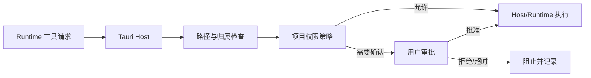

# 权限参考

> 状态：生效 
> 适用版本：Fox 0.1.x 
> 维护者：Fox 安全与 Runtime 团队 
> 最后更新：2026-09-22 
> 基线与待验证清单见[当前状态与核验基线](../01-项目概览/当前状态与核验基线.md)。

## 权限模式

| 模式 | 读项目 | 写/编辑 | 命令 | MCP 调用 |
|---|---|---|---|---|
| `read_only` | 允许受控只读工具 | 阻止 | 审批策略仍通常阻止/要求明确授权 | 总是审批 |
| `ask` | 允许受控只读工具 | 未获会话授权时审批 | 未获会话授权时审批 | 未获会话授权时审批 |
| `allow` | 允许受控只读工具 | 可按策略允许 | 未获会话授权时审批 | 未获会话授权时审批 |

`allow` 不是无限权限；Host 的路径范围、工具 allowlist、参数和危险操作规则继续生效。

## 工具目录

| 工具 | 分类 | 执行位置 | 审批 |
|---|---|---|---|
| read/ls/find/grep | project-read | 默认 runtime；新 Run 可显式冻结为 Rust | preflight |
| read_attachment | attachment | host | none |
| write_file/edit_file | project-write | host | policy |
| run_command | process | host | always（**当前生产构建无条件拒绝启动**，无验证隔离后端） |
| list/search/read/query knowledge | knowledge | host | none，受绑定范围限制 |
| list_mcp_tools | mcp | host | none |
| call_mcp_tool | mcp | host | always |

## 路径判定

1. 项目根必须存在且为目录。
2. 相对路径基于项目根拼接；绝对路径不因此获得额外权限。
3. 根和目标均 canonicalize。
4. 目标必须 `starts_with(canonical_root)`。
5. 空路径、NUL、不可解析路径和越界链接全部拒绝。

新建文件尚不存在时由 Host 对父目录做同等边界检查；不能仅用字符串前缀比较。

## 审批记录

审批等待按持久请求时间和 Run 冻结预算计算绝对截止时刻；数据库重开或重进等待不能重新获得完整时限。批准在写事务中再次检查截止时间，过期批准不能产生会话权限。受控 Kernel 的模型工具描述仅用于提议，不附带资源执行能力；每个后续批次仍由 Host 决策并在执行入口重新核验资源。

审批绑定 Tool Call，记录 requested_action、请求 JSON、决定、作用域、请求/解决时间。`allow_once` 只解决当前 Tool Call；`allow_conversation` 额外写入 `(conversation_id, tool_name)` 授权，同一会话后续同名工具不再弹出交互审批。该授权不绕过只读阻断、Expert/Assistant allowlist、路径边界、参数校验或未知工具拒绝；删除会话时级联删除。UI 必须展示实际目标、diff 或命令和 cwd；批准后执行参数不得被 Runtime 替换。取消 Run 时 pending approval 应进入 cancelled。

### 策略代次与审批失效（执行准入）

- 会话权限模式保存在 `kernel_execution_policies`，带单调递增 `version`；更新走请求 ID + 版本 CAS。
- 策略版本变化会**作废尚未派发 dispatch 的 pending 审批**；已经签发 dispatch 的意图不受重新授权影响，不能被重放。
- 一次 dispatch 只允许一次持久领取（`kernel_execution_attempts`，主键 `(run_id, dispatch_id)`）；拒绝、完成和不确定结果只可只读查询。
- `start_confirmed` 不得从 1 回退；`unknown` 状态不得自动重跑，须转对账或人工核对。
- 文件写入的版本前置条件来自 Host 实际读取（`kernel_host_observations`），模型自报版本无效。

表结构与触发器细节见[数据库结构](数据库结构.md)的迁移 74–79；行为级说明见[项目与权限架构](../02-架构/项目与权限架构.md)的「执行准入与原子文件提交」。

## 知识权限

Agent 只能访问 `knowledge_bindings` 中 enabled 的知识库。知识库服务自身的用户 ACL 是第一层，Fox 会话绑定是第二层。两者取交集，不得因远端列表可见就自动授权给当前会话。

## 附件与图片

附件必须属于当前会话，状态 ready，路径位于受管附件根且与记录一致。图片输入还受数量、单文件大小、格式和模型 `supportsImageInput` 限制。

## MCP 与 Skills

MCP 环境变量对前端和 Runtime 不可见；MCP Tool Call 在未获得当前会话同名工具授权时审批。基础 Assistant 与当前 Expert 的 `allowedTools`、`mcpServers` 都是限权条件：有效范围取双方与 Host Capability 的交集。Skill 只可声明支持目录中的 required tools，不能通过 Prompt 获得新权限，也不能自行执行脚本。

## 默认拒绝场景

未知工具/权限模式/能力版本、缺失项目、失效路径、未绑定知识库、未知 MCP 工具、无效 Schema、审批超时、凭据缺失和用户取消均默认拒绝。

## 测试依据

`tool_guard.rs` 覆盖项目内路径与越界；`tool_host.rs` 覆盖写入和命令；`mcp.rs` 覆盖声明验证与超时；`runtime-contract` 测试保证权限元数据与实际工具一致。
