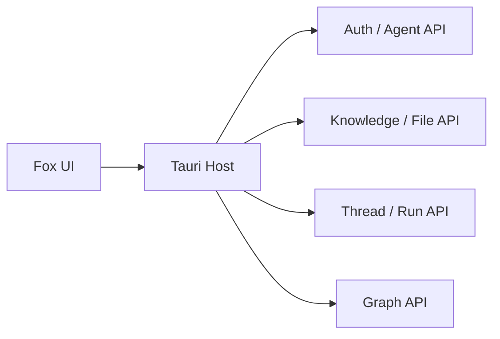

# 知识库服务接口参考

> 状态：生效 
> 兼容契约：Yuxi 0.7.x 
> 适用版本：Fox 0.1.x 
> 维护者：知识库集成工程师 
> 最后更新：2026-07-29

## 通用约定

Base URL 规范化后由 Host 拼接 `/api` 路径；认证使用 Bearer Token。Token 保存于 Keyring `com.fox.agent.yuxi`。页面不得直连服务。

## 身份、Agent 与模型

| 方法 | 路径 | Fox 用途 |
|---|---|---|
| POST | `/api/auth/token` | 用户名密码登录 |
| GET | `/api/auth/me` | 当前用户 |
| GET | `/api/agent` | Agent 列表/连通性 |
| GET | `/api/agent/default` | 默认 Agent |
| GET | `/api/agent/{slug}` | Agent 详情和资源 |
| GET | `/api/system/model-providers/models/v2` | 可用模型 |
| GET | `/api/system/health` | 服务测试/版本 |

## 知识库与文件

| 方法 | 路径 | 参数/说明 |
|---|---|---|
| GET | `/api/knowledge/databases/accessible` | 可访问知识库 |
| GET | `/api/workspace/knowledge/tree` | `kb_id`，文件树 |
| GET | `/api/workspace/knowledge/file` | `kb_id,file_id`，解析内容 |
| HEAD | `/api/workspace/knowledge/download` | 原件元数据 |
| GET | `/api/workspace/knowledge/download` | 原件下载，支持 Range；`variant=original` |
| POST/服务既有查询 | 由 `query_knowledge` 适配 | 知识检索 |

原件响应应提供 Content-Length、Content-Type、Content-Disposition、Accept-Ranges、ETag/versionId/Last-Modified 中明确的 revision 来源。Range 成功返回 206 和 Content-Range。

## 图谱

| 方法 | 路径 | 参数 |
|---|---|---|
| GET | `/api/graph/subgraph` | kb_id、keyword、max_depth、max_nodes |
| GET | `/api/graph/labels` | kb_id |
| GET | `/api/graph/stats` | kb_id |

Fox 会限制图谱规模；后端不得忽略上限返回无限节点。

## 远程 Agent Run

| 方法 | 路径 | 说明 |
|---|---|---|
| POST | `/api/chat/thread` | 创建 Thread |
| PUT | `/api/chat/thread/{id}` | 重命名 |
| DELETE | `/api/chat/thread/{id}` | 删除 |
| POST | `/api/chat/thread/{id}/attachments` | 上传附件 |
| POST | `/api/agent/runs` | 创建或 resume Run |
| GET | `/api/agent/runs/{id}` | Run 快照 |
| GET | `/api/agent/runs/{id}/events` | 增量事件/游标 |
| POST | `/api/agent/runs/{id}/cancel` | 取消 |

Run `meta` 携带会话启用的 `knowledge_base_ids` 与知识库名称。恢复交互必须携带 parent run 和用户 answers，避免新建无关联 Run。

## 兼容与失败处理

- 401/403 映射为未认证，不应清空本地历史。
- 404 文件可标记远端已删除；缓存命中仍可只读查看，但须提示版本风险。
- 不支持 Range 时可回退完整缓存；不应伪造 acceptsRanges。
- 未知 Agent 资源字段保留原 JSON 或忽略，不能注入 Runtime 请求的顶层未知参数。
- Office 版式转换接口已退役，不是 Fox 依赖。

## 验证

代码：`src-tauri/src/yuxi/mod.rs`、`yuxi/runtime.rs`。可选 Live Test 使用 `FOX_TEST_YUXI_URL/TOKEN/KB_ID/FILE_ID` 与 `FOX_TEST_YUXI_PREVIEW=1`；契约脚本为 `scripts/verify-knowledge-preview-contract.mjs`。
