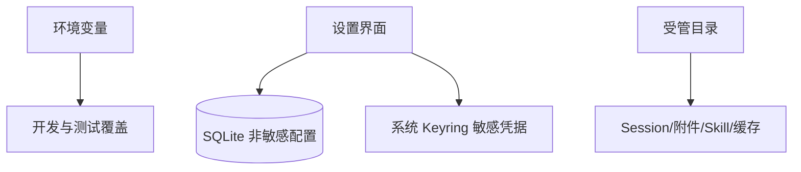

# 配置参考

> 状态：当前实现 
> 适用版本：Fox 0.1.x 
> 维护者：Fox 工程团队 
> 最后更新：2026-07-29

## 环境变量

| 变量 | 用途 | 默认 |
|---|---|---|
| `FOX_DATA_DIR` | 覆盖应用数据根，用于开发/测试隔离 | Tauri app_data_dir |
| `FOX_RUNTIME_SCRIPT` | 指定 Runtime `.mjs` 脚本 | 打包资源或工作区脚本 |
| `FOX_RUNTIME_EXECUTABLE` | 指定 Sidecar 可执行文件 | 自动解析打包产物/Node |
| `FOX_RUNTIME_MODE=fake` | 使用 Fake Runtime | Pi Runtime |
| `FOX_TEST_YUXI_URL` | 知识服务 Live Test URL | 无，测试跳过 |
| `FOX_TEST_YUXI_TOKEN` | Live Test Token | Keyring 中已配置凭据 |
| `FOX_TEST_YUXI_PREVIEW=1` | 启用原文件 Live Test | 关闭 |
| `FOX_TEST_YUXI_KB_ID` | 指定测试知识库 | 自动选择 |
| `FOX_TEST_YUXI_FILE_ID` | 指定测试文件 | 自动选择 |

环境变量不应进入安装包、日志或提交记录。生产配置优先通过设置页和系统 Keyring。

## 数据库配置

`app_settings` 当前保存知识预览缓存容量等本地偏好。用户资料也经 Repository 持久化为应用设置。结构化配置必须进行版本兼容和默认值处理。

## 模型配置

供应商字段：名称、Base URL、API Type、启用、默认；模型字段：modelId、显示名、contextWindow、maxOutputTokens、supportsImageInput、默认。API Key 不进 SQLite。

当前端到端可配置的 API 类型为 `openai-completions` 与 `anthropic-messages`。Runtime 内部保留 `openai-responses` 映射分支，但 Host 校验和设置 UI 尚未开放，因此不能视为已支持能力。

## 知识库服务配置

字段：名称、Base URL、enabled、连接类型、最近状态/版本/延迟。Token 使用 Keyring。产品层称“知识库服务”，代码/数据库兼容名仍为 yuxi。

## 项目权限

每个项目保存 `read_only/ask/allow`。该值只控制 Fox Host 策略，不能作为操作系统 ACL 的替代。项目路径失效时 status 变为 missing 或命令返回不可用。

## MCP 配置

SQLite 保存 name/command/args/enabled；环境变量保存到 `com.fox.agent.mcp` Keyring。MCP 参数必须是字符串数组，环境变量必须是字符串映射。

## Skills 配置

目录为 `<data>/skills/<id>/SKILL.md`，启用项记录在 `agent_runtime_config`。Skill 变更需重新扫描；无效 Skill 不注入 Prompt。

## 构建配置

- 工作区：pnpm 11.7.0。
- 前端：Vite 6，开发地址 `127.0.0.1:1421`。
- Tauri：窗口 1440x900，最小 760x560，无系统装饰。
- Sidecar：`pnpm runtime:build` 产出 `services/agent-runtime/dist` 并作为资源打包。
- 知识预览缓存：默认 500 MiB，设置范围 250 MiB 至 5 GiB；单预览文件上限 500 MiB，分段读取 4 MiB。

## 配置变更原则

敏感配置用 Keyring；产品事实用 SQLite；可重建资源用文件缓存；开发覆盖用环境变量。新增配置必须说明作用域、默认值、校验、迁移、清理和诊断输出是否脱敏。

## 失败恢复与验证

- Keyring 写入失败时不得把密钥退回 SQLite 或明文文件，应保留旧凭据并返回错误。
- 无效 URL、模型上下限、MCP 参数和缓存容量在保存前拒绝。
- Runtime 正忙时更换模型配置会返回 `model.runtime_busy`，由用户在 Run 结束后重试。
- 应用设置缺失或无法解析时使用安全默认值；不得因此阻止数据库打开。

关键代码：`src-tauri/src/lib.rs`、`commands/mod.rs`、`database/repositories.rs`、`model_service.rs`、`yuxi/mod.rs`、`mcp.rs`、`services/agent-runtime/src/pi-runtime.mjs`。验证以对应 Rust 单元测试、`pnpm runtime:test` 和设置页人工连接测试为准。
