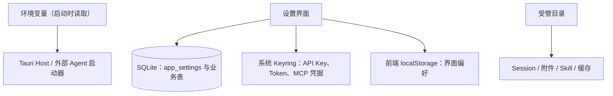

# 配置参考

> 状态：生效 
> 适用版本：Fox 0.1.x 
> 维护范围：环境变量、`app_settings` 设置键、模型协议、Keyring、受管目录与构建配置 
> 最后更新：2026-10-25

> 复核状态（2026-10-25）：环境变量表由 `main@763a019` 中 `std::env::var*` 调用与 `*_ENV` 常量整理（`apps/desktop/src-tauri/src`、`crates/fox-agent-backend/src`），只列生产代码读取的变量，测试 / 评测专用变量单列；`app_settings` 键来自 `commands/agent_backend_routing.rs`、`external_model.rs`、`local_knowledge_storage.rs`、`database/repositories.rs`；构建配置来自 `package.json`、`apps/desktop/vite.config.*`、`tauri.conf.json`。

## 结论

- 敏感凭据只进系统 Keyring；产品事实与非敏感设置进 SQLite（`app_settings` 等表）；可重建资源用文件缓存；开发与管理员覆盖用环境变量。
- 环境变量只在进程启动时读取，界面不能修改。管理员开关（`FOX_EXTERNAL_BACKENDS`、`FOX_EXTERNAL_FULL_ACCESS_FORBIDDEN`）只能收紧用户在设置里的选择。
- 未设置 `FOX_KERNEL_MODE` 时新 Run 走 **Kernel Authoritative**；`legacy` 只是显式的进程级回退。

```mermaid
flowchart TD
    ENV["环境变量（启动时读取）"] --> HOST["Tauri Host / 外部 Agent 启动器"]
    UI["设置界面"] --> DB[("SQLite：app_settings 与业务表")]
    UI --> KEY["系统 Keyring：API Key、Token、MCP 凭据"]
    UI --> LS["前端 localStorage：界面偏好"]
    FILE["受管目录"] --> ASSET["Session / 附件 / Skill / 缓存"]
```

## 环境变量

### 数据与执行

| 变量 | 取值与默认 | 作用 | 代码 |
| --- | --- | --- | --- |
| `FOX_DATA_DIR` | 路径；默认 Tauri `app_data_dir` | 覆盖数据根目录。设置后 WebView 数据也隔离到 `<data>/webviews/<窗口 label>`，用于开发 / 验收多实例 | `lib.rs` |
| `FOX_KERNEL_MODE` | `authoritative`（默认，未设置时）/ `legacy`；其他值报错 | 新 Run 的执行权威。已冻结的 Run 沿用冻结值 | `runtime_host/kernel_authority.rs` |
| `FOX_KERNEL_ENGINE` | `pi`（默认）/ `codex` / `deepseek_harness` | Kernel 使用的模型适配器 | `kernel_model_config.rs` |
| `FOX_KERNEL_CODEX_BINARY` | 绝对路径 | `FOX_KERNEL_ENGINE=codex` 时必需，指向经核验的 Codex 可执行文件（≤ 512 MiB） | `kernel_model_config.rs` |
| `FOX_KERNEL_WORKER_STDERR` | `inherit` / 其他（默认丢弃） | Kernel 模型 Worker 的 stderr 是否继承到 Host | `runtime_host/kernel_model_worker.rs` |
| `FOX_RESOURCE_GATEWAY_READS` | `rust`（默认，未设置时）/ `runtime`；其他值报错 | Legacy 路径新 Run 的 `read/ls/find/grep` 由谁执行；已冻结的 Run 不变 | `runtime_host/mod.rs` |
| `FOX_EXPERIMENTAL_COMPUTE_JOB_NOTICE` | `1` 开启，默认关闭 | 实验：附件计算作业完成通知 | `runtime_host/kernel_host.rs` |
| `FOX_DELIVERY_V2` | 默认关闭；无法识别的值按关闭处理 | 启用 v2 交付内容契约检查 | `runtime_host/delivery_v2.rs` |
| `FOX_SEARXNG_URL` | URL；无默认 | `web_search` 使用 SearXNG 时的地址 | `runtime_host/capability_tools.rs` |
| `FOX_RUNTIME_SCRIPT` | 路径 | 指定 Runtime `.mjs` 脚本 | `runtime_host/mod.rs` |
| `FOX_RUNTIME_EXECUTABLE` | 路径 | 指定 Sidecar 可执行文件 | `runtime_host/mod.rs` |
| `FOX_RUNTIME_MODE` | `fake` | 使用 Fake Runtime（测试） | `runtime_host/mod.rs` |

已失效：`FOX_KERNEL_RUN_CAPACITY`、`FOX_KERNEL_CHILD_RUN_CAPACITY`、`FOX_KERNEL_MODEL_REQUEST_CAPACITY` 不再生效（见 [Tauri 后端架构 · 并发与锁](../02-架构/Tauri后端架构.md#并发与锁)）。

### 外部 Agent（pi、DeepSeek、Codex）

| 变量 | 取值与默认 | 作用 | 代码 |
| --- | --- | --- | --- |
| `FOX_EXTERNAL_BACKENDS` | 未设置或空、`all`/`1`/`on`/`true`/`yes`：都可选；`0`/`off`/`false`/`none`/`no`：强制关闭；逗号或空白分隔的后端列表（如 `pi,deepseek`）：只允许这些，未知 id 忽略，列表里没有已知 id 等于全部关闭 | 管理员开关，只能收紧「新会话使用的 Agent」。关闭后只能新建 Fox 会话，已绑定该后端的会话只读（`agent_backend_disabled`）。Codex 与 pi / dsh 一样受它控制 | `crates/fox-agent-backend/src/host_routing.rs`（`EXTERNAL_BACKENDS_ENV`） |
| `FOX_EXTERNAL_FULL_ACCESS` | 旧值 `1` / `conversation:<id>` / `project:<root>` | **已弃用**：外部 Agent 不再有 Fox 外层 full-access 授权；该变量不再改变启动、进程边界或原生权限 | `external_launch.rs`（保留兼容解析） |
| `FOX_EXTERNAL_FULL_ACCESS_FORBIDDEN` | `1` | 禁用外部 Agent 的原生完全访问选项（`agent_backend_full_access_forbidden`）；不会让 Fox 重新套 SRT | `external_launch.rs` |
| `FOX_EXTERNAL_EXTRA_DOMAINS` | `pi=api.example.com;codex=…` | 旧 SRT 网络放行配置；外部 Agent 已不走 SRT，当前启动不读取 | `external_launch.rs`（历史策略） |
| `FOX_EXTERNAL_ENV_PASSTHROUGH` | 变量名列表，如 `RUSTUP_HOME,CARGO_HOME` | 仍按显式 Host 白名单传给外部后端；不会传整个环境 | `external_launch.rs` |
| `FOX_PI_PROVIDERS` | 如 `anthropic,openai` | 旧 SRT 策略配置；当前外部启动不读取 | `external_launch.rs`（历史策略） |
| `FOX_AGENT_RUNTIME_ROOT` | 路径 | 覆盖受管运行时目录（所有系统） | `external_launch.rs`、`launch.rs` |
| `FOX_RUNTIME_ROOT` / `FOX_RUNTIME_VERSION` | 路径 / 版本号 | Windows：受管运行时位于 `%ProgramFiles%\Fox\sandbox-runtime\<版本>`；前者直接指定目录，后者指定版本，都未设置时用已安装的最新版本 | `winruntime.rs`、`launch.rs` |
| `FOX_PI_ACP_PROGRAM` / `FOX_DSH_PROGRAM` / `FOX_CODEX_ACP_PROGRAM` | 路径 | 开发覆盖：直接指定后端程序（Host 从不经 `npx` 启动） | `launch.rs` |
| `FOX_CODEX_API_KEY` | — | Host 写入 Codex 私有配置时使用的 `env_key` 名称，由 Host 在启动 Codex 时注入，不需要用户设置 | `unified_login.rs` |
| `FOX_PI_BIN` | — | pi 门禁脚本使用的内部变量，不需要用户设置 | `external_launch.rs` |

受管运行时默认位置：Windows `%ProgramFiles%\Fox\sandbox-runtime\<版本>`（由一次性提权的 `enable-sandbox.ps1` 安装）；Linux / macOS `<data>/agent-runtime`。布局见 `crates/fox-agent-backend/src/external_launch.rs` 模块注释和 `crates/fox-agent-backend/docs/sandbox.md`。

### 本机资料库辅助进程（内部）

`FOX_KNOWLEDGE_RETRIEVAL_ROOT`、`FOX_KNOWLEDGE_RETRIEVAL_REQUEST`、`FOX_KNOWLEDGE_ZVEC_RESOURCE_DIR`、`FOX_EMBEDDING_SMOKE_PACKAGE`：Host 以子进程方式重新启动自身做检索 / 向量模型自检时设置（`main.rs`、`local_knowledge_vector.rs`），用户不应设置。

### 测试与评测

| 变量 | 用途 |
| --- | --- |
| `FOX_TEST_YUXI_URL`、`FOX_TEST_YUXI_BASE_URL`、`FOX_TEST_YUXI_TOKEN`、`FOX_TEST_YUXI_USERNAME`、`FOX_TEST_YUXI_PASSWORD`、`FOX_TEST_YUXI_PREVIEW=1`、`FOX_TEST_YUXI_KB_ID`、`FOX_TEST_YUXI_FILE_ID`、`FOX_TEST_YUXI_QUERY` | 知识库服务 Live Test；未设置时跳过 |
| `FOX_KNOWLEDGE_TOKEN` | `pnpm.cmd knowledge:verify-preview` 原文件契约脚本使用 |
| `FOX_TEST_REAL_ACP`、`FOX_TEST_REAL_SRT`、`FOX_TEST_CODEX_BINARY` 等 `FOX_TEST_*` | 外部 Agent、沙箱、Kernel 测试的开关和子进程标记 |
| `FOX_EVAL_*`（`FOX_EVAL_BASE_URL`、`FOX_EVAL_API_KEY`、`FOX_EVAL_MODEL` 等） | 真实模型评测 |

环境变量不应进入安装包、日志或提交记录。生产配置优先通过设置页和系统 Keyring。

## app_settings 设置键

`app_settings(key, value, updated_at)` 保存非敏感设置。读取失败或值无法解析时使用安全默认值，不阻止数据库打开。

| 键 | 值 | 写入位置 | 说明 |
| --- | --- | --- | --- |
| `agent_backend.default_backend` | `fox`（未设置时）/ `pi` / `deepseek` / `codex` | 设置 → Agent →「新会话使用的 Agent」（`agent_backend_preferences_save`） | 新会话的后端。被 `FOX_EXTERNAL_BACKENDS` 关闭时实际回落到 Fox；Codex 已恢复可选 |
| `agent_backend.new_external_full_access` | `1` / `0` | 旧设置，界面已移除 | **已弃用**：不再决定新会话权限，也不创建 Fox 外层授权；权限由各 Agent 的原生模式决定 |
| `agent_backend.codex_responses_probe` | JSON（base URL 与探测结果） | `agent_backend_probe_codex_responses` | 最近一次对模型服务 `POST {base}/responses` 的探测缓存 |
| `agent_backend.native_mode.conversation.<会话 id>` | 原生权限选项 id | `agent_backend_native_permission_set` | 该外部会话选择的原生权限 |
| `agent_backend.native_mode.last.<后端>` | 原生权限选项 id | 同上 | 该后端最近一次选择，用作新会话初值 |
| `agent_backend.native_mode.draft_full.<后端>` | `1` / `0` / 空 | 同上 | 新建会话草稿是否选了完全访问 |
| `model.protocol.<供应商 id>.<api_type>.<协议 id>` | 规范 JSON（base URL、模型 id、供应商更新时间） | 外部 Agent 模型连接测试（`agent_backend_model_connection`） | 连接已验证的缓存；供应商被编辑后自动失效 |
| `local_knowledge_storage_path` | 路径 | 设置 → 资料库 → 本机存储（存储迁移完成后写入；`local_knowledge_storage_path_reset` 清除） | 本机资料库根目录；未设置时为 `<data>/local-knowledge`。已设置但不可用时降级打开，不改用默认目录 |
| `knowledge_preview_cache_limit_bytes` | 字节数；默认 500 MiB，范围 250 MiB–5 GiB | `knowledge_preview_cache_limit_set` | 知识预览缓存容量 |
| `user_profile` | JSON | `user_profile_save` | 用户资料 |
| `host_data_root_instance_uuid` | UUID | `Database::open` 首次写入 | 数据根实例标识，写入后不可替换 |

其他设置有专用表：通知偏好在 `notification_preferences`（单行），模型供应商在 `model_providers`（v97 起含 `protocol_profiles`），知识库服务、MCP、Hook、Skills 见下文。

前端 localStorage 偏好（不在 SQLite）：「新项目权限」`fox.preferences.defaultPermission`（默认「询问」）等。

## 模型配置

供应商字段：名称、Base URL、API Type、启用、默认、`protocol_profiles`（v97，JSON 数组）；模型字段：modelId、显示名、contextWindow、maxOutputTokens、supportsImageInput、默认。API Key 不进 SQLite，在系统凭据库中按 base URL 保存。

每个协议配置（`crates/fox-agent-backend/src/provider_protocol.rs` 的 `ProtocolProfile`）含 `id`、`apiType`、`baseUrl`、`modelId`、`backends`、`separateCredential`。各 Agent 支持的协议（`supports`）：

| Agent | 支持的 API Type |
| --- | --- |
| Fox | `openai-completions`、`anthropic-messages` |
| pi | `openai-completions`、`anthropic-messages`、`openai-responses` |
| Codex | `openai-responses` |
| DeepSeek | `anthropic-messages` |

模型服务的连接测试（`model_service.rs`）支持这三种协议。Runtime 正忙时更换模型配置会返回 `model.runtime_busy`。

## 知识库服务配置

字段：名称、Base URL、enabled、连接类型、最近状态 / 版本 / 延迟。Token 使用 Keyring。产品层称「知识库服务」，代码 / 数据库兼容名仍为 yuxi。

## 项目权限

Fox 会话的项目执行方式为 `read_only` / `ask` / `allow`，在「设置 → Agent → 项目权限」修改；新会话创建时复制项目当前值，之后两者独立。该值只控制 Fox Host 策略，不能作为操作系统 ACL 的替代。外部 Agent 使用各自的原生权限，Fox 不再套 SRT；见[权限参考](权限参考.md#外部-agent-权限)。项目路径失效时 status 变为 `missing` 或命令返回不可用。

## 扩展源与 Lifecycle Hook 配置

SQLite 的 `mcp_servers` 保存 name、`transport`（`stdio` / `streamable_http` / `openapi`）、command/args、endpoint、OpenAPI definition、enabled 和健康状态；stdio 环境变量或 HTTP Header 保存到 `com.fox.agent.mcp` Keyring。MCP 参数必须是字符串数组，凭据必须是字符串映射。HTTP 端点只允许 HTTP/HTTPS；Streamable HTTP 必填 endpoint，OpenAPI 可使用显式 endpoint 覆盖或规范 `servers[0].url`。

`lifecycle_hooks` 保存事件、matcher、动作、reason、priority 和 enabled。`before_tool` 可使用 `block|require_approval|annotate`；其他事件只允许 `annotate`。配置不接受脚本、Shell、webhook 或参数改写代码。管理入口：插件中心「策略」和「设置 → 插件 → 策略」。

## Skills 配置

目录为 `<data>/skills/<id>/SKILL.md`，启用项记录在 `agent_runtime_config`。Skill 变更需重新扫描；无效 Skill 不注入 Prompt。

## 构建配置

- 工作区：pnpm 11.7.0（根 `package.json` 的 `packageManager`）。
- 前端：Vite 6，开发地址 `127.0.0.1:1421`。
- Tauri：主窗口 1120×768，最小 600×560，无系统装饰（`tauri.conf.json`）；应用版本 0.1.0。
- Sidecar：`pnpm runtime:build` 产出 `services/agent-runtime/dist` 并作为资源打包。
- 知识预览缓存：默认 500 MiB，设置范围 250 MiB 至 5 GiB（`maintenance.rs`）；单预览文件上限 500 MiB，分段读取 4 MiB。

## 配置变更原则

敏感配置用 Keyring；产品事实用 SQLite；可重建资源用文件缓存；开发与管理员覆盖用环境变量。新增配置必须说明作用域、默认值、校验、迁移、清理和诊断输出是否脱敏，并补到本页。

## 失败恢复与验证

- Keyring 写入失败时不得把密钥退回 SQLite 或明文文件，应保留旧凭据并返回错误（`model.credential_save_failed`、`mcp.credential_save_failed` 等）。
- 无效 URL、模型上下限、MCP/OpenAPI 参数、Hook 枚举和缓存容量在保存前拒绝。
- `FOX_KERNEL_MODE`、`FOX_KERNEL_ENGINE`、`FOX_RESOURCE_GATEWAY_READS` 取值非法时启动 Run 失败并给出提示，不静默回退。
- 应用设置缺失或无法解析时使用安全默认值；不得因此阻止数据库打开。

关键代码：`apps/desktop/src-tauri/src/lib.rs`、`commands/agent_backend_routing.rs`、`external_model.rs`、`kernel_model_config.rs`、`runtime_host/kernel_authority.rs`、`database/repositories.rs`、`model_service.rs`、`yuxi/mod.rs`、`mcp.rs`、`lifecycle_hooks.rs`、`crates/fox-agent-backend/src/{host_routing,external_launch,launch,provider_protocol}.rs`。
