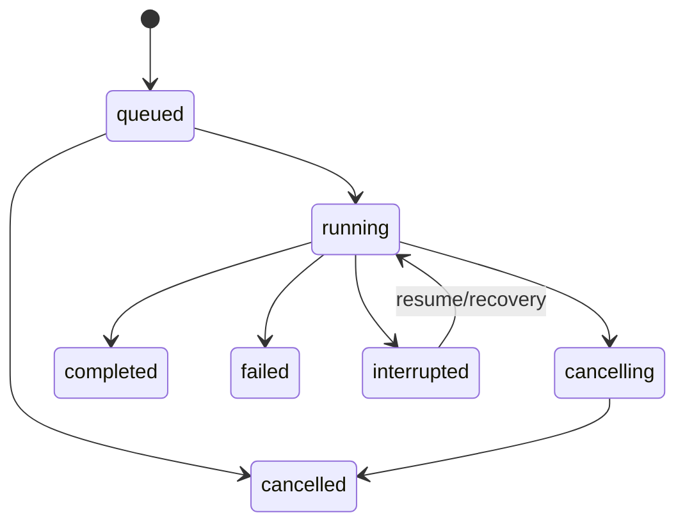

# 错误与状态参考

> 状态：生效 
> 适用版本：Fox 0.1.x 
> 维护者：Fox 工程团队 
> 最后更新：2026-08-21

## API 错误格式

所有普通命令失败返回 `code/message/retryable`。前端应按 code 决定交互，message 用于用户可读提示；不要匹配完整英文或中文错误文本。

## 错误码族

| 前缀 | 示例 | 处理建议 |
|---|---|---|
| `conversation.*` | not_found, run_active, invalid_title | 返回列表或修正输入 |
| `conversation.assistant_required` / `conversation.expert_required` | Agent 分类不符合会话角色 | 返回助手或专家入口重新选择 |
| `conversation.expert_locked` | 会话已有用户/助手消息、正在运行或已归档 | 新建对话，或结束活动 Run 后处理空会话 |
| `conversation.expert_invalid_role` | 所选 Agent 不是 `expert/inline/expert_center` | 返回专家中心重新选择 |
| `conversation.expert_remote_unavailable` | 远程专家当前离线或未同步 | 检查知识服务连接或更换专家 |
| `conversation.expert_snapshot_invalid` | 绑定执行快照缺失、分类无效或 Hash 不匹配 | 新建对话并重新选择专家；不得静默使用最新版 |
| `expert.not_found` | 专家已删除或尚未同步 | 刷新专家中心或移除草稿选择 |
| `project.*` | path_denied, root_unavailable | 重新授权/选择项目 |
| `attachment.*` | too_large, image_invalid | 删除或换文件 |
| `run.*` / `runtime.*` | create_failed, process_crashed | reload 状态后重试 |
| `model.*` | not_configured, connection_failed | 打开供应商设置 |
| `yuxi.*` | not_authenticated, agent_sync_failed, agent_sync_timeout, stream_error | 登录/检查知识服务；专家同步失败时继续使用已标记为不可用的本地缓存 |
| `knowledge.*` | preview_cancelled, source_metadata_failed | 重试、回退或提示不可预览 |
| `mcp.*` | invalid_config, connection_failed | 编辑配置/停用 Server |
| `skills.*` | invalid, scan_failed | 展示校验错误 |
| `backup.*` / `maintenance.*` | restore_failed | 保留原数据并展示诊断 |
| `storage.*` | event_projection_failed | 刷新数据库投影并告警 |
| `protocol.*` / `provider.*` | invalid_message, request_failed | 记录诊断，必要时重启 Runtime |

## Run 状态机

终态为 completed/failed/cancelled；interrupted 表示可解释的非正常中止，远程 Run 可能恢复。前端活动判断包含 queued/running/cancelling。

## 消息与工具状态

消息从 sending/streaming 到 completed，Run 失败或中断时投影为 failed/interrupted。Tool Call 通常经历 started、awaiting approval、completed/failed；Approval 只允许 pending 转 approved/denied/cancelled/expired。

## Runtime Host 状态

`RuntimeStatus.state` 是诊断字符串，常见为未初始化、ready、busy、unavailable/error。业务判断优先使用 `available`、`activeRunId` 和数据库 Run 状态，不要把展示字符串写成强枚举。

## 重试规则

- 参数、权限、认证和不支持能力通常不可自动重试。
- 网络瞬断、远端 5xx、Runtime 进程崩溃可有限重试，并保留退避和次数。
- 写入、命令、MCP 等有副作用操作不得盲目自动重放。
- 事件投影失败先从 Run 快照/数据库恢复，不能重复追加文本。

## 诊断要求

错误记录应包含 code、run/conversation/tool 标识、阶段和脱敏上下文。`runtime_diagnostics` 提供协议、版本、stderr tail、Session 数和恢复次数；`diagnostics_export` 导出支持包，禁止包含 API Key 和 Token。

## 现状、规划与验证

当前错误码主要由 `commands/mod.rs` 和两个 Runtime Host 定义，尚未形成单独的编译期枚举；新增错误必须复用前缀并避免同义码。A4 计划引入 Trace/Span 后，错误应关联 trace_id/span_id，但这些字段尚未落地。

关键代码：`src-tauri/src/commands/mod.rs`、`runtime_host/mod.rs`、`yuxi/runtime.rs`、`database/repositories.rs`、前端 `runtime-event-reducer.ts`。测试应覆盖每个状态转换、重复/乱序事件、异常退出恢复、可重试网络错误和有副作用操作不自动重放。
