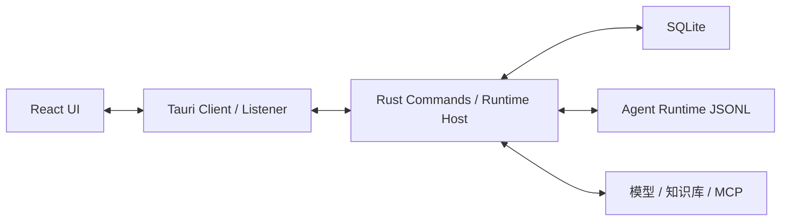

# 调试指南

> 状态：当前<br>
> 适用版本：Fox 0.1.0<br>
> 维护范围：前端、Tauri、Runtime、SQLite、知识库与文件预览<br>
> 最后更新：2026-07-29

## 目标与范围

本文提供从用户症状定位到具体层级的调试路径。Fox 同时包含 WebView、Rust Host、SQLite、Node/Bun Sidecar 和外部服务，优先判断故障属于哪一层，再读取对应状态，避免反复修改 UI 掩盖数据问题。

## 调试模型



排查顺序：UI 当前状态 → Tauri 调用/事件 → SQLite 事实 → Runtime/外部服务。

## 隔离环境

### 独立数据目录

```powershell
$env:FOX_DATA_DIR = "$env:TEMP\fox-debug-$([DateTimeOffset]::Now.ToUnixTimeSeconds())"
pnpm.cmd tauri dev
```

这能排除旧数据库、损坏缓存和历史配置干扰。

### 假 Runtime

```powershell
$env:FOX_RUNTIME_MODE = "fake"
pnpm.cmd tauri dev
```

假 Runtime 正常而真实 Runtime 异常时，重点检查模型配置、Pi 依赖和 JSONL 适配。

### 指定 Runtime 脚本或 EXE

```powershell
$env:FOX_RUNTIME_SCRIPT = "D:\path\to\pi-runtime.mjs"
pnpm.cmd tauri dev
```

```powershell
$env:FOX_RUNTIME_EXECUTABLE = "D:\path\to\fox-agent-runtime-x86_64-pc-windows-msvc.exe"
pnpm.cmd tauri dev
```

路径必须指向真实文件。`FOX_RUNTIME_EXECUTABLE` 优先于默认开发脚本。

## 前端调试

- 在 Tauri 开发窗口打开 WebView DevTools，观察 Console、Network 和 React 状态。
- 核对 `desktop-client.ts` 的 Command 响应以及 `fox://runtime-event`、审批、下载进度 listener。
- 对事件显示问题记录 `conversationId`、`runId`、`seq`、事件类型和当前路由。
- 检查 listener 是否在组件挂载前注册，以及卸载后是否被错误移除。
- 对刷新后正常、实时不正常的问题，优先比较实时 Reducer 与 `conversation_load` 返回的 SQLite 快照。

关键入口：

- `features/conversations/api/desktop-client.ts`
- `features/conversations/hooks/use-desktop-conversation.ts`
- `features/conversations/model/runtime-event-queue.ts`
- `features/conversations/model/runtime-event-reducer.ts`
- `features/chat/workbench.tsx`

## Runtime 调试

开发态 Host 默认以 Node 启动 `services/agent-runtime/src/pi-runtime.mjs`。stdout 是 JSONL 协议通道，不能输出普通日志；stderr 会被 Host 捕获并进入脱敏诊断。

独立运行源码仅适合协议开发：

```powershell
pnpm.cmd --dir services/agent-runtime start
```

使用假 Runtime：

```powershell
pnpm.cmd --dir services/agent-runtime start:fake
```

协议错误重点检查：

- `protocol` 是否为 `fox-runtime-jsonl`。
- `version` 是否为 1。
- ready payload 是否包含 Runtime 名称、版本和有效 Capability Manifest。
- 注册工具顺序是否与 `RUNTIME_TOOL_CATALOG` 完全一致。
- 每个增量是否带正确 `runId`，最终是否产生 `run.completed` 或失败终态。

## SQLite 调试

数据库位于 Tauri 应用数据目录下的 `fox.db`；开发时可用 `FOX_DATA_DIR` 明确位置。

查看数据库前：

1. 关闭 App，或使用只读连接，避免与 WAL 写入竞争。
2. 先复制 `fox.db`、`fox.db-wal`、`fox.db-shm`，或从设置创建备份。
3. 不直接修改生产数据验证猜测。

基础检查：

```sql
PRAGMA integrity_check;
SELECT MAX(version) FROM schema_migrations;
SELECT id, status, updated_at FROM runs ORDER BY updated_at DESC LIMIT 20;
```

启动时会执行 Migration、`repair_interrupted_runs`、待恢复备份和预览缓存恢复。若白屏或启动慢，应分别计时这些步骤。

## 诊断包

应用的“数据与诊断”页面可以调用 `diagnostics_export`。诊断 JSON 写入数据目录的 `exports/fox-diagnostics-<timestamp>.json`，包含 Runtime、Schema、模型、知识库和 MCP 状态，不包含对话正文、项目文件和凭证明文。

即使有脱敏逻辑，分享前仍应人工检查诊断文件。

## 常见症状

### 用户消息出现，但模型回复刷新后才显示

1. 确认 listener 已 ready。
2. 比较事件的 `conversationId` 与当前会话。
3. 查看 `seq` 是否停滞、乱序或被去重。
4. 查询 SQLite 中 Run/Event 是否已完成。
5. 如果数据库已完整，问题在前端事件队列/Reducer；如果数据库也缺失，继续查 Host 与 Sidecar。

### 一直“思考中”

- 检查 Run 是否已有终态。
- 检查 Runtime 是否崩溃或等待审批/用户补充。
- 检查远程知识助手是否在后台完成，但本地游标没有恢复。
- 重启能恢复时，比较启动恢复路径与实时轮询路径。

### `Unknown parameter: input[n].namespace`

这类错误通常来自发送给模型供应商的历史消息或工具输入不符合其 API Schema。定位生成请求的 Runtime Session，确认内部诊断字段没有被回灌为模型输入，并执行 Runtime adapter contract 测试。

### `Pi Runtime dependencies are missing`

从根目录执行 `pnpm.cmd install --frozen-lockfile`。开发 Host 会向上查找工作区 `node_modules`，只安装桌面端依赖不足以提供 Pi Runtime 包。

### 知识库预览第二页空白或 Range 失败

先运行契约脚本，检查服务端是否严格支持 HEAD、版本标识与 Range。前端预览器问题再检查缓存读取区间、PDF Worker、取消信号和文档切换后的旧请求覆盖。

### 白屏

- Vite Console 是否有模块加载异常。
- `127.0.0.1:1421` 是否被其他进程占用。
- node_modules 是否因混用包管理器损坏。
- App 初始化是否卡在 Migration、备份恢复或 Runtime 初始化。
- 最近是否把 Office、G6、Mermaid、Shiki 等重型依赖改成了首屏静态导入。

## 验证方式

- 使用假 Runtime 复现并隔离模型变量。
- 使用全新 `FOX_DATA_DIR` 排除历史数据。
- 刷新与重启后状态和实时状态一致。
- 导出诊断包并确认无敏感正文。
- 对修复点添加对应 Reducer、Runtime 或 Rust 回归测试。

## 相关代码与文档

- `apps/desktop/src-tauri/src/lib.rs`
- `apps/desktop/src-tauri/src/runtime_host/mod.rs`
- `apps/desktop/src-tauri/src/maintenance.rs`
- `services/agent-runtime/src/pi-runtime.mjs`
- `services/agent-runtime/src/protocol.mjs`
- `docs/06-运维指南/诊断与故障排查.md`
- `docs/05-开发指南/测试指南.md`
