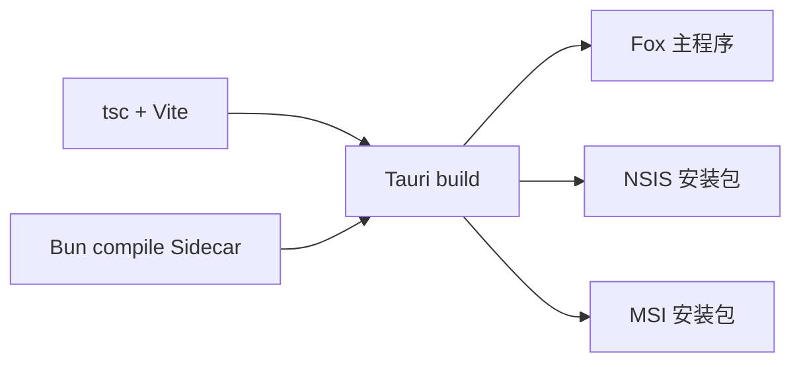

# 构建与发布

> 状态：生效<br>
> 适用版本：Fox 0.1.0<br>
> 维护范围：前端、Runtime Sidecar、Tauri 安装包与发布验收<br>
> 最后更新：2026-09-22<br>
> 发布状态（已提交/已推送/已发布/已验收的区分）见[当前状态与核验基线](../01-项目概览/当前状态与核验基线.md)。

## 目标与范围

本文描述 Windows x64 的当前构建链。发布由三部分组成：Vite 前端、Bun 编译的 Runtime Sidecar、Tauri/Rust 主程序与安装包。

## 构建关系



根命令 `pnpm.cmd tauri:build` 会先执行 `runtime:build`，再执行桌面端 `tauri build`。Tauri 自身还会通过 `beforeBuildCommand` 执行前端 build。

## 发布前准备

1. 工作区无意外生成文件和敏感配置。
2. `package.json`、`pnpm-lock.yaml`、Cargo 版本和 Tauri `version` 一致或已按发布策略更新。
3. Bun、Node、pnpm、Rust MSVC、C++ Build Tools 可用。
4. 预期的应用图标存在于 `apps/desktop/src-tauri/icons/`。
5. Runtime 依赖已经由根目录 pnpm 安装。

## 分步构建

### 前端

```powershell
pnpm.cmd --dir apps/desktop build
```

输出目录：`apps/desktop/dist/`。

### Runtime Sidecar

```powershell
pnpm.cmd runtime:build
pnpm.cmd runtime:smoke
```

输出：

```text
services/agent-runtime/dist/fox-agent-runtime-x86_64-pc-windows-msvc.exe
```

构建脚本会建立临时 bundler workspace、实体化 pnpm 符号链接依赖、复制 Runtime 协议文件，使用 `bun build --compile --target=bun-windows-x64 --windows-hide-console` 生成临时 EXE，成功后再替换正式文件。失败不会破坏上一次可用产物。

### Tauri 主程序和安装包

```powershell
pnpm.cmd tauri:build
```

典型输出：

```text
apps/desktop/src-tauri/target/release/fox-desktop.exe
apps/desktop/src-tauri/target/release/bundle/nsis/Fox_<version>_x64-setup.exe
apps/desktop/src-tauri/target/release/bundle/msi/Fox_<version>_x64_en-US.msi
```

当前 `bundle.targets` 为 `all`。历史构建曾出现 WiX `light.exe` 失败而 NSIS 成功的情况，因此必须按本次时间戳和哈希识别产物，不能把目录中的旧 MSI 当作新构建结果。

## 完整发布检查

```powershell
bun test ./apps/desktop/tests
pnpm.cmd runtime:test
pnpm.cmd knowledge:verify-preview:test
cargo fmt --manifest-path apps/desktop/src-tauri/Cargo.toml -- --check
cargo test --manifest-path apps/desktop/src-tauri/Cargo.toml
pnpm.cmd --dir apps/desktop build
pnpm.cmd runtime:build
pnpm.cmd runtime:smoke
pnpm.cmd tauri:build
git diff --check
```

生成 SHA-256：

```powershell
Get-FileHash apps/desktop/src-tauri/target/release/bundle/nsis/Fox_0.1.0_x64-setup.exe -Algorithm SHA256
```

## 安装包验收

在干净或隔离的 Windows 用户环境验证：

1. 首次安装和首次启动。
2. 引导页、用户资料和默认头像。
3. 模型供应商配置与凭证保存。
4. Fox 通用助手流式对话、取消、审批和重启恢复。
5. 项目文件夹授权、读取、写入和命令审批。
6. 附件保存与历史恢复。
7. 知识库登录、绑定、检索、引用跳转、文档预览和下载。
8. 插件中心、Skills、MCP/OpenAPI 配置与健康状态。
9. 本地知识导入、检索、引用、删除和缺少向量资源时的降级。
10. 专家包、工作流、团队和数字同事的创建、触发、取消与恢复。
11. Goal/Task/Evidence、Plan/Review/Acceptance、重启/中断、Evidence 失效、`diagnose_work_state` 和 `export_work_trace`。
12. 诊断导出、备份、恢复和缓存清理。
13. 从上一个正式版本覆盖安装，旧数据库自动迁移。

录屏、测试输出和人工签收必须对应本次安装包哈希，不得复用历史构建素材。发布基线与完整命令见 `docs/05-开发指南/Agent能力测试基准.md`。

## Tauri 资源

`tauri.conf.json` 将 Runtime 源文件和 `services/agent-runtime/dist/*` 打入 `agent-runtime/` 资源目录。生产模式优先启动编译后的 Sidecar EXE；若资源缺失，Host 会报告 `bundled Fox Runtime executable was not found`。

修改 Runtime 文件清单时，需要同步 `tauri.conf.json` 和 `build-sidecar.mjs` 的复制列表。

## 构建变体与打包命令

根 `package.json` 提供三个打包入口，产物语义不同，不能互相代替：

| 命令 | bundles / config | 默认执行权威 |
| --- | --- | --- |
| `pnpm tauri:build` | `bundle.targets = "all"`（NSIS + MSI） | **Authoritative** |
| `pnpm tauri:build:windows` | `--bundles nsis` + `tauri.installer.conf.json`（补入 `resources/windows-runtime/*.dll`） | **Authoritative** |
| `pnpm tauri:build:kernel-preview` | `--bundles nsis` + `tauri.kernel-preview.conf.json`（`features: ["kernel-default"]`） | **Authoritative** |

预览包使用独立 `productName`（Fox Kernel Preview）与 `identifier`（`com.fox.agent.kernel-preview`），可与正式版并存安装。2026-09-29 起普通开发和构建也默认 Authoritative，Legacy 仅通过显式 `FOX_KERNEL_MODE=legacy` 启用；现有安装产物需要更新后才采用新的默认。见[当前状态与核验基线](../01-项目概览/当前状态与核验基线.md)的「执行权威的层次」。

安全相关的构建事实：`apps/desktop/src-tauri/tauri.conf.json` 的 `app.security` 已配置 `csp` 与 `devCsp`；预览配置未覆盖 `app.security`，按 Tauri 的配置合并语义应沿用基础 CSP（本轮未运行预览包实测）。

## 发布状态说明

本仓库当前**没有**代码签名、更新服务器和 SBOM 流程：`tauri.conf.json` 中不存在 `updater`、`pubkey` 或签名相关字段。也没有 GitHub Release/自动发布工作流；`.github/workflows/windows-ci.yml` 只做测试与构建校验，不产出发布包。

因此「构建出安装包」只到**产物存在**这一层。要形成发布结论，必须补齐：与本次提交对应的安装包哈希、在干净/隔离环境的安装验收记录、明确的交付范围（NSIS 还是 MSI）。没有这三项时，不得写入任何「已发布」或「已验收」表述。

对外分发前还需明确：

- 版本号唯一来源与升级规则。
- Windows 代码签名证书与签名校验。
- GitHub Release 或其他发布通道。
- 安装包哈希、变更日志和回滚包。
- 依赖许可证与供应链审查。
- CI 是否对当前提交实际跑通（job 存在不等于通过，见[测试指南](../05-开发指南/测试指南.md)）。

## 常见故障

### Sidecar 构建找不到依赖

从根目录执行 `pnpm.cmd install --frozen-lockfile`。构建脚本会从 Runtime 本地或工作区 `node_modules` 查找 Pi 与传递依赖。

### `runtime-contract.mjs` 无法解析

确认它仍位于 `services/agent-runtime/src/`，并包含在 `build-sidecar.mjs` 的复制列表中。

### Tauri CLI 模块缺失

不要硬编码 `node_modules/@tauri-apps/cli/tauri.js` 路径。重新安装锁定依赖，并通过 `pnpm.cmd --dir apps/desktop exec tauri --version` 验证本地 bin。

### MSI 失败

保留完整 WiX 日志并确认 NSIS 是否成功。本次发布若要求 MSI，则不能用旧文件补位；若只发布 NSIS，要在发布说明明确交付范围。

## 相关代码与文档

- `package.json`
- `apps/desktop/package.json`
- `apps/desktop/src-tauri/tauri.conf.json`
- `services/agent-runtime/scripts/build-sidecar.mjs`
- `services/agent-runtime/scripts/smoke-sidecar.mjs`
- `docs/05-开发指南/测试指南.md`
- `docs/06-运维指南/迁移备份与恢复.md`
