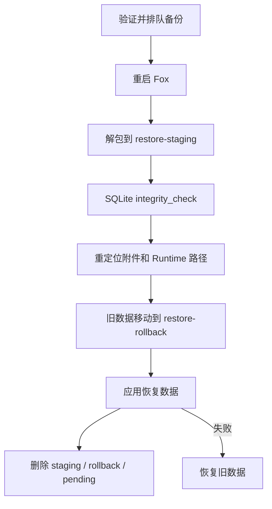

# 迁移、备份与恢复

> 状态：当前<br>
> 适用版本：Fox 0.1.0<br>
> 维护范围：SQLite Migration、Fox 数据备份、恢复与清理<br>
> 最后更新：2026-07-29

## 目标与范围

本文说明 Fox 数据的实际组成、自动 Migration、`.foxbackup` 内容及恢复机制。它不覆盖知识库服务自身的 MinIO、数据库或向量存储备份；外部知识库必须按其服务运维方案独立备份。

## 数据目录

Fox 默认使用 Tauri 的应用数据目录。开发和测试可通过 `FOX_DATA_DIR` 指定：

```text
<data-dir>/
├─ fox.db                       # SQLite 产品事实
├─ fox.db-wal / fox.db-shm      # SQLite WAL 临时文件
├─ attachments/                 # Fox 管理的附件
├─ runtime-sessions/            # Pi Runtime Session，尽力恢复
├─ skills/                      # 本地 Skills
├─ cache/knowledge-preview/     # 知识库预览缓存
├─ exports/                     # 诊断导出
├─ backups/                     # Fox 备份包
├─ restore-pending.foxbackup    # 等待下次启动恢复
├─ restore-staging/             # 恢复暂存
└─ restore-rollback/            # 恢复回滚副本
```

凭证不在数据目录中：模型 API Key、知识库 Token 和 MCP 环境变量位于 Windows Credential Manager。

## SQLite Migration

数据库打开时 `Database::open` 自动执行 `database/migrations.rs`。当前迁移版本为 13，记录在 `schema_migrations(version, applied_at)`。

迁移规则：

- 每个新版本只追加一次。
- 在同一事务中执行。
- 使用 `INSERT`/`CREATE IF NOT EXISTS` 等方式保持可重复打开。
- 不改写历史迁移。
- 迁移失败时应用启动失败，不应绕过 Schema 继续运行。

发布升级前应使用上一个正式版本的样本数据库验证自动升级和数据完整性。

## 备份内容

应用内备份由 `maintenance::create_backup` 创建：

```text
<data-dir>/backups/fox-backup-<timestamp>.foxbackup
```

备份包含：

- SQLite 一致性快照 `fox.db`。
- `attachments/`。
- `runtime-sessions/`。
- `skills/`。
- Manifest：Fox 版本、Schema 版本、条目大小和 SHA-256。

备份不包含：

- 模型 API Key、知识库 Token、MCP 环境变量。
- 诊断输出和普通日志。
- 知识库预览缓存。
- 用户下载到任意外部目录的文件。
- 外部知识库服务的数据。

Runtime Session 标记为“尽力恢复”，不保证跨 Pi Runtime 版本兼容；对话和消息历史仍以 SQLite 为准。

## 备份格式与限制

- Magic：`FOXBACKUP1`。
- 格式版本：1。
- 单条目最大 512 MB。
- 归档声明内容最大 4 GB。
- Manifest 最大 4 MB。
- 所有路径必须是安全相对路径，拒绝绝对路径、控制字符和 `..`。
- 恢复前逐条校验大小与 SHA-256。

因此 `.foxbackup` 不是 ZIP，也不应由普通压缩软件编辑。

## 创建备份

推荐从应用“数据与诊断”页面创建，以获得 SQLite 一致性快照。手工复制正在运行的 `fox.db` 可能漏掉 WAL 中尚未 checkpoint 的数据。

发布升级、数据库迁移、恢复演练和重大清理前必须创建备份，并将副本保存到数据目录之外。

## 恢复流程

应用选择备份后，`queue_restore` 先完整读取和校验归档，再复制为：

```text
<data-dir>/restore-pending.foxbackup
```

恢复不会在当前进程中直接替换数据库，而是在下次启动时执行：



恢复会重定位附件路径和 Pi Runtime Session 路径，使从其他数据目录导入的备份仍可用。

## 中断恢复

若上次恢复在替换阶段中断，下一次启动先执行 `recover_restore_rollback`：只有旧副本存在且目标缺失时才移回。随后清理 rollback 并继续处理 pending。

手工处理前：

1. 完整复制当前数据目录。
2. 关闭所有 Fox 进程。
3. 记录 pending、staging、rollback 的存在状态。
4. 不同时删除 rollback 和目标数据。
5. 必要时让程序自身先执行一次恢复逻辑。

## 数据清理

应用清理功能会：

- 删除超过指定天数的 Runtime Session 文件；参数被限制在 1 至 3650 天。
- 删除数据库未引用的附件文件。
- 删除失败附件记录。
- 清理知识库预览缓存的陈旧 `.part`、孤儿和超限 LRU。

清理不是备份替代品。活动缓存有租约保护，手工删除不会理解租约状态。

## 升级验证

1. 使用旧正式版本创建包含会话、附件、Skills 和运行记录的数据库。
2. 创建升级前备份。
3. 启动新版本并检查 Migration 完成。
4. 验证会话、附件、项目、知识库绑定、用户资料和设置。
5. 执行 `PRAGMA integrity_check`。
6. 创建新版本备份并恢复到另一个 `FOX_DATA_DIR`。
7. 验证凭证未随备份迁移，需要重新配置时提示清晰。

## 回滚策略

推荐回滚是恢复升级前 `.foxbackup` 并安装对应旧版本，而不是删除新表继续使用旧程序。若新版本已经生成旧程序不认识的数据，直接降级存在不可预测风险。

当前项目尚未建立每个正式版本的自动数据库 Fixture 与回滚流水线，应作为发布工程补强项。

## 常见故障

### “备份缺少 fox.db”

归档不是有效 Fox 核心备份，或已损坏。不要强制恢复。

### “备份条目校验失败”

大小或 SHA-256 不匹配。保留文件用于调查，从其他副本恢复。

### 恢复要求重启

这是正常设计；当前打开的 SQLite 和 Runtime 不能在进程内安全替换。

### 跨机器恢复后模型不可用

凭证有意不进入备份。重新配置模型 API Key、知识库登录和 MCP 环境变量。

## 相关代码与文档

- `apps/desktop/src-tauri/src/database/migrations.rs`
- `apps/desktop/src-tauri/src/database/repositories.rs`
- `apps/desktop/src-tauri/src/maintenance.rs`
- `apps/desktop/src-tauri/src/lib.rs`
- `docs/06-运维指南/诊断与故障排查.md`
- `docs/06-运维指南/构建与发布.md`
