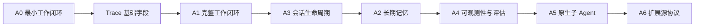

# Agent 能力路线图

> 状态：维护中 
> 适用版本：Fox `0.1.x` 及后续版本 
> 维护范围：A0-A6 Agent 能力演进 
> 最后更新：2026-08-21

## 当前基线

Fox 已具备本地与远程智能体、Assistant/Expert/Worker 分层、会话专家绑定、流式消息、工具审批、Session 恢复、项目文件操作、知识检索、Skills、MCP、附件、运行诊断和 A0 最小工作图。当前主要缺口不是“能否调用模型”，而是版本化可安装专家包、工作流专家、长期记忆、完整评估和子 Agent 协作。

A0 的 Goal、Task、Evidence、Work Event、确认恢复和基础 Trace 字段已经完成工程实现，当前等待 Alpha 人工发布签收。A1-A6 尚未进入业务实现；下一阶段为 A1 完整工作闭环。

## 实施顺序

## A0：最小工作闭环

目标是验证 `Goal -> Task -> Evidence` 的最小闭环，同时确保普通问答不会被强制任务化。

首个 Milestone：[A0-Minimal-Work-Loop](https://github.com/Hry1729/Fox-Agent/milestone/1)。详细规格见原有 A0 规格与 Issue `#1` 至 `#9`。

完成标志包括跨三文件修复、Evidence 绑定、应用重启恢复、失败状态保留和普通问答负向验收。

## A1：完整工作闭环

在 A0 验证成功后增加 Plan Revision、Review Finding 和 Acceptance，使计划可以修订、执行可以审查、完成可以被独立验收。Evidence 与 Trace 建立引用关系，避免模型仅通过文本宣称完成。

## A3：会话生命周期

完善归档、恢复、分支、派生关系和上下文边界。该阶段先于长期记忆，是因为记忆来源必须能够追溯到稳定的会话谱系。

## A2：长期记忆

建立候选、确认、启用、停用、冲突和来源追踪机制。记忆必须允许用户查看、修改和删除，不能把所有聊天内容自动永久化。

## A4：可观测性与评估

补全 Trace、Span、运行指标、失败分类和评估样本。Trace 同时服务诊断与 Evidence，不建立两套平行的执行事实。

## A5：原生子 Agent

首版先实现串行 Child Run，验证父子任务、上下文、Evidence 和取消传播，再决定是否引入真正的 Worker Pool 并发。默认并发和深度必须保守，并隔离文件修改范围。

## A6：扩展源协议

统一管理 OpenAPI、Hooks 和其他能力来源。首版必须包含域名白名单、调用频率、响应大小、凭据隔离和全量审计；Hooks 不允许默认执行任意脚本。

## 专家能力演进

专家能力采用 E0-E4 横向演进：Persona 专家、专家能力包、工作流专家、专家团队和数字同事。它不替代 A0-A6：工作流专家复用 A0/A1 的 Goal/Task/Evidence，专家团队依赖 A5 Child Run，数字同事依赖 A2 Memory、A5 Child Agent 和 A6 Extension Source。

E0 与会话集成 P0-P2 已落地：`fox-general` 为基础 Assistant，五个内置 Persona 和用户专家为 Expert，远程 Sub-agent 为隐藏 Worker；聊天下拉菜单只显示 Assistant，专家中心只显示 Expert。专家通过独立绑定、时间线卡片和 Composer 底部胶囊进入对话，Runtime 使用 Assistant + Expert Overlay，并对工具与 MCP 取交集。下一步进入版本化可安装专家包与 Workflow 绑定，专家团队继续依赖 A5 Child Run。

## 阶段共同验收

- 数据模型具有升级、备份恢复和完整性测试。
- 状态转换和失败路径可以通过测试或明确的人工步骤验证。
- UI 刷新和应用重启不会丢失最终事实。
- 新能力不会破坏普通问答和现有会话。
- 文档、代码枚举、协议版本与数据库 Schema 保持一致。

## 路线图管理

- GitHub Milestone 与 Issues 是进度事实源。
- 本文只维护阶段目标、依赖和决策门，不复制每个 Issue 的实时状态。
- 每完成一个阶段，使用真实任务进行端到端验收并更新已知限制。
- 未达到前一阶段退出条件时，不为追求功能数量提前引入下一阶段复杂度。

## 关联资料

- [A0 最小工作闭环规格](A0最小工作闭环规格.md)：A0 数据、状态、协议、失败和验收契约。
- [A0 里程碑与 Issue](A0里程碑与Issue.md)：A0 GitHub Issue 定义与执行顺序。
- [Agent 能力实施方案](Agent能力实施方案.md)：完整竞品研究、数据模型与 A1-A6 设计依据。
- [Agent 改造工程交接](Agent改造工程交接.md)：当前完成度、下一阶段范围和工程开工约束。
- [Agent 能力测试基准](Agent能力测试基准.md)：当前验证结果、对外口径与真实模型评测方法。
- [专家智能体对比与演进建议](专家智能体对比与演进建议.md)：WorkBuddy、PinVou 与 Fox 的专家分层和差距。
- [专家分层与对话集成改造方案](专家分层与对话集成改造方案.md)：助手、专家、Worker 分层及会话绑定的实施规格。
