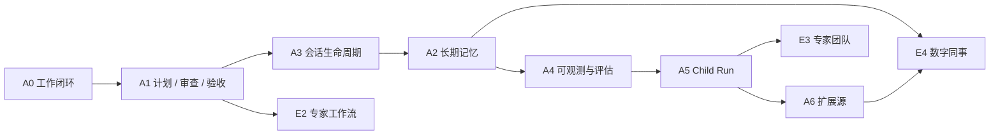

# Agent 能力路线图

> 状态：维护中 
> 适用版本：Fox `0.1.x` 及后续版本 
> 维护范围：已完成能力的依赖关系、下一阶段目标与决策门 
> 最后更新：2026-08-24

## 当前基线

A0-A6 与 E1-E4 已完成工程实现和离线回归。当前功能、边界和事实源统一见[Fox 能力矩阵](../01-项目概览/能力矩阵.md)；测试结果见[Agent 能力测试基准](../05-开发指南/Agent能力测试基准.md)；尚未解决的问题见[已知限制](已知限制.md)。

## 下一阶段优先级

### P0：真实任务质量与发布门禁

- 建立版本化在线 Smoke Runner，冻结模型、Prompt、工具清单、项目 Fixture 和评分器。
- 在隔离环境接入官方或可审计子集的 BFCL、AgentDojo、SWE-bench 等评测；Fox 离线 Fixture 与官方成绩分栏报告。
- 固化 Markdown 链接、契约 Fixture、Runtime/前端/Rust 测试、Sidecar Smoke 和安装包验收为 CI 门禁。
- 为成功率、引用支持率、恢复成功率、延迟和 Token 建立趋势，而不是只记录单次通过数。

退出条件：同一候选构建能够关联 Commit、依赖锁、安装包 Hash、完整测试输出和脱敏评测报告。

### P1：子 Agent 与团队隔离增强

- 为共享写任务提供可选 Git worktree 或等价隔离策略。
- 在有明确冲突解决和审计协议后，再评估并行 Team、mailbox 与共享任务领取。
- 增加跨 Child Run 的结构化产物合并、Reviewer 分工和预算可视化。

退出条件：两个 writer 不会静默覆盖彼此变更，取消、审批、预算和 Trace 能覆盖完整执行树。

### P1：扩展源安全与治理

- MCP/OpenAPI 增加 OAuth、证书固定、操作级限流和更细的凭据作用域。
- 评估外部 `$ref`、webhook 与参数改写；默认仍拒绝任意脚本 Hook。
- 插件安装与升级必须具备来源、签名、版本、权限差异和回滚证据。

退出条件：扩展升级前后权限差异可见，凭据不进入日志/Prompt，网络目标和调用预算可审计。

### P2：本地知识质量

- 完成受信 ONNX 模型与 Zvec Windows 资源的发布供应链、签名和离线 Smoke。
- 建立检索、引用、增量重建、模型升级和数据库迁移的质量基准。
- 明确本地知识图谱的产品价值和事实源后再实现，不复制远程知识库接口形状。

退出条件：纯离线安装可复现，缺少原生资源时明确降级，引用可以稳定回到原文件位置。

## 候选阶段

| 阶段 | 状态 | 启动条件 |
| --- | --- | --- |
| A7 模型路由 | 未启动 | 有真实模型质量/成本/延迟数据，且用户可以锁定模型与解释路由结果 |
| A8 通用自动化 | 部分基础存在 | 数字同事 Schedule/Channel 已提供受控触发；通用后台任务需先补齐重试、重叠策略、通知和系统级治理 |
| A9 远程 Fox Runtime | 未启动 | 本地协议、身份、凭据、项目同步和断线恢复契约稳定，且有明确部署/运维需求 |

候选阶段不是承诺。没有满足启动条件时，不以增加页面或 Prompt 声明的方式提前标记支持。

## 共同验收规则

- 数据模型具有升级、备份恢复和完整性测试。
- 状态转换、失败、取消和重启路径可通过自动化或明确人工步骤验证。
- UI 刷新和应用重启不会丢失最终事实。
- 新能力不破坏普通问答、现有会话和 Host 权限边界。
- 文档、代码枚举、协议版本、数据库 Schema 和测试 Fixture 同步更新。

## 关联资料

- [Fox 能力矩阵](../01-项目概览/能力矩阵.md)
- [Agent 能力测试基准](../05-开发指南/Agent能力测试基准.md)
- [子 Agent 与 Child Run 架构](../02-架构/子Agent与ChildRun架构.md)
- [扩展源与策略生命周期架构](../02-架构/扩展源与策略生命周期架构.md)
- [数字同事架构](../02-架构/数字同事架构.md)
- [已知限制](已知限制.md)
