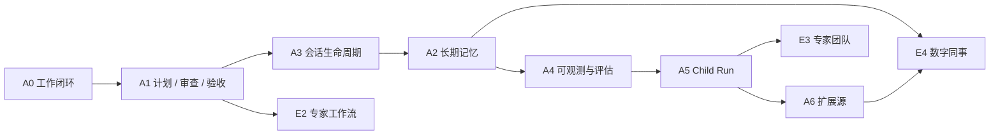

# Agent 能力路线图

> 状态：维护中 
> 适用版本：Fox `0.1.x` 及后续版本 
> 维护范围：已完成能力的依赖关系、下一阶段目标与决策门 
> 最后更新：2026-08-27

## 当前基线

A0-A6 与 E1-E4 已完成工程实现和离线回归。当前功能、边界和事实源统一见[Fox 能力矩阵](../01-项目概览/能力矩阵.md)；测试结果见[Agent 能力测试基准](../05-开发指南/Agent能力测试基准.md)；尚未解决的问题见[已知限制](已知限制.md)。

Durable Loop 的 Host 原子快照阶段已完成：`WorkSnapshotV2` 在一次 SQLite read transaction 内统一 A1、Work Graph、Task Ledger、selected Goal 与根 Source identity，并用关键事实优先的结构化尾窗控制 100+ Task/1000+ Evidence 历史。实现参考（路径相对 Fox 仓库根目录）`../maka-agent-main/packages/storage/src/sqlite-session-metadata-store.ts` 的同事务 projection/version 边界、`../maka-agent-main/packages/core/src/task-ledger.ts` 的稳定投影顺序，以及 `../codex-latest/codex-rs/state/src/runtime/goals.rs`、`recovery.rs`、`recovery_tests.rs` 的陈旧版本与恢复测试；只吸收一致性边界，没有引入外部可写 Projection、Goal Store 或恢复数据库。

只读 Graph 的 Phase 1.5A 内存态预览已完成：`graph_readonly_preview` 可运行最多 3 个独立只读节点，支持深度 1 DAG、同层并行、失败/取消传播和有界 accepted-only 汇总。Phase 1.5B 现已完成 Host 持久激活、只读快照、生产 node start、criterion↔Evidence finish、两阶段 node cancel、独立高风险 node review 与专用 final Graph Acceptance。`graph_readonly_node_review` 只处理“Attempt 仍 running、implementation Child 已 completed”的高风险节点，复用 node finish 的 current Attempt frozen criteria→fresh Host-valid Evidence 七键输入；Lead、implementation Child 和实现 Run 不能自审。真正的 Reviewer Child 由 Host 绑定隐藏 `graph_reviewer_v1`：固定 `strict_v2/high_risk_v1/graph_reviewer_v1` 策略，关闭 continuation 和 Graph，只暴露 `read/ls/find/grep`，所以不能接触 Graph/work/delegation/approval 状态工具；两项 Graph 编排工具仍只对主 Lead `durable_v2` 可见。Reviewer terminal 固定 exact 四键 `{criteria,recommendation,summary,findings}`：finding item 仅含 `criterion/severity/title/detail/toolCallIds` 且全部有界；pass 必须全部 criteria passed 且 findings 为空，revise 必须至少一个 failed criterion 且有结构化 finding，inconclusive 的 findings 也为空。finding 只能引用对应 failed criterion 已绑定的 proof ToolCall 子集；v39 只把它不可变保存在 decision JSON，不投影通用 findings 或触发自动 repair/retry。Reviewer pass 仍不接受节点：Lead 必须重读 snapshot，再把已通过 review 的七键请求原样交给 `graph_readonly_node_finish`，包括完全相同的 `criterionEvidence` 和 `summary`。只有当前批准 Plan 的全部 required nodes accepted 且没有 open findings 时，`graph_readonly_accept` 才能完成 Goal；通用 `acceptance_submit`、`goal_complete`、Attempt finish 和直接 SQL 均不能绕过。整个链路始终保持 `Child completed ≠ Reviewer pass ≠ Node accepted ≠ Goal accepted`，工具返回成功也不等于 Host transition。

本切片的实现校准路径（相对 Fox 根目录）包括：Maka `../maka-agent-main/packages/runtime/src/goal-evaluator.ts` 的保守 Evidence/范围判断、`stream-graph-supervisor-tools.ts::assertFinishResultsCommitted` 与 `stream-graph-readiness.ts::evaluateAllSettledReadiness` 的 committed record/readiness；Kun `../Kun/kun/src/prompt/graph-lead-mode.ts:64-80`、`graph-control-service.ts::recordReview`、`graph-scheduler-policy.ts::reviewDisposition`、`graph-scheduler.ts::reconcileSubmitted` 的 executor无完成权、current Attempt review、self-review/stale replay 拒绝和 submitted→review→accepted 分层；Codex `../codex-latest/codex-rs/prompts/templates/review/rubric.md`、`core/src/agent/control.rs::maybe_start_completion_watcher`、`core/src/guardian/review_session.rs::wait_for_guardian_review_ignores_prior_turn_completion` 与 `core/src/guardian/prompt.rs:182,203` 的独立审查、Child terminal 只通知父级、旧 turn 排除和 untrusted transcript；Reasonix `../DeepSeek-Reasonix/internal/agent/review_report.go:23-76`、`internal/evidence/evidence.go::{HasSuccessfulReviewAfter,HasHostReviewCoverageAfter}`、`internal/recovery/reviewer.go` 的 Host-observed read coverage、latest mutation 后 freshness 与 bounded untrusted Evidence。Fox 只吸收这些验证方法；没有把 Maka text-only judge、Kun 第二 Graph 状态机、Codex Guardian approval/session 或 Reasonix low/medium fail-open 复制进来。

对应 Offline Eval 已扩展为 full 121 case（10 simple / 81 medium / 25 complex / 5 recovery）、65 条工具目录和 6 个零容忍 hard gate；新增 3 条 complex Graph review/Acceptance 合同，不新增假 recovery case。fast Manifest 仍是原 30 条、原版本和原 Hash，Rust 负责真实 exact replay、并发、crash/restart 与数据库绕过测试。

吸收 Maka、Kun、DeepSeek-Reasonix 与 OpenAI Codex 优点的统一架构原则、分阶段顺序和防复杂化门槛，见[Fox Agent 核心能力优化方案](Agent核心能力优化方案.md)。

## 下一阶段优先级

### P0：真实任务质量与发布门禁

- 建立版本化在线 Smoke Runner，冻结模型、Prompt、工具清单、项目 Fixture 和评分器。
- 在隔离环境接入官方或可审计子集的 BFCL、AgentDojo、SWE-bench 等评测；Fox 离线 Fixture 与官方成绩分栏报告。
- 固化 Markdown 链接、契约 Fixture、Runtime/前端/Rust 测试、Sidecar Smoke 和安装包验收为 CI 门禁。
- 为成功率、引用支持率、恢复成功率、延迟和 Token 建立趋势，而不是只记录单次通过数。

退出条件：同一候选构建能够关联 Commit、依赖锁、安装包 Hash、完整测试输出和脱敏评测报告。

### P1：子 Agent 与团队隔离增强

- 在已完成 Host 权威 Task Edge、节点启动、跨 Lead 恢复、criterion↔Evidence finish、两阶段 node cancel、三类 Child 负终态对账、独立高风险 Reviewer、最终 Graph Acceptance 和启动 outbox 重发的基础上，补齐真实任务级多 Agent 质量/延迟/成本基准；任何阶段都保持 `completed ≠ accepted`。
- 为共享写任务提供可选 Git worktree 或等价隔离策略。
- 在有明确冲突解决和审计协议后，再评估并行 Team、mailbox 与共享任务领取。
- 增加跨 Child Run 的结构化产物合并、Reviewer 分工和预算可视化。

退出条件：两个 writer 不会静默覆盖彼此变更，取消、审批、预算和 Trace 能覆盖完整执行树。

### P1：扩展源安全与治理

- MCP/OpenAPI 增加 OAuth、证书固定、操作级限流和更细的凭据作用域。
- 评估外部 `$ref`、webhook 与参数改写；默认仍拒绝任意脚本 Hook。
- 插件安装与升级必须具备来源、签名、版本、权限差异和回滚证据。

退出条件：扩展升级前后权限差异可见，凭据不进入日志/Prompt，网络目标和调用预算可审计。

### P2：本地知识质量

- 完成受信 ONNX 模型与 Zvec Windows 资源的发布供应链、签名和离线 Smoke。
- 建立检索、引用、增量重建、模型升级和数据库迁移的质量基准。
- 明确本地知识图谱的产品价值和事实源后再实现，不复制远程知识库接口形状。

退出条件：纯离线安装可复现，缺少原生资源时明确降级，引用可以稳定回到原文件位置。

## 候选阶段

| 阶段 | 状态 | 启动条件 |
| --- | --- | --- |
| A7 模型路由 | 未启动 | 有真实模型质量/成本/延迟数据，且用户可以锁定模型与解释路由结果 |
| A8 通用自动化 | 部分基础存在 | 数字同事 Schedule/Channel 已提供受控触发；通用后台任务需先补齐重试、重叠策略、通知和系统级治理 |
| A9 远程 Fox Runtime | 未启动 | 本地协议、身份、凭据、项目同步和断线恢复契约稳定，且有明确部署/运维需求 |

候选阶段不是承诺。没有满足启动条件时，不以增加页面或 Prompt 声明的方式提前标记支持。

## 共同验收规则

- 数据模型具有升级、备份恢复和完整性测试。
- 状态转换、失败、取消和重启路径可通过自动化或明确人工步骤验证。
- UI 刷新和应用重启不会丢失最终事实。
- 新能力不破坏普通问答、现有会话和 Host 权限边界。
- 文档、代码枚举、协议版本、数据库 Schema 和测试 Fixture 同步更新。

## 关联资料

- [Fox 能力矩阵](../01-项目概览/能力矩阵.md)
- [Fox Agent 核心能力优化方案](Agent核心能力优化方案.md)
- [Agent 能力测试基准](../05-开发指南/Agent能力测试基准.md)
- [子 Agent 与 Child Run 架构](../02-架构/子Agent与ChildRun架构.md)
- [扩展源与策略生命周期架构](../02-架构/扩展源与策略生命周期架构.md)
- [数字同事架构](../02-架构/数字同事架构.md)
- [已知限制](已知限制.md)
