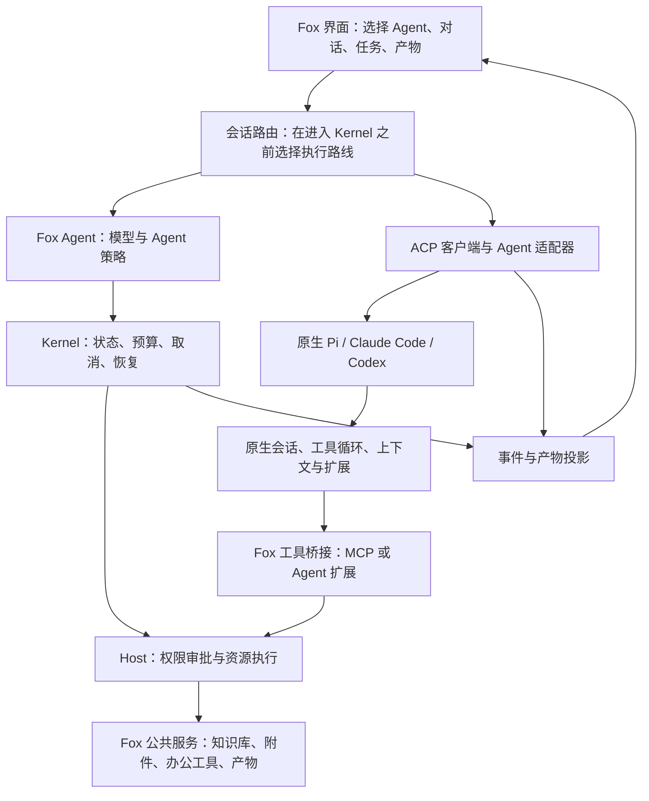

# Fox Agent 与原生 Agent 双路线架构方案

日期：2026-09-11  
状态：方案确认，暂缓实施；当前优先修复现有版本并开展小范围试点。

## 1. 目标与定位

保留现有 Kernel、Host、知识库、附件计算和权限体系，同时支持接入 Pi、Claude Code、Codex 等原生 Agent，尽可能保留各自的能力。两条路线共用 Fox 产品入口，分别拥有自己的执行循环。

- **Fox Agent**：在现有实现上继续完善，作为 Fox 自己的智能体。完整组成是「模型 + Agent 策略层 + Kernel + Host + 工具」，不只是给 Kernel 改名。Pi SDK 可以继续作为内部实现之一。
- **原生 Agent**：通过 ACP 客户端和对应适配器接入完整 Agent 会话，保留其上下文管理、工具循环、会话和扩展机制；具体保留哪些能力以适配器实际支持为准。

## 2. 核心架构

两条路线复用界面、任务目录、知识与附件服务、产物展示和审计能力。原生 Agent 不再作为 Kernel 内的一次模型请求运行，否则其完整循环仍会被截断。

## 3. 能力与权责边界

| 层次 | 职责 |
| --- | --- |
| Fox Agent 策略层 | 理解目标、制定计划、调用模型、选择工具、检查结果、决定继续或结束；任务语义判断由模型及策略承担。 |
| Kernel | 确定性的运行状态、并发与资源边界、预算、取消、恢复和持久化；不堆叠针对某类业务的完成判断。 |
| Host | 执行资源操作、校验权限、审批、提供工具结果与可核查的执行记录。 |
| ACP 客户端 | 管理原生会话、消息、流式事件、权限请求、取消和能力协商，适配 Fox 界面。 |
| 原生 Agent | 保留自己的模型调用、上下文整理、工具循环和扩展系统；认证及模型配置按其实际机制处理。 |

原生 Agent 通过 Fox 工具桥接调用公共服务时，继续经过 Host 的权限校验。原生 Agent 自行执行的文件或终端操作，需要适配器提供可执行的权限接入机制；仅有事件展示并不能证明 Fox 已控制这些操作。原生 Agent 上报的结果与 Fox Host 实际执行的记录应注明来源。

## 4. 会话与产品改动

Agent 选择与模型选择分开：例如先选择「Fox Agent」「Pi 原生」「Claude Code」，再显示该 Agent 支持的模型及设置。

会话保存执行路线、Agent 类型、原生会话标识和能力信息。已有冻结运行继续使用原路线及原配置；不在执行中自动迁移。原生 Agent 的恢复、压缩和取消按其会话机制接入，Fox 统一呈现状态，但不虚构不支持的能力。

主要新增部分是路线入口、ACP 客户端、会话映射、事件映射、权限接入和工具桥接。现有界面与公共服务可复用，因此属于中到较大的增量改造，无需全面重写。

## 5. Pi 当前差距

当前 Kernel 路线使用 Pi 的模型接入、流式响应、工具提议和取消能力；自动重试、上下文整理与执行调度由 Fox 接管，原生扩展、Skills 和持续会话并未完整保留。Fox 已有自己的上下文压缩与业务能力，不能把关闭 Pi 原生机制理解为 Fox 完全没有对应功能。

接入原生 Pi 的重点是让完整 Pi 会话运行起来，再完成 Fox 的事件、权限、工具和产物衔接，而不是重写 Pi。

现有 [pi-acp](https://github.com/svkozak/pi-acp) 可作为起点：它通过 Pi RPC 桥接 ACP，支持会话、Skills 和压缩等功能。但其 README 将其标为 MVP；MCP 配置尚未真正接入 Pi，文件与终端也没有委托给 ACP 客户端执行。因此仍需补齐 Fox 工具与权限桥接并验证版本兼容性，不能视为直接接入即可完整可用。

现阶段没有同模型、同任务的对照结果，不给出「与原生 Pi 相差百分之多少」的判断。

## 6. 建议顺序与验收

1. **当前阶段**：修复现有版本、打包试点，记录真实文件和真实模型的失败样例；本方案暂不实施。
2. **基础接入**：建立执行路线入口和通用 ACP 客户端，优先贯通一个原生 Pi 会话。
3. **接入完善**：补齐工具、权限、产物、取消及会话恢复，再接入 Claude Code、Codex。
4. **Fox Agent 演进**：沿现有架构改善持续执行、结果检查、失败恢复和完成判断，与原生路线做对照。

验收统一覆盖普通问答、多步工具调用、多附件分析、真实文件产出、审批、取消、失败恢复及长上下文。比较任务完成情况、执行证据、耗时和成本；本地模拟通过不等于真实模型与试点验收通过。

相关参考：[ACP](https://agentclientprotocol.com/) · [Claude Agent ACP](https://github.com/agentclientprotocol/claude-agent-acp) · [Codex ACP](https://github.com/agentclientprotocol/codex-acp)
